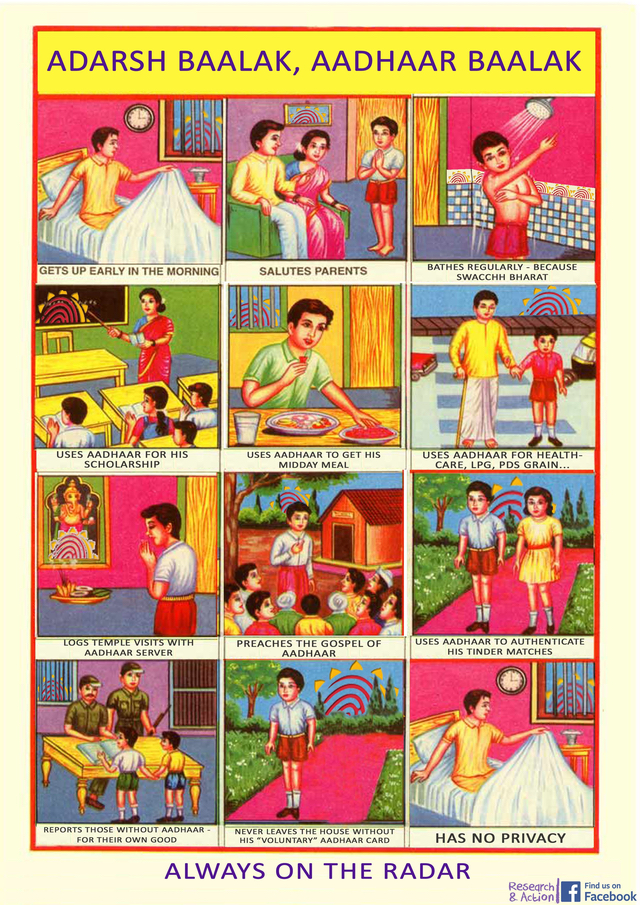

---
Pr-id: MoneyLab
P-id: INC Reader
A-id: 10
Type: article
Book-type: anthology
Anthology item: article
Item-id: unique no.
Article-title: title of the article
Article-status: accepted
Author: name(s) of author(s)
Author-email:   corresponding address
Author-bio:  about the author
Abstract:   short description of the article (100 words)
Keywords:   50 keywords for search and indexing
Rights: CC BY-NC 4.0
...

INC Theory on Demand \#45

## OVERLOAD, CREEP, EXCESS – AN INTERNET FROM INDIA

INC Theory on Demand #45
 
**Overload, Creep, Excess - An Internet from India**
 
 
Authors: Nishant Shah, Ashish Rajadhyaksha and Nafis Hasan
 
 
Copy editor: Sunaina Dalaya
 
 
Cover Design: Katja van Stiphout
 
Design and EPUB development: Tommaso Campagna and Jasmin Leech
 
 
Published by the Institute of Network Cultures, Amsterdam, 2022
 
ISBN print: 9789492302922
 
ISBN EPUB: 9789492302922
 
 
**Contact**
Institute of Network Cultures
 
Amsterdam University of Applied Sciences (HVA)
 
Faculty of DMCI
 
Benno Premsela Huis
 
Rhijnspoorplein
 
Room 04A07
 
1019 GC Amsterdam
 
The Netherlands
 
Email: info@networkcultures.org
 
Web: www.networkcultures.org 
 
 
 

  

 