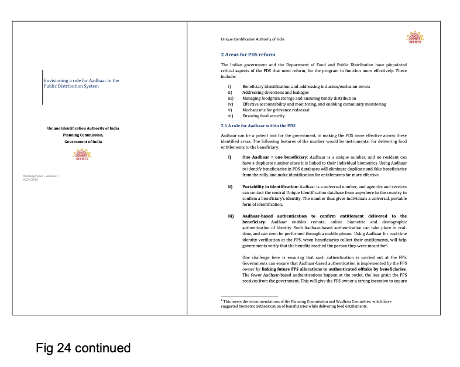
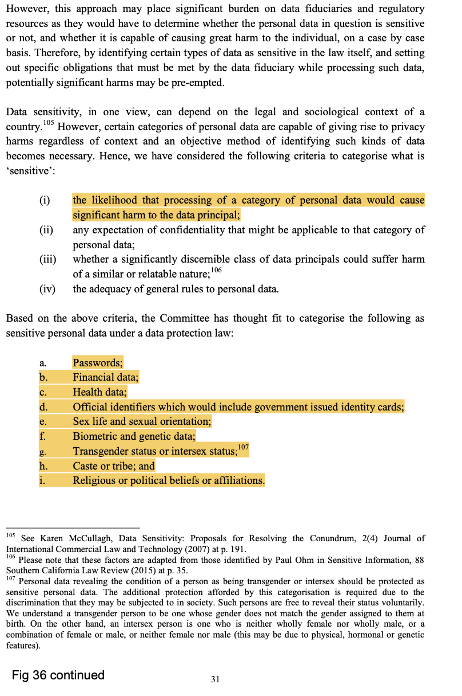
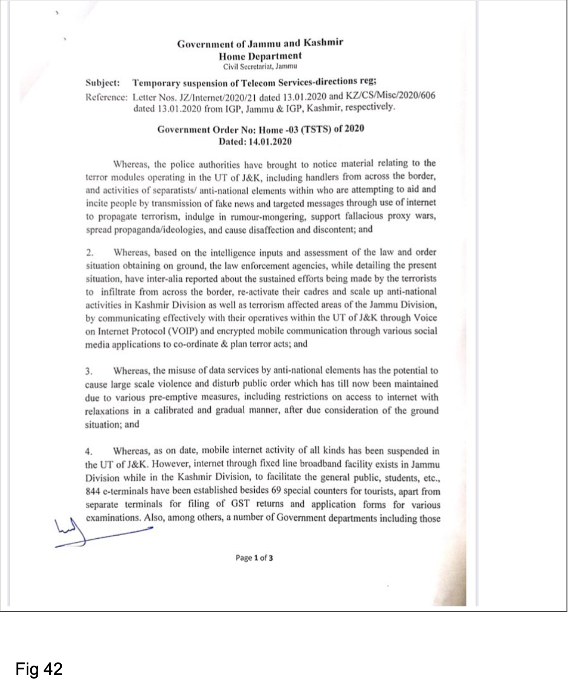
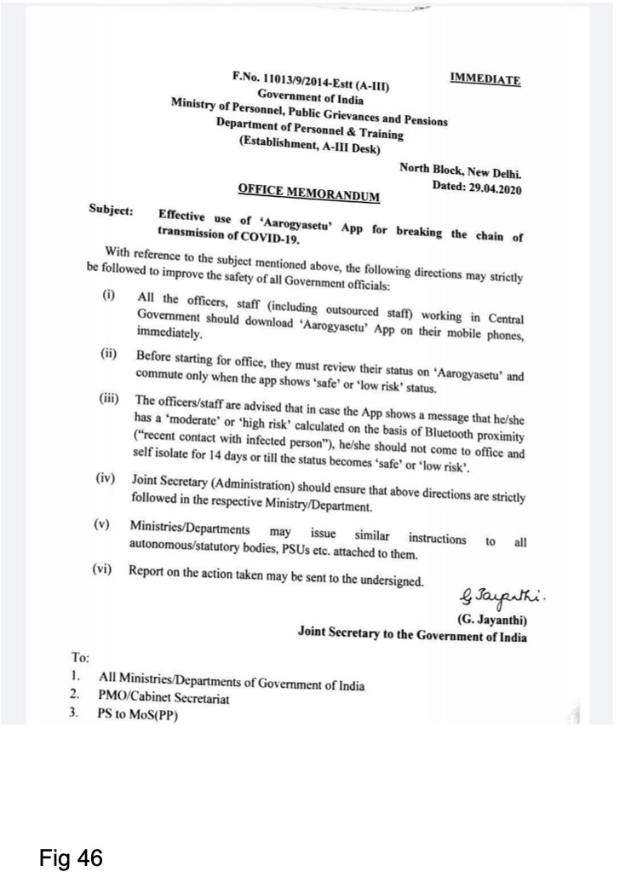

---
Pr-id: MoneyLab
P-id: INC Reader
A-id: 10
Type: article
Book-type: anthology
Anthology item: article
Item-id: unique no.
Article-title: title of the article
Article-status: accepted
Author: name(s) of author(s)
Author-email:   corresponding address
Author-bio:  about the author
Abstract:   short description of the article (100 words)
Keywords:   50 keywords for search and indexing
Rights: CC BY-NC 4.0
...

#The Archive

 

## **SECTION 1**

 

 

 

 

 

 

![Fig 7. April 2020, Delhi. Broadcast Engineering Consultants India,
Ministry of Information & Broadcasting, puts out a call for a Covid
Tracking tool that is directly a surveillance app, which should be able
to ‘identify close contacts, frequent contacts as well as occasional
Contacts’, ‘collect information like where the suspect has spent most of
his/her time and who all he or she has met’, ‘zero in on connections
with Watch List suspects’, ‘Identify a suspects behaviour, see what he
or she does on specific days of the week, where does he or she order
food from, where does the suspect go for regular walks, where does
he/she work during the day, where does he/she sleep at night etc’.](imgs/08TOD46.png)

 

## **SECTION 2**

 

 

 

 

 

 

 

 

 

 

 

 

 

 

 

 

 

 

 

 

 

 

 

## **Section 3**

 

![Fig 30. 2009-2012. Tensions rise around state control and social media.
(Above) The UIDAI’s outlining of their partner registrars, and
sidelining the NPR as ‘also’ one of the UIDAI’s partners, on condition
that the NPR ‘incorporat(es) some additional procedures into the RGI
data collection mechanism, in order to make it UID-ready’. Below left:
the original 2012 Facebook post that led to the Supreme Court case known
as the ‘Shreya Singhal case’, challenging the validity of Section 66A of
the Information Technology Act, 2000.](imgs/32TOD46.png)

 

![Fig 31. (Top left) the original Facebook post that led to the Shreya
Singhal judgment. (Top right) The ‘Pink Chaddi’ campaign by a
‘Consortium of Pub-Going, Loose and Forward Women’, as a rejoinder to a
Hindu right-wing organization’s targeting of young people celebrating
Valentine’s Day, asking for gifts of pink knickers be sent to that
organization. (Below): Twitter reposts by ‘Shami Witness’ in 2014,
arrested for pro-ISIS views for whom he was ‘aggregating information’,
in the words of Karnataka’s Director General of Police.](imgs/33TOD46.png)

 

![Fig 32. July 2010. The UIDAI signs a memorandum of Understanding with
the National Coalition of Organisations for Security of Migrant Workers,
specifically providing for enabling migrants to register with Aadhar.
This was a critical demonstration of how ‘portable identities’ worked. A
decade later this would be a major issue in March 2020, when the first
Covid lockdown was declared and millions of such migrants found
themselves without support in their workplaces but were unable to travel
home because they could not prove their home address.
](imgs/34TOD46.png)

 

 

![Fig 34. September 2015, Manipur. The Churachandpur protests, following
protests by Kuki groups opposing the introduction of Inner Line Permits,
led to a week-long internet shutdown. Nine people died in police firing
widely seen as directly instigated by that shutdown. In an astonishing
display of physical occupation, for an entire year the bodies of the
nine dead were kept on public display in mauve coffins under a shamiana,
in front of which daily speeches occurred under a sign that said ‘Hills
& Valley as separate entities: the new normal, learn to live with it’.](imgs/36TOD46.png)

 

 

 

 

 

 

 

 

 

![Fig 40. August 2019. March 2020, New Delhi. Use of the Information Technology (Intermediary Guidelines) Rules of 2011 to prevent ‘false news’ on Covid. These rules held ‘intermediaries’, more precisely ‘significant social media intermediaries’ (SSMIs), with registered users in India above a notified threshold. In 2021, a year later, these rules were further amended to require SSMIs to ‘observe certain additional due diligence such as appointing certain personnel for compliance, enabling identification of the first originator of the information on its platform under certain conditions, and deploying technology-based measures on a best-effort basis to identify certain types of content’](imgs/45TOD46.png)

 

 

 

 

 

 

 

 
