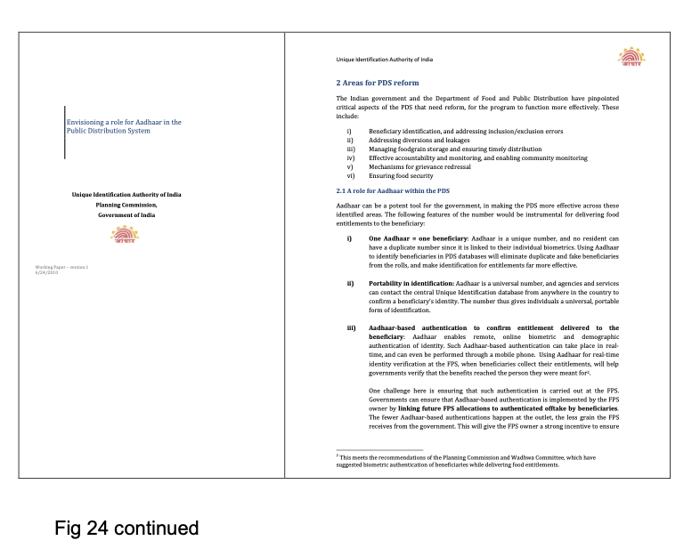
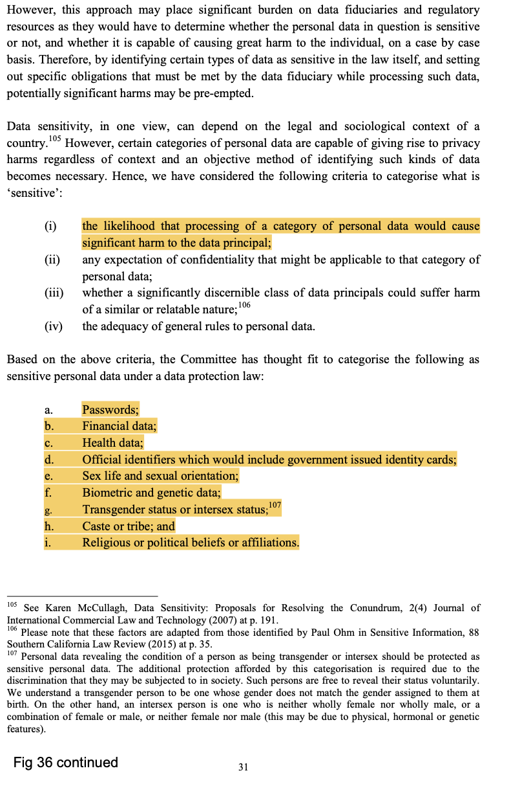
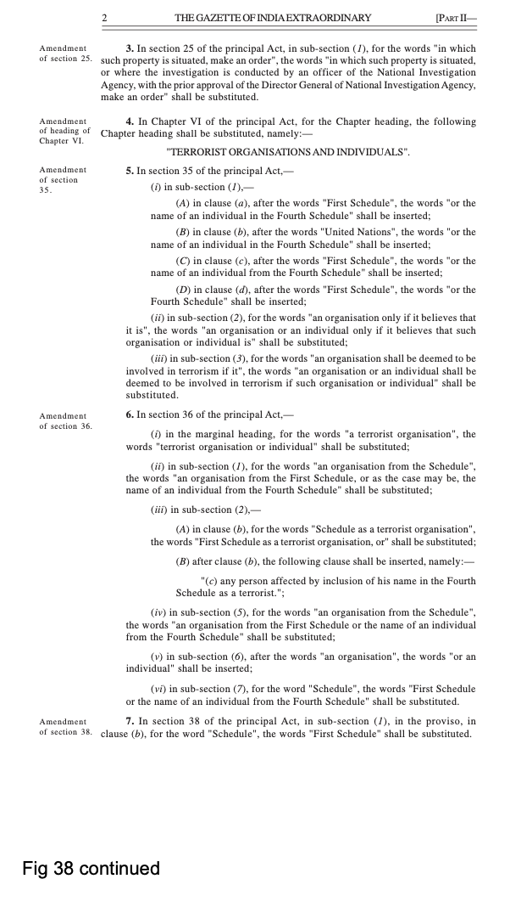
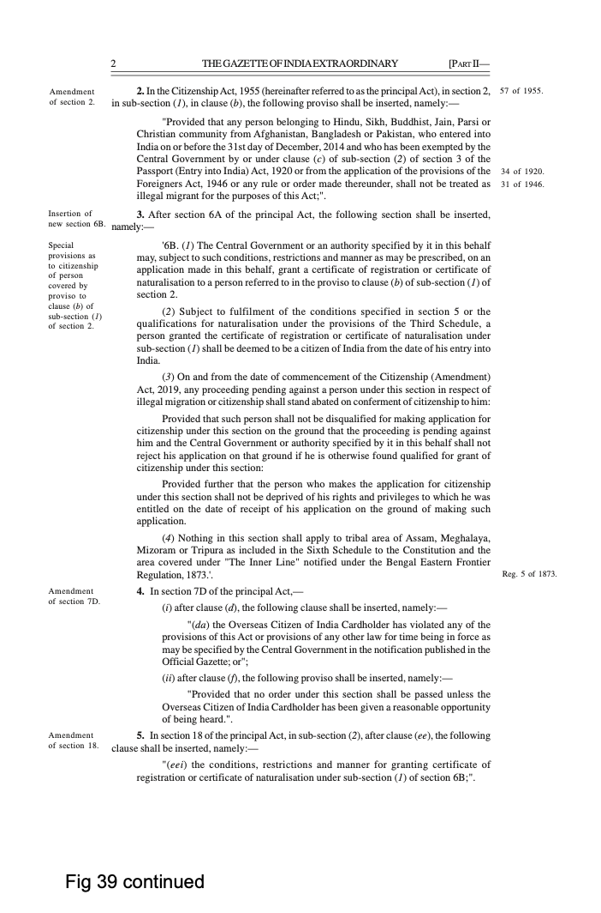
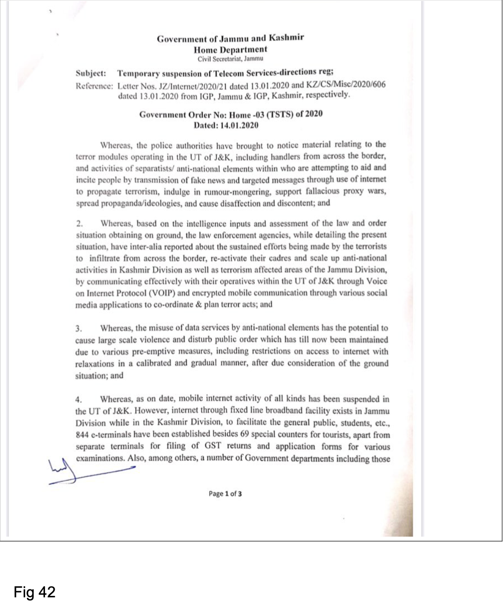
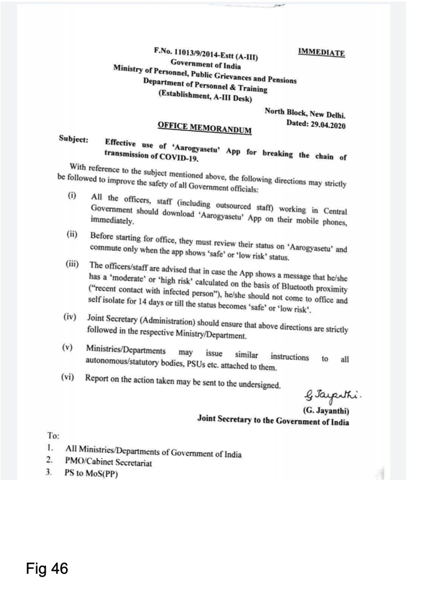

# OVERLOAD, CREEP, EXCESS
## AN INTERNET FROM INDIA
### BY Nishant Shah, Ashish Rajadhyaksha, and Nafis Hasan

INC Theory on Demand \#45

## OVERLOAD, CREEP, EXCESS – AN INTERNET FROM INDIA

Authors: Nishant Shah, Ashish Rajadhyaksha and Nafis Hasan

Copy editor: Sunaina Dalaya

Cover Design: Katja van Stiphout

Design and EPUB development:  Tommaso Campagna and Jasmin Leech

Published by the Institute of Network Cultures, Amsterdam 2022

ISBN print:

ISBN EPUB:

Institute of Network Cultures

Amsterdam University of Applied Sciences

Emai: <info@networkcultures.org>

Web: [www.networkcultures.org](http://www.networkcultures.org)

Email: <viralimageculture@networkcultures.org>

Web:
[www.networkcultures.org/viralimageculture](http://www.networkcultures.org/viralimageculture)

Order a copy or download this publication for free at:
[www.networkcultures.org/publications](http://www.networkcultures.org/publications)

Subscribe to the INC newsletter:
[www.networkcultures.org/newsletter](http://www.networkcultures.org/newsletter)

Subscribe to the INC Viral Image Culture newsletter:
[www.networkcultures.org/viralimageculture](http://www.networkcultures.org/viralimageculture)

This publication is licensed under the Creative Commons Attribution
NonCommercial ShareAlike 4.0 Unported (CC BY-NC-SA 4.0). To view a copy
of this license, visit
[www.creativecommons.org/licences/by-nc-sa/4.0/](http://www.creativecommons.org/licences/by-nc-sa/4.0/).

 

  

 

# OVERLOAD, CREEP, EXCESS – AN INTERNET FROM INDIA

### Nishant Shah, Ashish Rajadhyaksha, Nafis Hasan

Foreword: Chinmayi Arun

## About this book: 

This book locates India’s flourishing internet within a complex 24-year
history that has seen an unprecedented re-organization of social and
political life. Three essays provide independent perspectives on a
common area of inquiry, an era that witnessed a fundamental mutation of
the State, its mechanisms of planning and governance, the public domain
and the everyday, all mediated by digital technology, all impacting its
internet. Bringing the essays together is a common timeline, which
begins in the late 1970s, includes such landmarks as the Information
Technology Act, the much-discussed Aadhaar biometric identification
programme, the chequered career of social media, and the widespread use
of internet shutdowns.

## About the Authors

**Nishant Shah** is a feminist, humanist, technologist. He was the
cofounder of The Centre for Internet & Society, India. He is currently
an endowed professor of aesthetics and cultures of technology at ArtEZ
University of the Arts and Radboud University in the Netherlands, a
Faculty Associate at the Berkman Klein Centre for Internet & Society,
Harvard University, USA, and a Knowledge Partner with the Digital Asia
Hub, Hong Kong. His current preoccupations are around questions of
digital technologies, narrative practices for collective action, and
cultural politics of Artificial Intelligence.

**Ashish Rajadhyaksha** worked as Senior Fellow at the Centre for the
Study of Culture and Society. Although known primarily as a film
scholar, he has published widely on digital governance, including the
book *The Last Cultural Mile: An Inquiry into Technology and Governance
in India* (2011), ‘State Power and Technological Citizenship in India:
From the Postcolonial to the Digital Age’ (with Itty Abraham) in *East
Asian Science, Technology and Society: An International Journal* (2015),
and *In the Wake of Aadhaar: The Digital Ecoystem of Governance in
India* (2013).

**Nafis Aziz Hasan** has been researching the techno-politics of digital
media, material politics of public institutions, and technological
policies for governance, with a regional focus on India. One part of his
project seeks to offer a historical understanding of digital technology
in relation to prior technologies of rule. Another aspect of his work
draws on rich ethnographic material on the assemblage of people,
processes, and technologies, generated over a decade from across India.
His work has appeared in academic journals such as *South
Asia*, *Political and Legal Anthropology Review*, and *Economic and
Political Weekly*, and popular outlets such as thewire.in, *New Indian
Express* and raiot.in. This is his first book. 

#Table of Contents

 <a href='ch003.xhtml'>**Foreward**</a>
 Chinmayi Arun

 <a href='ch004.xhtml'>**Series Introduction**</a>
 

 <a href='ch004.xhtml'>**Introduction: Data Without Content, or the Medium With no Message**</a>
 

<a href='ch005.xhtml'>**The Insidiousness of Information Overload**</a>
 Nishant Shah 

<a href='ch006.xhtml'>**The Ambivalence of ‘Creep’: A Biopolitical History of Citizenship in Digital Times**</a>
 Ashish Rajadhyaksha

<a href='ch007.xhtml'>**‘Slow Violence’ and Vacant Citizenship: The Excesses of India’s
Digital Governance**</a>
 Nafis Aziz Hasan

<a href='ch008.xhtml'>**About the book: *An* Internet *from* India**</a>
 

<a href='ch009.xhtml'>**Annotated timeline**</a>
 

<a href='ch010.xhtml'>**The Archive**</a>
 

<a href='ch012.xhtml'>**Consolidated bibliography**</a>

<a href='ch013.xhtml'>**Acknowledgments**</a>
 

# Foreword

### Chinmayi Arun

When reading anything, we absorb the text through our particular gaze,
infused with our background and history. Here, I offer a lawyer’s
reading of a textured, interdisciplinary book that will benefit from
multiple readings. For lawyers like myself who tend to engage mainly
with the creation and application of rules, this book’s narratives are a
revelation. They illuminate the past with political theory, design
theory, philosophy, history, and sociology. The authors take a period of
time that is very familiar, and show us everything we missed as we lived
through it.

This book is an intertextual conversation across disciplines,
generations, and geographies. Since the authors are long-time
collaborators, it is also a conversation across time. This adds depth
and warmth to their engagement with each other. You will see, in the
three essays, the authors speak to each other’s writing, and also to
prior work, as they join voices to tell this story. Ruth Padel wrote of
migrations, in her poem ‘Time to Fly’, that ‘you go because the world
rotates, because the world is changing and you’ve lost the key’. This
book, by three individuals on three different continents, is also proof
that wherever you may go, you can come together and remake the key.

This is a book for everyone who cares about citizenship, technology, and
democracy, even though we have each formed our concerns and questions in
different contexts. In the first part of this foreword (‘Eye-opening’),
I discuss the authors’ repositioning of seemingly familiar history. The
second part (‘Crisis in India’) will resonate particularly with those
who are familiar with recent developments of law, politics, and
technology in India, and have a visceral interest in the meaning of
citizenship and democracy in India. This book shows us, step by step,
how technology and law have changed what it means to be a citizen in
India.

In the last part of my foreword (‘Yes, all democracies’), the crisis
discussed in this book is a crisis of democracy and citizenship that is
building worldwide. The authors’ pathbreaking scholarship offers
important questions and theories for anyone with an interest in
democracy. India is one of the most interesting democracies in the world
and is a great choice of canvas for the authors’ ideas. To understand
these ideas is to understand India a little. But to understand India is
to also understand how societies move toward and away from seeing
themselves as democracies.

## Eye-opening

The combined effect of the three authors’ narratives of how technology
has changed society is much more than the sum of its parts. This
narrative is informed by their personal and scholarly understanding of
the events that constructed and embedded the relationships between
technology, state, and society in India. The authors are able to
theorize these questions with a granularity of detail that is both
satisfying and enriching. Ashish Rajadhyaksha, for example, reflects on
the questions that the three authors were asking at the time that the
universal identity system was proposed, and details the developments
that changed both the nature of the system and the authors’ view of it.

As an Aadhaar-skeptic who has written about the deficiencies of the
statutory safeguards proposed for the system, I thought I had already
read about, heard of, or conceived its worst outcomes. For example, I
have always maintained that using statutory safeguards (as opposed to
constitutional obligations) to contain Aadhaar’s excesses can easily be
undone by the first legislature that is willing to remove the
safeguards. However, each of the authors surprised me by showing me
dimensions of this project that I did not know about, understand, or
envision.

Rajadhyaksha sketches out how the National Population Register and other
developments that directly threaten meaningful citizenship were able to
use or repurpose Aadhaar. While Nishant Shah has been coy about his past
work, Rajadhyaksha has devoted several pages to reminding us of Shah’s
past work on Aadhaar’s conflation of identity and identification. This
work was so insightful that it was cited in Justice Chandrachud’s 2018
dissenting judgment in the second Aadhaar case. But it is Nafis Hasan
who shines light on previously unplumbed questions in the context of
Aadhaar. He does this by showing us how the Indian government chose
particular technologies and private actors to create its databases, and
helps us understand how these choices affect citizens. Using a brilliant
blend of empirical research and theory, he shows us how datasets are
perceived as objective but can be compromised in several ways. The
particular paths chosen by the Indian government leave citizens with the
burden and labor of ensuring that their information is recorded
correctly. This part of the book is not only visionary in its own right,
it also shows us why Shah is right, now and in the past, about what
these databases do to the individual citizen.

I wonder how the Supreme Court judges who wrote the privacy and Aadhaar
judgments would read this book. Aadhaar, like many serious questions
before the Supreme Court, triggered a conversation between the judiciary
and the executive. In the case about the fundamental right to privacy,
in particular, the judges made assumptions about the restraint the
executive was likely to exercise in its invasion of privacy within the
broad space offered to it. One wonders if they would rule differently if
we could throw this book back in time to show benches past the future
their combined rulings constructed.

## Crisis in India

Indian readers will have lived through the period and events discussed
in this book, and others may have witnessed similar developments in
their countries. What we think we witnessed is transformed and
reconstructed by the authors’ narrative, framing, and retelling. If you
were wondering how and why we got here – how citizenship is now based on
a fragile and almost fickle digital ID, why protesting can get you
arrested, and what the Aarogya Setu was doing on anybody’s phone – this
is the book to read. It offers compelling insights to show us how India
got here, and ways to rethink where technology and society have taken
our democracy.

In March 2015, many celebrated the Indian Supreme Court’s decision in
*Shreya Singhal* v *Union of India*, which was widely regarded as the
first significant Indian judgment on online communication. During the
litigation, big technology companies were rallying support and
coordinating advocacy that would favor unrestricted online speech.
Public attention was focused on online speech. In the meantime, data
collection by these companies and by the state was expanding. The unique
identification system was being put in place, and state surveillance was
becoming more sophisticated and less accountable. Companies were
competing to invent new ways to collect and use data. At the time, very
little attention was being paid to privacy and to the ways in which
these companies violated it. The companies would go on to argue for some
years that granular privacy laws restricted innovation and were bad for
the population. They would also go on to privately restrict speech in
ways that would not have met the constitutional threshold if the state
had ordered the restriction.

The connection between Shreya Singhal and the events discussed in the
book is that this highly regarded judgment also displayed the judicial
shortsightedness that would be displayed in the court’s later rulings on
privacy and universal identity. The judiciary failed to appreciate the
extent to which the executive could censor information, if it was able
to negotiate directly with companies and leverage their gatekeeping role
without involving the citizens whose speech and information is made
inaccessible. The advocacy in the case also assumed that companies’
incentives would always lie in resisting censorship, and this optimism
did not survive the test of time. The story of Aadhaar was similarly a
story of not seeing what was in plain sight as well as what lay
concealed, both of which powerfully affected the form that the system
would take and the future it would create.

Parts of the book unearth new and important information. Other parts
reveal what was hidden in plain sight or obscured by how we were taught
to see. What, for example, has Aadhaar done to the meaning of
citizenship and choice? Does this change depend on the demographic to
which one belongs? Can this change be attributed only to Aadhaar or was
the universal identity system a part of a series of changes made to what
it means to be a citizen of India? For Indians, to read this book is to
understand the many ways in which the last decade has changed how
citizenship works. Rajadhyaksha characterizes these changes as ‘creep’.
While national attention focused on the questions framed and amplified
by policy wonks and news media influencers, creep was taking place. Shah
is looking at it from our point of view. We the user, or ‘yousers’ as he
prefers to think of us, suffer from information overload. Hasan
characterizes the problems as emerging in part from excess.

As Rajadhyaksha points out, it was difficult for many to understand the
full implications of the Unique Identification number or UID in its
initial stages. The trio who authored this book, along with my old
friend, brilliant lawyer-researcher Sruti Chaganti, were among the first
to study the project. Despite their meticulous work, they were – as we
all were - looking at only one corner of the picture. It is not only
Rajadhyaksha but also Hasan who surfaces everything that was unknown
then. Hasan’s chapter is revelatory because it shows us that the changes
began long before any of us imagined they did. Shah shows us that it was
not just the obscurement of changes in law and policy, but the
overriding of our cognitive capacity to take in the world and to think,
masked by the language of access and empowerment, that has made it
difficult to participate in the democracy as we should. Together, the
three authors offer an account of how technology has been used to
gradually restrict and stunt the capacities that flow from citizenship
in India.

## Yes, All Democracies

Although this is a book that will certainly be of interest to Indians,
the theory, the questions and the reimagining should be of interest to
anyone with an interest in technology, citizenship, and democracy. It
offers a rich interdisciplinary narrative of these questions that is
unusual. The compound vision of this book might be turned on other
countries, especially democracies that are skewing the way India has.

As a postcolonial democracy that is not ruled by colonial settlers,
India is acutely sensitive to questions of power, equality, and control.
When the information revolution began, India was one of the world’s most
interesting democracies. It was less than fifty years old then, and is
less than a hundred now. It is also a country that was, and is,
constantly learning and remaking itself, with a momentum toward change
that has been steered in varying directions. India has moved rapidly
toward increasing equality and then, perhaps even more rapidly, toward
eradicating equality. It has invested heavily in the public sector and
then privatized aggressively as it took its neoliberal turn.

The authors have a deep and nuanced understanding of the country. As you
will see, this ease of navigating the past and its meaning allows them
to reimagine narratives about technology and citizenship, and also
allows them to show us how to ask the right questions and how to
understand how technology and a democracy affect each other.
Additionally, as international scholars, they are able to situate this
narrative within a broader global and theoretical context. If Lisa
Gitelman’s book *Raw Data is an Oxymoron* discussed why there is no such
thing as raw data, and danah boyd showed us the real nature of
enmeshment of technology and human society, then these three authors
show us the ways in which technology and private interest are entwined
within democracy, and between citizens and states.

The phases of technology in democracy that this book takes us through –
the euphoria, and use of the language of rights to allow technology to
permeate society unrestricted – will be familiar to most people in most
democracies. Similarly, the use of the language of freedom to usher in
insidious changes of unfreedom has also been a global phenomenon. The
cycle outlined by the authors is one that infects many democracies at
different stages of having technological determinism creep into core
administrative systems while the population remains hooked on
entertaining videos. Like Shoshana Zuboff’s widely read *The Age of
Surveillance Capitalism* which describes the visible and invisible
changes that technology was precipitating in one country, this too is a
book that speaks to the world using India as its canvas.

As the authors took me through the last decade’s events, I asked myself
what it is about India that seems make it particularly fertile ground
for all the most difficult questions of technology and society to grow.
Perhaps it is the way forceful neoliberalism came into contact with
strong constitutionalism in ways that affect a very large percentage of
the people of the world. Perhaps it is also the place that India
occupies in both the creation and the consumption of technology, with
populations and participation that are highly visible and entirely
invisible in turn. This book not only helps us understand what has come
to pass, but also helps us ask more questions.
 

**Overload, Creep, Excess: An Internet from India** is part of a series
of titles supported by the Centre for the Study of Culture & Society
(CSCS), Bangalore, under the broad theme of **Culture and Democracy at
the Millennial Turn**.

Turns of millennia are usually
occasions to review forms of knowledge production for what they have
achieved. In India, however, such an endeavor takes unusual turns.
Politically bracketed by globalization at one end and the onset of
religious majoritarianism at the other, as the current century has worn
on it has turned into something far more significant than merely a
political crisis as we come to terms with the insufficiency of several
founding concepts of modernity such as nation, freedom, identity,
governance, and indeed of power.

Paradoxically, as the current volume shows, this struggle is rendered
especially stark when placed alongside a contrasting, and widespread,
optimism that *also* defined the era. The sudden availability of new
open access research tools once found only in wealthy Western
universities now promised a delirious new freedom as the archives opened
and transdisciplinary and transnational access led to the crumbling of
timeworn disciplinary silos. Variously characterized as the time of the
‘internet’, it was also a time of transborder conversations that only a
scant decade earlier might have been inconceivable, and of the
pluralization of *spaces* for doing theory and *means* by which theory
could be done. While the series defines these spaces and means
diversely, a possible common thread that runs through them will be a
focus on new practices of trans-institutional knowledge production,
typically brought together by the triad of *pedagogy*, *research*, and
*public engagement*, often contextualized by the onset of mass public
digitization.

It was in the spirit of the times that CSCS, together with a range of
new institutions, initiatives, and projects across India, saw its role
as moving beyond the limits of the orthodox institution: inventing the
term ‘inter-institutionality’, contending that the range of research
resources and networks that good interdisciplinary work needed could
never be supported within any single institution, however large or
well-funded.

It is clear that this period did not last. One
sign of its demise may well be the loss of faith in the internet's
neutrality, signaled by meltdowns, funding crises, corruption, fears of
neoliberal excess, terrorist threats, surveillance mechanisms, and new
global ecologies that would soon engulf us in the new century.

As we turn back to the millennial moment, however, such diversity of
both location and method allows us to re-view the dilemmas faced by
academic practice in this fraught era of modern political history. The
diversity of means, in the expanded space of the human sciences, may
need to be viewed alongside the expectation that new practices of
pedagogy and public engagement be given full recognition as research
domains. Both came together – this series proposes – in the larger
academic response mounted to the political challenges of the time.
Across the literature we find outlined an era
that was politically fraught, facing crises that were at once of the
moment and requiring a larger historical frame, capable of some radical
interdisciplinary/institutional barrier-breaking, and sustained if only
momentarily by the temporary convergence of academic-activist drive and
independent support.

\_\_\_\_\_\_

## This Volume

The origins of this book lie in a CSCS project assembled by the authors
in 2010. The previous year, the ‘Unique Identity for Every Indian
Resident’ project, better known as Aadhaar (support), had been announced
with much fanfare by the Government of India. Known then as the Identity
Project, it sought over three years to research the grassroots social
impact of mass digitization through detailed field research across seven
Indian states. The multiple outcomes and findings of that particular
project, on paper, PDF, and video, are in the public domain. This volume
is, among other things, a retrospective turn to that epochal moment, and
the decades that both preceded and followed it, using insights that are
very much of the present.

# INTRODUCTION

## Data Without Content, or the Medium With no Message

In February 2015, India’s Supreme Court delivered a landmark judgment on
the right to speech.[^05MainIntroduction_1] The issue was itself, certainly by today’s
standards, relatively insignificant – a Facebook post by a young woman
in the small town of Palghar, in Maharashtra, that another young woman
had ‘liked’ – that blew up when police arrested the two women under
something named Section 66A of India’s Information Technology Act, 2000,
which redefined India’s hallowed right to free speech into the digital
era.[^05MainIntroduction_2]

The Court easily agreed with the primary argument of the petitioners on
the specific question of free speech. This was the easier part, for, as
legal scholar Pranesh Prakash wrote, it would have taken ‘a highly
clever lawyer and a highly credulous judge to make ‘liking’ of a
Facebook status update an act capable of being charged with
electronically “sending … any information that is grossly offensive or
has menacing character”’.[^05MainIntroduction_3] Most lawyers also were agreed that, as
Prakash elsewhere unambiguously asserted, ‘‘liking’ is protected speech
under Article 19(1)(a)’.[^05MainIntroduction_4]

Justice Rohinton Nariman, who wrote the judgment, however went further.
He took the debate beyond the relatively settled domain of the content
of protected free speech and into a far more ambiguous and contested
space, namely the legal nature and the properties of data itself. In
seeking to regulate speech, the specific amendment to the Information
Technology Act that was now being challenged had sought to define speech
as *all* forms of digital storage and movement. ‘Section 66A’, Nariman
said, ‘casts the net very wide’, for it effectively seeks to control
‘all information that is disseminated over the internet’. Its diktat was
being sought to be extended, he pointed out, over any ‘computer,
computer system, computer resource or communication device including
attachments in text, image, audio, video and any other electronic
record’.[^05MainIntroduction_5]

Could all of this data be even understood as speech? Speech in India has
a specific legal history. The right to speech is a key right, defined by
the Constitution of India as one of the cornerstones of the freedom that
India’s citizens had been promised with Independence. Such speech has
had particular meaning. It has defined speakers as conscious subjects
who know what they are saying, what meaning their speech can have, who
take responsibility for what they are saying. If what they are saying is
seen as dangerous, such danger ‘should not be remote, conjectural or
far-fetched’ but should have ‘proximate and direct nexus’ with what is
said.[^05MainIntroduction_6] Did all data disseminated over the internet produce such a
speaker? If not, how was it speech?

But even that wasn’t the real problem. The real problem was that, in
defining objectionable speech, the Act ‘refers only to the medium
through which such information is disseminated’. It was, reversing the
famous McLuhan dictum, as though the *message was now the medium*.
‘Information of all kinds is roped in’, Nariman went on. ‘Such
information may have scientific, literary or artistic value, it may
refer to current events, it may be obscene or seditious’, none of this
apparently made any difference to the regulator. As a result, ‘no
distinction is made between mere discussion or advocacy of a particular
point of view which may be annoying or inconvenient or grossly offensive
to some’ and the far more inflammatory ‘incitement by which such words
lead to an imminent causal connection with public disorder, security of
State etc’.[^05MainIntroduction_7]

\_\_\_\_\_\_

It may well be possible to read into Nariman’s view of data’s content
neutrality, and the potentially inflammatory nature of *all* data in the
paranoid view of the state censor, an inevitable if unintended afterlife
to Tim Berners-Lee’s original famous May 1990 conception of the ubiquity
of information on the internet – when a ‘web’ of ‘hypertext documents’
would become intelligible across browsers everywhere. Now it was
precisely the *illusion of its intelligibility* – the capacity of the
digital delivery mechanisms to simulate speech in the way they assumed
that universal accessibility automatically equated with damage – that
allowed police and judicial authorities to read whatever they chose into
it. It also made the sheer possession of any device traceable however
remotely to seemingly suspect data into a non-bailable criminal act.

A scant three years later, in another Supreme Court case in 2018,
Justice Nariman’s premonition was graphically on view when the eminent
historian Romila Thapar led a small group of senior academics to
challenge the legality of the arrest of five human rights activists and
lawyers.[^05MainIntroduction_8] In their rejoinder, the police made a series of
fantastical, ever-expanding claims of a nationwide conspiracy on the
part of the accused to overthrow the Indian state. They based this
entirely on ‘material retrieved from the computers, laptops, pen drives
and memory cards of \[…\] accused persons’. Such material, they
asserted, revealed the arrested ‘as active members of the Communist
Party of India (Maoist), a banned organisation, and reflected a design
of being involved in the commission of offences having the potential to
destabilise the country’. They had been, the police added, arrested ‘not
because of their political activities’ but for ‘selecting and
encouraging cadres in \[…\] banned organizations to go underground \[…\]
mobilizing and distributing money, facilitating selection and purchase
of arms, deciding the rates of such arms and suggesting the routes and
ways of smuggling such arms into India for \[…\] training and laying
booby traps and directional mines’.

None of this had been proved in any court. Instead, as Justice
Chandrachud pointed out, the police claimed at a press conference to
possess ‘more than sufficient evidence against the five individuals’
without indicating what this evidence was. Three days later, the judge
continued, ‘letters (many of which should form part of the case diary)
were selectively flashed and read out’ and ‘leaked to the media’, even
though the concerned officer admitted – once again only on television –
that ‘the letters which had been read out by him were still undergoing
forensic analysis together with the electronic devices’.[^05MainIntroduction_9] Since then,
as regards the specific detainees of the Bhima-Koregaon undertrials, a
US-based forensics company named Arsenal Consulting has shown, in its
own analysis of some of the disks owned by them, that significant
malware existed indicating the possibility of ‘planted’ evidence.
Although Arsenal’s report has been widely circulated, it too has not
appeared in Court evidence since the National Investigative Agency has
challenged the *locus standi* of this organization, and so it too hangs
– like the data the police claim to have – in a liminal ghostly
existence hovering over the actual legal process.

## Possession 

This book is centered around a proposition. ‘Somewhere’, says Nishant
Shah in his essay, ‘in the last few years, without us even realizing it,
and in an almost non-dramatic fashion, we have foundationally changed
our idea of who we are as information subjects’. The human being has
become ‘rehumanized’, ‘parsed, processed, and presented only through
interfaces that render it recognizable’.

The essays in this book address a relatively recent development: the
ever-expanding tsunami of data that surrounds, engulfs, and contaminates
us all, passes through our devices and implicates us in multiple
actions. We look at how the experience of both receiving and producing
data has transformed several basic concepts of democratic politics such
as citizenship, authorship, the right to life, to livelihood and to
speech, and indeed our experience of the public domain itself. Such data
defines us as much to the state as to online entities trying to access
us, sell us things, troll us, qualify or disqualify us, even as we on
our side relentlessly seek to understand and avail of an ever-expanding
range of new and often unfamiliar rights, goods, services, and
privileges available ‘online’.

This transformation has taken place within a relatively short span of
time. Although Nafis Hasan’s essay explores an essential 70s-80s
prequel, the book mostly covers a narrower period – between, as Nishant
Shah has it, the Information Technology Act of 2000 and Facebook’s Free
Basics project of 2016 or, as Ashish Rajadhyaksha suggests, between 2009
(when in a single month India announced its massive biometric Aadhaar
project and passed the draconian Section 66A) and 2020, which saw the
Supreme Court judgment on the longest and severest internet shutdown the
world has yet seen in Kashmir.[^05MainIntroduction_10]

In this time, we saw data – together with the manner of its gathering,
its location, its securing, and the ability to interpret it –
foundationally transform the basic armature of the modern state. In some
measure the technological transformation was built, Hasan argues, on the
arrival of RDBMS (or Relational Database Management System) to India.
Introduced as a corporate technology, and responsible for much of the
famous information technology boom of the 90s, it was the mounting of
governmental functioning onto RDBMS that reinvented governance itself
into something of a corporate-style service provider with the National
e-Governance Plan (NeGP) of 2006, and also thereby into what Indian
political scientist Partha Chatterjee has described as the ‘tactically
extended state’.[^05MainIntroduction_11] It transformed the modern state away from what
Hasan calls the constraints of ‘an overbearing fidelity to the
organizational design of bureaucracy, to its hierarchies and rules, as
well as to the computational design of information systems’ and into a
new era in which digital governance ‘clogs the information highway,
storms into the lanes, cracks, and crevices of daily life’.

A more complex register concerned the parallel morphing of several
universal and ‘unbound’ conceptions of identity into unrecognizable
avatars following the rise of targeted delivery of benefit alongside
equally targeted surveillance technologies. We began encountering a new
kind of subjectivity that surely rewrote the old Hegelian negotiation
between subjec*tion*, or the condition of being a sovereign subject
defined by the King and the State, and subjec*tivity*, or the individual
egotistic interiorization of both the freedoms and responsibilities of
the citizen-subject. Shah calls it a crossroads between being subjects
*of* information (where we spend much of our life producing, consciously
or otherwise, information about who we are, what we do, and how we
relate to the world around us), subjects *to* information (as
algorithmic data mining constantly produces information structures that
determine various markers of who we think we are), and *subjective to*
information (as we keep filtering everything that does not directly
pertain to us, produce a bias in favor of information that is customized
for our specific needs, and eventually find ourselves in filter bubbles,
‘echo chambers of network neighborhoods that protect us from people who
are unlike us’).

At all these stages we encounter informational excess as a condition of
existence, as we turn into subjects ‘whose *ontology* lies in
information overload’. Such an ‘ontology’, says Shah, is pivoted around
what may be the most basic, founding transformation taking place in our
‘rehumanization’: a move away from *representation*, upon which the
entire polity of the 20th century was based, and into *simulation*. It
is not, as we saw (in the Nariman judgment when free speech was being
sought to be re-simulated into media of data storage and dissemination)
a *break* from the past as much as it is the *re-signification* of the
classical public sphere, morphing its key concepts such as democracy or
rights into a new era that significantly redefines basic meaning-making
languages that have historically founded our representation-driven 20th
century. The shift from representation to simulation, paralleled by
further transformations from author*ity* to author*ization*, also forces
another transformation from older conditions of possibility to new
structures defined by probability.

This ontology is manifested in permanent systemic crisis, but it is a
crisis that, for perhaps the first time in history, has become
*naturalized*. It has even turned into an everyday state of being. As
human beings reconcile to their new condition (one that Hasan, on his
side, names ‘responsibilization’), they become ever-more dependent on
‘information-overload managing technologies’, even as these technologies
in turn ‘train’ human users to meet technology halfway. At the heart of
information overload, says Shah, is the argument that we are now in a
cybernetic feedback loop with ourselves, where we produce and consume
our own data, and engage with it through multiple terrains so that we no
longer can see outside of the data streams into which we are permanently
immersed.

Such humans are a new construct – ‘yousers’, Shah calls them – with new
claims, new promises (including, as he points out, the promise of
immortality that requires the older human to step out of the model of
being either human or relevant and to enter this new world where Google
would be their savior) and, most of all, transformed citizenship norms.
We are possessed by a ‘condition of informality’ that defines ‘our
authorship, which in turn defines who speaks, on behalf of whom, in what
voice, and with what authority’. It defines ‘agency, choice, freedom,
and truth’.

It also appears connected with what Hasan calls a *techne* of
neoliberalism that, while demanding a lesser or leaner government, often
actually *expands* regulation and domination through multiple seemingly
autonomous entities not part of the formal state apparatus but guided
instead by a corporate enterprise logic. Hasan sees it as a confluence
of two interconnected trajectories. One is precisely technological – the
‘electronification of governance’ redefined an old command-driven,
centralized planned economy into a new center-periphery imagination. The
second is more ideological, a neoliberal transformation of the
democratic state that allowed – often in the name of the very people
whose rights were being taken away – the conversion of state benefit
into elite privilege.

## Being Possessed By

The authors of this volume first came together in 2010. This was a year
after Aadhaar or the ‘Unique Identity for Every Indian Resident’ project
had been announced with much fanfare by the Government of India, under
which members of a large team were to research the grassroots social
impact of mass digitization. ‘The Identity Project’ (as we named it) ran
for three years, during which time we carried out detailed field
research in seven Indian states, generated a mound of documentation,
conducted four major workshops, and published three books.[^05MainIntroduction_12] The
multiple outcomes and findings of that particular project, on paper,
PDF, and video, have been p8ublished and are easily accessible.[^05MainIntroduction_13]

At that time, in 2010, we had sought – against, it must be said,
considerable pressure from numerous friends, coworkers, and colleagues
who offered grim forebodings about this new development and saw
totalitarian designs behind it – to withhold judgment, and to try and
understand what the digital ecosystem of governance might actually look
like. It has been, as Ashish Rajadhyaksha’s essay shows, an unfolding
story, especially in the startlingly *déjà vu* manner in which the new
Arogya Setu app evoked, in 2020, much of the voluntary/mandatory shadow
dance that we had seen in the old Aadhaar playbook. As the last decade
panned out, especially in the series of Supreme Court judgments between
2016 and 2018, it appeared that a new story could be told of the earlier
period when, coinciding with the arrival of social media, a new
apparatus of state regulation was also being assembled.

Such a retrospective retelling, Rajadhyaksha suggests, would now place
the National Population Register (NPR) as a far more central player in
the story of the first two decades of the present century than we
recognized when it was passed into law in 2010, to create a register of
India’s ‘usual residents’, redefining both the Citizenship Act, 1955 and
the Citizenship (Registration of Citizens and Issue of National Identity
Cards) Rules, 2003. In 2010, it had appeared that Aadhaar, which had
repeatedly claimed *not* to be mandatory and *not* about citizens but
rather about residents, and had presented itself in far more social
media-friendly terms than the NPR, had been in some conflict with the
coercive approach of the NPR, which had made registration mandatory for
all those who had either lived or intended to live in in India for six
months or more. A retrospective timeline – especially outlined in detail
by the 2018 Supreme Court judgment on Aadhaar – however suggests that
the two were very much envisaged together and were indeed always meant
to be two halves of a single picture.

Although this picture came together in public imagination only in 2019
with the passing of the Citizenship Amendment Act, 2019 and in the
protests that followed, what it did mean was that, even as
information-starved Indians everywhere were both consuming and producing
digital content, we were also being possessed by a larger ecosystem that
governed us. Such a state, and its attendant crisis, has been often most
directly evidenced in anxiety around access: both the *granting* of
access and concerns about the *control and regulation* of practices that
emerge.

In 2018, the Supreme Court judgment defined the condition of being
possessed by data in yet another way: by calling it ‘civil death’.[^05MainIntroduction_14]
It described what was happening as a ‘compulsory bartering away’ of
‘rights freely exercised, liberties freely enjoyed, entitlements granted
by the Constitution and laws’. All these rights, liberties, and laws
were being ‘made conditional’, and citizens were being compelled, in
return, to give up their biometrics ‘voluntarily’, allow their
biometrics and demographic information to be stored by the state and
private operators, and then used for a process termed ‘authentication’.

Such an operation has, said the Court, the ‘*propensity to cause the
civil death of an individual by simply switching of Aadhaar of that
person*’. If the Indian Constitution ‘balances rights of individuals
against State interest’, Aadhaar ‘completely upsets this balance and
skews the relationship between the citizen and the State enabling the
State to totally dominate the individual’.

Civil death, in this sense, may well be the extreme condition of such
possession – where data is viewed as something of a life-support
apparatus. More commonly, however, it redefines citizenship into a
condition of suspended animation of what Hasan calls ‘slow violence’. In
his detailed example of the digitization of landownership records, he
describes it as the routine ‘violence of data repair’ when actual people
find themselves trapped in a legally precarious condition of ‘temporal
vacuity, a state of limbo, a temporary break from ongoing relationships’
which, while not an extraordinary event of ‘spectacular violence’, is
nevertheless an equally deadly ‘circuitous low-grade suffering’.

## Accidental Possession and Verifiability 

In July 2020, Delhi University’s much-respected professor of English,
Hany Babu, was arrested by the National Investigation Agency, yet
another target in the state crackdown on intellectuals, academics, and
activists on the Left. As part of their inquiry, the Agency seized
Babu’s computer, and their ‘forensic inquiry’ claimed, in what had
become a by-now familiar police playbook, that some sort of a ‘disk
partition’ had existed in that machine between February and April 2019,
and that this partition had contained 62 files with ‘‘incriminating
details’ about his involvement in the Maoist movement’.[^05MainIntroduction_15] Hany Babu
said he had made no such partition, possessed no such files.

Eight months later, five senior academics – including several of Hany
Babu’s colleagues – went yet again to the Supreme Court with what
appeared to be a far more basic anxiety than even the protection of
their liberty: namely the potential loss of their research through
unauthorized seizure of their computers and hard disks. Such seizure,
they said, endangered decades of research work for their computers
contained ‘their life’s work’, ‘extensive field work spanning decades or
the results of scientific experiments or calculations’, ‘patentable
material \[…\] or work that runs the risk of being plagiarised’. All
such research work was ‘irreplaceable’. In the hands of the police, it
could ‘run the risk of damage, loss, destruction’ or – the academic’s
ultimate nightmare – ‘even distortion’.[^05MainIntroduction_16]

The question of what data is may in these fraught times open up,
together with an ontology, a parallel epistemic trajectory. Documents,
as Lisa Gitelman says in the beginning of her book *Paper Knowledge*,
are at base ‘epistemic objects’, ‘recognizable sites and subjects of
interpretation across the disciplines and beyond’ and are thus
‘evidential structures’ – essentially there to document, to *know* and
to *show* (along with their corollary, ‘no show’, or no proof).[^05MainIntroduction_17]
While their digital variants may inherit some of these properties, these
successor objects reveal a deeply disquieting elusiveness, where you (or
rather, your device) could have chance encounters with other data or
other human beings tampering with it, that can only be navigated in real
time.

Raw data, says a well-known book, is an ‘oxymoron’ for data is
everywhere, always already ‘cooked’.[^05MainIntroduction_18] ‘Access-centered discourse
overrides the complex terrain of the human-technology relationship –
usage, adoption, penetration, internalization, proliferation, nudging –
and becomes the single point of obsession in telling the promise of the
internet’, writes Shah. There is a double bind of anxiety, defining both
the concerns around privacy (and the draft Personal Data Protection Bill
of 2019) or the multiple Terms of Service and of Intermediary Liability
that define both informational control and access regulation. It is a
role that the state in its orthodox avatar is often unable to perform,
forcing new layers of ‘*state-like organizations* that would take up
state-like functions in order to help deal with the threat of access’.

Shah’s introduction of pornography into this picture, and his addition
to the famous Rule 34 of the internet that claims that ‘If something
exists, there is \[internet\] porn of it’, with a further Rule 35 that
‘If there is porn on the net, people will access it’, also brings a new
political edge to transgressive access which he understands as a
question of agency within the logics of regulation. In January 2018,
when a news report appeared that a journalist had been able, via a
WhatsApp group and an INR 500 bribe, to access the main databases of
Aadhaar, the journalist, instead of being recognized as a whistleblower,
was promptly charged with a criminal offence.[^05MainIntroduction_19] Among those who came
to her rescue at the time was Edward Snowden. He contended that Aadhaar
was ‘creating a systemisation of the public’ that was unrelated to its
original agenda.

The incident, alongside the tantalizing ease of the hack, also brought
to the fore the phenomenon of what we might call accidental possession.
This is *data contaminated*, not in its content, not even by how you
came across it, but most commonly in the way *it* accessed *you*.
The idea that there
exists only one single definable truth and any truth becomes a truth
only when it is *verifiable*, as this entire teleology of
truth-production got technologized (usually by interminable systems of
authentication), it also produced strange fruit that produced the very
opposite of their stated intentions when you found yourself caught
within the irresistibility of its flow.

There has been, for example, the growing phenomenon of *impunity*, or
what political theorist Anant Teltumbde calls the ‘macabre spectacle’ of
extreme violence conducted in the full glare of the media.[^05MainIntroduction_20] When
perpetrators of violence perform their actions in front of cameras,
leaving no one in doubt as to what happened, but nevertheless force a
legal challenge to the verification apparatus precisely from the excess
of data they have produced, they point to one of the basic consequences
of what Rajadhyaksha calls ‘creep’. If the entire history of state
digitization, from the Information Technology Act of 2000 through to
Aadhaar 2009 to the Citizenship Amendment Act of 2019, unveils a
relentless process of making ‘creep’ ubiquitous through the incessant
production of information overload, it necessarily also opens a
disquieting underside. Both the hacker’s pornographic transgressions and
its opposite, fears of police tampering, evoke the same crisis as do the
perpetrators of violence on camera – the possibility that data in its
very nature is always already contaminated, and that both the ‘truth’ it
stands for as well as the apparatus of its verifiability remain
compromised. What we see is, in a way, a new problem for democratic
governance, and it points to one of the more bizarre consequences of the
transition of the subject from a beneficiary of data practices into a
source for data harvesting.

## 

## The Body, the State

Much of this book deals with the apparatus of the digital state. As the
crisis of the informational subject reveals itself and reveals thereby
the unprecedented challenges to the Directive Principles of the
Constitution of India that define the responsibilities of the state, it
necessarily opens up a larger question on the ideologies of the state
apparatus itself – as distinct from the ruling ideologies of whichever
government happens to be in power. There was once the idealism of a
hierarchical, centralized, ordered state that regulated, along with its
data itself, a parallel meaning-making apparatus on what the data meant,
how it should be interpreted, who should be given access to it, and how
it could translate into policy. From the 80s, this idealism was replaced
with a second idealism of the neoliberal state, this time premised on
the seamless capacity of data to travel unhindered, to become both
universally accessible and universally intelligible. Such a belief,
which underpinned the protocols of networking and delivery of targeted
benefit, was in some measure adapted from the early idealism of the
internet, one that (we have suggested above) Justice Nariman’s judgment
of 2015 may well have brought to a close. We need, as we turn to a yet
more recent chapter in both idealisms, to not only question their
salience, but also to track – as Nafis Hasan does at the end of his
essay – a yet further development, where once again the state is seeking
to close down its borders to once more localize access: this time within
the boundaries of the nation.

Already, in 2019, and long before the pandemic saw national borders
being made tighter and more impregnable than perhaps ever in history,
both the morphing of the colonial Section 144 of the Indian Penal Code
(the right to public assembly) into the longest and most severe internet
shutdown the world has seen in Kashmir (over 500 days) – a blanket shut
off from data that threatened a ‘civil death’ type crisis of
unprecedented proportions – as well as the extreme Emergency-like
deployment, with the first COVID-19 outbreak, of the National Disaster
Management Act, 2005 in March 2020 revealed further state reinventions
through reinscribing real-life conditions into virtuality and back into
real life, and also the central presence of the embodied informational
subject in these makeovers. Overriding the question of how data
challenges the sovereignty of the nation-state, what we may be
witnessing is something opposite, namely the reinscription of data to
make something of a massive digital cartography project in the
re-encoding of the state. Its various *avatar*s,[^05MainIntroduction_21] from hierarchical
to networked to boundary-driven – and the corresponding *avatar*s of its
citizen, from resident (Aadhaar’s favored term) to ‘usual resident’ (as
used in the NPR) to beneficiary to ‘natural person’ and ‘data principal’
(as used in the Personal Data Protection Bill) – may well be best
comprehended as simulations of the models of democracy rather than
merely their digital renditions.

One result of this simulation process is the growing *weaponization* of
concepts like ‘sovereign national interest’ and ‘security and integrity
of India’ to define a new legal apparatus alongside the multiple new
identity and biotechnological checks that regulate national borders.
India’s legal system has, says legal theorist Gautam Bhatia, in recent
years taken a major turn.[^05MainIntroduction_22] Indian law has historically been
constituted by two parallel regimes, the criminal justice system (or
CJS) characterized by elements of due process, personal rights, and
rigorous judicial review of state power, and a parallel ‘preventive
detention system’ (PDS) in which none of these features obtain.

The two halves have been historically incompatible, but in recent years
this incompatibility has been solved by the simple if deadly expedient
of the return of the old colonial sedition law and its sequel laws,
Terrorist and Disruptive Activities (Prevention) Act, 1987 (TADA),
Prevention of Terrorism Act, 2002, and now the Unlawful Activities
Prevention Act, 1967. All of these have been premised on custodial
detention, on absolute executive (as against judicial) supremacy. Almost
all are derived from unpredictable encounters with contaminated data.

Such weaponization of the apparatus of verifiability could be
intentional and targeted, as with digital benefit and surveillance, or
could emerge as a consequence of the sheer randomness of accidental
possession – where you did not discover data as much as it discovered
you, or when your inadvertent stumbling into a data ecosystem
automatically criminalized you. Identity here becomes a life-and-death
matter of dealing with essentially accidental encounters. If its extreme
condition is the threat to life itself – when a person’s digital
identity gets obliterated, hacked, or simply shut off – mostly it is a
slow-burning process of coming to terms with both the aspirational as
well as targeted consequences of overload, to learn overnight when to be
visible and when it is best not to be.

The focus on the embodied data-subject is thus no longer merely the
bearer of data but an instantiation of the data practices into which the
body finds itself immersed, voluntarily or otherwise. The weaponization
of data as evidence to punish, control, and contain the body is
therefore a corollary of digital misinformation and civil death. Both
conditions are eventually tied to the idea of ownership defined not in
terms of possession but of *distribution*. If data evidences are no
longer about discrete bodies and institutions where ownership can be
demonstrated, disrupted, or contained, then we could be looking at new
challenges posed by the conditions of data circulation to meaning
itself.

In the end, if Justice Nariman’s pronouncements on data may have ended
one kind of internet dream, his parallel point about making ‘no
distinction’ between ‘mere discussion or advocacy’ and ‘incitement by
which such words lead to an imminent causal connection with public
disorder’ may well open up another possibility.[^05MainIntroduction_23] The signification
of data through circulation exists within, but also breaches, the
boundaries of the state. In either case, it defines several of our
immediate political challenges, the subjective condition of being
immersed in informationality, or the consequences of being disconnected
from it.

[^05MainIntroduction_1]: Supreme Court of India, *Shreya Singhal* v *Union of India*, WP
    (Criminal) No. 167 of 2012 (24 March 2015),
    https://indiankanoon.org/doc/110813550/.

[^05MainIntroduction_2]: The original 66A said that ‘any person who sends, by means of a
    computer resource or a communication device, (a) any information
    that is grossly offensive or has menacing character; or (b) any
    information which he knows to be false, but for the purpose of
    causing annoyance, inconvenience, danger, obstruction, insult,
    injury, criminal intimidation, enmity, hatred or ill will,
    persistently by making use of such computer resource or a
    communication device, (c) any electronic mail or electronic mail
    message for the purpose of causing annoyance or inconvenience or to
    deceive or to mislead the addressee or recipient about the origin of
    such messages, shall be punishable with imprisonment for a term
    which may extend to three years and with fine.

[^05MainIntroduction_3]: Pranesh Prakash, ‘Social Media Regulation vs. Suppression of Freedom of Speech’, *Kafila Online*, 19 November 2012,

    https://kafila.online/2012/11/19/social-media-regulation-vs-suppression-of-freedom-of-speech-pranesh-prakash/.

[^05MainIntroduction_4]: Pranesh Prakash,‘Adding Insult to
    Injury’, *Outlook India*, 19 November 2012,
    https://www.outlookindia.com/website/story/adding-insult-to-injury/283033.

[^05MainIntroduction_5]: *Shreya Singhal* v *UOI*.

[^05MainIntroduction_6]: Supreme Court of India, *S. Rangarajan Etc* v *P. Jagjivan Ram*,
    1989 SCR (2) 204, 1989 SCC (2) 574, 30 March 1989,
    https://indiankanoon.org/doc/341773/.

[^05MainIntroduction_7]: *Shreya Singhal* v *UOI*.

[^05MainIntroduction_8]: Supreme Court of India, *Romila Thapar* v *Union of India*, Writ
    Petition (Criminal) No. 268 of 2018, 28 September, 2018,
    https://indiankanoon.org/doc/52834611/. This concerned the arrest
    and incarceration without bail of several well-known activists,
    lawyers, and academics in 2018, known as the ‘Bhima-Koregaon’ case.
    On the occasion of the bicentenary celebrations of a colonial war
    celebrated by the Dalit community in Maharashtra, a political rally
    was held. It led to retaliatory violence, that in turn led to a
    major crackdown across the country. Most of the arrested are still
    in jail.

[^05MainIntroduction_9]: *Romila Thapar* v *UOI*.

[^05MainIntroduction_10]: Internet shutdown for 552 days, starting August 4, 2019, when
    Article 370 of the Constitution was abrogated by Parliament.

[^05MainIntroduction_11]: Partha Chatterjee, *I am the People: Reflections on Popular
    Sovereignty Today*, Ranikhet: Permanent Black, 2019, p 73.

[^05MainIntroduction_12]: See Ashish Rajadhyaksha, *The Last Cultural Mile: An Inquiry into
    Technology and Governance in India*, Bangalore: The Centre for
    Internet & Society/Researchers@Work, 2011; Rajadhyaksha (ed.), *In
    the Wake of Aadhaar: The Digital Ecosystem of Governance in India*,
    Bangalore: Centre for the Study of Culture and Society, 2013; Atig
    Ghosh (ed.), *Branding the Migrant: Arguments of Rights, Welfare and
    Security***,** Kolkata**:** Frontpage Publications Ltd., 2013.

[^05MainIntroduction_13]: The entire video archive is available on the open access platform
    pad.ma. See
    https://pad.ma/grid/title/list==zi:The\_Identity\_Project.

[^05MainIntroduction_14]: ‘Gist of the Challenge to the Aadhaar Scheme as Well as the Act’,
    Sec 59, Supreme Court of India, *Justice K.S. Puttaswamy (retd)* v
    *Union of India*, Writ Petition (C) 494/2012 (2018),
    https://main.sci.gov.in/supremecourt/2012/35071/35071\_2012\_Judgement\_26-Sep-2018.pdf.

[^05MainIntroduction_15]: Sukanya Shantha, ‘Elgar Parishad: NIA
    Arrests Hany Babu, 'Pressured Him to Implicate Colleagues, Others,’
    Says Wife’, *The Wire*, 28 July 2020,
    https://thewire.in/government/nia-bhima-koregaon-hany-babu-arrest-gn-saibaba.

[^05MainIntroduction_16]: Krishnadas Rajagopal, ‘Plea in Supreme Court to Save Academic
    Freedom’, *The Hindu*, 30 March 2021,
    https://www.thehindu.com/news/national/plea-in-supreme-court-to-save-academic-freedom/article34200750.ece.

[^05MainIntroduction_17]: Lisa Gitelman, *Paper Knowledge:
    Towards a Media History of Documents*, Durham: Duke University
    Press, 2014, pp 1–2.

[^05MainIntroduction_18]: Lisa Gitelman (ed.) *‘Raw Data’ is an
    Oxymoron*, Cambridge: MIT Press, 2013.

[^05MainIntroduction_19]: ‘Journalists Exposing Aadhaar Deserve
    Award, Not Investigation: Edward Snowden’, The News Minute, 9
    January 2018,

    https://www.thenewsminute.com/article/journalists-exposing-aadhaar-deserve-award-not-investigation-edward-snowden-74409.

[^05MainIntroduction_20]: Anant Teltumbde, *The Persistence of
    Caste: The Khairlanji Murders and India's Hidden Apartheid*, London:
    Zed Books, 2010, pp. 54, 137.

[^05MainIntroduction_21]: Avatar, in this context, is a variant phase or version of a
    continuing basic entity.

[^05MainIntroduction_22]: Gautam Bhatia, *The Transformative
    Constitution: A Radical Biography in Nine Acts*, New Delhi: Harper
    Collins, 2019, p 257.

[^05MainIntroduction_23]: *Shreya Singhal* v *UOI*.

# The Insidiousness of Information Overload 

### Nishant Shah

## Introductory Note

In 2018, there was still a breathless excitement about information
access, expansion, and bounty, leading to futurescaping scenarios of
interactive smart cities, self-driving autonomous vehicles, and 5G
inspired virtual environments that we shall all live and interact in.
The promise of the internet (and all things included in that catch-all
term) was still expressed in the boundless, limitless, and accelerated
information which forms the basis of Big Data dreams as well. However,
somewhere around that time, there also emerged a different conversation
– about excessive data streams, relentless notifications, algorithmic
manipulation, and the capacity to discern the veracity, validity, or
value of the information that was circulating so fast that any
meaningful interaction with it became difficult. The proliferation of
‘fake news’, in particular, made it clear that the extraordinary and
uncontrolled spread of digital information had suddenly erupted as a
critical and unforeseen problem.

In addition, with more and more people finding a voice online – we were
globally celebrating some powerful hashtags like \#metoo and their local
consequences – there was also increased backlash, online violence, and
abuse directed at them through institutional and informal organization.
The excess of information, or information overload, was no longer just
an information design and data management question; it had become a
weaponized mode of address, leading to silencing, intimidation, and
harm. While we were processing these
questions, the COVID-19 pandemic shrunk our lives into rectangles on
screens and the weariness of increased digital engagement – encapsulated
in the cultural zeitgeist as ‘Zoom fatigue’ – led to people’s
disengagement from decision-making. People were relying more on
automated algorithmic structures to curate the information that they
engaged with. We were slowly recognizing the unbearable lightness of
digitization and the insufferable weight of information, realizing that
the thrill of plenty was now manifesting as the tyranny of overload.

Information overload became the unspoken state of digital being and it
took us by surprise. The assurances of search
engines, database management, algorithmic curation, peer-2-peer
dissemination, wisdom of crowds, intuitive information shaping, and
emancipation from the task of remembering everything by putting it into
storage seemed to have done their rhetorical work so well that when we
started recognizing information overload, it felt like it was new,
sudden, and unexpected, and we didn’t quite know how it happened. This
essay is an attempt to first recognize and identify this state of
information overload as a cultural and political, not just
technological, question. It examines the cost of being in this perpetual
state of crisis of informational overload and how it shapes our
conversations about action and activism. More urgently, it refuses the
framework of unexpectedness and surprise and shows how information
overload is not the bug but rather the feature of computational network
design, and one that has been a long time in the making.

This essay looks at significant milestones, judgments, policies, acts,
regulations, controversies, and cultural phenomena that have shaped and
signaled the rise and making of information overload. It takes pastiche
historicization to break the pattern of responses that accompany the
newness of digital media crises: the finding of new digital tools to
counteract the existing digital tools and pathologizing the user as the
corrupt variable responsible for these crises. When it comes to digital
media, the crisis of the now invariably looks for solutions in the
future, as if the immediacy of the crisis also precludes all
historicity. In this essay, by focusing on the infrastructural
production of overload and the informational shaping of the user, I
examine how we got to this state of information overload and the crisis
of the informational subject.

The first section tries to understand how the state of overload was
designed and naturalized through regulatory and policy frameworks on the
one hand, and the favoring of specific forms of informational behavior
on the other. The second section establishes that the user, who is often
seen as the agential unit of digital cybernetic feedback loops, is
compromised in agency and autonomy through the championing and the
perpetuation of informational overload. Both sections together present a
specific account of how we got to this point where information overload
is so ubiquitous and insidious that we do not even recognize it as a
critical condition and do not understand the materiality and historicity
of how it came about. Through an archive of milestones in India – some
popular, some lesser studied – this essay offers a way of reading some
of the most pernicious problems of our times as a result of the
engineering, cultural shaping, and political proliferation of the state
of overload.

## SECTION I 

## INFORMATIONALLY YOURS: OVERLOADED\

In July 2020, when India, and the rest of the world, was reeling from
the COVID-19 pandemic, a YouTube video went viral in the country.[^05NIshantShah_1]
Made by a self-described *YouTuber and influencer* Shubham Mishra, the
video shows Mishra sitting in his car, uttering profanities in unchaste
Hindi. He threatened a stand-up comedian Agrima Joshua with physical
violence and even rape. Mishra, a staunch nationalist and a moderately
popular influencer, who regularly created offensive and threatening
videos in the name of *calling truth* for his roughly 2.5 million
followers, was aggravated by a stand-up routine or set that Joshua had
performed a year earlier in 2019. In that set, Joshua mocked the Indian
government’s plans to build a massive statue of the beloved nationalist
icon Chhatrapati Shivaji Maharaj off Mumbai’s shoreline and the way
people on the crowdsourcing platform Quora were exaggerating and
embellishing the features of the proposed statue – laser eyes to kill
terrorists, solar cells to power the entire state of Maharashtra, and
GPS trackers to identify enemies, for example.

In his three-minute video, like a professional social media berserker,
Mishra managed to at once profess his love and loyalty for Shivaji,
appoint himself as the vanguard of all communities aggrieved by this
attack on their religious/nationalist leader, and call for the
cancelling of such *progressive* stand-up comedies. Announcing his
respect for women, he went on to lambast Joshua, call her the ‘N’ word
(coincidentally doing it while Black Lives Matter was taking global
anchor in its second uprising), and casually threaten her with rape and
death while inviting his followers to join him in teaching Joshua a
lesson.

The video, which has since been deleted and
re-uploaded multiple times, went viral amidst polarized responses from
those supporting Mishra and those appalled at the blatant display of
toxic masculinity and aggression woefully naturalized in the
entertainment-hate complex of digital social media. The renewed interest
in this video a year later led to a series of quick attacks on Joshua in
a manner that has become all-too-familiar by now. The ruling right-wing
party in Maharashtra unleashed an army of trolls who started threatening
and intimidating Joshua for insulting their beloved warrior king
Shivaji. Pratap Sarnaik, a member of the Maharashtra legislative
assembly representing the nationalist party Shiv Sena, wrote to the home
minister of Maharashtra Anil Deshmukh to prosecute the comedian for
making contemptuous comments against Shivaji.[^05NIshantShah_2] Deshmukh himself
tweeted to his affronted populace that he had ‘instructed CP
(Commissioner of Police) Mumbai and IG (Inspector General) Cyber to take
legal action expeditiously’, and urged everybody to ‘maintain calm’ and
let the law take its course.[^05NIshantShah_3] Caught in the storm, Joshua tweeted an
apology video and took down the offending recording, even as angry mobs
echoed Mishra that Joshua should be taught a lesson. They ignored her
apology, ransacked the café where the comedy sketch had been hosted, and
committed multiple acts of vandalism and destruction.[^05NIshantShah_4]

This narrative of digital bullying, intimidation, harassment, threat,
violence, and incitement to sexual assault that Joshua experienced – in
an intense viral cycle – follows an all-too-familiar trope of women’s
experiences on digital social media in India. It exemplifies the 2018
Thomson Reuters Foundation report that pegged India as one of the most
dangerous countries for women[^05NIshantShah_5] and the 2020 Global Press Freedom
Index which ranked it 142 out of 180 countries for erasure of the right
to free speech.[^05NIshantShah_6]

The Joshua–Mishra story might well have ended here, except for an
unexpected narrative twist. Outraged by Mishra’s particular brand of
misogyny, a growing movement began protesting the impunity with which
Mishra, together with a slew of hate-spewing influencers, was apparently
able to continue unaffected. Following a public outcry, the National
Commission for Women (NCW) took cognizance of the case,[^05NIshantShah_7] and Mishra
was arrested by Vadodara Police on charges of obscenity, outraging the
modesty of a woman, provocation to break public peace, public mischief,
and criminal intimidation. Police also seized his phone and booked him
under the Information Technology Act, 2000, for publishing and
transmitting lascivious material.

The Joshua–Mishra story is unremarkable in how such incidents have
become normalized on the Indian social web. However, some responses were
significant. Many of those responsible for joining the social media
outrage that had led to Mishra’s arrest were surprised, alarmed, and
angry, but also genuinely shocked to see their favorite video-sharing
platform hosting such content. Several were apparently discovering such
content for the first time on the web. There were heated discussions on
the YouTube video, on Quora and on Reddit, about how this might be
*scripted content*, a *publicity stunt*; how this amount of hatred is
*not natural*. People were busy examining Mishra’s previous videos (his
followers and video views increased tenfold in the process) trying to
present this instance as anomalous, hinting at a larger conspiracy
theory of who might have *put Mishra up to the job* or what might have
*triggered him* to use such language. It seemed impossible to view
casual misogyny as the naturalized state of digital entertainment in
influencer cultures. There appeared an overwhelming felt need to find
deeper, somehow more profound, explanations alongside hidden
conspiracies that might have made this video at all possible.

Mishra’s supporters, too, were analyzing his loathsome diatribe, seeking
to prove that, while admittedly violent and hateful, it did not either
explicitly or conclusively threaten Joshua with rape. Progressive
liberals were, they claimed, twisting Mishra’s profanity-laden words and
misinterpreting them because he was standing up for national honor. In
his own apology video, which he was forced to make after being
threatened with legal action, Mishra reiterated that he had not attacked
Joshua, but rather defended the honor of his people. He was indeed the
*victim* here, of conspiracy, of being baited by the secular press and
media to suit their own agendas of nation-hating.

For Mishra’s supporters and critics, this in-your-face video and its
production and reception were deemed suspicious. Debates arose on both
sides on what, to use Kellyanne Conway’s phrase, the ‘alternative
facts’[^05NIshantShah_8] were, how the video could not be taken at face value, and how
it didn’t necessarily mean what it said.

I point here to the ease with which both outraged factions slipped into
the examination of conspiracy, unable to see the obvious. Together with
the large amount of information generated around this entire phenomenon,
a critical new mode of subjectivity was created: that of being
*informationally overloaded*. I propose that the natural propensity to
take almost *any* digital content and expect something *more*, something
*hidden*, something *extra* than what meets the eye or is available on
the surface indicates a particular condition where blame,
responsibility, and culpability become ever negotiated and constantly
oscillating values without fixity. []The
production of Joshua, as a perpetrator who had to apologize for her
acts, and the presentation of Mishra, as a victim being wronged by angry
Twitterati, are not exceptional, but rather a regular occurrence in an
ever-expanding zone of crises produced by social media.

Information overload produces, then, a state of permanent crisis – one
that allows for inversions and suspensions, and allows for fixed values
to come *unstuck*, enabled by a set of paradoxes that frame our debates
around contemporary digital social media. In an attempt to unravel these
paradoxes, this essay provides a symptomatic reading of three major
*digital crises* that have emerged in India (along with the rest of the
world) over the last two decades that saw an astonishing democratization
of digital technologies even as it saw the digitization of democracy.
Building through these crises, the sections in
this essay help us understand the implications of a naturalized
information overload, and how such a condition allows us to unpack the
almost paralyzed debates on misinformation, verification, fake news, and
post-truth – contexts that destabilize nearly all our conversations on
political governance, from climate to social justice.

## 

## The Information (Overload) Crisis

I begin this section with a fundamental proposition: In the last few
years, without us even realizing it, and in an almost nondramatic
fashion, we have foundationally changed our idea of who we are as
information subjects. We increasingly define information as a
*condition* of our existence, a condition of naming ourselves and each
other. Our informational condition is now also what defines our
authorship, which in turn defines who speaks, on behalf of whom, in what
voice, and with what authority. Our questions of agency, choice,
freedom, and truth are all tied to conditions of informationality.

It appears also to be widely accepted that
such a condition of informationality exists at three different levels,
in the three kinds of relationships we have with information. First, as
subjects *of* information, where we don’t need personal and social media
or smart and quantifying devices to tell us that, primarily, when we
talk about anything at all, we talk about ourselves. A large part of our
everyday life is spent in producing information about who we are, what
we do, and how we relate to the world around us. It is not a surprise
that, with the rise of easy-to-access digital devices, we built *social
media* which built something that was not *new* as much as it was a
documentation of our authoring of our selfhood immersed within this
informational condition.

At a second level, informationality also makes us subject *to*
information, as it shapes our informational realities and the contexts
we live in. Our identities, subjectivities, opinions, choices, tastes,
preferences, and desires are continuously designed and influenced by a
variety of other information hubs. This is at the heart of communication
and marketing, and this is also the hold, in analogue media, of
advertising and propaganda. It is, then, not surprising that with the
rise of algorithmic data mining practices we
are being written more and more into information structures that
*determine various markers of who we think we are*. An emerging global concern of invisible data being stored and
circulated and manipulated and reintroduced into our lives is
essentially a recognition that we are more written against than writing.

Third, and perhaps most significantly, informationality also makes us
*subjective to* information. Not only do we produce habits of filtering
information that do not directly pertain to us, we also have a *positive
bias* toward information that is relatable, accessible, and customized
to our specific needs. These needs box us into filter bubbles in digital
networks, and explain why so many of our conversations are in echo
chambers of network neighborhoods that protect us from people who are
unlike us. We are aware that information can be excessive, intense, and
paralyzing, and hence we have learned to selectively filter out the
streams that can sustain our modes of being. This relationship is
historical as well as ingrained in our daily practices of life, labor,
language, and love. And because this relationship is so central to our
very biological, social, political, and emotional survival, we have
guarded it fiercely across history.

One of the ways in which we have protected ourselves within such a
relentless informationality is by thinking about what constitutes a
reasonable amount of information for a human person to process, analyze,
and execute. Hence, the much used, abused, and sometimes dismissed
notion of information overload. The moment you read this phrase, I know
you have a reaction to it – you are either rolling your eyes, shaking
your head in empathy, or bookmarking it for later because right now you
have a dozen other tabs open that are competing for your attention.

While information overload has been talked about extensively in the last
decade or so, connected with precarious labor in attention economies,
with scattered and fragmented lives shaped by \#FOMO (Fear of Missing
Out), and data circulation in digital networks, it is good to remember
that it is not as contemporary a concern as it appears. Ann Blair, a
historian of information, points out that in the Judeo-Christian
traditions of the West, the concern around *too many books* surfaced as
early as in the 1st century, where in Ecclesiastes we are cautioned:
‘But beyond these, my son, be warned: there is no end to the making of many books, and much study wearies the body.’[^05NIshantShah_9] This warning was
echoed in moral philosophy where Seneca, in his *Treatises*, mourned the
dangers of abundant information:

> Even for studies, where expenditure is most honorable, it is
> justifiable only so long as it is kept within bounds. What is the use
> of having countless books and libraries, whose titles their owners can
> scarcely read through in a whole lifetime? The learner is, not
> instructed, but burdened by the mass of them, and it is much better to
> surrender yourself to a few authors than to wander through many.[^05NIshantShah_10]

Similarly, even at the height of the accumulation craze in the mythical
libraries of Alexandria in Egypt, the concern about *How much is too
much?* was very much alive. As Kathleen Fitzpatrick shows in her history
of information design, *Planned Obsolescence*, it was the idea that too
much unfiltered exposure to information might paralyze the reader that
gave rise to librarians as custodians and keepers of the keys rather
than as access points and facilitators of knowledge.[^05NIshantShah_11] Mark Rose
talks about scribal cultures in the 5th and 6th centuries a.d. in England, where the
Church educated young men to take the sacred duty of copying the Holy
Writ for circulation across the land.[^05NIshantShah_12] However, not just anybody
could become a scribe. Apart from privileges of birth and gender, the
to-be-scribe also needed to show moral fortitude and the capacity to
deal with the excessive information he would be exposed to in the course
of his literary education. Even when scribes were finally granted an
epiphany and tasked with the holy book, they were kept in cloistered
isolation so as not to transmit any possible madness that may emerge
from excessive sensory and information overload.

At the turn of the 16th century, with moveable type democratizing
information access, the concern around information overload took on a
more gendered tone. As Virgina Woolf, in her 1929 novel *A Room of One’s
Own*, reminds us, in her commemoration of Aphra Behn, ‘the blue stocking
with an itch for scribbling’, the trope of too much information leading
to more depravity was also used as a justification for keeping women
from reading or writing literature.[^05NIshantShah_13] Kate Millet, in her seminal
1970 thesis *Sexual Politics*, reminds us that there was a systemic
relationship between madness and reading, where the woman was considered
too fragile to deal with the cerebral processing that came as a part of
too much exposure to information.[^05NIshantShah_14]

In the late 19th century, the arrival of mass communication, especially
the telephone, opened the door to anyone being able to call to give you
information – spammers, cold callers, wrong numbers, heretics with
dubious content, strangers with predatory intent –putting us all in the
continued danger of lapsing into a state of excessive information that
would leave us uncertain about our own identities. The anxiety at this
point was not about our *ability* to discern credible information from
lies, but about an *instability in our sense of self* and its
well-being.

So strong was this idea of sudden bursts of information overload as
harming the self, that it even translated into facetious-sounding but
earnestly written editorials vilifying and demonizing the technology
apparatus itself. Carolyn Marvyn, a historian of information
technologies, in her book *When Old Technologies Were New*, fishes out
an editorial from *The Electrical Review* that relates the story of an
affluent Chicago woman who was looking for a housekeeper she could
entrust her children to while she traveled for a family emergency. A
housekeeper who was tending to another house recovering from scarlet
fever was recommended. As Marvyn recounts, ‘…she was urged to expedite
arrangements by telephone’. At first, she was ‘aghast at the
proposition, and was sure there would be great danger of infection’ by
wire, her fears a metaphor for all the elements of the world beyond
domestic control. After weighing the arguments of a knowledgeable
friend, she concluded:

> Well, I suppose I must risk it. I’ll have a servant call up the house
> and tell them be sure that the housekeeper changes her clothes and the
> sick children aren’t in the room where the telephone is; then I may
> feel justified under the circumstances in talking with her.

In 1894, *Electrical World* had reported that the ‘editor of a prominent
Philadelphia daily newspaper had cautioned his readers not to converse
by phone with ill persons for fear of contracting contagious
diseases.’[^05NIshantShah_15]

This idea of information overload – either caused by unexpected
information, excessive information, shocking information, dangerous
information, or misinformation, all resulting from what Alvin Toffler
described in 1970 in his famous *Future Shock* as ‘an information
explosion’ – has been naturalized and brooded over.[^05NIshantShah_16] For those of us
old enough to have lived through the turn of the millennium, we still
have memories of the Y2K scare where the entire world order was going to
collapse, as time-counting mechanisms of modern-day computers, unable to
grasp the millennial turn, would throw us into an information chaos. The
crisis-that-never-happened was perhaps best enshrined in the iconic Nike
advertisement that showed a jogger ‘just doing it’ in a world slowly
deteriorating into Y2K anarchy.[^05NIshantShah_17] The biggest worry about Y2K was not
just that infrastructure would crash – satellites collapsing, planes
crashing, banks coming to a halt – but a sudden savagery that we would
all regress into because the machines that regulated our information
consumption would give up on their task of information regulation.

I give you this huge, ahistorical, symptomatic
overview to go back to my proposition – that somewhere, in the first two
decades of the 21st century, our relationship with information shifted,
and that this shift is perhaps best characterized by information
overload. This is not, as my sketchy history shows, a new phenomenon –
every technology that sought to expand knowledge documentation and
information production has triggered worries about who we will become.
In short, we have always worried about what happens when we lapse into
information overload.

What is, however, *new* for the digital turn that we live in is that we
may have, perhaps for the first time in history, *stopped worrying about
information overload*. Or, to make it clearer, we no longer think about
information overload as the exceptional moment when we get bombarded
with too much information. Such a condition is not evidenced through
isolated incidents, nor does it require special coping mechanisms and
skills to deal with it and escape it. Our overflowing inboxes, our
continuous stream of notifications, the smart devices we see, and the
smarter devices that are invisible but watch us, have all created a new
informational subject – a subject whose *ontology* lies in information
overload. This has become our naturalized state of being, not a
futuristic phenomenon or a momentary condition to be separated and dealt
with in isolation.

If the older information subject was a subject worried about information
overload and how to escape it, the new information subject understands
itself *through* the condition of incessant information. This is why we
participate in the continuous mining of data by devices that give us
beautiful visualizations masquerading as profound self-knowledge and
truth. It is perhaps why we subject ourselves to the ever-expanding
field of algorithmic surveillance that gives us convenience for privacy.
This may also be why we see ourselves as willfully participating in
polarized positions that are neither illustrative nor reflective of our
subjective selves, but performative of the networked mechanics that
shape the digital.

I seek to establish this naturalization of information overload as a
*condition* of crisis, which not only engineers and perpetuates the
contemporary crises around automation, fake news, algorithmic
polarization, and filter bubbles, but is a *crisis in itself*, which
needs to be unpacked beyond the questions of usage, penetration,
regulation, and control that are often addressed when dealing with
information overload.

## 

## The Information Overload (Continual) Crisis 

The information overload crisis, as in the case of the Joshua–Mishra
controversy, can be studied – and has indeed been mainly analyzed – at
the level of content: in editorials, analyses and conversations about
the nature of hate speech and the polarizing formats of digital
engagement. However, such analyses do not
always help us understand the phenomenon where *both* Mishra and Joshua
are presented as victims, and how *all* the narratives seem to be
received as potentially fake and are thus at once informationally
overwhelming as well as deficient in credibility. This particular condition of information overload as both
*saturated* and *depleted* by informationality has to be understood as
*itself* a crisis as opposed to the *reason* for a crisis. It
establishes information overload not as a future horizon or a historical
event but a *specific condition of the digital* perpetuating and
generating itself as a continuous condition.

In technology studies, and particularly in critical code and software
studies, such a crisis has received a lot of attention. The French media
philosopher Bruno Latour proposed the idea of ‘reversible black-boxing’,
where he takes the example of a broken overhead projector to propose
that, upon breakdown, a technological object transforms from being an
enclosed object to a network of different agents – actants – making up
the performance or idea of the object.[^05NIshantShah_18] This framework has found
much traction because it recognizes the breakdown as a state of crisis
where the user’s attention is directed from the system as an enclosed
object to an awareness that the system is constituted by different
parts.

It is possible to take the Joshua–Mishra case as an instance where the
expected smoothness of social media gets interrupted by the intrusion of
the legal apparatus that seeks to regulate the content and its
distribution. It is important to notice that the Terms of Service of
digital services and the Information Technology (Intermediary Guidelines
and Digital Media Ethics Code) Rules, 2021 were ineffective in actually
curbing the spread and the visibility of this hate speech. Despite
multiple people reporting the videos and the call for action, neither
Instagram nor YouTube took responsibility for censoring and removing
such content. Even as people were commenting on the broken nature of
this social media engagement, amplified by discussions in traditional
media, it was clear that multiple agents were needed to make sense of
this digital crisis. The swift intervention of the law, the arrest of
Mishra, the stepping in of different celebrities and politicians, the
response from the political party that sought to investigate Joshua as
also culpable, all suddenly make themselves visible in the
infrastructure of otherwise opaquely transparent interfaces of our
digital devices where these crises play out.

American sociologist Susan Leigh Star builds on Latour’s work in her
‘call to study boring things’.[^05NIshantShah_19] She seeks to understand crisis as
located in neglected and invisible systems – not systems that work and
might break, but systems that have long stopped working, but are still
around, forming a massive infrastructure of what German media theorist
Wolfgang Ernst calls ‘undead media’.[^05NIshantShah_20] While Star was particularly
interested in thinking of ‘computers as information highways’ and ‘as
symbolic sewers’ to open up the back ends of global information flows,
which otherwise remain ‘buried in inaccessible electronic code’, Ernst,
by contrast, was identifying the crisis in the time criticality of
digital computational media which converts the computer into ‘a complex
time machine’ and manifests it as ‘equiprimordial’ (temporally
undistinguishable).[^05NIshantShah_21] Media do not have a historical past, says
Ernst: while in operation, they exist outside of historic time in a
state of micro-temporality, a synthesis of the past and the present in
the now.

New Media theorists Hertz Garnett and Jussi Parikka draw on Ernst’s idea
of crisis as constituted in the very operation of media, and propose
that *all media is always in a state of degeneration* and hence always
on the precipice of obsolescence – a state of continual crisis. Hertz
and Parikka present ‘planned obsolescence’ as a crisis horizon that can
both be bent and differed as art and design practices ‘resurrect,
reanimate, and reappropriate’ discarded dead media, turning them into
new assemblies of ‘zombie media’.[^05NIshantShah_22] This resonates with Lauren
Berlant, who, in their exposition on *Cruel Optimism*, reminds us that
the naturalization of crises of ‘life-building’ has so overwhelmed our
experience of living that ‘adjustment seems like an
accomplishment’.[^05NIshantShah_23] Critical Code studies theorist Wendy Chun begins
her book by claiming that ‘new media exist at the bleeding edge of
obsolescence’, thus necessitating a continued state of ‘updating to
remain the same’.[^05NIshantShah_24] Chun argues that the ‘twinning of crisis and
code/habit’ (perhaps a perfect description of social media engagement)
‘has not diminished crises, but rather proliferated them through an
unending series of decisions and unforeseen consequences that undermine
the agency they promise’.[^05NIshantShah_25] In her characteristically pithy way, Chun
announces that in ‘new media, crisis has found its medium: and in
crisis, new media has found its value, its punctuating device’.[^05NIshantShah_26]

Information overload as a condition of crisis is itself critical because
it does not seek to dissolve itself or offer any resolutions for the
short-lived but intense moments of engagement it generates. Rather, it
normalizes a state of continual crisis, manifested in different events
that rise and fade without the crisis ever going away. It is from this
sense of a crisis that we shall now try and make sense of how digital
discourse and practice have been shaped in India.

This essay lays out the story of the internet in India as a story of the
naturalizing of information overload. It tries to make sense of current
debates around disinformation, fake news, post-truth, and governance as
structured and informed by such naturalization. In order to do this, it
establishes three paradoxes that mark the naturalization and anchors
these paradoxes in *social media crises* that have pockmarked the
history of the internet(s) in India. I hope to retell the story of
infrastructure, governance, regulation, and policy through the
often-overlooked questions of affective, libidinal, and lived
experiences of the people. This will hopefully also return our focus
back to the human actors who are often a part of the technological
crises, but are made invisible by the focus on the technological terrain
and the idea of the user as the predominant way of describing and
resolving these crises.

## Your Access/Accessing You

On August 25, 2015, the state government of Gujarat imposed an
unprecedented internet shutdown on the entire state.[^05NIshantShah_27] For the state,
which had built itself up as the poster child of digital development,
through reurbanization, opening up public sector projects for private
investments and offering tax breaks to information technology companies
to build their development-making centers in the state,[^05NIshantShah_28] this was an
unexpected and unprecedented move. The promise of economic and inclusive
growth, enshrined in the ruling party’s slogan *Sabka saath, sabka
vikas* (Everyone’s support, everyone’s development), and the image of
Gujarat as a new IT state that was investing in the digital future, made
this an unexpected site for a shutdown. While other parts in the country
have a continued history of internet shutdowns, these were generally in
states that saw conflict, where the suspension of digital access and
civil liberties appeared necessary for security and sovereignty.[^05NIshantShah_29]

The movement that ushered Gujarat into this state of digital emergency
has a 22-year-old politician, Hardik Patel, as its poster child. The
convener of the Patidar Anamat Andolan Samiti (PAAS), a political body
that advocates for minority rights for the Patidar community[^05NIshantShah_30] by
including them in the category of Other Backward Class (OBC),[^05NIshantShah_31] Patel
has been actively involved in organizing massive rallies since the
summer of 2015.[^05NIshantShah_32] The on-the-ground rallies have also been
accompanied by a popular social media campaign which included YouTube
videos, messages, memes, and even two Android apps that mobilized the
community through weak people-to-people networks.

It took a small but dedicated core team of young political leaders to
put together the *Maha Kranti* Rally (The Epic Revolution Rally) that
engulfed the whole state.[^05NIshantShah_33] While each major city in Gujarat was
organizing the coordinated demonstration, the biggest protest gathering
was planned in Ahmedabad. Beginning at the massive Gujarat Mineral
Development Corporation (GMDC) ground, the rally attracted more than
half a million members of the community, who, after some political
speeches, held the city under siege, marching to the district
collector’s office. Patel, who was one of the speakers rallying up the
crowds, announced that at the end of the rally he would go on an
indeterminate hunger strike until the chief minister of the state
herself came to receive the memorandum. Both he and his immediate allies
were arrested for not having the adequate permissions to stay on the
ground after the rally. Although they were later released, tensions had
already escalated and the city saw the deployment of police and
paramilitary forces to disperse the agitating crowds that were already
demonstrating acts of mob violence. Ten people (police and protestors)
would eventually be killed across the state. The state government of
Gujarat imposed physical curfews in a few cities along with a complete
shutdown of the internet.[^05NIshantShah_34]

The story of PAAS, and the electoral and political results it led to,
merits another analysis. Here it is important to place its role in the
blocking of internet access, and thus to tell a somewhat different story
of the promise of access that has shaped the history of the internet in
the country.

*Access* has been one of the primary drivers of digitalization and
investment in internet infrastructure that was supposed to leapfrog the
country into a digital revolution. In fact, the very first definition in
the Information Technology Act, 2000 is for the term access.

*Access* with its grammatical variations and cognate expressions means
gaining entry into, instructing, or communicating, with the logical,
arithmetical, or memory function resources of a computer, computer
system, or computer network.[^05NIshantShah_35]

Even in this definition, both the conditions and means of access are
clearly nuanced. Access was not just about usage *but any meaningful
interaction with the entire digital ecosystem*. Access was discussed in the context of unauthorized access;
storage, retention, and retrieval; licensing and public access;
availability and perpetuity; security and legitimation; denial and
maleficent blockage of access; privacy and replication of information;
and markers of public space.[^05NIshantShah_36] In that very first laying out of the
regulations of legal and acceptable forms of transactions in the digital
networks, access was clearly one of the most cited and critical clauses.

I have explained earlier that both the emphasis on access as well as the
conditions of its possibility are mirrored by Access to Technology (A2T)
developments across information societies in the face of digitalization.
Access has been fetishized as the aspired-to end of all technological
infrastructure, and also as the point of danger that allows for criminal
practices to proliferate. Access to technology remains central in IT4D
portfolios which look at universal access as the endgame. Government
practices recognize lack of access to digital infrastructure as an axis
of discrimination and seek to invest in creating access
opportunities.[^05NIshantShah_37]

Access, here, typically carries a double bind
of anxiety. On the one hand, it generates anxiety about the need to
*grant* access. On the other, and immediately afterward, it triggers
concerns about the *control and regulation* of practices that emerge.
Access-centered discourse overrides the complex terrain of the
human-technology relationship – usage, adoption, penetration,
internalization, proliferation, nudging – and becomes the single point
of obsession in telling the promise of the internet. More than 15 years
after India’s first Information Technology Act, 2000, we see this double
bind emerging, where we celebrate the participation of young people in
‘Digital India’ economies, while also shaping their behavior by banning
undesirable content. Likewise, in the world of user-generated content,
there is a celebration of the participatory cultural processes, of
peer-to-peer sharing and distribution, and of remixed and reused genres
that show the possibility of creative explosion in the age of ubiquitous
access. At the same time, there is a growing concern that these new
regimes of cut-and-paste creativity are leading to an explosion of
information that is being mined by predatory algorithms and data mining
practices that make the subjects extremely vulnerable. Access is often
thought of as a one-point entry into the digital world.

Yet, in the Information Technology Act, 2000, access was more a
*condition* than it was an interaction, and this becomes clearer in the
amendments made to the Act in the Information Technology (Amendment)
Act, 2008. On the one hand, access became closely tied to the
*infrastructure of access*, specifically looking at the emergence of
‘cyber cafes’, and examining the idea of ‘cyber security’.[^05NIshantShah_38] On the
other, there arose a particular focus on the extended practices of
information and data protection, ‘access, use, disclosure, disruption,
modification or destruction’,[^05NIshantShah_39] recognizing the threats that come
when ubiquitous access becomes the norm. The amendments mainly
concentrated on the potential for transgression that emerged with web
sociality. They thus envisaged the instituting of controllers with
extraordinary access to computers if ‘he has reasonable cause to
suspect’ that the computing network was used to break the laws set out
through this regulation.[^05NIshantShah_40]

The Information Technology (Amendment) Act, 2008 recognized the role of
service providers and those who would be made responsible for providing
access, and thus also for mitigating any threat that emerged out of the
access. What such recognition did was to enable the government to ‘issue
directions for interception or monitoring of information through any
computer resource’,[^05NIshantShah_41] that would eventually introduce the
intermediaries as critical to shaping the conditions of access.

On the one hand, the amendments to the Information Technology Act, 2000
clearly acknowledged the internet as a cultural force. On the other
hand, the amendments were primarily aimed at containing and regulating
the internet, focusing on usability and agency, because of its ability
to disrupt ‘public order’ and because it could ‘have \[a\] debilitating
impact on national security, economy, public health, or safety’,[^05NIshantShah_42]
all of which needed to be more monitored and contained for better
governance. The *promise* of access was not merely one public agency and
the right to informational technologies. It was also about training the
public into becoming responsible and responsive, and for training
regulatory units to meet the expectations of these emerging
technologies. The design and regulation of technology was thus
simultaneously the design and regulation of the *intended user*,
creating the need for devices that shall train the user to become the
technosocial subjects to now be shaped around the promise of access.

## 

## Meeting Technologies Halfway

Digitalization was aspirational, arriving before it was experienced and
heralded before it materialized. The accent of digitalization was
virtuality, but access to the digital went beyond infrastructure.
Infrastructure was a way by which the digital user was shaped to meet
technologies halfway. This was not in itself an unexpected or
unprecedented development. In the mid-1960s, in the United States, when
the first idea of mass digitalization was being floated, Douglas
Engelbart was examining, as a part of his ‘Augmenting Human Intellect’
project of 1962, how to develop ‘new techniques, procedures and systems’
to enhance the ‘effectiveness of the individual’s basic
information-handling capabilities in meeting the various needs of
society for problem solving in its most general sense’.[^05NIshantShah_43] Engelbart’s
ambitious and influential research came up with many conclusions and
recommendations for humans and computers to work together, some of which
pioneered and shaped the Graphical User Interface as we know it – from
the first prototypes of a Macintosh by Alan Kay to the production and
introduction of the mouse and the GIMP design.[^05NIshantShah_44] However, implicit in
almost all of the findings was the idea of information overload and
information processing.

In staging the problem, Engelbart proposed that ‘the entire effect of an
individual on the world stems essentially from what he can transmit to
the world through his limited motor channels.’ However, most problems we
directly grapple with do not rely on our motor skills but on innate
sensory inspection and cognitive capabilities. Engelbart thus broke
human capabilities down into four classes: Artifacts, Language,
Methodology, and Training, all of which could be stored as information
on computer-controlled systems, which could handle massive amounts of
information and display it when needed, thus enabling a transfer of
knowledge and the adaptive invoking of expertise whenever required for
dealing with new problems. Engelbart’s basic presumption was that the
human subject was not entirely capable of explicitly recognizing its
knowledge and, when confronted with it, not always able to discretely
and efficiently process that information or to make the most effective
decisions. The human, in Engelbart’s proposal, needed *augmentation* –
because we are continually paralyzed by the informational overload of
our own knowledge and perception. We needed an external augmentation
device that would offer prosthetic help to move from ineffective to
effective, and then to brilliantly effective, when faced with complex
problems. A *device*, then, which would, as it were, allow us to access
our own information through intelligent filters, so that we can cope
with massive information without being overwhelmed by it.

The production of the device was not a straightforward digitization
process of deep mining the human subject for information, however,
though that would become one of the logical fallouts of the process.
Engelbart’s own efforts were directed at training machines that can
learn from human actions and interventions and, subsequently, training
humans to be able to work with these machines. Augmentation was not just
an *expansion* but also a *reworking* of human capabilities to work with
these machines of expansion. So much so that he wrote a tutorial on
‘Games that teach the fundamentals of computer operation’, where he
devised a way by which ‘a group of common laymen’ might be taught how to
‘coax sophisticated information-handling behavior from an organization
of simple physical elements \[…\] to simulate various kinds of simple
elements by organizing them into a network’ whose behavior is obviously
more sophisticated than that of any single element.[^05NIshantShah_45] Whimsical,
overly elaborate, and long-drawn as this game might be, it does signal a
pivotal moment in technology design, where it became clear that for the
*human* to be effective, new information-overload managing technologies
would be necessary. Subsequently, for these *technologies* to be
effective, the human user would have to be trained to meet technology
halfway.

In India, some of the earliest manifestations of this human-technology
access and co-design was in the problem of access that was both at the
level of infrastructure penetration and systemic unevenness. Through the
1990s, as the first wave of telephone connectivity was receding, the
infrastructure of telephony was quickly transformed to become the basic
infrastructure for all digital access. People close to the ground, and
especially those who were aware of the back-end costs of digitalization,
had already recognized that reducing access to infrastructure would not
be enough. While it remained necessary to develop the digital ecosystem,
a promise of mass connectivity would need more: the design of a user who
could indeed be installed and meet the technology development demands.

Hence, Simputer, the first ‘local’ computing machine, proposed in 1998
as a ‘low-cost, usable and *useful* and usable to the common man’
solution. The Simputer group, located at the Indian Institute of Science
in Bangalore, under the leadership of Vijay Chandru, found that the
‘high cost of initial acquisition’ made computation unimaginable for the
average person. They also recognized that the ‘equally high cost of
maintenance and upgrade’, and the ‘complete lack of user-friendly
interface’ combined with English as an alien language to a vast majority
in the country, made computation prohibitive.[^05NIshantShah_46]

The Simputer – A ‘Simple Computer’ or, as its co-inventor Swami Manohar
writes, ‘if you prefer ridiculously complex recursive acronyms,
‘simputer stands for Simple, In-expensive Multi-lingual PeopLE’s :-)
comPUTER’.[^05NIshantShah_47] (I am as intrigued by this proposition of access for and
by the people as I am by the fact that back then, before the world of
emojis had exploded on us, Manohar was already using smileys in his
documenting of the project.) The Simputer was a prototype to be designed
and commercially sold for under Rs 5,000 to address three key
application areas: ‘Transactions, Communication, and Information’. It
was supposed to facilitate economic transactions, establish
interpersonal communication, and give access to the ‘right information
at the right time’ so as to ‘dramatically improve the quality of life at
all levels’,[^05NIshantShah_48] including in political and electoral participation and
governance.

The ‘make or break’ point of the Simputer was its interface. Or, as the
pithy statement said, ‘The simputer IS the user-interface’. For a
country struggling with massive illiteracy, functional literacy, and
semi-literacy problems across multiple languages, a text-based interface
was exclusionary and thus futile. The Simputer group was already zeroing
down on voice inputs and speech outputs in local languages, ‘augmented
by a minimal single-line display’ as the best, indeed the only feasible,
option. Combined with a user interface of the TV remote, this produced
the Simputer as a phone with a keyboard – a concept that sounds quaint
from the contemporary vantage point, but was revolutionary for that
time.[^05NIshantShah_49]

The Simputer, in recognizing the need for a visually dense interface,
telephonic connectivity, and simple navigation structures, was already
preempting the mobile revolution that leapfrogged India into the
information age. However, the really visionary qualities of the
Simputer, even though it never quite made it in the mass market, was its
way of predicting three critical points in access infrastructure that
bring us back to the phenomena of access and disconnectivity we
discussed earlier.

The scientists behind the Simputer indicated that the infrastructure of
the future would be dynamic. Devices with their own IP address, new
protocols to manage these dynamic IP addresses, and hyperconnectivity
through Local Area Networks, all this would be part of the architecture
managing the projected massification of the internet. In the
standardization, they saw a clear hierarchy: the *application* was the
responsibility of the intermediary, but the *infrastructure* would be a
state enterprise. The state, in their vision, would hold ownership over
the entire ecosystem from spectrum to device in order to facilitate a
comprehensive suite of transactions. Standardization would necessitate
not only the setting up of technical protocols, but also a clear
guideline on what can and cannot be said. The state, then, would have to
evolve into the digital system to become the primary service provider
rather than just a regulator. The state must access the digital before
the user does.

However, before the state could access the digital, digital technologies
would have to first reach the physical user. With its emphasis on costs
and the chief ambition of being ‘inexpensive’, the Simputer advanced the
concept of ‘smart card’ access. The project underestimated the seduction
of private ownership and was thinking of communal access devices where
entire communities would use one Simputer to manage their needs. This
also led to the possibility of a cloud-based, modular infrastructure
where, based on the personalized login of a user, the same device could
become temporarily personal, thus allowing for multiple ownership and
usage paradigms: a structure that (we saw) had been implemented by
cybercafes in the late 1990s. With smart card access, the Simputer was
already proposing that individual voter identities, electronic cash
repositories, and other essential services be tied together to form a
specific profile which in turn served as an access point to the
expanding universe of computational information services. *The
individual would have to thus be first accessed by the digital
technologies before s/he could be authorized into the system*.

Lastly, the Simputer focused on questions of security. The Simputer
group recognized that putting this information, data, and ‘money’ on the
digital network came with additional risks of theft, loss of control,
and hacked leaks that put the individual in vulnerable conditions.
Security concerns were central, but were also a known risk that had to
be taken. The personal risk of security breaches is, the Simputer
suggested, negligible when compared to the far more real threat posed by
the digital transaction ecosystem to the regulatory state. The digital
transaction ecosystem identified anonymous transactions, unverified
identities, direct access communication between people, and undocumented
movement of information as posing serious challenges to the state, even
as the state reconfigured itself in digital space. The model of the
Simputer thus showed that both the digital infrastructure and the
governance ecosystem access each other and share the information around
the user before the user could be given access to the promise of the
digital revolution.

It is telling that the Simputer had already embodied the basic paradox
of information overload and access. In order for the user to access the
information superhighway, the user needed to be *made accessible*, thus
meeting demands of both state and technology for legibility as well as
intelligibility. The user needed to be designed toward specific
protocols and behaviors in order for a digital transformation to emerge.
This also preempted the fact that universal access was not only about
building access infrastructure, but that it was also about leapfrogging
users into a techno-governmental regulation model that would shape them
to meet technologies halfway.

The Simputer was part engineering, part science fiction, part fantasy.
It imagined a future that we have now naturalized, even though it never
managed to be a significant player in that future. It preempted the
principles of the mobile revolution as well as the rapid transitions of
the Indian state toward ‘Digital India’ policies. However, more than
anything else, the Simputer presented the first model of a *user who
would be designed and regulated*, both because of the user being
information-hungry as well as informationally overloaded, alongside a
new model of a fresh state-technology nexus to sift credible data from
the mass of unnecessary information that surrounded it.

## 

## What You Get is What You Want

The digital turn, we have argued, was aspirational. We may take this a
step further and argue that the aspiration was for transgression. The
dramatic changes in media practices that the digital ushered in have
found many terms – convergent media, post-media, disruptive media,
collaborative media, connected media. Regardless of the name, what marks
digital media practices is their power of transgression, the capacity to
not just blur boundaries but produce an aggressive disregard for any
boundaries at all. The promise of access as unleashing *unbounded*
access in turn produced unbound practices that became central to how we
saw the potentials of access.

It is impossible to make an exhaustive list of all the transgressions
that digital media practices enabled. Perhaps the most evocative
embodiment could be the playful and provocatively fictive ‘Rule 34’ meme
that asserts that ‘If something exists, there is \[internet\] porn of
it’. In memetic truth, Rule 34 shows how nothing is off limits when it
comes to the internet, and how *accessing the web is to already be in a
state of transgression*. It is easiest to understand the state of both
transgression and access by looking at the burgeoning phenomenon of net
porn. This is particularly true in India, which has the dubious honor of
being among the top ten consumers of online pornography ever since
MMS-enabled phones became popular.

India’s regulatory authorities have used every technological means at
their disposal to try to stop the libidinal flow of pornographic content
– from censorship to blocked ISPs, from individual penalization to
intermediary liability. The fact that nothing has worked leads me to
build a Rule 35: ‘If there is porn on the net, people will access it’.
Transgression here means not just accessing the forbidden or blurring
the boundaries. The potential of transgressive access is in its capacity
to engineer desire, expression, and freedom. I propose that
transgressive access needs to be understood as more than an adolescent
glee of breaking rules. Transgressive access needs to be understood as a
question of agency within the logics of regulation.

It is perhaps possible to tell the story of access as transgression
bookended between two of the largest public debates around
transgression, morality, and pornography in India. The first instance of
transgressive access that is also the most popular (but forgotten in
viral time) is the story of the famous DPS MMS (Delhi Public School
Multimedia Messaging Service) case. A short, grainy, low-resolution clip
that portrayed two students, allegedly studying at the Delhi Public
School in New Delhi, went viral in 2004. The
pornographic clip, shot by the male student using his then cutting-edge
camera-enabled phone, shows the face of the female student performing
fellatio as he verbally encouraged her. The male student leaked the
video after he was dumped, and the clip first made its appearance on the
closed networks of the school. In the friend-of-a-friend logic of
digital networks, the clip soon went viral on the internet. Arguably one
of the first instances of user-generated pornography in India, it became
the origin point of the spy cam – the hidden cam, the POV, and other
invasive and amateur pornographic conventions – that has now been
mainstreamed and naturalized across various porn tubes.

When the MMS first emerged on the digital landscape of smutty social
media in India, however, it took the country by storm. As Namita
Malhotra points out in her landmark monograph examining the
intersections of law, pleasure, video, and porn in India, everybody was
looking for it.[^05NIshantShah_50] On the pervert-2-pervert network, the need to see
‘real people’ with ‘bodies like ours’ having ‘Indian sex’ caught on
video resulted in spikes on search engines and local sharing networks.
The clip also found its way into grey markets where it was sold as ‘real
sex’ as opposed to ‘imported porn’.

Even as the clip went viral, an enterprising student, Ravi Raj, at the
Indian Institute of Technology Kharagpur decided to capitalize on the
demand and put the clip up for auction on the site Bazee.com where it
appeared as an e-book under the scintillating title *Item 27877408 – DPS
Gurl having fun!!! Full video + Bazee points*, priced at Rs 125. The
state regulatory apparatus, which had no way of recognizing and
controlling the ‘nether spaces of p2p networks’ or ‘covert exchanges on
mobile phones’ found its first engagement with this e-commerce
transaction and immediately banned the offensive clip.[^05NIshantShah_51]

A public interest litigation was filed against the clip and a bizarre
case ensued. Once all the bodies involved in the making and circulation
of the clip were identified, nobody could be found guilty. Ravi Raj was
taken into custody for possession and intention to sell pornographic
material but was acquitted in juvenile court and expelled from his
university. The male student who was the clip’s
producer/actor/distributor was also acquitted: his crime, according to
the presiding judge, was of being part of a society that is rapidly
being influenced by Western Culture. The female student, the most
visible body of the video, was recognized as a victim, and mechanisms
were set in place to protect her identity and her future. When none of
these three obviously responsible people could be charged with the
crime, the state sought a ‘symbolic resolution’ by extraditing the CEO
of Bazee.com, Avnish Bajaj, from the United States and recognizing him
as ‘the foreign-educated man who had been touched by the spread of such
sleaze’.[^05NIshantShah_52] Bajaj was an easy target: it was over his visible body
that the case was resolved, at least for the public. He won the case,
pitting ‘Terms of Service’ against the Information and Technology Act,
2000, and thus claimed innocence as an intermediary.[^05NIshantShah_53] We shall
discuss intermediary liability shortly, but it becomes interesting that
in this one case, where several transgressive bodies were identified,
and several more desiring bodies were accessing the transgressive
material, that the blame eventually was put on the technology itself.

The court judgment argued that the true culprit in this case were ‘the
gadgets…which make possible certain kinds of technological conditions’
that caused ‘…obscene material to be published’. The technology – which
offered access to a ‘listing which informed the potential buyer that
such a video clip that is pornographic can be procured for a price’ –
was what needs to be controlled and regulated.[^05NIshantShah_54] The ensuing
regulations addressed the control of access to technology. Those found
in possession of the clip could be fined and prosecuted. The police in
Mumbai were given the authority to carry out digital frisking of
people’s phones to check for the objectionable content.

The concern was not about obscenity or pornography, but about the fact
that the digital was now producing ways to sidestep the state’s
authorial positions, and producing mutable, transmittable, and
transferrable products which could be accessed without regulation or
control. *The crime was thus not individual but collective*. The
culprits were not the four people in the case, but an entire
technosocial country participating in the proliferation and consumption
of the video clip. Access, an avowed goal of the state’s ICT4D visions,
suddenly produced the *user as a potential criminal* whose crime was to
access the digital, making such an act in itself into an act of
transgression. The *potential* of transgression thus made access into a
point of regulation and control: making access into possibly the most
contested space of digital engagement, thereby also turning access into
infrastructure.

Transgressive access was not just about infrastructure *of* access. It
was also about memory making and archiving. Wendy Chun, in her work on
Software Studies, points out that ‘the role of the digital is to make
memory into storage’.[^05NIshantShah_55] Chun points out that, as physical
computation, memory refers to actual storage. The web’s infinite
capacity to remember is tied to its material capabilities of storage or
information and data. Obsolescence, corruption, and erasure of storage
can easily invalidate memories and remove entire archives without any
respite.

Transgressive access thus meant that the user, who only had spectatorial
memories so far, was also suddenly equipped with archival storage
mechanisms. To access something on the web was to also have the
potential for storing it. The personal archive for public distribution
directly challenged the state’s authority of being the custodian of
histories and guardian of memories.

This was evidenced in another famous case around pornography in India,
this time enshrined in the illustrated figure of ‘Savita Bhabhi’.
Created under the pseudonym of ‘Deshmukh’, India’s first adult comic
strip series on the now banned website SavitaBhabhi.com depicted the
fantasy-filled sexual adventures of a ‘housewife’ whose husband was
traveling a lot for work, which gave her space to engage in pornographic
encounters. The 51 stories published in this series destabilized the
home as the bearer of family values and foregrounded a woman’s agency
and sexual desire. They also made the site the 82nd most visited Indian
website in 2009.[^05NIshantShah_56]

In 2009, the Department of Telecommunications (DoT) issued an order
asking all internet service providers in the country to block access to
the website. The Controller of Certifying Authorities, N. Vijayaditya,
explained in an interview that even though there was no legal order for
the ban, they were proceeding with it as a sign of respect to the voices
of protest from conservative quarters in the country. [^05NIshantShah_57] While Puneet
Agarwal, a second-generation Indian entrepreneur in the United Kingdom,
eventually acknowledged responsibility for the website and even
spearheaded the ‘Save Our Savita Bhabhi’ campaign, he did not challenge
the ban, giving into ‘family pressures’.[^05NIshantShah_58] And, thus, Savita Bhabhi
disappeared from the Indian web.

In this case, however, when the official distribution channels got
pulled down, the users who had been accessing the series revealed that
they were not just accessing but also archiving all the content.
User-generated torrents of archives marked by obsession, animated by
passion, and sustained through personal libido began appearing on social
media. Savita Bhabhi was given a viral lease of life as pervert users
suddenly became defenders of free speech and protectors of the public
memory that was being erased by the regulatory authorities. While the
official platforms – the legal owners, the intermediary suppliers, and
regulated channels – could be regulated and controlled to make Savita
Bhabhi disappear, the personal archives emerging from access could not
be subjected to the protocols of the gatekeepers. The checkpoints and
chokepoints of regulation could control the conditions of circulation,
but not the potentials of access. Transgressive access in this case was
not just a retaliation against the state: it challenged the state’s
ability to write memories and histories. Access became more than
infrastructure – it became a point of archiving – and thus also
challenged older forms of regulation and control of information, much as
it did in the case of the DPS MMS.

This idea of information access as not just *enabling* transgression,
but being *itself* an act of transgression immediately dovetails into
the second paradox of information overload: the information you get and
the information you want. On the one hand, access to information is seen
as a right, a necessary condition for participation and inclusion in the
information (overload) networks. Indeed, because information overload is
also at the basis of the economic and regulatory models of digital
governance and development, it is important to have all users
‘accessible’ on the premise of ‘having access’. However, the peer-2-peer
and distributed modes of information dissemination and circulation mean
that this access, an act of transgression, is continually seen as a
state of crisis, where it is simultaneously both a right and a threat.

## 

## Informationally Overloaded Threats

The regulation of information – its access, ownership, proliferation,
and infrastructure – clearly imagines the rise of people participating
in information production spaces as a threat. In the hands of young
users, the access to and ownership of information became a way of
bypassing social conservatism, leading to the proliferation of sexual
desires and identities. When equipped with information infrastructure of
proliferation, engaged citizens turned into active protestors, as in the
case of the PAAS agitators. As computing became ubiquitous, every
household with an internet connection became a potential hub for piracy,
with pirate crackdowns becoming a major concern. Minority and marginal
voices found an amplified presence, sparked off by the tragic case of
Rohith Vemula and the discussions around caste-based
discrimination.[^05NIshantShah_59] Survivors and victims of violence found platforms
to voice their struggles, creating lists that called out systemic
perpetrators, as in the case of the \#LOSHA (List of Sexual Harassers in
Academia) and the \#metoo conversations. When used by populist
vigilantes, these platforms have mobilized lynch mobs that have hurt and
killed people through social participation. The democratization of the
internet might have started as a romantic invitation to participate in
the political economies of the digital transformation, but the
consequences and results of this engagement have been extremely
threatening to ways of life and living.

The history of internet regulation has largely been a series of often
futile attempts using older models of censorship, blackouts, and
control. Many foolhardy attempts at blocking domain names, installing
censoring mechanisms, banning content, removing platforms, and hiring
‘content clean-up crews’ litter the landscape of controlling and
curtailing access. As Ashish Rajadhyaksha points out in his landmark
monograph *The Last Cultural Mile*, there was an inherent conflict in
these mechanisms of control: the state was trying to introduce
regulatory mechanisms that were relics of a centralized information
model, on to a system that was necessarily peer-2-peer and distributed,
and hence had different mechanics.[^05NIshantShah_60]

As network engineer and theorist Duncan Watts points out in his ‘Small
World Phenomenon’, the digital network is essentially a collection of
small worlds – each world self-contained and self-referential, but with
an infinite capacity for expansion and replication.[^05NIshantShah_61]
The regulation of physical computation
networks like the internet needs a different mode of control, one which
sets up instances of governance for every ‘small world’ and yet has the
capacity to scale that to each world that is simultaneously generic and
unique. Martin Warnke, a system theorist and digital cultures critic,
along with Carmen Wedemeyer, explains this as a ‘scale-free’ event.[^05NIshantShah_62]
Warnke argues that because the physical computing networks do not work
through the law of medians, but of correlations – looking not at
averages but at unique relationships – it is impossible to govern the
space through regulations and laws which are limited in their scale,
scope, and speed. Our older forms of regulation were devised around the
law of silos, of contained, scaled, carefully demarcated spaces, whereas
the internet is necessarily a space of bleeding overlaps, circulating
traffics, and flows of information which cannot be regulated or
contained.

In the face of this networked logic, the state is often unable to be the
vanguard, arbitrator, or gatekeeper of informational control and access
regulation. As one of the peers – nodes in a flattened network – the
state can serve as a hub through which different nodes operate, but it
cannot be a central node from which this control emerges. Hence, it
became necessary to think of a new layer of *state-like organizations*
that would take up state-like functions in order to help deal with the
threat of access.

The need for such a layer was already visible in the DPS MMS case, where
the regulation was seen to be the responsibility of a platform like
Bazee.com. However, the Terms of Service of service providers like
Facebook, Google, or WhatsApp does not hold them accountable for the
nature of the content. The service provider – also known as intermediary
– consisting of telecommunication companies, platform providers,
application owners, device manufacturers – was generally imagined as
neutral, whereas the informational relationship and its content was a
direct relationship between the state and the citizen-user. In the face of new networked logics, through the
1990s it became quickly clear that the logic and logistics of the
central governmental regulation were not going to work. Especially with
the rise of hate speech, gendered violence, terrorist recruitment, fake
news, and personal attacks, it has become apparent that the intermediary
can no longer be treated as a neutral delivery mechanism.

The Information Technology Act, 2000 (Section 79) provided
intermediaries with qualified immunity, where, as long as they follow
the prescribed due diligence and do not conspire, abet, or aid an
unlawful act, their lack of ‘actual knowledge’ of the content and the
failure to remove or disable access would not be punished. However, this
condition of what constitutes ‘actual knowledge’ has been quite vague.
Thus, in the intellectual property case of *MySpace Inc vs Super
Cassettes Industries Ltd.*, the Delhi High Court read the Information
Technology Act to declare that in the case of copyright infringement, a
court order is not required and an intermediary must act to remove the
content upon receiving knowledge of the infringement.[^05NIshantShah_63] Similarly, in
at least two cases of sexual abuse and lynching through mob violence,
the government has indicated that the responsibility of finding
solutions is on the service providers who, if they remain mute
spectators, would otherwise be ‘liable to be treated as abettors’ and
‘face legal action’.[^05NIshantShah_64]

In April 2011, the Government of India published Intermediary Guidelines
that prescribe, among other things, guidelines for takedowns by
intermediaries, thus controlling both the conditions of access and the
afterlife of access.[^05NIshantShah_65] These guidelines also mark the beginning of
post-access politics: control and contestation around access, not just
as the point of engagement but in the continued interaction with, and
ownership over, the content produced. Under these guidelines, *access
became conflated with agency*, where the intermediary was required to
‘publish rules and regulations, privacy policy, and user agreement for
access or usage of the intermediary’s computer resource’.[^05NIshantShah_66] The
control was not just about the moment of access, but about what happened
once access had been established: control, in short, also of *usage*.
Similarly, the intermediary was to be held responsible not only for
monitoring the access to its ‘computer resources’, but also the control
over ‘removal of access to any information, data, or communication link
by an intermediary after such information, data, or communication link
comes to the actual knowledge of a person authorized by the
intermediary’.[^05NIshantShah_67] The guidelines help us
understand that access is a two-way link; they monitor not only persons
accessing but also persons being accessed. They identify persons who
might be violated because of *other* persons accessing *their* data and
information and recognize the need for grievance redress mechanisms as
part of access regulations.[^05NIshantShah_68]

Such an extension of access control into the afterlife of engagement has
had some alarming consequences. The Centre for Internet & Society in
Bangalore, along with the Google Foundation, carried out investigative
research with a small group of intermediaries to determine ‘whether the
criteria, procedure and safeguards for administration of the takedowns
as prescribed by the Rules lead to a chilling effect on online free
expression.’ Legally and informationally wrong takedown notices were
sent to the intermediaries.[^05NIshantShah_69] A large majority of them, without any
scrutiny, immediately removed the content, showing the possible
‘chilling effects’ on free speech that result from such intermediaries’
power.[^05NIshantShah_70] The question of the *threat* of access found its solution in
controlling the very *conditions* of access by putting the
responsibility on intermediaries and allowing their terms of service and
takedown powers to override what might be fundamental individual
freedoms. This, coupled with algorithmic detections and no-obligation
removal practices, produced a different notion of regulation: where any
action or expression was removed even *before* it was officially charged
with a criminal or objectionable intent, and which considered *all*
information – indeed considered the very act of access – as potentially
criminal.

## 

## Rightful Information Overload

This right to information has been both a utopian promise and a
fundamental prerequisite for information overload to become our
naturalized setting. This right began as a question of access and
infrastructure shaped as a problem of hardware penetration. However,
over the last 30 years, it has become a question of agency, identity,
and expression, so much so that universal access is no longer positioned
simply as *good to have* but as a fundamental right. Lack of access to
the net is discrimination, and a preventive mechanism for the
realization of one’s true self. So strong has been this idea of access
as *right* that it culminated in one of the largest cases of public
consultation and protest around internet policy in India.

It all began with Internet.org, a Facebook-led not-for-profit initiative
that seeks to build infrastructure and conditions of universal access.
Its mission states that ‘the more we connect, the better it gets’ and
sets out to overcome ‘issues of accessibility, affordability and
awareness’ in the hope that ‘one day everyone will be connected’. One of
the largest initiatives under the umbrella of Internet.org is a program
called Free Basics by Facebook, that ‘provides people with access to
useful services on their mobile phones in markets where internet access
may be less affordable’. The underlying condition of Free Basics is to
help improve the lives of people who are hitherto underconnected or
unconnected. Free Basics partners with mobile operators to build
universal access infrastructure that gives people ‘access to basic
websites for free’.

Mark Zuckerberg, the CEO of Facebook, has already been identified as
moving the company from being a ‘directory of information’ to a ‘social
network’ to a ‘core social infrastructure’ of connectivity.[^05NIshantShah_71] In his
2013 white paper, ‘Is Connectivity a Human Right?’, Zuckerberg announced
a new milestone for making internet access available to 5 billion new
users. Recognizing the infrastructure-deficit of emerging network
societies, his proposal was to expand access with a marginal role for
governments as regulators of the spectrum, and then give the
responsibility to secure the right of access to intermediaries:
technology and telecom industries. Free Basics thus actively sought
partnerships with telecommunication and ICT intermediaries in order to
build what they saw as universal access.

Given that the Indian government had already recognized access as a
critical pillar for development and growth, it did not come as a
surprise that Internet.org was welcomed to partner with the government
in its quest to create access across the country. The program was first
launched in 2015 as ‘Free Facebook’, with viral television and digital
media campaigns showing young millennials in India holding up notecards
saying, ‘I want free Internet’.[^05NIshantShah_72] Facebook proposed pairing up with
Reliance Telecommunications in order to offer free access to a selected
set of websites for all consumers of Reliance mobile phones.[^05NIshantShah_73]
Effectively, Free Basics was the gateway to users being connected for
the first time as it provided them with initial free access that also
tied them to the Reliance-Facebook nexus as the basic infrastructure for
their internet. In a country like India, where 350 million existing
users access the internet through mobile phone, and almost 70 percent of
its 1.2 billion population wait for future connectivity, this was a
massive market share. Universal access clearly became the philanthropic
strategy toward securing a loyal customer base of new users who were
being ‘platformed’ into this new ecosystem. The right to access was in
the service of expanding the consumer of private telecom ecosystems.

This blatant use of developmental rhetoric to create a future monopoly
was severely critiqued by technology advocates, technology
entrepreneurs, information activists, and internet researchers. Apart
from this transparent ploy of market expansion, however,
\#SaveTheInternet groups[^05NIshantShah_74] also challenged Facebook’s claims to
universal access as threatening two core principles of free and
democratic access in the country.[^05NIshantShah_75] They claimed that in its
‘walled-garden’ design, Facebook was creating a restrictive environment
and overriding the principles of zero rating and net neutrality in the
country. They started a massive campaign, pulling in one of the largest
comedy groups, All India Backchod (AIB), into their fold and a public
mobilization toward saving the internet and the principles of net
neutrality.[^05NIshantShah_76] They showed how Free Basics could create a
discriminatory preference of Facebook’s selected websites while
downgrading access to the others. They demonstrated how this building of
a *super* super information highway would throttle innovation and
smaller services, which might be disruptive to Facebook’s future
services. Through blogs, hashtags, twitter campaigns, comedy videos, and
print media, the \#SaveTheInternet group mobilized more than a million
emails and comments to TRAI[^05NIshantShah_77] in response to their consultation paper
on service differentiation in less than a month, asking for a free and
democratic internet that does not get compromised in the quest for
universal access.

The Cellular Operators Association of India launched their
countercampaign \#SabkaInternet (Everybody’s Internet)[^05NIshantShah_78] arguing that
Free Basics was a way to leapfrog the population into mobile
connectivity. Facebook responded to the \#SaveTheInternet email campaign
with its own public relations promotions of Internet.org as a ‘step
towards digital equality’. Massive banners, emotionally charged
advertisements promoting its mission to ‘connect the unconnected’,
became a part of its strategy.[^05NIshantShah_79] They created poster children – a
farmer who looks up weather information and commodity prices and learns
new framing techniques; a woman finding access to independence and a
break from patriarchy as she gains access to education through digital
services – in order to position themselves as the new saviors helping
unconnected India transform into Digital India. Mark Zuckerberg took
center stage, talking with Prime Minister Narendra Modi, visiting
different parts of the country to promote technology empowerment
dialogues, and reassuring everyone that while user growth was good for
Facebook, it was only part of a larger mission for a more diverse
ecosystem.

Despite its large advertising machinery, Facebook’s Free Basics lost
ground. The Telecom Regulatory Authority of India (TRAI) ruled against
its ‘differential pricing’ and ‘zero-rating plans’ which allowed mobile
phone companies to offer only a few services for free.[^05NIshantShah_80] The judgment
endorsed the position taken by the \#SaveTheInternet group that in a
yet-to-be-connected country like India, ‘allowing service providers to
define the nature of access would be equivalent to letting TSPs shape
the users’ internet experience.[^05NIshantShah_81] India became the first country that
fought against the lobbying powers of Facebook and retained the
conditions for free and democratic access, guarding these conditions as
critical to the fundamental rights of the citizen. Even with the
government’s flagship programs in ‘Make in India’ and ‘Digital India’,
which seek to create a ‘digitally empowered society and a knowledge
economy’,[^05NIshantShah_82] and despite its close association with tech giants like
Facebook, Microsoft and Google, it had to succumb to the idea of access
as such a fundamental right that it could not be transferred to
intermediaries. It also resulted in the \#SaveTheInternet group
launching themselves into the Internet Freedom Foundation, with an
explicit mission to ‘defend freedom of speech, privacy, and our digital
commons’ in the face of the new technosocial nationalism.[^05NIshantShah_83]

The story of Free Basics, its reversal and the continued promotion of
universal access, becomes a logical bookend to the story of the internet
itself as it got concretized in the Information Technology Act, 2000. It
offers an illustration of disconnectivity in far more insidious ways
than internet blackouts, regulation of content, or the moderation of
expression. It shows how companies benefitting the most from maintaining
information overload and all its paradoxes continue to exclude users who
participate as data subjects from the new data owners produced in these
conditions. The subject remains informationally circumscribed but also
severed from the regulation of the digital spaces and, ironically,
information overload remains the way by which this exclusion is
engineered.

## Stitching Things Together

At the core of the argument around information overload is an attempt to
historicize this as a crisis-in-the-making. While the history of
computation and the internet has often been written as a history of
information access, I have attempted to rewrite it as an history of
informationally overloaded access, showing how access is both a
multidirectional process as well as a transformative paradigm. It has
been well noted that production digitalization is not merely an
infrastructural project but a technosocial revolution that rewires
circuits and bodies, people and societies. Through the lens of
information overload, it becomes possible to see how the infrastructures
of digital spread move beyond the hardware of computational networks and
incite an entire ecosystem of regulatory, political, and technological
actors to create conditions of informationality that anticipate and
write a subject to occupy it.

Or, in other words, the story of digital expansion is the story of
creating people into becoming users. The success of digital connectivity
lies in transforming the subjects into users. They are defined by their
presence in these digital systems which access them through
informationally overloaded circuits. In this narrative, digital networks
such as the internet find their cybernetic nodes in digital users, and
the development is thus co-constitutive and interactive, where
technologies course through bodies, converting them into digital nodes,
which, when assembled, form the layered and stacked network of
information transactions.

The problem may well be that the idea of users as agential, and thus in
control of the systems of digital networking in which they are
installed, may well be misleading. Overwritten in informationality and
superseded by the processing power of rapid computing, the user – often
the end point of these technologies – is also *excluded* from
decision-making practices and processes of digital developments. Such a
realization is especially significant given the rhetoric of unlimited
choice, individual customization, filter bubble existence, and network
neighborhood architecture often presented in the guise of human-centric
design of the digital ecosystem. In the following section, I narrate a
symptomatic development of digital technologies in India to show how the
human user, an infrastructural presence in the growth of these
technologies, also remained excluded from their ownership and
decision-making.

The first section has been an exposition on the making of digital access
systems, and the way they *create* and *validate* specific human users
as legitimate operators of these spaces. In the next section, I focus on
the making of this user – how different computational logics, network
principles, and technosocial standards naturalize the making of this
user – and particularly consider the questions of power, agency, and
choice as they unfold in these informationally overloaded systems.

## SECTION II 

## 

## THE PORTRAIT OF YOU AS A USER

In the summer of 2020, Netflix released a globally trending documentary
called *The Social Dilemma* which centered the voices of some of the
people who worked in the early years of the Silicon Valley expansion to
create the monopoly of the GAFA (Google, Amazon, Facebook, Apple)
companies over our attention and data economies. Largely male, white,
and rich, these woke voices presented themselves in a *mea culpa* – they
screwed up, they set out to save the world and ended up ruining it; they
believed in the emancipatory powers of digital technologies but don’t
quite understand how these technologies produced the conditions of dread
that we now see in our digital futures. Apart from the fact that the
documentary failed to address or even acknowledge the voices of
critiques, activists, and researchers who have been actively
foreshadowing the future, it also failed to acknowledge that these
technological problems are not merely technological problems – they are
profoundly human and fiercely intertwined in the shaping of our
collective and singular identities.

As the film went on, the very people now confessing to their oops
moments began positioning themselves as the new warriors who were going
to learn from mistakes (that they consciously made during the times of
emerging tech) and were now going to build better and more humane
technologies to set the world right into order. Each well-curated and
crafted message ended with hope that we will only need new technological
frameworks, new tools of regulation and control of these technologies,
and all would be well. Without any sense of irony, when they talked
about their own personal interventions in the field of data
surveillance, predictive algorithms, and acute information profiling,
they kept resorting to ways of stepping out of information overload.
They did not mention information overload *per se*, but in their
discussions on design hacks, UIX manipulations, data seductions,
algorithmic correlations and profiling, their message was very simple:
these technologies have now produced such an overwhelming amount of data
and information that, at a very human level, it will be impossible to
actually understand, process, and fathom our informational societies
leave alone rebuild them. The message was clear: those who can afford
it, will find data bubbles where they can escape the onslaught of
information overload. The rest of us will just have to bear with it and
put our trust in other technologies that will counter the attacks of the
current technologies.

Alternatively, if we were to extrapolate from their implicit messages,
the only way to fight these current technologies of information overload
is to develop yet more technologies of counter-information overload. In many ways, this debate is
reminiscent of the first propositions by Alan Turing during the Second
World War to break the code of encrypted Nazi information by developing
decryption machines. Alan Turing’s so called ‘Turing Test’ is often
misrepresented as some kind of purity standard that digital computation
has to pass in order to qualify as intelligent. However, a closer
reading of Turing’s essay, ‘Imitation Game’, presents a more interesting
formulation. Turing wasn’t interested so much in whether a computer
network takes the semblance of intelligence or not. He was more invested
in the idea that a computer network can perform a manipulation and
ordering of abstract symbols (like numbers or language) and thus compute
all possible predictions in any value (like a sum or a sentence) and
eventually approximate it in such a way that the process of composing
that value would become intelligible to a human reader.

Turing’s imitation game was not about a computer imitating a human and
fooling us into accepting it as sapient intelligence. He was rather
proposing that computer networks are more adept at *manipulating
structures and symbols that we may think of as human language* and can
thus produce complex results that can no longer be understood or decoded
by human faculties. The imitation machine, then, would be the answer to
the encryption produced by one machine. At the
level of both scale and complexity as well as of speed, the measure of
one machinic process would be another machinic process, or rather, the
best imitation of a machine would be another machine so that when
machines start speaking to each other, the human in the information
circuit would either become unbearably overloaded or outright excluded
from this information transfer.

Turing was effectively warning us that if we
continued to reduce language to nothing more than granular arrangement
of data, strip it off all the different contexts, bodies, and affects
that give it meaning, we would soon find language becoming a paralyzing
rather than a generative force because then the logical machines would
take over. The original proposition of the Turing Test – that in a
purely text-based environment mediated by a digital screen we might no
longer be able to discern whether the person we are talking to is male
or female – is signaling that when it comes to information overload,
*context collapse is the natural mode of informational existence*, that
the individual capacity for discernment, interpretation, and engagement
with information is simultaneously both redundant and futile. So much so
that the very basic identification of the sex of the person, manifest in
so many different ways in embodied interactions, might collapse, thus
introducing in us a fundamental existential crisis where we would no
longer be able to rely on our capacity to tell a truth, to recognize or
engage with truth. The Turing Test was not about being fooled by
machines, but about realizing that we were rapidly emerging into a
system where our human abilities and histories of truth-telling might be
replaced by systems and networks of verification, where the human
subject is both ontologically unstable and epistemologically rewritten.

I invoke Turing to come back to our conversation around information
overload because, as we have seen earlier, nearly all conversations
around information overload have been staged and rehearsed as
technological conditions. They typically invite two pre-wired responses:
one, that if we only created enough regulations and controls, the
technologies would become better; or, two, that we needed to educate and
rehabilitate users into coping and negotiating with information
overload. In both these responses, the user remained either a problem to
be solved or a unit that has to be aligned to the state of continued
crisis that we experience in our unceasing and unrelenting state of
being informational. The user thus gets defined only as a transactional
entity of the computation network. In order to put the questions of
agency, affect, embodiment, and intentions into the conversation around
information overload and usership, I propose the term ‘Youser’ – a
portmanteau of ‘you’ and ‘user’ – in order to anchor the questions of
information overload and the movements that naturalize it as personal
questions that affect the very making of our bodies, selves, identities,
and desires.

The idea of a youser suggests that we need to let go of both the
romantic fantasies of ‘stepping out’ of these networks of information
overload as well as futuristic impulses of finding a ‘cure’, as if this
is just a phase or a temporary state of being. Instead, I hope to map
out specific transitions that digital computation-driven information
overload enables, and suggest an in-betweenness there that might find
resistance, critique, and collectivity, to question informationally
overloaded futures otherwise presented to us as both definite and
inevitable.

## 

## Making of a Youser

The idea of the youser was perhaps most
visible in two almost science-fiction-like predictions that were made in
2014 by two of the biggest digital technology actors, showing us the
imagined future of data-driven realities. Google announced the backing
of a life-extension company called Calico that aimed to cure not disease
but death itself, thus promising immortality. Such immortality would be
achieved through extensive data mining of the human code.
A company that combines biotechnology,
artificial intelligence, deep-learning algorithms, and pharmaceutical
experiments was now sure that deep data mining that allowed for
unprecedented and unfathomable intimacy of code with human biology would
also allow for the production of super drugs to reverse aging and thus
defy death itself.

It was surprising and revealing to large swathes of people who identify
Google largely as a digital information organization company that the
quest of organizing the world’s information is not merely a question of
sorting and processing information: it also entailed converting the
world into information. As Google built larger and more comprehensive
databases where user data got organized, stored, and processed, it also
started creating a profile of the user that both mimicked and overrode
the knowledge that users had about themselves. In the ambition to cure
death, Google’s vast data empire established itself as a digital force
that could rescue the human from its fragile, mortal conditions. In
offering this hope of being saved, Google could immediately trigger a
future that it defined, because it became clear that the older human had
to now step out of the model of being either human or relevant and enter
this new world where Google would be the savior.

That same year, billionaires Peter Thiel and Elon Musk announced their
quest for immortality through singularity by investing in a Thiel
Fellowship that encouraged young innovators to ‘hack’ the human body,
encode it exhaustively into data, and thus find ways of transferring the
data into android smart machines that continued to live on our behalf
long after our bodies were claimed by death.

In both visions, concerned in the end with human mortality, the
human-technology intersections are clear. In Calico’s vision, human
biology is a code that needs to be broken and intercepted so that it can
be infiltrated by genetic information that makes us live beyond our
natural capacities. In Thiel’s proposition, the body is merely a shell
that houses the human: it can be discarded once the ‘essential makeup’
of the human gets transferred to more durable hosts. In this singularity
vision, the human body is clearly being positioned as both undesirable
and accidental and in need of a reengineering that can cure its mortal
uncertainties.

While both seem to mimic science fiction fantasies – and indeed both of
them heavily reference immortality quests drawn from popular and
historical sci-fi – what they also do is signal a changing model of the
human within new data realities. This model of the
human-in-technological-transition, liberating and frightening as it is,
betrays three intertwined tropes in the discourse around technology and
the human, especially with the rise of the digital: the *human as
discrete* from the technological conditions; the *human eroded* through
the technological engagement; and the *human and the technological as
contingent* *and paradoxical in their codependence*.

The ‘discrete human’ has been scathingly critiqued by Asha Achuthan, who
argues as a feminist epistemologist of science and technology that such
a discrete human has been at the heart of the radical transformation
caused by Information and Communication Technologies for Development
(ICT4D) in developing networked countries like India.[^05NIshantShah_84] Achuthan
posits, through a political history of nation-building, that despite the
change in political ideologies of statecraft and governance, even as
technologies of governmentality leapfrogged into different forms, the
human as a ‘user’ always remained discretely removed and separated from
the technological. Achuthan argues that the production of the digital
and human as ontologically discrete, and in need of reconciliation,
perpetuates the idea that technology is prosthetic and dependent upon
human desire and agency for its meaning.

It is a trope that Bruno Latour argues against when he recommends that
we ‘inquire into the existence of things and into all the relations in
which things enter as well as the behaviours and values they exhibit, in
order to exist’.[^05NIshantShah_85] Latour resists imagining technology as neutral,
but also warns us against seeing human existence as the teleological
means of technological forms. He shows that while reified practices of
technology are marked by intention and desire, the singular focus on
transactions and actions as the end point of existence willfully remains
innocent of the politics that accompany the practices that make the
human and the thing coexist as a parity.

The second trope of the human being eroded through technological
engagement is underlined by the contemporary vision of a postapocalyptic
future where the human has been dislocated from its centrality in our
contemporary Anthropocene.[^05NIshantShah_86] It is a vision where the
human-technology interaction is seen as a process of extraction, where
the idea of ‘use’ is not as simple as a human using technology. As Rosi
Braidotti emphasizes in her formulation of the ‘post-human’, the
dislocation of the human from its centrality is not just a conceptual
tool, it is also a recognition that the idea of the human at the center
of the universe, creating use value for all of its resources, is no
longer valid; the human is perhaps more *used* than *using* in the
future.[^05NIshantShah_87]

Malavika Jayaram points out in her analysis of e-governance structures
in emerging networked societies that there is a conceptualization of the
human as a data pod, harvested for data that seeks to *replace* rather
than *represent* the human subject.[^05NIshantShah_88] This is what I have elsewhere
described as *subject of/to technology*,[^05NIshantShah_89] where the very idea of the
human subject has been under renegotiation. On the one hand, the human
is sought to be reconfigured in the digital matrix, and on the other
hand, the human is parsed, processed, and presented only through
interfaces that render it recognizable. The call for rehumanizing
technology, or mapping the human subject, presumes that the human and
the technological are unknown to each other, creating, in the process,
opaque structures of dependence and manipulation.

The third trope sees the human and the technological emerge as
paradoxical, each as the context for the other. As Arjun Appadurai
argues in the unravelling of the conflicting ‘scapes’ that mark
modernity, the fixity of geography and genesis are no longer granted to
the modern migratory subject who encounters technological transactions
in essentially transitory states.[^05NIshantShah_90] The modern subject, for
Appadurai, remains bound in technology and media, which then produces
all-encompassing and inescapable situations that define the ethnic,
ideological, and financial determinants of everyday life.[^05NIshantShah_91]
Appadurai’s argument for thinking of the contemporary moment as a moment
of fusion – where the inextricable nature of our technologized
subjectivity brings forth what Woodhouse and Patton call the
‘technosocial regime’[^05NIshantShah_92] – is important to look at new intersections
of politics, policy, and practice. This technosocial subject resonates
with Donna Haraway’s ironies that define the cyborg. As she says in
*Simians, Cyborgs, and Women*: ‘Irony is about contradictions that do
not resolve into larger wholes, even dialectically, about the tension of
holding incompatible things together because both or all are necessary
and true. Irony is about humour and serious play. It is also a
rhetorical strategy and a political method.’[^05NIshantShah_93] This technosocial
subject, then, does not have the burden of either reconciling or
choosing between staged paradoxes, but finds its existence in a
continuous negotiation between the two.

This technosocial subject is what I call a youser. The youser, defined
by the information overload and circumscribed in the technologies that
support it, is no longer outside the computational networks and no
longer seeks to escape its matrix. However, unlike the dramatic
declarations of Google and Elon Musk, the youser is not constructed
overnight. The production of the youser does not carry the same speed
and scale of many of our popular social media practices where entire
lifetimes get lived and transformed in short-lived trends. Instead, the
production of the youser is an insidious process. It takes a long time,
and when the shifts happen, they happen almost imperceptibly, as
transitions get naturalized and new modes of being and becoming are
established as the status quo.

It is important to call out these transitions in order to unpack the
processes by which the youser is engineered, produced, verified, and
created, and see the possibilities of escape and resistance to this
insidiousness of information overload that we have now come to
experience as the default of our digital lives.

### 

## From Representation to Simulation

In her much cited and often critiqued ‘The Cyborg Manifesto’, Donna
Haraway cryptically introduces the shift from representation to
simulation as marking the transition from ‘comfortable old hierarchical
domination to the scary new networks… (of) informatics of
domination’.[^05NIshantShah_94] Haraway does not expand upon this shift, though she
was already writing with others who were examining simulation as a new
order of ‘reality making’ in a world of symbols that ruled the
abstractions provided by the new social relations tied to science and
technology at the turn of the century. The works of Baudrillard[^05NIshantShah_95] and
Deleuze[^05NIshantShah_96] are often invoked in thinking through the question of
simulation, and the practices of hacking simulations[^05NIshantShah_97] are offered as
a way of breaking the simulations open. I am not taking either of those
routes, nor am I seeking to develop toolkits on how to work with them. I
am more interested in the shift itself – from representation to
simulation – as a computational network phenomenon that controls and
shapes the politics of informationality. While Haraway does not herself
unpack this shift, it is interesting to go down this particular rabbit
hole and understand what simulation might mean within a computational
network.

Namita Malhotra reminds us, in her analysis of born-digital pornographic
objects, that these are essentially simulations.[^05NIshantShah_98] At the back end of
a digital video are numbers. These numbers become pornographic images,
like bodies without organs, only when they are rendered through a
simulation software, such as a web browser or a video player. In fact,
one of the continuous struggles in preparing standards for a unified
language of the web has been that different simulation software
compilations render this material differently, thus reminding us that
there is nothing authentically real about digital objects: they are
inherently ‘fake’ and capable of being ‘faked’.

Duncan Watts complements ‘fake’ digital media in his description of the
mathematical networks that power computation.[^05NIshantShah_99] Watts admits that the
mathematical model of a social network is ‘in place of the real thing’,
and it does not have fidelity to the external world. Computational
networks might have a correlation with the world that they seek to
describe and model, but they are not in a state of mimesis. They are not
‘realities’ that can be understood by measuring them up against a
physical phenomenon or event. The network is an abstraction of modified
information and of the connections made between them. This
nonrepresentational characteristic of the network enables a
decontextualization of the information that it circulates. Thus, even a
stable information set in a network is subject to change as new
connections are made, even though there might be no change in the ‘real
state’ of the individual or phenomenon that is the source of the
information being abstracted. This break from fidelity enables new
conditions within which we measure the veracity of information.

This means that the computational network is necessarily *in a state of
simulation* and can no longer live up to the expectations of the ‘real’
and the ‘truthful’: concepts premised on a representational paradigm
that presumes a material external reality to the represented object, an
external gaze that can be used as a verificatory tool when there is
doubt about the meaning of the representation. To put it bluntly, within
any computation network of simulations everything is ‘fake news’.

Such an eschewing of ontologies of the real is a characteristic of what
Albert-László Barabási calls ‘scale-free networks’.[^05NIshantShah_100] As Barabási
explains, such a network doesn’t only have a lack of fidelity with the
external world, it doesn’t even have any central median value or scale
by which other elements of the network might have an ascertained value.
A scale-free network is thus an indeterminate system, where each element
has a relational value only in the transactional connection that is
established between the two.

*The shift from representation to simulation, then, is not just
aesthetic but ontological.* It invalidates the meaning-making
foundations of our representation-driven expressions and languages. It
propels us straight into the world of ‘deep fakes’ and ‘alternative
facts’, not as aberrations to a human truth, but as new ‘cyborg unities’
that are corrupt, instable, and without fixity. This shift is also not a
futuristic one: it is coded into the very nature of computational
networks that drive our digital communication practices. Thus, the ‘you’
in ‘youser’ of information is created *as* a simulation, a fake, an
approximation without an original. The youser has to be understood as
something created through manipulated information, decontextualized
data, faked circulation, and doctored rendering, needing neither
certainty nor external verification. This youser now needs to be
understood as a ‘cyborg body’ that circulates to create informational
instability. As Haraway had prophesized, ‘we can no longer go back
materially or ideologically’.[^05NIshantShah_101]

## From Authority to Authorization\

Perhaps this shift from representation to simulation is best understood
as a shift from author*ity* to author*ization*, illustrated in the
stories of ‘fake news’ that have been punctuating the landscape in India
regularly.

Take, for example, the extremely charged story of the young political
activist Kanhaiya Kumar. In February 2016, Kumar along with other former
members of the Democratic Students Union organized a protest at the
Jawaharlal Nehru University campus to oppose the capital punishment
handed to Afzal Guru who was convicted of terrorist charges for an
attack on the Indian Parliament in 2001.[^05NIshantShah_102] The protest ended in
clashes with the Hindu nationalist student organization Akhil Bharatiya
Vidyarthi Parishad (ABVP), and videos of the clashes and the events went
viral. Among these witness videos, there was a set of clips circulated
by the Indian news channel Zee News that purportedly showed Kumar and
his fellow protestors shouting ‘anti-India’ slogans. These clips became
the basis for Kumar to be arrested on charges of sedition.

It required forensic digital investigations for the legal courts to
acquit Kumar, as the reports showed that the ‘footage had been tampered
with’.[^05NIshantShah_103] Further scrutiny showed that the audio that was inserted
into the clips was from a different group of people assembled there, and
that it had been overlaid on the video clips of Kumar and his allies.
However, their protest performance, which was asking for the death of
social evils like caste and communalism, got easily doctored into
evidence of seditious sentiments.[^05NIshantShah_104]

Despite the testimonies of Kumar and many neutral witnesses that the
video was not ‘true’, it was nevertheless taken as the authoritative
version of events. It was eventually disproven only when other forms of
contrary digital information came to light. The authority of
truth-telling no longer resided in the human witnesses, but in the
capacity of one technology to *authorize* the other as invalid.

I mark this as a shift from authority to authorization. Authority here
refers to a regime of ‘human-determined’ and negotiated representational
veracity, whereas authorization is a ‘post-human’ techno-cultural force
that combines affect and the logics of computational networks. Neda
Atanasoski and Kalindi Vora in *Surrogate Humanity* provide a critical
framework to understand how the fantasies of assistive technologies –
robots, artificial intelligence – constitute this shift toward what I
shall now call *technologies of authorization*, standing in as
‘surrogates for human workers within a labor system entrenched in racial
capitalism and patriarchy’.[^05NIshantShah_105] Authority specifically looks at the
assemblage where the technology was an instrument assisting human
decision-making; authorization is, on the other hand, a condition where
the human becomes a cog in the larger system of decision-making, and
human discretion becomes one of the many variables that leads to the
final output. Kate Crawford and Vladan Joler, in their visual essay on
‘Anatomy of an AI System’, recognize this shift to authorization as a
‘new form of extractivism’. They write: ‘Many of the assumptions about
human life made by machine learning systems are narrow, normative, and
laden with error. Yet they are inscribing and building those assumptions
into a new world, and will increasingly play a role in how
opportunities, wealth, and knowledge are distributed.’ [^05NIshantShah_106]

This shift from authority to authorization – where we essentially depend
on one set of digital protocols to validate the others – is a telling
symptom of information blackouts. It establishes a digital regime where
the representational touchstones of verification are no longer going to
be enough to determine the veracity of a digital object. And it is worth
noting that, despite the high-profile media trial around this doctoring
of evidence and the disproving of the sentiments, the viral reach and
accelerated spread of the video was so vast that it started a nationwide
rhetoric of branding JNU students as ‘anti-national’ and facilitated
draconian control and clamping down of free speech and organization on
the campus by the right-wing political party in power.

A similar pattern emerges in WhatsApp lynch mobs, where it is not just
the instability of truth in a born-digital simulated object, but the
speed of its circulation that leads to a fabricated reality. So it was
in the case of the well-documented[^05NIshantShah_107] instance in the district of
Bidar, when Mohammad Azam, a software engineer working with Google, had
gone off on a long pleasure ride in his car with a relative and friends.
One of the members of the group, who was visiting from Qatar, had a box
of chocolates with him. At a stop where they were stretching their legs,
when he saw a group of schoolchildren passing by and looking at them, he
offered to share some chocolates.

What the group did not know was that the entire region was bristling
with WhatsApp videos with no provenance warning people of child
abductors. Even though there had been no cases in the villages of
kidnapping, communities were firmly convinced that multiple children had
gone missing. When somebody reported the men stopping in the village and
offering chocolates to children, a mob quickly assembled. They started
abusing the group. The group fled in their car. However, the information
of their arrival had passed much faster than their travel, and in the
next village of Murki, they were faced with an angry mob that forced the
car to stop. The mob dragged the occupants out of the car and beat them
up with sticks and stones. By the time the police arrived, Azam was
dead, while the others had sustained critical injuries and were taken to
the hospital.[^05NIshantShah_108]

Even though the group that was lynched bore all the markings of
affluence and middle-class respectability, the mob insisted on
misreading them as kidnappers. In their police reports, the survivors
from the group talked about how all their explanations, their
identification, and efforts to have a conversation were overridden and
they were framed only as confirmed kidnappers who had come to abduct
children. In other testimonies, people also note how mob participants
saw videos that they had access to and used them as verifying evidence,
claiming that the people in their videos resembled the group that they
were attacking. And even when the group could escape the first mob, the
speed with which information was passed to the connections in the next
village eventually turned fatal for the traveling company.

This predominance of authority of digital objects – without recognizing
them as simulated and potentially modified – and using them as a way of
establishing representational truths, overriding the authority of the
individuals but trusting the authorization of the digital information –
is the way by which the youser become operational. It is no longer a
question of verifying information but of producing information that
pretends to be representing a reality and only ends up simulating the
small world that works through connections, circulations,
recontextualization, and computational realities.

## From Possibility to Probability\

The reason why networked authorization works over human authority and
discretion is not only to do with the life cycle of rumors and speed of
information. It has also to do with the epistemic choices of networked
computation. At the heart of counting are two knowledge-making systems.
One deriving its laws from logic, and the other from mathematics. In
contemporary computation, drawing from Watts’ ‘small world’ hypothesis,
it is clear that we have established logic as the default mode of
meaning-making. With self-containing systems at its core, the logical
world of computation creates a system of referential meaning-making that
depends on deduction and reduces the probability of event occurrence.
Logical probability insists that if a thing happens once, then the
chances of it happening again are large; and if it happens enough times,
it is the naturalized order of things so that other alternatives of
things happening are reduced.

In her work expanding the second order of logic, Maria Manzano argues
that within the first and second order of logic, ‘we will never find a
strongly complete deductive calculus… (because) compactness, which could
be proven from strong completeness, fails’.[^05NIshantShah_109] She draws from the
history of logic to remind us that ‘a complete calculus can never be
obtained’, and yet computational networks continue to demand and affirm
stability and validity of a probability driven approach. Clemens Apprich
characterizes this as the ‘hermeneutical paradox’ where, ‘\[i\]n order
to filter a message out noise, to literally discriminate data to extract
information, the discriminatory patterns within the communication
process have to work behind the scene’.[^05NIshantShah_110] The logical fallacy that
*first* computes all the possibilities and reduces them to a probability
coefficient, and *then* uses that probability coefficient as a way of
predicting and shaping behavior and events, is deeply located in the
four principles of social media as characterized by Jose van Dijck and
Thomas Poell: *programmability*, *popularity*, *connectivity*, and
*datafication*. As they argue, in our data-driven computational
networks, computation now ‘refers to the ability of networked platforms
to render into data many aspects of the world that have never been
quantified before’.[^05NIshantShah_111] These
quantifications, unprecedented in their volume and velocity, being
constantly consolidated and circulated, provide the platform basis for a
whole new structure of *governance* which tries simultaneously to
predict and shape the behavior of the users and redefine our
understanding of both engagement and participation.

With this logic of pattern recognition and probability indices, the
youser becomes a symbolic construction that only makes sense within the
confined and closed universe of a computational network system. The
youser has no fidelity, no engagement, and no faithfulness to the
person(s) that they might refer to. The idea of the youser is not so
much to *describe* the user as it is to *hide* that fact that our
digital networks are more expansive and more opaque than we understand
when we bring them down to mere transactions made by the user.

The creation of the youser is not wedded to these principles of logic.
Yousers are grounded in the mathematical realms of possibility mapping.
The first order of mathematics insists that, at any given space-time
confluence, there is an almost infinite possibility of things that can
happen. Even in making something as simple as a natural number, there is
recognition that the value can be infinitesimally granulated so that it
only approximates the number but never quite achieves it. Or, to make it
more legible, the value of 1 is an infinite possibility of the number
‘0.999999…’ stretched to such infinite levels that it might as well be
1. Mathematical possibility makes transparent the pragmatism of choice,
but in doing so it also denies the precluding of all the other things
that might happen outside of computed events.

This mathematical uncertainty is closer to human perception and
cognition than it is to the logical certitude of computation networks.
This uncertainty replaces *scale* with *intensity* and *speed* with
*depth*, offering a different register of information within the digital
realms – imagining a network of quantum computers invested in
calculating different possibilities of human negotiation rather than
predicting the scripted routes of controlled behavior. It privileges the
making and structuring of authority, and the negotiations with it,
rather than the deployment and penalization of authorization that is
central to shutdowns.

Perhaps this tension between logic and mathematics is the most visible
in conspiracy theories that accompany particular crises. Take the
terrifying Facebook streaming of two consecutive mass shootings that
occurred at mosques in Christchurch, New Zealand, during Friday prayer
on March 15, 2019. The attacker, a white supremacist, was charged and
convicted of 51 murders, 40 attempted murders, and terrorist
activity.[^05NIshantShah_112] In an attempt to reconcile the population with this
heinous act, both the video and the manifesto that it was linked to were
banned in New Zealand,[^05NIshantShah_113] effectively putting a temporary lockdown
both on the video’s circulation and its capacity to make connections.

However, the erasure of the perpetrator as a Facebook user via modes of
internet censorship did not stop a global response and viral consumption
of the phenomenon.[^05NIshantShah_114] Additionally, it led to an enormous conspiracy
theory group emerging in far-right global mainstream media as well as on
the fertile grounds of Reddit where detailed forensic analysis of the
video insisted that the entire shooting and its subsequent regulation
were staged in order to forward a ‘liberal left agenda’ that would take
guns away from people.[^05NIshantShah_115] This wasn’t just a small faction, but these
conspiracy theories found huge traction in different media forms and in
viral posters and memes that offered ‘rational’ evidence to their
irrational analyses.

This particular form of resurgence of a user who has been removed by
regulation as a youser that is still circulating and replicating is in
the realm of the mathematical possibility that abounds the digital web,
so that even when faced with factual or logical resistance, the
informationality of the youser only grows in intensity and popularity.
From anti-vaccine movements to flat-earth conventions and global climate
change deniers, these dabblers in possibility mapping continue to
exploit the strength of correlative causality embedded in digital
networks to create these alternative ‘small worlds’. They find each
other through weak ties of topical interest and the algorithmic
correlation of weak ties to form a sustained community consolidated on
unregulated platforms, where they emerge as a collective force rather
than merely fringe elements of irrational thought. Thus the ‘content possibility’ that enables irrational
argumentation, conspiracy theories, and absurd fantasies, none of which
get either detected or filtered by the computational networks of weak
ties because such networks are only tied to ‘network probability’ that
maintains a mythical neutrality toward the information, the theories,
and the fantasies being circulated.

The networks pretending agnosticism to content, its traffic and the
management of its connections allow for such discourses to emerge
uncontrolled into a domain of speculation. Networks facilitate these
practices even as they try to establish regulation over social media
platforms. And even when legal and governance measures, depending on the
fallacy of logical erasure, remove users from these platforms, the
networks of circulation and possibility continue to proliferate and
replicate such yousers on the social web’s horizons of possibility.

## 

## From Memory to Storage

## 

Computational networks encourage overproduction of information. This
happens in part by making users encounter their own information and its
relationships, and partly by circulating all information at the same
scale and speed, making it almost impossible to take parsing or
verifying practices as human practices. In fact, the new mode of
countering or blocking information is to flood the topics, hashtags, or
viral events with counter-information and misinformation so that human
users are so overwhelmed by the information that they disengage from it.
This disengagement, however, does not mean a lack of information. It
merely means that the responsibility of presenting this information is
now given to machine learning and customization practices that we call
artificial intelligence. It establishes a new model of information
circulation, where the human user is created by an algorithmic data
harvest and the targeted information provided to the user is also
curated and filtered by another algorithmic network. The human in this
computational network – sandwiched between two sets of self-verifying
and mutually complementary algorithms – has diminished the agencies that
protect free speech and expression.

This is the death of memory – the capacity to remember, the ability to
forget, and the need for willfully remembering wrong. This is the
relegation of the youser into a database, an information stream that is
beyond the capacity of the human, trusted only to the verification and
authorization principles of algorithmic machines that mimic human agency
and make machine decisions. The role of the digital self is to be bereft
of memory, but in the midst of abundance of storage. The responsibility
and capacity for memory has firmly been relegated to other things that
perform that task.

Both in our bodily practices and data preservation, we persist in being
creatures of storage. A look at our hard drives will tell us that we
have stored more data than we remember or will ever read. A glance at
our digital histories and archives shocks us because just the storage of
our self has taken up so much data property that increasingly we are
unable to read anything more than the data that we have produced – we
have become queries that retrieve the data that algorithms sort for us.
Our relationship with our data, as informationally overloaded subjects,
is necessarily one of *dis*information. Given the volume, velocity, and
vectors of our data, it is now a given that everything we can know about
our data is wrong, and that we will be corrected only by the algorithms
of storage that will do our remembering for us. We complain about
information overload now, not because we cannot remember enough, but
because we are aware that digital storage is always going to exceed our
capacities of memory, and hence we see ourselves moving into storage.
What you can tell about yourself is now wrong. And if your memory is
challenged with storage, you know that you are going to lose the battle.

## INSIDIOUSNESS OVERLOAD

In contemporary discourse around the future of digital technologies and
the lives lived in those futures, many anxieties get foregrounded.
Questions of automation, machine ethics, information extraction, data
surveillance, algorithmic censorship, infrastructural silencing, and
violence by misinformation have not only become theoretical speculations
but lived realities in our increasingly networked societies. The
formulation and intervention in these areas are rich with different
multilayered approaches and poly-vocal narratives that give attention to
the social, technological, embodied, affective, and material
consequences of these unfoldings.

Most of these formulations and interventions are circumscribed by a few
characteristics. They recognize the problems post facto. The focus on
case studies, production of actual events, and reliance on a case-driven
narrative invariably means that the problem with all its violence and
consequences, often borne by those who are the most vulnerable, is
allowed to flourish. The scale with which these problems proliferate in
digital circuits also means that countermeasures are slow, lag behind,
and not effective in reaching the root cause of these problems.

The identification of the frictions and dangers focuses on dramatic
unfolding. While many of these problems are quite spectacular (as also
referenced in this essay), it is obvious that these spectacles are
neither representative nor comprehensive in understanding the
underpinning principles and motivations that create them. They are both,
invisible and offered as natural progression, thus making it difficult
to identify them when they are being operationalized. In reality,
despite knowing these concerns, we become willing actors contributing to
the development of these shifts because of the incentives and
gratifications that are offered.

There is a tacit understanding that while these technological
developments are problematic, they are aimed at the social good and need
to be protected and championed. From the market logic of *too big to
fail* to the technosocial framing of *technology for social good* or its
predecessor concept of *information technologies for development*, most
definitions of both good development and bigness are unable to recognize
their structurally exclusionary and discriminatory character. The
conventional counter to technological problems is inevitably more
technology of a similar kind with a slightly different orientation.

What remains problematic to these circuits is the location of the human
within them. Visual and popular narratives insist on ease of access and
convenience as the end point of users’ interactions with these
technologies, and continue under the seduction of the visual interface
to create new operational conditions that nudge, train, and produce
users into becoming a different kind of subject.

The lens of information overload that I have presented here offers two
ways of breaking through these much-repeated modes of inquiry and
intervention. In information overload, I identify the axiom that
information overload is a computational network necessity, not a human
one. In showing the different ways by which information overload is
being naturalized, I show how it creates a subject that is rendered
vulnerable, fragile, helpless, and in need of rescuing by the very
technologies that create this subject position to begin with.

In the shift from user to youser, I show how the technological user is
not just being led into new forms of practice and transactions, but
rather into an entirely new mode of being and becoming. By making the
principles that engineer these transitions explicit, I show that the
youser is already in the making, and that access to and of digital
technologies has to be complicated to produce a more nuanced idea of who
is being accessed, for what purpose, and how this access is creating a
new template of a technological user.

Through all this, I want to emphasize that the digital condition (as
opposed to digital technologies) is insidious, and it doesn’t merely
amplify or augment reality, but replaces it, gently, without fanfare,
and then demands and forces us to accept it, spending our energy and
focus in filling up the positions and profiles that are created in this
new reality. This essay is an attempt to provide a framework where we
can think through our digital conditions to create spaces for
intervention rather than just making meaning, and to make transparent
the ways by which we are seduced into becoming yousers of an insidious
informationality.

The history of the digital conditions has been written as the history of
digital access. However, digital access is an insidious process that
diverts our focus and energy on explicating, understanding, and making
meaning of it. In this role, we are always going to be informationally
overloaded, temporally lagging, and structurally reactive, falling into
predicted futures with scripts where our roles have already been
written.

[^05NIshantShah_1]: The video, a piece of misogynist vitriol, was later deleted by the
    original uploader. While many clone copies exist, I find it
    important not to center his voice and give him more hyperlink
    attention. However, the following write-up in *The* *Free Press
    Journal* offers a comprehensive summary of the case at hand. See
    ‘Remember Agrima Joshua’s Vile Abuser Shubham Mishra? He’s Out on
    Bail Now’, *The Free Press Journal*, 18 August 2020,

    <a href="https://www.freepressjournal.in/entertainment/remember-agrima-joshuas-vile-abuser-shubham-mishra-hes-out-on-bail-now">https://www.freepressjournal.in/entertainment/remember-agrima-joshuas-vile-abuser-shubham-mishra-hes-out-on-bail-now</a>.

[^05NIshantShah_2]: *The Quint* published a detailed report on the story. See, ‘Comic
    Joshua Gets Rape Threat for Joke on Chhatrapati Shivaji’, *The
    Quint*, 13 July 2020,
    <a href="https://www.thequint.com/news/india/comic-agrima-joshua-gets-rape-threat-for-joke-on-chhatrapati-shivaji">https://www.thequint.com/news/india/comic-agrima-joshua-gets-rape-threat-for-joke-on-chhatrapati-shivaji</a>.

[^05NIshantShah_3]: ‘Agrima Joshua Case: Maha HM Anil Deshmukh Asks Mumbai Police to
    Take Legal Action against Comedian over Chhatrapati Shivaji Maharaj
    Remark’, *The Free Press Journal*, 11 July 2020, []{#_Hlk105225732
    .anchor}https://www.freepressjournal.in/mumbai/agrima-joshua-case-maha-hm-anil-deshmukh-asks-mumbai-police-to-take-legal-action-against-comedian-over-chhatrapati-shivaji-maharaj-remark.

[^05NIshantShah_4]: ‘Agrima Joshua Row: Comedian Posts Video Apologizing to Members of
    Political Parties’, *The Free Press Journal*, 11 July 2020,
    <a href="https://www.freepressjournal.in/india/agrima-joshua-row-comedian-posts-video-apologizing-to-members-of-political-parties">https://www.freepressjournal.in/india/agrima-joshua-row-comedian-posts-video-apologizing-to-members-of-political-parties</a>.

[^05NIshantShah_5]: Belinda Goldsmith and Meka Beresford, ‘India Most Dangerous
    Country for Women with Sexual Violence Rife - Global Poll’,
    *Reuters*, 26 June 2018,
    <a href="https://www.reuters.com/article/women-dangerous-poll-idINKBN1JM076">https://www.reuters.com/article/women-dangerous-poll-idINKBN1JM076</a>.

[^05NIshantShah_6]: ‘2020 World Press Freedom Index: “Entering a Decisive Decade for
    Journalism, Exacerbated by Coronavirus”’, Reporters Without Borders,
    <a href="https://rsf.org/en/2020-world-press-freedom-index-entering-decisive-decade-journalism-exacerbated-coronavirus">https://rsf.org/en/2020-world-press-freedom-index-entering-decisive-decade-journalism-exacerbated-coronavirus</a>.

[^05NIshantShah_7]: Tanvi Akhauri, ‘Shubham Mishra Has Been Arrested, but the Problem
    of Offence-Taking Still Persists’, *shethepeople*, 13 July 2020,
    <a href="https://www.shethepeople.tv/home-top-video/shubham-mishra-arrested-agrima-joshua/">https://www.shethepeople.tv/home-top-video/shubham-mishra-arrested-agrima-joshua/</a>.

[^05NIshantShah_8]: Aaron Blake, ‘Kellyanne Conway Says Donald Trump’s Team Has
    ‘Alternative Facts.’ Which Pretty Much Says it All’, *The Washington
    Post*, 22 January 2017,
    <a href="https://www.washingtonpost.com/news/the-fix/wp/2017/01/22/kellyanne-conway-says-donald-trumps-team-has-alternate-facts-which-pretty-much-says-it-all/">https://www.washingtonpost.com/news/the-fix/wp/2017/01/22/kellyanne-conway-says-donald-trumps-team-has-alternate-facts-which-pretty-much-says-it-all/</a>.

[^05NIshantShah_9]: Eccles. 12:12 Christian Standard Bible.

[^05NIshantShah_10]: Ann M. Blair, *Too Much to Know: Managing Scholarly Information
    before the Modern Age*, New Haven and London*:* Yale University
    Press, 2010; all citations in this paragraph are from pp. 14–16.

[^05NIshantShah_11]: Kathleen Fitzpatrick, *Planned Obsolescence:* *Publishing,
    Technology, and the Future of the Academy*, New York and London: New
    York University Press, 2011.

[^05NIshantShah_12]: Mark Rose, *Authors and Owners: The Invention of Copyright*,
    Cambridge, Massachusetts: Harvard University Press, 1993.

[^05NIshantShah_13]: Virginia Woolf, *A Room of One’s Own*, London: Hogarth Press,
    1929.

[^05NIshantShah_14]: Kate Millett, *Sexual Politics*, Garden City, New York: Doubleday
    & Co., 1970.

[^05NIshantShah_15]: Carolyn Marvin, *When Old Technologies Were New: Thinking About
    Electric Communication in the Late Nineteenth Century*, Oxford:
    Oxford University Press, 1988, p. 81.

[^05NIshantShah_16]: Alvin Tofler, *Future Shock*, New York: Random House, 1970.

[^05NIshantShah_17]: Nike Y2K - Jogger, <a href="https://www.youtube.com/watch?v=q%5C_7YmvH3pYw">https://www.youtube.com/watch?v=q\_7YmvH3pYw</a>.

[^05NIshantShah_18]: Bruno Latour, ‘A Collective of Humans and Nonhumans: Following
    Daedalus’s Labyrinth’, in Bruno Latour, *Pandora’s Hope: Essays on
    the Reality of Science Studies*, Cambridge, Massachusetts: Harvard
    University Press, 1999, pp. 183–184.

[^05NIshantShah_19]: Susan Leigh Star, ‘The Ethnography of Infrastructure’, *American
    Behavioral Scientist* 43.5 (1999): 377–391.

[^05NIshantShah_20]: Wolfgang Ernst, *Digital Memory and the Archive*,* *Minneapolis:
    University of Minnesota Press, 2013, p. 57.

[^05NIshantShah_21]: Wolfgang Ernst, *Sonic Time Machines: Explicit Sound, Sirenic
    Voices, and Implicit Sonicity*,* *

    Amsterdam: University of Amsterdam Press, 2016, pp. 64, 80, xxii.

[^05NIshantShah_22]: Garnet Hertz and Jussi Parikka, ‘Zombie Media: Circuit Bending
    Media Archaeology into an Art Method’, *Leonardo* 45.5 (2012):
    424–430.

[^05NIshantShah_23]: Lauren Berlant, *Cruel Optimism*, Durham: Duke University Press,
    2011, p. 3.

[^05NIshantShah_24]: Wendy Hui Kyong Chun, *Updating to Remain the Same: Habitual New
    Media*, Cambridge, Massachusetts and London: The MIT Press, 2016.

[^05NIshantShah_25]: Chun, *Updating to Remain the Same*, p. 70.

[^05NIshantShah_26]: Chun, *Updating to Remain the Same*, p.74.

[^05NIshantShah_27]: Aarefa Johari, ‘Gujarat Internet Ban: On Day Six, Citizens Have
    Had Enough of Being Patronized by the State’, *Scroll.in*, 1
    September 2015,
    <a href="https://scroll.in/article/752538/gujarat-internet-ban-on-day-six-citizens-have-had-enough-of-being-patronised-by-the-state">https://scroll.in/article/752538/gujarat-internet-ban-on-day-six-citizens-have-had-enough-of-being-patronised-by-the-state</a>.

[^05NIshantShah_28]: Pooja Thomas, ‘Museum as Metaphor: The Politics of an Imagined
    Ahmedabad’, in Arvind Rajagopal and Anupama Rao (eds) *Media and
    Utopia: History, Imagination and Technology*, New York: Routledge,
    2017, pp. 133–148.

[^05NIshantShah_29]: Examining this phenomenon of lockdowns and internet shutdowns to
    show how ‘disinformation’ continues to travel in these shutdowns to
    shape state propaganda and messaging, I have also written about this
    case in another journal paper: Nishant Shah, ‘(Dis)information
    Blackouts: Politics and Practices of Internet Shutdowns’,
    *International Journal of Communication* 15 (2021): 2693–2709.

[^05NIshantShah_30]: To know more about the political context of the Patidar
    community, see Gopal Kateshiya, ‘Gujarat Protests: Who are the
    Patidars, and why are they Angry’, *The Indian Express*, 27 August
    2015,
    <a href="https://indianexpress.com/article/explained/simply-put-who-are-gujarats-patidars-and-why-are-they-angry/">https://indianexpress.com/article/explained/simply-put-who-are-gujarats-patidars-and-why-are-they-angry/</a>.

[^05NIshantShah_31]: Ashish Chauhan, ‘Jat Fire Tempts Patidars to Action’, *The Times
    of India*, 22 February 2016,
    <a href="https://timesofindia.indiatimes.com/city/ahmedabad/jat-fire-tempts-patidars-to-action/articleshow/51086440.cms">https://timesofindia.indiatimes.com/city/ahmedabad/jat-fire-tempts-patidars-to-action/articleshow/51086440.cms</a>.

[^05NIshantShah_32]: ‘Patidar Reservation: Social Media Spreading Sardar Patel
    Movement Like Wild Fire’, *DNA*, 22 August 2015,
    <a href="http://www.dnaindia.com/india/report-patidar-reservation-social-media-spreading-sardar-patel-movement-like-wild-fire-2117056">http://www.dnaindia.com/india/report-patidar-reservation-social-media-spreading-sardar-patel-movement-like-wild-fire-2117056</a>.

[^05NIshantShah_33]: ‘Stir Over OBC Status: Govt Proposes Talks; Hardik Plays
    Hardball’, *The Indian Express*, 23 August 2015,
    <a href="http://indianexpress.com/article/india/india-others/stir-over-obc-status-govt-proposes-talks-hardik-patel-plays-hard-ball/">http://indianexpress.com/article/india/india-others/stir-over-obc-status-govt-proposes-talks-hardik-patel-plays-hard-ball/</a>.

[^05NIshantShah_34]: ‘Gujarat Shuts Down Internet during Exams’, *The Hindu*, 29
    February 2016,
    <a href="http://www.thehindu.com/todays-paper/tp-miscellaneous/tp-others/gujarat-shuts-down-internet-during-exam/article8294672.ece">http://www.thehindu.com/todays-paper/tp-miscellaneous/tp-others/gujarat-shuts-down-internet-during-exam/article8294672.ece</a>.

[^05NIshantShah_35]: ‘The Information Technology Act, 2000’, *The Gazette of India*,
    June 2000,
    <a href="https://www.indiacode.nic.in/bitstream/123456789/13116/1/it%5C_act%5C_2000%5C_updated.pdf">https://www.indiacode.nic.in/bitstream/123456789/13116/1/it\_act\_2000\_updated.pdf</a>.

[^05NIshantShah_36]: See ‘The Information Technology Act, 2000’, p. 4 (unauthorised
    access), p. 6 (storage, retention, and retrieval), p. 9 (licensing
    and public access), p. 11 (availability and perpetuity), p. 15
    (security and legitimation), p. 15 (denial and maleficent blockage
    of access), p. 20 (privacy and replication of information), p. 22
    (markers of public space). The page numbers here correspond to the
    actual gazette and can be found at:
    <a href="https://eprocure.gov.in/cppp/rulesandprocs/kbadqkdlcswfjdelrquehwuxcfmijmuixngudufgbuubgubfugbububjxcgfvsbdihbgfGhdfgFHytyhRtMjk4NzY=%5C#:%5C~:text=[9th%20June,%202000]%20An,communication%20and%20storage%20of%20information,">https://eprocure.gov.in/cppp/rulesandprocs/kbadqkdlcswfjdelrquehwuxcfmijmuixngudufgbuubgubfugbububjxcgfvsbdihbgfGhdfgFHytyhRtMjk4NzY=\#:\~:text=%5B9th%20June%2C%202000%5D%20An,communication%20and%20storage%20of%20information%2C</a>.

[^05NIshantShah_37]: Nishant Shah, ‘In Access: Digital Video and the User’, in Joshua
    Neves and Bhaskar Sarkar (eds) *Asian Video Cultures: In the
    Penumbra of the Global*, Durham: Duke University Press, 2017, pp.
    114–130.

[^05NIshantShah_38]: ‘The Information Technology (Amendment) Act, 2008’, *The Gazette
    of India*, February 2009, p. 3,
    <a href="https://eprocure.gov.in/cppp/rulesandprocs/kbadqkdlcswfjdelrquehwuxcfmijmuixngudufgbuubgubfugbububjxcgfvsbdihbgfGhdfgFHytyhRtMTk4NzY=">https://eprocure.gov.in/cppp/rulesandprocs/kbadqkdlcswfjdelrquehwuxcfmijmuixngudufgbuubgubfugbububjxcgfvsbdihbgfGhdfgFHytyhRtMTk4NzY=</a>.

[^05NIshantShah_39]: ‘The Information Technology Act, 2000’.

[^05NIshantShah_40]: ‘The Information Technology Act, 2000’, p. 12.

[^05NIshantShah_41]: ‘The Information Technology (Amendment) Act, 2008’, p. 27.

[^05NIshantShah_42]: ‘The Information Technology (Amendment) Act, 2008’, pp. 27, 29.

[^05NIshantShah_43]: Douglas C. Engelbart, ‘Augmenting Human Intellect: A Conceptual
    Framework’, Summary Report, SRI Project No. 3578, Stanford Research
    Institute, October 1962,
    <a href="https://www.dougengelbart.org/content/view/138">https://www.dougengelbart.org/content/view/138</a>.

[^05NIshantShah_44]: Adam Fisher documents the process by which Douglas Engelbart
    pulled off the presentation that was retroactively dubbed ‘The
    Mother of All Demos’, and paved the way for Alan Kay’s historical
    presentation. See Adam Fisher, *Valley of Genius: The Uncensored
    History of Silicon Valley (As Told by the Hackers, Founders, and
    Freaks Who Made it Boom)*, New York and Boston: Twelve (The Hatchett
    Group), 2018.

[^05NIshantShah_45]: Douglas C. Engelbart, ‘Games That Teach the Fundamentals of
    Computer Operation’, *IRE Transactions on Electronic Computers*,
    March 1961,
    <a href="https://ia800203.us.archive.org/13/items/GamesThatTeachFundamentalComputerOperationsEngelbart/1961-Games-That-Teach-Fundamental-Computer-Operations-Engelbart.pdf">https://ia800203.us.archive.org/13/items/GamesThatTeachFundamentalComputerOperationsEngelbart/1961-Games-That-Teach-Fundamental-Computer-Operations-Engelbart.pdf</a>.

[^05NIshantShah_46]: Swami Manohar, ‘The Simputer: Access Device for the Masses’, p.
    1, <a href="http://www.simputer.org/simputer/history/paper.pdf">http://www.simputer.org/simputer/history/paper.pdf</a>.

[^05NIshantShah_47]: Manohar, ‘The Simputer’, p. 1.

[^05NIshantShah_48]: Manohar, ‘The Simputer’, p. 2.

[^05NIshantShah_49]: Manohar, ‘The Simputer’, p. 3.

[^05NIshantShah_50]: Namita Malhotra, *Porn: Law, Video & Technology*, Bangalore: The
    Centre for Internet & Society, 2011.

[^05NIshantShah_51]: Shah, ‘In Access: Digital Video and the User’.

[^05NIshantShah_52]: Shah, ‘In Access: Digital Video and the User’.

[^05NIshantShah_53]: *Avnish Bajaj* v *State (NCT of Delhi)*, 105 DRJ 721 (2008). The
    presiding judge was Justice S. Muralidhar. For details, see
    <a href="https://indiankanoon.org/doc/309722/">https://indiankanoon.org/doc/309722/</a>.

[^05NIshantShah_54]: Shah, ‘In Access: Digital Video and the User’.

[^05NIshantShah_55]: Wendy Hui Kyong Chun, ‘The Enduring Ephemeral, or the Future is a
    Memory’, *Critical Inquiry* 35.1 (2008): 148–171.

[^05NIshantShah_56]: Ariana Rodriguez, ‘India Bans Adult Cartoon Site
    SavitaBhabhi.com’, *XBIZ Newswire*, 28 June 2009,
    <a href="http://newswire.xbiz.com/view.php?id=109797">http://newswire.xbiz.com/view.php?id=109797</a>.

[^05NIshantShah_57]: Sruthijith K.K., ‘Govt Bans Popular Toon Porn Site’, *Hindustan
    Times*, 20 June 2009,
    <a href="https://www.hindustantimes.com/entertainment/govt-bans-popular-toon-porn-site/story-M7UO7XgStS9Cfrvfziok6J.html">https://www.hindustantimes.com/entertainment/govt-bans-popular-toon-porn-site/story-M7UO7XgStS9Cfrvfziok6J.html</a>.

[^05NIshantShah_58]: Vinita Chaturvedi, ‘I Keep a Low Profile to Promote Savita Bhabhi
    Better: Puneet Agarwal’, *The Times of India*, 11 April 2013,
    <a href="https://timesofindia.indiatimes.com/entertainment/hindi/bollywood/news/i-keep-a-low-profile-to-promote-savita-bhabhi-better-puneet-agrawal/articleshow/19493624.cms">https://timesofindia.indiatimes.com/entertainment/hindi/bollywood/news/i-keep-a-low-profile-to-promote-savita-bhabhi-better-puneet-agrawal/articleshow/19493624.cms</a>.

[^05NIshantShah_59]: For details, see <a href="https://en.wikipedia.org/wiki/Rohith%5C_Vemula">https://en.wikipedia.org/wiki/Rohith\_Vemula</a>.

[^05NIshantShah_60]: Ashish Rajadhyaksha, *The Last Cultural Mile: An Inquiry into
    Technology and Governance in India*, Bangalore: The Centre for
    Internet & Society/Researchers@Work, 2011.

[^05NIshantShah_61]: Duncan J. Watts, ‘Networks, Dynamics, and the Small‐World
    Phenomenon’, *American Journal of Sociology* 105.2 (1999): 493–527.

[^05NIshantShah_62]: Martin Warnke and Carmen Wedemeyer, ‘Documenting Artistic
    Networks: Anna Oppermann’s Ensembles are Complex Networks!’,
    *Leonardo* 44.3 (2011): 258–259.

[^05NIshantShah_63]: *MySpace Inc.* v *Super Cassettes Industries Ltd.*, 236 DLT 478
    (DB) (23 December 2016). The case was presided over by Justices S.
    Ravindra Bhat, Deepa Sharma. For details, see
    <a href="https://indiankanoon.org/doc/12972852/">https://indiankanoon.org/doc/12972852/</a>.

[^05NIshantShah_64]: Cyril Sam and Paranjoy Guha Thakurta, ‘Part 1: Is Facebook in
    India Truly Independent of Political Influence? Not Really – It has
    Backed Modi and BJP’, NewsClick, 22 November 2018,
    <a href="https://www.newsclick.in/part-1-facebook-india-truly-independent-political-influence">https://www.newsclick.in/part-1-facebook-india-truly-independent-political-influence</a>.

[^05NIshantShah_65]: ‘Notification’, New Delhi, 11 April 2011, *The Gazette of India
    Extraordinary* Part II-Sec.3(i),
    <a href="https://dispur.nic.in/itact/it-intermediaries-guidelines-rules-2011.pdf">https://dispur.nic.in/itact/it-intermediaries-guidelines-rules-2011.pdf</a>.

[^05NIshantShah_66]: ‘Notification’, 3 (1).

[^05NIshantShah_67]: ‘Notification’, 3 (3 b).

[^05NIshantShah_68]: ‘Notification’, 3 (11).

[^05NIshantShah_69]: Rishabh Dara, ‘Intermediary Liability in India: Chilling Effects
    on Free Expression on the Internet 2011’, *The Centre for Internet
    &* Society, 10 April 2012,
    <a href="https://cis-india.org/internet-governance/intermediary-liability-in-india">https://cis-india.org/internet-governance/intermediary-liability-in-india</a>.

[^05NIshantShah_70]: Dara, ‘Intermediary Liability in India’.

[^05NIshantShah_71]: Anna Lauren Hoffmann, Nicholas Proferes and Michael Zimmer,
    ‘“Making the World More Open and Connected”: Mark Zuckerberg and the
    Discursive Construction of Facebook and its Users’, *New Media and
    Society* 20.1(2016): 199–218.

[^05NIshantShah_72]: Lauren Smiley, ‘How India Pierced Facebook’s Free Internet’,
    *Wired*, 1 February 2016,

    <a href="https://www.wired.com/2016/02/how-india-pierced-facebooks-free-internet-program/">https://www.wired.com/2016/02/how-india-pierced-facebooks-free-internet-program/</a>.

[^05NIshantShah_73]: ‘TRAI Tells Reliance to Put Facebook’s Free Basics Platform on
    Hold’, *The Free Library*, 23 December 2015,
    <a href="https://www.thefreelibrary.com/TRAI+tells+Reliance+to+put+Facebook&#39;s+Free+Basics+platform+on+hold-a0438721289">https://www.thefreelibrary.com/TRAI+tells+Reliance+to+put+Facebook%27s+Free+Basics+platform+on+hold-a0438721289</a>.

[^05NIshantShah_74]: <a href="https://savetheinternet.in/">https://savetheinternet.in/</a>.

[^05NIshantShah_75]: Nimisha Jaiswal, ‘Why Indians Are Turning Down Facebook’s Free
    Internet’, *GlobalPost*, 13 January 2016,
    <a href="https://theworld.org/stories/2016-01-13/why-indians-are-turning-down-facebooks-free-internet">https://theworld.org/stories/2016-01-13/why-indians-are-turning-down-facebooks-free-internet</a>.

[^05NIshantShah_76]: ‘Indian Comedians Explain Net Neutrality in Free Basics Battle’,
    *Web We Want*, 13 January 2016,
    <a href="https://webwewant.org/news/indian-comedians-explain-net-neutrality/">https://webwewant.org/news/indian-comedians-explain-net-neutrality/</a>.

[^05NIshantShah_77]: Rahul Bhatia, ‘The Inside Story of Facebook’s Biggest Setback’,
    *The Guardian*, 12 May 2016,
    <a href="https://www.theguardian.com/technology/2016/may/12/facebook-free-basics-india-zuckerberg">https://www.theguardian.com/technology/2016/may/12/facebook-free-basics-india-zuckerberg</a>.

[^05NIshantShah_78]: Mohul Ghosh, ‘Is \#SabKaInternet a Deliberate Attempt by COAI to
    Confuse People?’, *Trak.in*, 2 December 2016,
    <a href="https://trak.in/tags/business/2015/04/22/sabkainternet-deliberate-attempt-coai-to-confuse/">https://trak.in/tags/business/2015/04/22/sabkainternet-deliberate-attempt-coai-to-confuse/</a>.

[^05NIshantShah_79]: Nash David, ‘Digital ‘Equality’ Not So Equal: Is an Aggressive
    Facebook Turning Free Basics into a Movement?’, *Firstpost*, 24
    December 2015,

    <a href="https://www.firstpost.com/india/is-an-aggressive-facebook-turning-free-basics-into-a-movement-2557360.html">https://www.firstpost.com/india/is-an-aggressive-facebook-turning-free-basics-into-a-movement-2557360.html</a>.

[^05NIshantShah_80]: Telecom Regulatory Authority of India, ‘Prohibition of
    Discriminatory Tariffs for Data Services Regulations, 2016’,
    *Gazette of India*, 8 February 2016,
    <a href="https://trai.gov.in/sites/default/files/Regulation%5C_Data%5C_Service.pdf">https://trai.gov.in/sites/default/files/Regulation\_Data\_Service.pdf</a>.

[^05NIshantShah_81]: ‘Prohibition of Discriminatory Tariffs’, p. 10.

[^05NIshantShah_82]: ‘PM’s Remarks at the Launch of Digital India Week’, 1 July 2015,
    <a href="https://www.narendramodi.in/pm-s-remarks-at-the-launch-of-digital-india-week-175128">https://www.narendramodi.in/pm-s-remarks-at-the-launch-of-digital-india-week-175128</a>.

[^05NIshantShah_83]: Internet Freedom Foundation, ‘About IFF’,
    <a href="https://internetfreedom.in/about/">https://internetfreedom.in/about/</a>.

[^05NIshantShah_84]: Asha Achuthan, *Re:Wiring Bodies*, Bangalore: Researchers@Work
    and The Centre for Internet & Society, 2012.

[^05NIshantShah_85]: Bruno Latour, *An* *Inquiry into Modes of Existence: An
    Anthropology into the Moderns*, Cambridge, Massachusetts: Harvard
    University Press, 2013, p. 93.

[^05NIshantShah_86]: Eric Hörl in exchange with Paul Fiegelfeld and Cornelia Kastelan,
    ‘The Anthropocenic Illusion: Sustainability and the Fascination of
    Control’, in Christoph Behnke, Cornelia Kastelan, Valerie Knoll, and
    Ulf Wuggenig (eds) *Art in the Periphery of the Center*, Berlin:
    Sternberg Press, 2015, pp. 352–368.

[^05NIshantShah_87]: Rosi Braidotti, *The Posthuman*, New York; Wiley, 2013.

[^05NIshantShah_88]: Malavika Jayaram, ‘India’s Big Brother Project: The World’s
    Largest Biometrics Identity Program’, *Boston Review*, 19 May 2014,
    <a href="https://bostonreview.net/world/malavika-jayaram-india-unique-identification-biometrics">https://bostonreview.net/world/malavika-jayaram-india-unique-identification-biometrics</a>.

[^05NIshantShah_89]: Nishant Shah, ‘Subject to Technology: Internet Pornography,
    Cyber-terrorism and the Indian State’, *Inter-Asia Cultural Studies*
    8.3 (2007): 349–366.

[^05NIshantShah_90]: Arjun Appadurai, *Modernity at Large: Cultural Dimensions of
    Globalization*, Minneapolis: University of Minnesota Press, 1996.

[^05NIshantShah_91]: Arjun Appadurai’s notion of scapes looks at the boundlessness of
    subjectivity in the age of late modernity. Appadurai posits that the
    two fixities of geography and genesis are no longer granted to the
    modern migratory subject who encounters modernity and its value
    systems in a state of transitory transactions. This produces the
    subject as caught in various binds of ethnicity, ideology, and
    technology that produce it at the center of distinct and divisive
    contrary forces. See Appadurai, *Modernity at Large*.

[^05NIshantShah_92]: Woodhouse and Patton describe technosociality as ‘a system where
    people and technologies combine to work as heterogeneous but
    functional wholes’. See Edward Woodhouse and Jason W. Patton,
    ‘Design by Society: Science and Technology Studies and the Social
    Shaping of Design’, *Design Issues* 20.3 (2004): 1–12.

[^05NIshantShah_93]: Donna J. Haraway, *Simians, Cyborgs and Women: The Reinvention of
    Nature*, New York and London: Routledge, 1991, p. 180. I
    particularly want to reference Donna Haraway’s invocation of irony
    as a reading and a political strategy that allows for these
    contradictions to emerge as distinct and not necessarily in need of
    resolution.

[^05NIshantShah_94]: Haraway, *Simians, Cyborgs and Women*, p. 167.

[^05NIshantShah_95]: Jean Baudrillard, *Simulacra and Simulation*, trans. Sheila
    Glaser, Ann Arbor: University of Michigan Press, 1983.

[^05NIshantShah_96]: Gilles Deleuze, *Difference and Repetition*, trans. Paul Patton,
    Columbia: Columbia University Press, 1994, p. 69.

[^05NIshantShah_97]: Jaron Lanier, *You Are Not a Gadget: A Manifesto*, New York:
    Alfred A. Knopf, 2010.

[^05NIshantShah_98]: Malhotra, *Porn*.

[^05NIshantShah_99]: Duncan Watts, *Small Worlds: The Dynamics of Networks between
    Order and Randomness.* Princeton Studies in Complexity \#36.
    Princeton: Princeton University Press, 1999.

[^05NIshantShah_100]: Albert-László Barabási, ‘Scale-Free Networks: A Decade and
    Beyond’, *Science* 325.5939 (2009): 412–413*. *

[^05NIshantShah_101]: Barabási, ‘Scale-Free Networks’, p. 62.

[^05NIshantShah_102]: The Wire Staff does a sympathetic reconstruction of the sedition
    charges and arrest of Kumar and his other partners in their
    reporting. See ‘JNU Sedition Case: Umar Khalid, Kanhaiya Kumar,
    Other Accused Appear in Court’, *The Wire*, 16 March 2021,
    <a href="https://thewire.in/law/jnu-sedition-case-umar-khalid-kanhaiya-kumar-delhi-court">https://thewire.in/law/jnu-sedition-case-umar-khalid-kanhaiya-kumar-delhi-court</a>.

[^05NIshantShah_103]: Sarah Hafeez, ‘Zee News Producer Quits: Video We Shot Had No
    Pakistan Zindabad Slogan’, *The Indian Express*, 22 February 2016,
    <a href="https://indianexpress.com/article/india/india-news-india/zee-news-producer-quits-video-we-shot-had-no-pakistan-zindabad-slogan/">https://indianexpress.com/article/india/india-news-india/zee-news-producer-quits-video-we-shot-had-no-pakistan-zindabad-slogan/</a>.

[^05NIshantShah_104]: Rahul Kanwal, ‘JNU Row: Did a Fake Video Fuel the Anti-national
    Fire?’, *India Today*, 18 February 2016,
    <a href="https://www.indiatoday.in/india/story/panelists-debate-whether-kanhaiya-sedition-video-doctored-or-not-309451-2016-02-18">https://www.indiatoday.in/india/story/panelists-debate-whether-kanhaiya-sedition-video-doctored-or-not-309451-2016-02-18</a>.

[^05NIshantShah_105]: Neda Atanasoski and Kalindi Vora, *Surrogate Humanity:* *Race,
    Robots, and the Politics of Technological Futures*, Durham: Duke
    University Press, 2019, p. 12.

[^05NIshantShah_106]: Kate Crawford and Vladan Joler, ‘Anatomy of an AI System: The
    Amazon Echo as an Anatomical Map of Human Labor, Data and Planetary
    Resources’, *AI Now Institute and Share Lab*, 7 September 2018,
    <a href="https://anatomyof.ai">https://anatomyof.ai</a>.

[^05NIshantShah_107]: IANS, ‘Google Techie’s Lynching in Karnataka: How an Act of
    Kindness Turned Deadly’, *Business Standard*, 16 July 2018,
    <a href="https://www.business-standard.com/article/current-affairs/google-techie-s-lynching-in-karnataka-how-an-act-of-kindness-turned-deadly-118071500351%5C_1.html">https://www.business-standard.com/article/current-affairs/google-techie-s-lynching-in-karnataka-how-an-act-of-kindness-turned-deadly-118071500351\_1.html</a>.

[^05NIshantShah_108]: Reuters, ‘Bidar Lynching: He Looked Like terrorist, Says
    Villager, Days After WhatsApp Rumour Leads to Death of 1 in Rural
    Karnataka’, *Firstpost*, 30 July 2018,
    <a href="https://www.firstpost.com/india/bidar-lynching-he-looked-like-terrorist-says-villager-days-after-whatsapp-rumour-leads-to-death-of-1-in-rural-karnataka-4848181.html">https://www.firstpost.com/india/bidar-lynching-he-looked-like-terrorist-says-villager-days-after-whatsapp-rumour-leads-to-death-of-1-in-rural-karnataka-4848181.html</a>.

[^05NIshantShah_109]: Maria Manzano, *Extensions of First-Order Logic.* Cambridge
    Tracts in Theoretical Computer Science, Series \# 19. Cambridge:
    Cambridge University Press, 1996, p. 5.

[^05NIshantShah_110]: Clemens Apprich, Wendy Hui Kyong Chun, Florian Cramer, and Hito
    Steyerl, *Pattern Discrimination,* Minneapolis: University of
    Minnesota Press, 2019, p. 102.

[^05NIshantShah_111]: José van Dijck and Thomas Poell, ‘Understanding Social Media
    Logic’, *Media and Communication* 1.1 (2013): 9.

[^05NIshantShah_112]: Kristen Gelineau and Jon Gambrell, ‘New Zealand Mosque Shooter
    is a White Nationalist who Hates Immigrants, Documents and Video
    Reveal’, *Chicago Tribune*, 16 March 2019,
    <a href="https://www.chicagotribune.com/nation-world/ct-mosque-killer-white-supremacy-20190315-story.html">https://www.chicagotribune.com/nation-world/ct-mosque-killer-white-supremacy-20190315-story.html</a>.

[^05NIshantShah_113]: Charlotte Graham-McLay, ‘Spreading the Mosque Shooting Video is
    a Crime in New Zealand’, *The New York Times*, 21 March 2019,
    <a href="https://www.nytimes.com/2019/03/21/world/asia/new-zealand-attacks-social-media.html">https://www.nytimes.com/2019/03/21/world/asia/new-zealand-attacks-social-media.html</a>.

[^05NIshantShah_114]: BBC, ‘New Zealand Man Jailed for 21 Months for Sharing
    Christchurch Shooting Video’, *BBC News*, 18 June 2019,
    <a href="https://www.bbc.com/news/world-asia-48671837">https://www.bbc.com/news/world-asia-48671837</a>.

[^05NIshantShah_115]: Ben Strang, ‘Thousands Don’t Believe Official Christchurch
    Terror Attacks Story’, *RNZ*, 4 April 2019,
    <a href="https://www.rnz.co.nz/news/national/386367/thousands-don-t-believe-official-christchurch-terror-attacks-story">https://www.rnz.co.nz/news/national/386367/thousands-don-t-believe-official-christchurch-terror-attacks-story</a>.

# The Ambivalence of ‘Creep’: A Biopolitical History of Citizenship in Digital Times

### Ashish Rajadhyaksha 

## Introductory Note

This essay was written in April and June 2020,
during India’s first COVID-19 lockdown, and bears the marks of that
astonishing moment. The lockdown, as is well known, was announced on
March 24, 2000 under the Disaster Management Act, 2005 by the sudden
appearance of India’s prime minister on national television giving
four-hour notice before effectively shutting the country. All access to
the physical public domain was declared illegal and all travel
suspended, leaving millions of Indians not only in a space of
considerable legal jeopardy, as they could not prove their identity,
their address or their need to travel, but also in a physically
precarious space that threatened their very survival.

It did seem, that April and May, that several things had come to a head.
It also seemed that an unusual clarity had somehow descended upon us all
– not only a clarity about what was being attempted by the government,
but also where it was coming from. Eight months earlier, in August 2019,
similar restrictions on public movement had been enhanced by the longest
and most severe internet shutdown the world has seen, in the state of
Kashmir. And a scant four months earlier, nationwide protests had taken
place against the 2019 amendment to the Citizenship Act, 1955, whose
incendiary Section 2 (1)(b) was widely construed as directly targeting
Muslim migrants. The protests clubbed together
four disparate initiatives by the state: the Citizenship (Amendment)
Act, 2019 (CAA) together with a revised Unlawful Activities (Prevention)
Act, 1967 (UAPA) that could now designate individuals as terrorists, the
National Register of Citizenship (NRC), and the technology that was
believed to have been the one that enabled it all, India’s
much-discussed Aadhaar or biometric authentication system.

That April, as the jailed students (under
UAPA) of the Jamia Millia Islamia University came together with the
parallel images of millions upon millions of India’s displaced migrants
walking across the length of the subcontinent, or taking whatever means
of transport they could to escape the stranglehold of quarantine,
something appeared to click together. Even as images of the laborers
incessantly evoked the Partition of India, the last time such a scale of
subcontinental upheaval had taken place, it became clear that questions
of identity – and the regulatory mechanisms defining it – needed,
historically, conceptually, and politically, to take on a similar span.
You could not account for the Disaster
Management Act or the several technologies of ‘contact tracing’ it
brought in (most notably the Arogya Setu health app) without at the same
time looking at the history of legislation that went back to the
Information Technology Act, 2000 (IT Act), and to several other acts,
bills and rules redefining citizenship that went hand-in-hand with new
digital technologies ‘targeting’ India’s populace as recipients of state
benefit.

This essay retells what is to some a familiar story – or at least a
recent and well-known moment in history – from that particular, if
temporary, vantage point. There is wide acceptance that India, like
several other nation-states in different parts of the world, is seeing a
totalitarian turn in its governance. This is not new. India has
previously seen, in 1975, the formal suspension of civil rights, and has
also seen in several regions within the nation – from Kashmir to
Chhattisgarh and across the Northeast – military action under special
powers that looks a lot like the Emergency, with significant curbs on
public movement, the imposition of censorship, and the incarceration of
political dissidents.

What may well be new, however, was the
political weaponization of the massive digital infrastructure assembled
since the 90s. This infrastructure, which initially saw the famous
information technology revolution in the early 2000s, followed by the
targeted delivery of state benefit to consumers, beneficiaries, and
citizens (label depending on the nature of the benefit), also
undergirded a massive neoliberal state apparatus whose consequences may
only now be apparent.

For all its immediacy, the story may well go
back a long way. The fragmentation of ‘the people’ – the ‘we’ who wrote
the Constitution of India – into multiple rights and duties also
dispersed ‘the people’ into numerous new categories. These include,
among others, the ‘natural person’ and ‘digital principal’ of the draft
Personal Data Protection Bill, 2019, the ‘terrorist’ of the UAPA, and
the ‘hacker’ of the IT Act. Negotiating one’s digital existence includes
new questions basic to the idea of identity, ranging from bodily
incarceration and what one major Supreme Court judgment called ‘civil
death’ to an increasingly invisible ‘virtuality’.

This story is told
here in bold strokes, over five parts that foreground the conception of
‘creep’ or the phenomenon of how tools, devices, structures, or modes
develop a purpose far removed from their initial conception. The first
part, addressing the embodied sovereign subject, opens vexed questions
of citizenship going back to India’s Independence and beyond. The second
more specifically addresses Aadhaar, the promise and the revision,
suggesting a tactical maneuver – of two Aadhaars, one small and nimble,
the other a larger data guzzler acting at the behest of the state – and
an element of ‘creep’ literally built into the system. The third
addresses Justice D.Y. Chandrachud’s much-celebrated dissenting judgment
on the 2018 Aadhaar case in the Supreme Court, locating his view within
a tradition of social science addressing the question of identity in the
Indian subcontinent. The fourth looks at the basic transformation in the
conceptions of ‘people’ and ‘citizen’ as India moves into a new, many
argue, more draconian regime of digital management of civil society. The
fifth part primarily addresses the Kashmir internet shutdown and looks
at the link between freedom of speech and the right to free movement in
the public domain – a right directly threatened by the 2020 lockdown.

## 

## I

## 

## ‘The Time is not Right’: The Sovereign Body

## 

On April 10, 2020, three weeks into the first
COVID-19 lockdown, Safoora Zargar, an MPhil student at Delhi’s Jamia
Millia Islamia University, was arrested by Delhi Police. She was a
member of a student body that had been active in the agitations that had
convulsed the nation since early December 2019, ever since Parliament
passed the CAA.[^06AshishRajadhayksha_1] Now she was accused of organizing a protest at East
Delhi’s Jaffrabad metro station in support of a planned nationwide
strike.

The agitations over December and January had been generally peaceful,
often led by women, their most visible manifestation the very public
occupation of Shaheen Bagh in deep eastern Delhi.[^06AshishRajadhayksha_2] Although
right-wing pro-Hindutva hotheads had repeatedly threatened retaliation,
nobody was quite prepared for what now followed Jaffrabad or what
Zargar’s protest would be accused of having started.

A day after the Jaffrabad metro sit-in, a man named Kapil Mishra, member
of the right-wing Bharatiya Janata Party (BJP), proclaimed that the
protesters in Delhi had three days to wind up their movement, a period
of grace determined by American President Donald Trump’s visit to India
at the time. That grace period never materialized: violence broke out
that very night and over the next five days, even as Trump was being
feted by the president of India, 53 people were killed and thousands
lost their homes, many forever.

It is widely accepted that Delhi police did nothing to stop these riots.
On February 26, 2020, the Delhi High Court heard an emergency plea to
urgently step in and ensure both accountability and immediate police
action. A two-judge bench chastised the police for their failure in
bringing to book the pro-BJP leadership whose inflammatory speeches as
well as active role in the riots had been widely recorded. That night,
the bench was replaced and one of the justices, S. Muralidhar,
transferred. The following day, another bench accepted with alacrity the
solicitor general’s claim that the abnormality of the situation, with
passions inflamed everywhere, made it not ‘conducive’ for any action
against the riot instigators. The authorities were given six weeks to
comfortably rethink their strategy.

Even as tensions remained high and thousands of people who had lost
their homes continued to seek temporary shelter and basic help, the
COVID-19 pandemic came upon us. In late March, a nationwide lockdown was
declared, initially for three weeks but extended four times thereafter,
leaving millions of migrant laborers stranded in conditions of extreme
hunger and penury. This lockdown was
authorized by an unusual emergency measure: a time-bound Order issued on
March 24, 2020 invoking the Disaster Management Act, 2005. The Ministry
of Home Affairs decided that it was ‘satisfied that the country is
threatened’ and that ‘effective measures’ were needed.[^06AshishRajadhayksha_3] Every
extension thereafter became an excuse to add ever-greater authority to
the home ministry. ‘It can be tempting in these circumstances to argue
that the executive’s powers are limitless’, warned legal theorist Gautam
Bhatia, ‘that, if the government so chooses, fundamental rights can be
suspended at will. The pandemic \[…\] is an existential threat and the
paramount need to save lives takes precedence over all other interests.’
However, ‘any temporary measures they impose have a disturbing habit of
entrenching themselves into the landscape \[…\] well after the crisis
has passed.’[^06AshishRajadhayksha_4]

Zargar, meanwhile, was taken to Tihar Jail and charged with non-bailable
offences under the draconian UAPA. This Act itself has seen significant
modifications since it was first introduced in 1967 mainly as an
anti-terrorist measure. In 1967, it had mainly targeted organizations,
or ‘unlawful associations’, usually either Maoist or Muslim, trying to
‘bring about \[…\] the secession of a part of the territory of India
from the Union, or \[…\] disrupt the sovereignty and territorial
integrity of India’.[^06AshishRajadhayksha_5] A major shift, of
some relevance to the argument that now follows, was the 2004 amendment
that began recognizing ‘persons’ as also potential terrorists, making it
possible to give such organizations an identifiable name and a face,
thereby also making the UAPA the instrument of choice for suppressing
political dissent.

This was the Act under which Zargar was arrested, followed by arrests
the next day of human rights activists Gautam Navlakha and Anand
Teltumbde for their involvement in the aftermath of the Bhima-Koregaon
crackdown in 2018.[^06AshishRajadhayksha_6] In a public letter he wrote shortly before
surrendering, Navlakha pointed to how the amendments to the UAPA had
advocated ‘stringent punishment’ without any checks and balances, such
as ‘stricter procedures regarding evidence, especially electronic’. As
‘\[legal\] procedures, which otherwise provide tighter rules regarding
evidence’ become ‘elastic’, jail ‘becomes the norm, and bail an
exception \[…\] \[the\] process itself becomes punishment’.[^06AshishRajadhayksha_7]

When Zargar and her fellow students were taken to Tihar, their phones
were taken away, their passwords extracted under duress, and when they
expressed apprehension that fake evidence may be planted, the magistrate
at the Patiala House Court refused to monitor the cases for once again,
as the Delhi High Court too had said, the ‘time was not right’. This
time the reason was the ‘circumstances ensuing in the nation due to
pandemic’ that made it ‘not feasible to call for weekly reports and to
monitor them’.[^06AshishRajadhayksha_8] Zargar, who was several
months pregnant when she was arrested, had been at the time of writing
placed in solitary confinement, in her own interest according to the
police, who officially renamed it as quarantine.[^06AshishRajadhayksha_9]

Ten days after her arrest, Delhi Police, clearly on the defensive,
asserted on Twitter that they had done their job ‘sincerely and
impartially’ and would not be ‘deterred by the false propaganda and
rumors floated by some vested elements’. The arrests, they said, had
been made ‘based on analysis of scientific and forensic evidence,
including video footages, technical & other footprints’.[^06AshishRajadhayksha_10]

\_\_\_\_\_\_

This essay does not deal with the specific legal situation that Safoora
Zargar and her colleagues face. Nor does it deal with the condition of
migrant labor during the pandemic, trapped as they were in a major
crisis of identity, somewhere between work and home. I shall attempt
instead to address what seems to be a techno-normative maneuver that
brings together several of the key issues in which both the arrested
students and the stranded laborers find themselves implicated.
The National Population Register or NPR, the
‘video footages, technical & other footprints’ that the police claim to
have as the basis for Zargar’s arrest, the modified UAPA, and the
astonishing Emergency powers that the pandemic vested in the hands of
the state at the time of writing all come together to allow the
authorities to say that both Zargar and the migrant laborers were
quarantined, jailed or stranded *in their own best interests*. The
authorities were to decide as much ‘with sincerity’ as from the arsenal
of scientific and forensic evidence they claim to possess what that
interest should be.

I suggest that we are seeing something of a state-created technological
unilateralism that fundamentally reinterprets the concepts of both
sovereignty and citizenship. At the time of writing, India’s state
apparatus, as though a *parens patriae* gone rogue, had started
deploying digital technology to create a combination of legal,
administrative, and technological conditions for arrogating for itself
the absolute, imperial right to *own the people*.

Such an absolute right, although most graphically represented by
carceral control of subjects, springs primarily from the data that the
state now possesses on those subjects. As data (together with the sole
right to interpret it) becomes state property, so does its unique
authority to define the social good get weaponized. A populist
abstraction of the ‘people’ has increasingly been turned against actual
people, who no longer have any say in what is being done in their name
and apparently for their own good. Citizens as conscious and autonomous
subjects, capable of comprehending the responsibilities that go with key
constitutional rights, are replaced by populations to be ‘managed’ and
symbolized by individuated bodies, identifiable and incarcerable.

India has had a historical ambivalence around citizenship. The modern
citizen-subject, a thinking person who could qualify for a unique
individuated subjectivity, has historically been separated from another
kind of undifferentiated subject, literally a *body to be enumerated*,
to be fed, housed, incarcerated, quarantined. As a result, citizenship
has a component part that is viewed as an entitlement, requiring
qualifiers, impossible to make available for all. Niraja Gopal Jayal, in a complex argument which will appear many
times in this essay, identifies a differentiated citizenship, of status
(or ‘thin’ citizenship) as against practice (‘thick’ citizenship).[^06AshishRajadhayksha_11]
Within reform language, the first is meant to lead to the second in the
assumption that, in the fullness of time, status would eventually
translate into practice. Both race and class defined many of its
subjective qualifications when India became independent, even though the
Constitution of India explicitly defined *residence* (or *jus soli*) as
the overriding qualification for citizenship. Over decades, however,
residence has been replaced by *jus sanguinis* (blood-based descent),
specifically so in the 2004 amendments to the Citizenship Act,
1955.[^06AshishRajadhayksha_12]

At the same time, there has remained the enduring recognition of people
who are either not, not-yet, or not-quite citizens, who nevertheless
have to receive basic welfare, even if not necessarily any other
entitlements. Colonial India – in which an articulate nationalist elite
campaigned for the citizenship rights of subaltern Indians in the
British Dominions even as they ‘accepted without question their own
privileged class position within India’ – saw a definitional shift take
place, early on, in the concept away from civil and political rights to
social and economic rights, says Jayal.[^06AshishRajadhayksha_13] It also led to an
especially troubled career for what Jayal calls social citizenship.[^06AshishRajadhayksha_14]
A universal and ‘difference-blind’ citizenship was replaced by a
group-differentiated constitutional identification of various special
‘backward’ categories, primarily of caste but also gender and other
social categories. While such a recognition of backwardness went far
toward acknowledging diverse forms of historical discrimination, the
flip side has been that delivery of *economic* benefit did not
necessarily extend to *social* rights.[^06AshishRajadhayksha_15] Indeed, special care was
taken to ensure that this did not happen. It was necessary that the
right to food and shelter, to education and to vote, should not
automatically translate into the associational privileges of
citizenship. ‘To become a citizen required being marked, but
paradoxically the very act of getting marked meant the entrenchment of
one’s exclusion from substantive citizenship’, says Jayal.[^06AshishRajadhayksha_16] Politics
would thus produce some of its most elaborate contours in India as a
fight for social justice.

\_\_\_\_\_\_

Digital platforms arrived in the 2000s with the intention of delivering
state welfare with a utopian promise. They were to accurately identify
intended recipients and make sure those recipients got their benefits in
a direct and unmediated mode. ‘Leakages’, it was claimed, both of
misdirected benefit and corrupt middlemen, would be eliminated.

The experience has been rather different, even as digital governance
enhanced the Indian state’s enumerative capability to historically
inconceivable levels. As populations turned into targeted beneficiaries
identified by whatever category of ‘backwardness’ or lack of that
qualified them for benefit, many entered the digital gateway on terms
that would freeze their status on the poverty line, their qualification
for property, and their creditworthiness. Somewhere along the way, a
divide between entitlement and welfare also got frozen. The potential
redrawing of the blurry and porous character of the ‘last mile problem’
often enhanced social divides as it recast them into a new form of
socio-technological rigidity. New questions of source codes and
encryption arose even as a new battle over coercion and aspiration came
to define, since 2000, the primary location for social rights in India.

Divides between aspirational rather than
received identity would sharpen after 2004 when the arrival of social
media – whose associational rights as defined by Apple and Facebook
appeared to be beyond the control of and perhaps were even antagonistic
to the enumerative apparatus of the state – represented far friendlier
digital possibilities for much of the same demographic that digital
governance was also fashioning as its target. A technological battle for
control now ensued in India, between coercive measures to regulate what
came to be known in the Personal Data Protection Bill, 2018 as ‘data
fiduciaries’[^06AshishRajadhayksha_17] and conciliatory ones such as Aadhaar’s various
attempts to dress itself as cool and media friendly.[^06AshishRajadhayksha_18] Various social
media platforms struggled to make their peace with the IT Act’s many
amendments, Facebook going the furthest in proposing nothing less than
the abolition of net neutrality, the holy grail of internet freedom, in
return for partnership with the Indian state.[^06AshishRajadhayksha_19]

There was a larger history at play here when a week into the first
pandemic lockdown the central government announced the launch of a smart
phone app named Aarogya Setu or ‘Health Bridge’ as a single-point
solution for contact tracing, believed to be an essential part of
fighting the pandemic. Would *health* now be added to multiple existing
criteria for social exclusion? At the time of writing, the app revealed
four parts to its operating system. The first recorded some basic
demographics: name, age, gender, and travel history. The second, a kind
of automated health check, gave a diagnosis for any symptoms you wished
to list out: temperature, oxygen saturation levels, and so on. The third
gave periodic updates on the pandemic. The fourth, in all probability
intended to be the key section for future use, was a digital ‘e-pass’
that worked like a kind of health data aggregator to certify that you
are ‘green’ and thus healthy enough to access public utilities. The
e-pass, clearly templated on China’s Alipay Health Code,[^06AshishRajadhayksha_20] was
designed to continuously record your geographic location, while your
Bluetooth (which is required to be permanently open) range recorded all
other Aarogya Setu apps that might come within 6 feet of you, thus
enabling contact tracing if anybody in your chain of access ever tests
positive, while recording your whereabouts in relation to designated
containment zones. Everybody who installs this app gets a static digital
ID; so far it appears that some 90 million have done so.

As it has rolled out, Aarogya Setu’s safeguards have been stressed by
Rahul Matthan, a lawyer representing the Government of India on matters
of technology and privacy law and tasked with putting together the legal
framework for the app. The data would, he
asserted, remain inside your phone; it would be extracted only if you
came into actual contact with anyone who tested positive for Covid-19,
unless, that is, it was needed for research or other such use.[^06AshishRajadhayksha_21] Your
digital ID, tagged onto your name and your data, would be anonymized
unless you came under any threat of exposure. This data would be deleted
from your phone every 30 days and, if at all it was pulled into any
cloud, would be deleted from there within 45 or 60 days. The bottom line
was that the app only existed for the limited purpose of fighting the
pandemic. Most importantly, said Matthan, its implementation was
voluntary. If you didn’t want it, you didn’t
have to have it; even if you did have it, you could switch off the
Bluetooth and the GPS anytime or simply uninstall the app.[^06AshishRajadhayksha_22]

Many of these claims
have unraveled, some quite spectacularly. On April 12, 2020, a
middle-aged woman sitting down to dinner with her husband and daughter
in an apartment in the Mumbai suburb of Kalina suddenly encountered the
proverbial knock on the door: a team of officials of the Brihanmumbai
Municipal Corporation (BMC), two policemen, and an ambulance outside,
responding to a ‘complaint from the PMO office’ that she had tested
positive for COVID-19.[^06AshishRajadhayksha_23] The woman protested and her neighbors
confirmed that she hadn’t gone anywhere, that she had rigorously
observed the lockdown, that no stranger could have possibly come within
6 feet of her. Her protestations came to nought and she was taken away
to be hospitalized and tested. She had apparently installed the Aarogya
Setu app earlier that day, leaving many to puzzle out just where the bug
lay, and not least why she had been treated like a criminal.
Two days later, when a pizza delivery boy in
Delhi working for the food delivery service Zomato tested positive,
Zomato and several other local delivery services began using ‘Arogya
Setu compliance certificates’ issued by a commercial entity named
‘Suraksha Store’, in partnership with the Department of Consumer
Affairs, for a fee and in return for a host of further data.[^06AshishRajadhayksha_24] While
initially termed voluntary, no effort was being made any longer to even
pretend that the app installation was voluntary.[^06AshishRajadhayksha_25] The Ministry of
Personnel, Public Grievances and Pensions issued an office memorandum
that ‘all officers, staff (including outsourced staff) working in
Central Government should download ‘Aarogyasetu’ app on their mobile
phones, immediately’. All these employees, ‘before starting for office’
should ‘review their status on Aarogyasetu and commute only when the app
shows ‘safe’ and ‘low risk’ status’.[^06AshishRajadhayksha_26] On April 29, 2020, an Order
extending the lockdown under the Disaster Management Act required
private corporations to ensure their employees had the app as a
condition for reopening. In 2020, reports were coming in that the app
might be required to be compulsorily preinstalled on all new
smartphones, and may well be uninstallable.[^06AshishRajadhayksha_27]

By late May 2020, all of the above was still
happening under the Disaster Management Act, 2005. There was no clarity
on when and if the technology would be pulled down, what kind of
dedicated legislation would be put in place to run this in the longer
term, especially once the Act was withdrawn, how such legislation would
handle any conflicts with the Personal Data Protection Bill or who would
oversee its use. Meanwhile the ‘e-pass’, the fourth and possibly
deadliest part of Arogya Setu’s OS, was recommended as a travel
requirement on all journeys by land or air and on the Delhi Metro
whenever these services reopened.[^06AshishRajadhayksha_28]

Much of this is because the likely true uses of the Aarogya Setu app,
like of all digital governance, are an evolving story, and if precedent
is anything to go by, the story will be one of creep. Already, on April
10, 2020, a wing of the Information & Broadcasting Ministry put out a
tender for a ‘Covid-19 Patient Tracking Tool’ along with a handheld
thermal imager and an optical fever-sensing system. The tracking tool,
probably something like a wristband, was meant to ‘pair with Arogya
Setu’ to identify what it now quite unambiguously names a ‘suspect’, to
‘identify a suspects behaviour, see what he or she does on specific days
of the week, where does he or she order food from, where does the
suspect go for regular walks, where does he/she work during the day,
where does he/she sleep at night’; identify ‘close contacts, frequent
contacts as well as occasional contacts’; ‘trace where this person has
been’; ‘collect information like where the suspect has spent most of
his/her time and who all he or she has met’; and ‘identify common
friends’. Basically, the tracking tool was meant to be an ‘intelligence
investigation platform & tactical tool to detect, prevent and
investigate threats to national security using CDR, IPDR, Tower, Mobile
Phone Forensics Data.’[^06AshishRajadhayksha_29]

This is unambiguously surveillance language. The tool’s purposes as a
kind of health surveillance mechanism are independent of its founding
intentions. Aarogya Setu’s contact-tracing capability, at this moment
its primary reason to exist, has been questioned by many, for example,
by Professor Subhashis Banerjee of the Indian Institute of Technology
Delhi in a remarkable presentation for the Internet Freedom
Foundation.[^06AshishRajadhayksha_30] The scientific-technical
questions about whether the tool works or not need not detain this
argument since all it takes is to shift focus and figure out a
different, and perhaps infinitely more effective potential purpose for
this mechanism.

A day after the app was announced, on April 3, 2020, a memo from the
Cabinet Secretariat, Rashtrapati Bhavan, noted that ‘technology experts,
academicians and private companies’ had offered a wide range of
‘technology products and applications’ with which to fight this
pandemic. The memo announced the decision ‘to create an enabling
mechanism through a public-private partnership model to develop and
implement a ‘Citizen App technology platform, on-boarding all citizens
in combating Covid-19’.[^06AshishRajadhayksha_31]

You only need to call it what this Cabinet Secretariat memo calls it,
namely a *Citizen* App, and other possibilities emerge. They also take
us back to where the story originally began for Safoora Zargar: back to
the National Population Register and the original reason for the Shaheen
Bagh protests.

## The Body Corporeal: Revisiting an Old Project

The argument I present below is a revisionist account of the past two
decades. It seeks to produce a hindsight account of a transformation in
the embodied national subject, enabled by the *technological
appropriation* of what I’m calling an ‘ambivalence’ that is inherent to
the concept of citizenship in India.

The ambivalence has been, in brief, this. As thin and thick citizenship
straddles two increasingly separate spheres – in shorthand, those of
*entitlement* and *right* – it has also allowed a further ambivalence,
as actual human beings, concretized into various manifestations, become
discrete subsets of the abstracted ‘people’. Such ambivalence opens a
two-level operation of citizenship, an increasingly segregationist
approach when the constitutional privileges of citizenship get
selectively and diversely distributed to actual people. While normative
segregation is historically part of what Sudipta Kaviraj (quoted later
in this essay) famously called the ‘enumerated’ community, what may not
have been adequately discussed is the ways by which it has been further
enabled by digital technology in terms of controls over data gathering,
aggregation, and analytics, but also in terms of *whose* data was being
gathered and the rights of both access and control it promises to that
person in the process of converting her into a data subject.

Just a little over a decade ago, my coauthors in this volume, Nishant
Shah and Nafis Hasan, the lawyer Sruti Chaganti and I led a large team
on a major project to research the grassroots social impact of the
Aadhaar project, or the ‘Unique Identity for Every Indian Resident’,
that had been announced with much fanfare by the Government of India in
February 2009. This paper is not about those findings, but it
nevertheless emerges from that experience to make a larger argument set
in April 2020, the time of writing this essay, even as we see Aarogya
Setu reprise the old Aadhaar playbook in startling detail. My
revisionist account then, the one I provide here, was not available to
us in the period 2009–2011, even though a hindsight reading of several
of the findings of the Identity Project do provide initial signs of how
things might pan out in the decade that followed.

In February 2009, when the Unique Identification Number (UID) (as we
still called it then, the term ‘Aadhaar’ was yet to enter common usage)
was announced, there were admittedly reasons to worry. But there was
also palpable excitement. The IT revolution still retained the last
gasps of its 90s fervor and much of its history was still being written.
Although many friends and colleagues perhaps
more in tune with the times than us brought up grisly specters of Big
Brother, we decided we weren’t going to jump the gun, we wouldn’t
predetermine what would happen, for there were two, perhaps three,
essential reasons for why we believed this might yet be a political and
technology game changer. For one, it promised a technological flattening
of hierarchies that had been historically inbuilt into citizen-based
identity, and we felt this entire enterprise was very likely going to
have unpredictable consequences that we wanted to study in real time.
Secondly, it appeared, at least initially, that this flattening would
not happen from above, but rather in a way that did not delegitimize the
market – it would adopt market-consonant approaches to bridge what we
believed was the one ambivalence that needed the deepest possible study:
the proverbial ‘last mile’.

Thirdly, and most importantly, and shorn of all excess claim, we
understood the UID’s claims to be twofold. One, to issue a unique,
randomized, dumb number. Such a number would have no intelligence
attached to it and it would be issued to all Indian residents (as
against citizens, an important distinction).[^06AshishRajadhayksha_32] And, two, to assemble
an easy verification mechanism in which that demographic identifier
would connect to biometrics – to prove that I am who I say I am, even if
I have no other document to prove this. My identity would be my
scientific, culturally unmarked, body. My identity thus would lie solely
in my bodily existence. It would not be dependent on another’s
endorsement.

Such a biopolitical definition of the citizen would be autonomous from
the cultural credentials of citizenship – such as status, family,
education, or employment – to which numerous Indian residents had no
access. The demographic data would be name, date and place of birth,
gender, parents’ names and UID numbers (optional for adult residents)
and address (permanent and present). This data would, as the 2016 Aadhar
Bill later reasserted, explicitly exclude ‘race, religion, caste, tribe,
ethnicity, language, records of entitlement, income or medical history
of an individual’.[^06AshishRajadhayksha_33]

In 2008, Nandan Nilekani published *Imagining India: Ideas for the New
Century*, one of the more useful books in the ‘ten easy ways to reboot
India overnight’ genre obligatory for tech tycoons. Many also saw it as
a book-length job application for the post of head of the UID authority.
The following February, the Unique Identification Authority of India
(UIDAI) was set up and it published a working paper, *Creating a Unique
Identity for Every Resident in India*. Read together, Nilekani’s book
and the working paper have the synergy of a virtual manifesto of tech
solutionism – of what was wrong with the country, what needed doing,
where the hope lay, and what the UID would now do to realize that hope.

Among its founding principles, the UID was above all *not* going to
provide a citizenship record; it would be available to *anyone who*
*resided* *in this nation*. It was not – repeat *not*, repeat *ad
infinitum* not – an identity card. It would only be a ‘mechanism that
uniquely identifies a person, and ensures instant identity
verification’. Its purpose, once such a unique identification took
place, was to ‘transform the delivery of social welfare programs by
making them more inclusive of communities’ and also ‘enable the
government to shift from indirect to direct benefits, and help verify
whether the intended beneficiaries actually receive
funds/subsidies’.[^06AshishRajadhayksha_34] It would thus eliminate ‘gatekeepers’ and link
‘investors, farmers and citizens directly to both information and
resources, and \[provide\] rapidly democratizing access’, since
‘unprecedented access to information and resources’ was the only thing
that would transform ‘both political and economic power
structures’.[^06AshishRajadhayksha_35]

As Partha Chatterjee has argued in multiple contexts, independent India
had found ways to expand key developmental systems of welfare beyond its
normative citizens by creating parallel forms of classification and
enumeration that divided society into elementary units of
*population.*[^06AshishRajadhayksha_36] Unlike the citizen, he said, a population is
descriptive and empirical, not normative. In 2009, it appeared at least
possible that such a concept of nonnormative identity could pitch the
bodily self as tagged identifier into a flatter, more equitable digital
ecosystem of both governance and social acceptance. That identification
had purposes other than merely those of surveillance. That, as a result,
the rose-tinted digital future just might if not fight then at least
bypass the hierarchies of social exclusion that analogue citizenship had
seemingly written in stone.

It all seemed to come down to a particular interpretation of what, to
use prevalent terminology, was widely known as the last mile problem.
Such a problem was typically referenced by the so-called Rajiv Gandhi
15-paise formula, namely that only 15 paise of every rupee meant for a
poor beneficiary actually reached that person. ‘Across our creaky
subsidy distribution systems’, writes Nilekani, ‘leakages average 50 per
cent and more. The inefficiency of these state schemes has gotten even
worse over the last two decades’.[^06AshishRajadhayksha_37] Benefit does not reach
beneficiaries because of leakages either due to theft or corruption.
This is tolerated in India mainly because, said Nilekani, the benefit
was seen as *subsidy* (i.e. an entitlement) and not *benefit*.

The last mile problem was not new to the Indian political system, but
what was perhaps new was its translation into a communication paradigm.
In its classical form, the ‘last mile’ is a communications term defining
the final stage of providing connectivity from a communications provider
to a recipient.[^06AshishRajadhayksha_38] The last mile *problem* referred to situations in
which intended beneficiaries do not receive the communicated signal due
to either a break or distortion in the system at the receiver’s end. The
term has been widened to include problems that affect schemes of public
policy, from disaster relief to housing and food subsidies, where
benefits go astray and do not percolate to those for whom they are
intended. The UID would now, declared its book-working-paper manifesto,
eliminate this problem once and for all. It now promised both accurate
identification of and targeted delivery to intended recipients.

New questions arose in our project and new
data needed to be studied. What of flaws, not in the methodology but in
the very theory of ‘targeting’? When creating new group-differentiated
(as against universal) definitions of public distribution to recognize
special ‘backward’ categories deserving of special benefit, would the
shortcuts to which Chatterjee points – the workarounds of normative
protocols – not create potentially more problems than they solved? Could
the mere redefinition of politics and democracy into a communications
model be a sufficient solution for the shadowy, secondarized, and often
covert domain of negotiated state operation that now arose? Was it not
inevitable that techno-managerial solutions would paper over what might
become foundational cracks between the theory and practice of democracy?

What happens, Amartya Sen famously asks, when large forms of public good
are not divisible into targeted individual use?[^06AshishRajadhayksha_39] Does not delivery
of something like ‘shirts and apples’ always trump the delivery of, say,
a ‘malaria-free environment’? What happens then when, as the marketplace
enters this targeting mechanism, individuated developmental goals start
getting available only for a fee? What happens
when uncomfortable tracking mechanisms begin being built into the
delivery that reveal not the beneficiary’s need, but her ability to pay
for them?

The problem was further enhanced by another view. A slight shift in the
kaleidoscope showed the last mile being routinely bridged by diverse
local actors and low-end economies: rather like a boatman who plied you
across a river when the bridge had collapsed, or a tout who walked you
through an incomprehensible bureaucratic maze.

As a communication model the flaw could be somewhat precisely
identified. The model worked only when the receiver was seen to also be
a *sender* of a kind, and this sender could only become one if she was
given some agency. ‘The art of ‘targeting’’, says Sen, ‘is far less
simple than some advocates of means-testing tend to assume \[…\] since
the potential beneficiaries are also *agents of action*’ (emphasis
mine).[^06AshishRajadhayksha_40] Such agency of action was possible only if assignation of
identity went along with the capacity to *talk back* – to act on
juridical citizenship rights, such as being able to vote or litigate –
and it worked even better when peer-to-peer structures enabled
recipient-senders on the periphery to communicate without having to go
through any apparatus of centralized gatekeeping.

How, in delivering state benefit using
communications language, does one view the recipient as also a sender? A
sender of what? Who is qualified to receive what the senders were
sending? How might senders exercise some control over the data being
generated in their name, and ostensibly with their knowledge? How to
enable two-way and peer-to-peer structures? Back in the late 60s, the
scientist Vikram Sarabhai had proposed terrestrial television as a
single-point solution to what he said were the two key problems of last
mile delivery in India: *linguistic diversity* and *geographical
distance*.[^06AshishRajadhayksha_41] Considered the classic example of India’s fascination
with technological leapfrogging, or the use of the latest available
technology to jump intermediate steps within the developmental curve to
‘catch up’ with the developed world,[^06AshishRajadhayksha_42] the Sarabhai model would
inaugurate a developmental fascination with communications media in its
innate capacity to link *connectivity* to the key tenets of democratic
citizenship. This paradigm, first deployed with radio, has provided the
major rationale for successive technological developments: the wave of
portable transistors in the 60s, the terrestrial transponders of the
first televisual revolution in the early 80s, the capacity of satellite
since the SITE and INSAT series, and the arrival of wired networks
(LANs, cable, fiber optics) followed by wireless technology (WLAN,
WiMAX, W-CDMA) from the 90s, all of which seemed to have battled this
two-way and peer-to-peer problem and found many provisional solutions
one way or another.

Nilekani’s use of the term ‘electronification’ appeared to consciously
evoke this history – he himself has welcomed a popular science
historiography casting him in the tradition of Visveswaraiah and
Sarabhai[^06AshishRajadhayksha_43] – and his upbeat assumption that ‘entrepreneurial energy’
would ‘work its way through infrastructure barriers and connect markets,
thus building innovative, interlinked networks from scratch’,[^06AshishRajadhayksha_44]
appeared at least worth hearing out for its possibility of defining
bodily identity in a way that did not entirely rip it from its survival
conditions.

It is perhaps worth
remembering that the arrival of a new ecosystem – combining mobile
networks, satellite communications, offline enrolment and verification –
did offer promise. There were the inevitable glitches, but it appeared,
at least initially, that the UID, for the first time, was bringing to
the table a mix of agencies to improve direct benefit service delivery
and direct cash transfers to poor beneficiaries.[^06AshishRajadhayksha_45] How effectively it
would do this was yet to be seen, but the proposition was at least
before us.

Despite this long history of development
communication, two-way and peer-to-peer structures have been
incommensurable with the hierarchical self-image of the Indian state.
One consequence, as a bureaucrat pointed out during our Identity Project
interviews, was that ‘everywhere the state usually steps in when markets
fail; in India, markets step in when the state fails’. Access to various kinds of community-market mechanisms that were
often hidden, rendered covert and even illegal (the criminalization of
bribery, for example) appeared through our field studies a far more
trusted lifeline to survival for much of the population than often
discredited state benefit, not least because, even at the time, all such
state benefit came inevitably with the threat of surveillance, even in,
and perhaps especially during, times of crisis. Again, to quote Amartya
Sen, the role that markets play ‘depend\[s\] \[…\] not only on what they
can do but also on what they are allowed to do’. While the interests of
some people are served by the smooth functioning of markets, there are
‘groups whose established interests may be hurt by such functioning’.
Confronting such influences has to occur ‘not merely through resisting –
and perhaps even ‘exposing’ – the seekers of profit from captive
markets, but also \[…\] taking on their intellectual arguments *as
proper subjects of scrutiny*’.[^06AshishRajadhayksha_46]

## Little Aadhaar, Big Aadhaar – ‘The Poisoned Well’ and the Origins of Creep

The idealism with regard to Aadhaar as a revolutionary technology didn’t
last long. Perhaps, barring our project, the optimism over Aadhaar was
never really recorded, and so it is worth noting, momentarily, the
excitement of the brief period when the UID (not yet Aadhaar) presented
itself as at least potentially a radical break from unidirectional
hyper-centralization. Nilekani’s contention, in *Imagining India*, that
information technology, ‘untouched as it were by the legacies of the
*sarkar raj*, could be a powerful leverage for better public services
\[…\] could play a bigger and more powerful role in the economy than
anyone had guessed or attempted before’[^06AshishRajadhayksha_47] was part of the giddy
romance of the internet. It was also the moment from where the story
would begin to unravel.

Early warnings were less to do with the enrolment procedure itself and
more about the UID being a populist mechanism upon which central and
state governments were mounting their own diverse schemes with diverse
ideological purposes. Many revealed a gargantuan KYR-plus desire for
gathering ever-expanding and infinitely more intrusive data about all
those it enrolled, well beyond what Aadhaar itself asked.[^06AshishRajadhayksha_48] We were,
it appeared at times, seeing an optical double image: of two Aadhaars, a
lithe lean-and-mean Aadhaar, up front and visible, and a massively
data-guzzling Big Aadhaar lurking in the shadows. This ghost-image
effect would be key to the creep that now followed.

The UID itself was no more than one, albeit crucial, cog in a very large
wheel that was the National E-Governance Plan (NeGP) announced in 2006
by the then-Department of Electronics and Information Technology to
promote e-governance through a series of mission mode projects to
deliver various services online.[^06AshishRajadhayksha_49] As the only cog that sought to define
the wheel itself, the UID now became something of an in-house ideologue
for Digital India as a whole (and so gradually became indistinguishable
from it), taking it upon itself to explain how all manner of programs
would work, from health care to microfinance, to mediate their populist
differences, all the while ‘pitching’ the usefulness of its key central
feature – direct cash transfers under the overall umbrella concept of
financial inclusion. *Interoperability*, and Aadhaar’s unique ability to
offer it, was going to be the key to the success of the NeGP. Inevitably
this proved complex, not least because of turf wars, but more
significantly because of seeming ideological differences between
different populisms to which Aadhaar’s own delivery mechanism claimed,
increasingly ineffectually, to be neutral.

Was it, to take only one contradiction, mandatory or was it not? Aadhaar
itself repeatedly asserted (as Aarogya Setu is currently doing) that it
was not, but that meant little when government schemes that *were*
mandatory mounted an ‘interoperable’ arrangement upon it: it rapidly
became, as Jean Drèze would say, ‘like selling bottled water in a
village after poisoning the well, and claiming that people are buying
water voluntarily’.[^06AshishRajadhayksha_50] Drèze was one of the early critics of the
program, fearing the damage it would cause to the National Rural
Employment Guarantee Act (NREGA), especially its insistence on being the
sole payments gateway for cash transfers. Drèze and Reetika Khera spoke
of a ‘potent recipe for chaos’ if workers of the Mahatma Gandhi Rural
Employment Guarantee Scheme (MGNREGS) were deprived of their bank
passbooks, inserted into a system where there was no internet
connectivity, and required single bank operating procedures.[^06AshishRajadhayksha_51] Drèze
also noted with some apprehension a proposal in 2010 by the Planning
Commission that the National Food Security Act should impose the
‘mandatory use of UID numbers which are expected to become operational
by the end of 2010’. ‘No UID’, says Drèze, ‘no food’.[^06AshishRajadhayksha_52] So much then
for the UID’s much-touted voluntary nature.

While some differences between Aadhaar and the government schemes on
which it was mounted were foundational, like the vexed ‘mandatory’
question, other differences (mostly procedural issues) appeared like a
dispute internal to the joint family that was the NeGP, to be resolved
within. The real battle emerged when a hairy outsider moved into the
neighborhood scarcely a year after the UIDAI was set up, clearly with
hostile intent: the National Population Register or NPR.

Between 2010 and 2012, Aadhaar would fight a bitter, occasionally
personal, and clearly ideological battle with the NPR that saw its very
existence threatened more than once. Eventually it was – or so it
appeared at the time – the price Aadhaar paid for its survival that
proved pivotal to the turn digital governance took, a *longue durée*
origin of the issues framing the 2019 protests against CAA.

Unlike Aadhaar, which to date presents its voluntary status like some
act of faith, the NPR flaunted its compulsory nature. Unlike the Census
of India, which worked on the premise of anonymized data, the NPR’s
register would be public, causing a problem when the single-point
Registrar General of the NPR was also the Census Commissioner. Aadhaar
was pivoted on the *individual* as the basic social unit. The NPR’s
basic social unit was instead the *family*, represented by its head who
became legally liable for every member of his family. NPR brought in 15
data sets, including marital status, educational qualifications, and
occupation. While family, marriage, occupation, and education sent out
their own alarm bells, the most worrisome was the category of ‘*usual*
resident’ (not resident). You had to have physically lived in the space
you gave as your address for a minimum of six months. You had to be
*socially known* there, and had to pass a ‘social audit’. Such an audit
would happen in the following way: Your biographical data along with
your photograph and your Aadhaar number would be publicly ‘displayed in
the local area for inviting claims and objections’, to be ‘scrutinized
by local officials’ and ‘placed in Gram Sabhas and Ward Committees’.
This process of social audit, said the NPR, was necessary to ‘bring in
transparency and equity’. [^06AshishRajadhayksha_53] Aadhaar’s Proof of Address (POA), in
accepting a wide range of documents and in its introducer mechanism, was
in sharp contrast far more relaxed.

The war spilled out in the open when the NPR announced that it too would
be gathering biometric data. What initially began as a relatively minor
spat over quality of data and the usefulness of iris scans became a turf
issue, sought to be resolved (in January 2012) by dividing up the
country into two halves, giving the NPR control over one half and
Aadhaar the other.[^06AshishRajadhayksha_54] When that didn’t work, a compromise was reached
in which NPR data would be sent to Aadhaar for deduplication, but if the
two data sets didn’t match, NPR’s data would prevail. Other
capitulations rapidly followed: the NPR, it was decided in 2010, would
include, alongside demographic data and biometric data, the Aadhaar
number. The final nail perhaps was this: India’s Identity Card, whenever
it is issued to all of India’s ‘usual residents’ over 18 years, would
have the Aadhaar number on it. In a full turn of the wheel, Aadhaar
finally *de facto* became the one thing that it has always specifically
said it is not.

Despite this capitulation there were, as technologist R. Swaminathan
wrote, ‘genuine divergences in the objectives of NPR and UIDAI. Their
worldviews are from different eras. While one is rooted in a mindset of
exclusion and security, the other is inclusive and participative.’[^06AshishRajadhayksha_55]
The NPR made no secret of what its chief proponent, former Home Minister
P. Chidambaram, was trying to set up: ‘21 sets of databases \[...\] to
achieve quick seamless and secure access to desired information for
intelligence and enforcement agencies’, including a DNA data bank, the
NATGRID, and a series of others such as the Crime and Criminals Tracking
Network and Systems (CCTNS) and a National Counter Terrorism Centre, all
of which were intended to work together to make a devastating and
unimaginable impact on surveillance.[^06AshishRajadhayksha_56]

## II

## 

## ‘Algorithms of Connectedness’: Theorizing Creep

> Function creep: the gradual widening of the use of a technology or
> system beyond the purpose for which it was originally intended, esp
> when this leads to potential invasion of privacy – Collins Dictionary

The epic conflict between Aadhaar and NPR, and the eventual capitulation
of the former, appeared to have been enabled by a relentless creep of
some sort. It was as though the traditional ambivalences inherent to the
definition of citizenship had led to a shadowy, sinister, sleight of
hand movement in which one thing was being claimed and another
attempted.

The conflict itself was largely technology-driven, but the problem
itself – and its terminology – appeared to arrive in arcane language, of
*citizenship* versus *population*, whose import would perhaps be more
familiar to students of Foucault and Partha Chatterjee than either
technologists or political activists. If Aadhaar was, in Chatterjee’s
sense, a populational database, the National *Population* Register,
contrary to its name, was explicitly a register of *citizenship*.
Indeed, the NPR was born under the 2004 amendment of the Citizenship
Act, 1955, with several new clauses reversing basic constitutional norms
that had returned the emphasis on ancestry, directly targeting ‘illegal’
migrants. Although the terminology was itself a minor matter, it
nevertheless pressed an alarm button. Was this purely creep? Could this
terminological confusion be illuminated by another rather more complex
*theoretical* social-scientific explanation, with a rather longer time
span, that might say something about the Indian state itself as it
mutated in the early years of the new millennium?

These fine distinctions didn’t seem so arcane in 2013 when Bezwada
Wilson of the Safai Karmachari Andolan (a movement for the elimination
of manual scavenging in India) and S.G. Vombatkere impleaded themselves
in the ongoing Supreme Court Writ Petition challenging the Aadhaar
program. Wilson, along with a few other
co-petitioners such as transgender and sexual minorities, brought in
specific concerns, namely identities thrust upon them that would *add
to* citizen discrimination, not take away from it.

In a long conversation with *Frontline*, Wilson outlines his issues with
Aadhaar. The central purpose of identity has to above all enable its
*repudiation*. This was because ‘identities of Dalits and Adivasis
should never be permanent; they should be able to transcend them’.
Dalits are ‘segregated in such a way very clearly, demarcated in
villages’. The problem manual scavengers face is how to ‘come out of the
identity and destroy it forever \[…\] any marginalised community, any
manual scavenging or vulnerable community wants to destroy its existing
identity; that is our whole struggle’.

> My basic problem is that \[Aadhar facilitates\] keeping identity
> forever. This is against my principle. Because it is a caste-ridden
> society and we already have identities. You don’t need any Aadhar;
> \[people are\] already branded so we don’t need any fingerprints or
> iris recognition \[…\] So you are branding; even if I come out of this
> and get liberation also, but in your Aadhaar, my occupation, where I
> come from, everything will be there. Once you get the data, you can
> segregate in any way by means of technology. See, you never used
> identity to support us, never purposely did a proper survey to
> identify and rehabilitate us. Now you want to give us an
> identity?[^06AshishRajadhayksha_57]

The ghostly illusions of two separate Aadhaars, one small, nimble and
upfront, and one large and shadowy in the background, were now intense.
On the face of it, Aadhaar’s explicit mandate was to facilitate the
entry, to identify the biological body shorn of cultural markers: it was
*designed* so that it didn’t have to ask the *safai karmachari* (a
cleaner/someone engaged in manual scavenging) his occupation. On the
other hand, the NPR *did* list occupation, as did identification surveys
such as the Prohibition of Employment as Manual Scavengers and their
Rehabilitation Act, 2013 that Wilson excoriates when he points out that
*safai karmachari*s are ‘immediately identified’ and ‘asked why are you
here for a job when there is 100 per cent reservation for your
community’.[^06AshishRajadhayksha_58]

The issue wasn’t creep alone. It was creep stalking a more fundamental
slippage. We seemed to be looking at a designed ideological ambivalence
in the interoperability system. In a curious twist of fate, Aadhaar not
only capitulated to the NPR, it became the NPR’s public face.
Chameleon-like, even as it adopted the colors of whatever initiative it
came in under, it would end up becoming that initiative. As further
mismatches emerged, such slippages became routine: of Aadhar promising
something only to have its interoperable partner take it away – just one
of numerous instances being when Aadhaar’s culturally sensitive ‘third
gender’ category produced mismatches with PAN Cards (presently being
cross-linked with Aadhaar) that had built no such category.[^06AshishRajadhayksha_59] Little
Aadhaar increasingly became like an invitation to the parlor of an elite
Big Aadhaar citizenship club that professed nondiscrimination and entry
to all, only to reveal covert hierarchies and fine print designed to
reinforce segregation.

In 2017, the Supreme Court gave its much awaited omnibus judgment on
Aadhaar and privacy law. Although the five-bench judgment cleared
Aadhaar by a 4:1 majority, what caught attention was Justice D.Y.
Chandrachud’s extraordinary dissenting opinion.[^06AshishRajadhayksha_60] At a thousand
pages, nearly twice as long as the main judgment itself, it was, says
legal commentator Gautam Bhatia, a ‘dissent for the ages’.[^06AshishRajadhayksha_61] Among
numerous sharp observations, Chandrachud caught and dissected the creep
with clinical precision. It is true, he noted, that Aadhaar itself
‘excludes storage of individual information related to race, religion,
caste, tribe, ethnicity, language, income or medical history’.[^06AshishRajadhayksha_62]
However, when ‘Aadhaar is seeded into every database, it becomes a
bridge across discrete data silos, which allows anyone with access to
this information to re-construct a profile of an individual’s life’ and
so ‘the mandatory linking of Aadhaar with various schemes allows the
same result in effect’.[^06AshishRajadhayksha_63] Section 7 of that Act has become an
ever-expanding single window ‘for the government to route more benefits,
subsidies and services \[…\] and expand the scope of Aadhaar’. This
section listed benefits that ranged from

> schemes for children \[…\] \[to\] meals under the Mid-day meal scheme,
> painting and essay competitions \[…\] \[to\] scholarships on merit,
> \[from\] schemes relating to rehabilitation of bonded labour and human
> trafficking \[…\] to access to tuberculosis care, pensions, schemes
> relating to labour and employment, skill development, personnel and
> training, agriculture and farmers’ welfare, primary and higher
> education, social justice, benefits for persons with disabilities,
> women and child development, rural development, food distribution,
> healthcare, panchayati raj, chemicals & fertilizers, water resources,
> petroleum and natural gas, science and technology, sanitation,
> textiles, urban development, minority affairs, road transport,
> culture, tourism, urban housing, tribal affairs and stipends for
> internship for students.[^06AshishRajadhayksha_64]

So that ‘from delivery to deliverance, almost every aspect of the cycle
of life would be governed by the logic of Aadhaar’. A legal and
administrative creep was riding on the technology that, you wonder,
could *surely* not have been entirely unintentional.

> When an individual from a particular caste engaged in manual
> scavenging is rescued and in order to take benefit of rehabilitation
> schemes, she/he has to link the Aadhaar number with the scheme, the
> effect is that a profile as that of a person engaged in manual
> scavenging is created in the scheme database. The stigma of being a
> manual scavenger gets permanently fixed to her/his identity. What the
> Aadhaar Act seeks to exclude specifically is done in effect by the
> mandatory linking of Aadhaar numbers with different databases, under
> cover of the delivery of benefits and services.[^06AshishRajadhayksha_65]

If Aadhaar and its linking process are the only visible part of an
iceberg, the insight is sharp enough to clue us into how this double act
fits into our larger project, of rewriting our digital past over two
decades as precisely a history of the management of an ambivalence*.* It
will, if we do it right, provide a new genealogy to where we found
ourselves in 2020, to internet shutdowns, and to Aarogya Setu. And
perhaps, with it, an even longer ancestry to the anti-CAA/NPR movements
that the pandemic momentarily sought to suppress. We may even know at
last what we are really up against.

## ‘Tommy Singh’ and the Indifferent Network

In 2015, in a remarkable essay that Justice D.Y. Chandrachud would in
fact quote in his dissenting judgment, Nishant Shah produced a
technologically informed understanding of the slippage. At the very
center of the self-definition of the Aadhaar project, he pointed out a
‘curious conflation \[…\] between the notions of iden*tity* and
iden*tification*’, both terms ‘constantly used interchangeably’. ‘The
UIDAI authority, both in its name, and in its documents framing the
technological infrastructure that would serve as the scaffolding for
effective e-governance in India, centrally talked of
identification.’[^06AshishRajadhayksha_66]

Such a conflation of two opposing concepts of identity – one based on
individual choice, the second explicitly without choice – would open a
‘new understanding of the individual’.[^06AshishRajadhayksha_67] The person whose data was
being recorded was increasingly less you and me as we presumably
understood ourselves – as people capable of individual subjective choice
– and more a you-me looking in a distorting mirror and seeing an image
of ourselves created out of ‘predictive and self-correcting algorithms
that develop correlations, curations and connections between disparate
individuated transactions’. It was part of the design, said Shah, that
you and I found ourselves in a digital ecosystem, caught in between two
paradoxical imaginations of the individual. On the one side we were a
‘data subject’ and on the other a ‘quantified self’. The data subject
was offered a specific capability: of being imagined in such a way that
she was ‘no longer confined to the biological discreteness of \[…\]
existence’. Such a person became available to the world ‘through an
extended relationality enabled by digital traffic flows of ideas,
ideologies, and interactions’ – became thereby a *blurred entity*, in
turn blurring the lines between public and private. On the other hand, a
‘quantified self’ posited a very different sort of individual: as
‘atomic’, as no longer an actor but ‘produced through a series of
actions, understood as a networked entity that can be mined for data and
information, ranging from genetic blue-prints to socio-cultural
profiles’.

This conflation triggered multiple anxieties. These were in part ‘about
the fallibility of historical precedent’, but mostly about ‘the
unimaginability of the post-human futures that the individual embodies’.
They would sometimes manifest themselves as a ‘fear for the loss of
individual and human control and growing power of digital networks’. At
other times they would ‘call for accepting the emergent digital networks
of life and love’ in order to enable us to build entirely new and
perhaps ‘more transparent and accountable systems of governance and
regulation’.[^06AshishRajadhayksha_68]

Shah’s ‘data subject’, blurring the lines between public and private,
was (to return to the terminologies used at the top of this section) our
*citizen*. Such a subject was defined primarily through the capacity for
*choice*: to choose how to best reflect her identity or, as Wilson’s
Dalit and Adivasi example requires, to repudiate it. Faced up to this
kind of citizen-subject was another ‘quantified self’ that possessed
none of these freedoms of either choice or repudiation. Here your
identity was handed down by a machine, an identifi*cation* produced by a
complex algorithmic arrangement that collated all the data produced by
you and about you and decided something about you – whether you were
above or below the poverty line, if poor what your bodily needs were, if
rich what your net worth was and what luxuries might be advertised to
you. This was a *populational* procedure, where you were viewed as just
a number to whom a certain benefit had to be delivered or a luxury sold,
not a thinking and feeling human being.

Even as anxiety levels about privacy skyrocketed, the popularly held
view came to be that a right to privacy could only be realized when my
private self was walled off and made technologically entirely separate
from the data-gathering mechanism. A more complex view was its opposite,
to see how my two selves – the blurred choice-based self in which inhere
my citizenship entitlements and the hypervisible, enumerative
identification apparatus of the population that produced another self of
me – could be *better synced*, so that the right of choice was not
entirely lost when the process of enumeration kicked in. There was a
third view that would directly confront us with the fear of state
governance: where the second identity might entirely replace the first,
freezing us all into faceless beneficiaries.

Shah proposes on his side the concept of an ‘indifferent network’. He
suggests that in its very indifference lay its potential, and outlines
his argument with the metaphor of the dog on the Aadhaar card. This was
a famous episode that had caused much hilarity on the internet, when a
bona fide Aadhaar ID was made in Bhind, Madhya Pradesh, for a dog named
Tommy Singh, son of Sheru Singh, born on November 26, 2009.[^06AshishRajadhayksha_69] The
incident, says Shah, led to several expected responses, most of them
variations on the fond hope that ‘these networked phenomena \[might
build\] an implicit relationship with the exterior and with the human
subject’. This hope was itself never unpacked or questioned. Inevitably,
when questions are posed about the relationship between networks and
reality, ‘instead of looking at how networks fail to represent and map
the exterior, the problem is posed as the exterior not measuring up to
the parameters and models that the network produces’.[^06AshishRajadhayksha_70]

Shah saw Tommy Singh rather differently. The famous Aadhaar dog was not
a failed stand-in for a person, but as a ‘stand-in for the data
scattered across databases which, because of their correlation now
identify this dog as a resident of India, and probably even feed it into
the National Population Register which was linked with Aadhaar in the
last census’.[^06AshishRajadhayksha_71] Such data has no exteriority; it exists inside a
self-referential network that develops its content only in the way it
travels.

From here Shah made two prescient and radical propositions. Firstly, a
blanket statement that the *individual*, whether human or canine, ‘has
no space in the computational logic that informs our new structures of
governance’.[^06AshishRajadhayksha_72] The dog in Aadhaar’s imagination is in the end ‘as
much an actor or an individual or the bearer of an identifier/identity
as any other human being enrolled into the system’.[^06AshishRajadhayksha_73] It can become
such an actor only if we recognized that we were looking at an
‘indifferent network’. Such a claim of indifference clashed directly
with the PR claims made by the 2009 UID working paper which spoke of the
caring nature of a data network ‘committed to mapping the individual in
all its difference through the constantly expanding databases of
quantified measurement’. The facts, to Shah, were rather different:
networks were the very opposite of caring, indifferent to ‘the
individual and its expressions’. Under the black-and-white
ambivalence-free conditions of digital governance, the fiction of the
‘reasonable man’, which has been at the heart of legal regulation and
justice, has been absolutely replaced by another set of tools for
producing reason and rationality. These tools of reason are
self-learning and iterative algorithms that make connections at speeds
unfathomable to human faculties. As networks propelled by such tools
grow, they ‘reinforce this inherent paradox of the individual as unique
– having a unique identifier – but also the individual as \[…\] an actor
that can be mined for data, queried, and stored in mobile data
sets’.[^06AshishRajadhayksha_74]

Herein, says Shah in his second proposition, lies the hope. Identity,
which had in its analogue construction included the right *not* to be
identified, has been ‘flipped so that identification through
identifiers, and the data that accrues \[…\] becomes the only form of
identity in the time of database governance’.[^06AshishRajadhayksha_75] At the same time,
when a networked governance database system ‘does not treat the
appearance of the dog as a glitch, but just another data set which helps
make new correlations and predictions possible’, then, linguistically
speaking, ‘*the network is actually closer to the etymological
understanding of identity* than how we recognise it in common
utterance’.[^06AshishRajadhayksha_76]

The possibilities of analogue blurriness morph into those of network
indifference. If in analogue conditions the Dalit and the Adivasi claim
the right to change or repudiate their historical identity, in the time
of digital indifference a dog too can become an enumerable entity. A new
techno-social framework has to be imagined if we are to account for ‘the
machine function of identification’ that can offer new ‘inroads into
looking at what happens when our identities are mediated, mitigated,
facilitated, and contained by the ways in which networked technologies
of authentication and verification operate’.[^06AshishRajadhayksha_77]

As we worry about how such mediated identities may once more be ‘wedded
to the human expression of identity’, Tommy Singh suggests a new
possibility. It is one of ‘reconceptualising the individual as a
networked subject, constituted by processes of mediation between older
categories of being and new logics of digital computation’. Instead of
being seen as contradictory and perennially at war, these two logics
could instead be reintegrated ‘towards a more robust framework for
governance’.[^06AshishRajadhayksha_78]

## ‘Who is a person?’: Identity Collapse, Psychological Numbing, and the Citizen-Killer

So where does identity lie? Partha Chatterjee asks this very question in
the context of a major identity crisis that occurred at a crucial
historical moment in late colonial India that shaped several principles
of governmentality in times to come.[^06AshishRajadhayksha_79] This was a famous dispute,
much retold in popular fiction and cinema, of a dissolute *zamindar*
(landowner) in rural Bengal who died of syphilis and was ritually
cremated. Years later, when a *sannyasi* (a
Hindu mendicant ascetic) appeared in Dhaka claiming to be the dead man,
the British establishment was ranged, in its determination to prove the
reincarnated figure an impostor, against an Indian side that included
most (though not all) of his family that was equally committed to
proving that he was indeed the erstwhile landlord returned to life. A
fierce legal battle would begin in Calcutta[^06AshishRajadhayksha_80] and go all the way to
the Privy Council in London, taking us to the very gist of both the
possibilities and limitations of identity as posing a very real crisis
of state.

The British administrative answer clearly saw identity, as Aadhaar does,
as bodily property. As such it was something unique, decipherable, and
entirely unshakeable. Bodies were entitled to only one identity, and
there could be no choice in the matter. The full powers of the colonial
apparatus were therefore applied to reveal (unsuccessfully in the end)
that the *sannyasi* had to be a fraud. Reading in the possibility of the
second covert self the ‘secret history of Indian nationalism’,
Chatterjee offers a political interpretation for where the colonial
fault lines lay in this extraordinary dispute over who the *sannyasi*
said he was. A founding principle, upon which the entire apparatus of
sovereignty stood, was in its control over naming a person as a man and
a citizen, and in ensuring that *all* human beings possessed a
technically and socially verifiable identity. The apparatus of
governance would pivot over a ‘narrow (assumption) that insists on
physical and psychological continuity based on normal causes and
verified by scientific method’.[^06AshishRajadhayksha_81]

Arun Mohan Sukumar speaks of another trajectory of colonial anxiety, of
what happens if this founding principle of governance fails, in projects
that took place as recently as the 90s. In his history of technology in
independent India, Sukumar says that the failure of India’s vaccine and
genome projects were in large part due to ‘the subcontinent’s long and
dismal history of using biological attributes of Indians to serve in the
British Raj’. From the mid-19th century, Sukumar shows how
fingerprinting had been explicitly linked to criminal tracking, and the
Indian Evidence Act of 1899 was the world’s first legislation
recognizing this technology. And so it was that when India first piloted
automated fingerprint detection in 1992, it was the ‘historical
provenance of techniques and technologies that involved harvesting
information from the human body \[that\] made them unpalatable to
Indians young and old’. [^06AshishRajadhayksha_82]

‘Partition took place when human rights movements were more or less
unknown, in a world just getting accustomed to genocide and ethnic
cleansing’, writes Ashis Nandy, in an extraordinary series of texts that
reveal the crisis of selfhood that that episode in our history caused to
the question of identity. Nandy has been interested in the social
history of elusive ‘multiple selves’, a fundamental challenge to the
question of who a person is, and in one such example he links this
multiplicity to a situation of ‘psychological numbing’, when normal
human beings took part in genocide as a condition of normalcy. In an
intriguingly titled essay (‘Coming Home: Religion, Mass Violence and the
Exiled and Secret Selves of a Citizen-Killer’),[^06AshishRajadhayksha_83] Nandy discusses a
man named Madanlal Pahwa. He was a participant in the plot to
assassinate Gandhi, for which he was convicted and did 17 years in jail.
A largely forgotten man in his 80s, he lived in Bombay, disconnected
from contemporary politics when Nandy and Rajni Bakshi met him. Over
many conversations, Pahwa defended his extreme views but called himself
a humanist, claimed to be a *kattar* Hindu (hardcore Hindu) when growing
up but remembered the *qawwali*s (a style of Sufi devotional music) at
the *mazar* (Muslim shrine) of Baba Farid Shakarganj during his
childhood, admitted to numerous acts of violence and killing in many
cities, but said he felt no hatred for either Muslims or for Gandhi.
Pahwa saw no internal contradiction between these multiple selves,
saying mostly that what he did was a consequence of the times.

Chatterjee connects the two eras, and two selves, thus. ‘Just as the
anti-absolutist desire for individual liberty produced the dictum in the
reformed criminal law that one must be presumed innocent until proven
guilty’, so we find a ‘corresponding desire for the welfare of
populations’. This latter desire – very familiar to today’s urban
migrants seeking to find some way by which they may return home – is
reflected in the further dictum that ‘*one must be presumed to be an
impostor until proven otherwise*’. The two maxims, presumed innocent
till proven guilty and presumed impostor by default, are ‘not
contradictory, but entirely consistent within the domain of modern
governance’.[^06AshishRajadhayksha_84]

Justice Chandrachud apparently saw no such possibilities in modern
governance in his expansive dissenting judgment. Although his
conclusions were different, framed largely along classic constitutional
lines, he nevertheless recognized the key category that was now in
serious danger, in a way no legal or policy document of the time seemed
to have done – namely the pared down networked subject surviving on a
tenuous identity lifeline.

One of the central contentions of the petitioners in that 2017 Supreme
Court Writ Petition was that ‘at its core, Aadhaar alters the
relationship between the citizen and the State’, that it ‘diminishes the
status of the citizens’ in the way it sets them up in some kind of
trade-off, a *bartering process*.

> Rights freely exercised, liberties freely enjoyed, entitlements
> granted by the Constitution and laws are all made conditional, on a
> compulsory barter. The barter compels the citizens to give up their
> biometrics ‘voluntarily’, allows her biometrics and demographic
> information to be stored by the State and private operators and then
> used for a process termed ‘authentication’.[^06AshishRajadhayksha_85]

The petitioners did not see any of the negotiations that were enabled
between different data sets swirling within Shah’s indifferent networks.
To them, the bartering away of choice-based citizenship had only one
inevitable result: the subordination, and eventual stamping out, of
basic citizenship rights by the enumerated self. And if for any reason
such devastation did not occur, the state possessed one final nuclear
option: the ability to – in the Court’s chilling phrase – cause ‘civil
death’ by simply switching off any person’s Aadhaar connection.
Deletion, blocking or rendering inaccessible an Aadhaar identity was
potentially equivalent to extermination.

Chandrachud’s dissent, effectively agreeing with the petitioners, quoted
Shah’s essay at some length, adopting experience of tension internal to
identity – pulling people apart as it reintegrates them into
technologically-enabled data subjects. While accepting the argument that
the ‘quantified self’ is produced through data as it gets distributed
across various systems and this ‘curates \[…\] a comprehensive profile
of an individual’, he reads a rather darker, grimmer consequence into
this than Shah himself may have intended. To Chandrachud, such
quantification poses an unambiguous danger to citizenship rights, for he
reads the ‘flipping’ of the right as undermining your ability to be
identified *at all*, as it becomes, slowly and stealthily, *the only
form of identity* you have available to you under database governance.
This, he ruled, violated freedoms and liberties guaranteed by Part III
of the Constitution premised on choice in the means of identification
for proving identity. ‘Requiring an individual to prove identity on the
basis of one mode alone will \[…\] violate the right of
self-determination and free choice’.[^06AshishRajadhayksha_86]

For all the technological novelty of digitization, for Chandrachud the
issue was still one of freedom classically framed. It bore similarity
then to Safoora Zargar’s solitary confinement claimed as quarantine,
where she is currently fighting for the right to be spoken of in the
basic terms of liberty and self-determination. Central to both was the
*control by the state of the bodily subject* emanating from the invasive
‘curation’ of that body into an identity tag. Perhaps the most dangerous
aspect of Zargar’s incarceration is the claim that this is being done
for both her own good and that of society. It is the way technology
defines sovereignty, integrating the ‘social good’ into the production
of her identity as a terrorist and a candidate for UAPA treatment, that
we need to analyze next.

In many ways, control over the bodily subject remains the defining
center of the modern state’s existence. It is, as Giorgio Agamben says,
the founding principle of its sovereignty. There is some similarity
between the decultured and pared down bodily identity (a blank-slate
*tabula rasa* that, we felt in 2009, may have had some salience to the
UID’s basic system of creating unique identities) and Agamben’s
well-known conception of ‘bare life’.[^06AshishRajadhayksha_87] If the basic paradigm of
state control over bare life originates in the concentration camp, the
origins of sovereignty too lie in various ‘States of Exception’.

Such States of Exception lie in zones needing surveillance, benefit, or
other special attention. They may be spaces controlled by the Armed
Forces Special Powers Act, 1958. They may be spaces of drought, or
natural or man-made disaster. (Or they may be the ‘containment zones’ of
the present pandemic when all humans are defined only as either
COVID-positive or asymptomatic). The main point is that such States of
Exception gradually morph and expand, so that gradually ‘exclusion and
inclusion, outside and inside, *bios* and *zoē*, right and fact’ all
come together to become a ‘zone of irreducible indistinction’, and the
concentration camp becomes an increasingly normalized everyday
condition.

Such an everyday normalization of extreme control appears relevant to
Justice Chandrachud’s anxieties over how the state deals with the
sovereign body: and what might happen if the survival of such a body,
controlled by the state, came to be leashed to its Aadhaar alter ego
almost like a kind of RFID tag. It defines the further possibility that
pulling the Aadhaar plug on any person might ensure a body-endangering
‘civil death’.

In 2020, such a sovereign body dominating the Indian political horizon
was that of India’s migrant workers, who – ever since the invocation of
the Disaster Management Act and the lockdown – literally started
walking, in their millions, across the length of the country, going
home, often asserting their determination never to return. The pandemic
was used to block their departure in every way possible: through closed
borders, suspension of transport, and multiple other means, of which one
is especially relevant to our argument.

The full story of the largest physical migration the subcontinent may
have ever seen, determinedly returning from city to country, reversing
the foundational move that had defined the 20th century, will of course
be told some day. Meanwhile, at least *some* of the reasons for this
blocking are blatantly obvious. These people provide the labor that
keeps the urban economy going, from manufacturing to services; their
departure threatens its collapse. The point here is that Aadhaar, as a
portable identity, was surely *designed* for just such a cataclysmic
event: especially when both the central and several state governments,
realizing that they may have created a problem far larger than the
pandemic, began making various kinds of delivery of benefit, of food and
shelter, and in limited cases of transportation, available to bona fide
returnees.

What happened next allows us to open an entirely new inquiry into the
genealogy of key instruments of governance in independent India,
including those over which Justice Chandrachud had agonized. The
promised aid mostly never arrived. Numerous laborers, who had been
living in spaces provided by labor contractors with no money and no
food, found themselves disqualified from taking the trains being
provided because they didn’t have their village address on their Aadhaar
card, and so couldn’t prove that their destination was their home. Most
of these people had gotten these cards only when they had come to the
city, as a mandatory requirement to open a bank account and thus to
receive their wages and other ‘benefit’. Most would have been without
proof of address (POA) and would have used ‘introducers’ – an innovative
feature of Aadhaar in which undocumented people could get their identity
if ‘introduced’ along a certain procedure, and which had in fact signed
an MOU in July 2010 with a national coalition of several organizations
specifically to design a strategy for migrant workers[^06AshishRajadhayksha_88] – and most
would have had to give their temporary workplace as their address.
Aadhaar, by refusing to believe where they came from, was now
*preventing* them from proving who they were.[^06AshishRajadhayksha_89] It is hard to
describe their condition – without aid, unable to go back home because
they couldn’t prove that it was home, unable to cross state boundaries –
as anything but a form of civil death.

By now a pattern has surely emerged in the inevitable creep. Instead of
tracking the delivery of benefit, the system had inverted itself into
tracking the beneficiary. The onus lay on the migrant laborer to prove
*her* identity against the overwhelming *default assumption that she was
not who she said she was*. As several states too began closing their
borders to returnees for fear of virus contamination, loss of identity
began alarmingly to resemble political statelessness. The multiple
tensions – layered with the historical memories of famine, disease and
both natural and human catastrophe – into which the human body was now
inserted revealed several of Justice Chandrachud’s explicit fears about
the state’s near-totalitarian capacity to shut off the identity
lifeline.

Inevitably, the images of men, women and children, old and young, in
bullock carts, on trains, in trucks, on bicycle and overwhelmingly on
foot, trudging down streets and railway tracks to cross the nation,
evoked the migrations that followed the Partition. This was not just
image recall, although there was something relentless about the
similarity between what we saw now and what we had seen in the mid-40s.

There was an additional reason. Then as now, amid the baffling
determination of vast numbers of people to go ‘home’, in the astonishing
incapability of both the central and state administrations to deliver
benefit, whether as food, money, shelter or transport, lay a basic
*collapse of identity*. I mean identity collapse in two ways: one, a
globally familiar economic paradigm of invisibilizing the poor; and,
two, a paradigm that may be closer to the subcontinent, in which who you
are depends foundationally on your ability to name a *home*, such as (if
not only) a nation. Who could these people be, if not citizens of
*some*where?

As in Saadat Hasan Manto’s legendary short story of the Partition, the
location of the village of Toba Tek Singh is the only identity of the
lunatic Bishan Singh, who – utterly confused by the political division
taking place – finally finds himself ‘after fifteen years on his feet’
‘face down on the ground’ with India on one side and Pakistan on the
other, and his village of Toba Tek Singh ‘in the middle, on a piece of
land that had no name’ – so too these migrants found themselves in an
identity abyss and told to quarantine themselves in it.[^06AshishRajadhayksha_90]

## III

## 

## Careers of Corporeality 

The body corporeal – the body incarcerated – is a classic empty
signifier. It thus possesses a potential for meaning that can appear
both terrifying and uncontrolled, across religious and political
ideologies. The institutions of its (political, sexual, subjective)
containment define the repressions of the modern public sphere. Control
over such a body is thus a crucial signifying site for state
sovereignty. When an identity is lashed to that body, it is a key aspect
of that control for its putative elusiveness can be a source of anxiety
as much for the sovereignty of the state as for its subjects.

Such elusiveness of identity can occur both when a body loses its
identity and when identity exists independently of any bodily anchor.
Both phenomena trace back at least to colonial times and may well
precede it by several centuries in other social-religious traditions.
Here we look at more recent history to track, post-2000, the political,
legal, and administrative morphing of bodily signification.

Sometime around 2012, legal scholar Kalyani Ramnath, still a student at
the National Law School in Bangalore and participant-blogger on the CSCS
Identity Project site, was developing an interesting take on India’s
historical ambivalence around citizenship. Like many legal scholars, she
too took the problem back to founding documents, but instead of going to
the Citizenship Act, 1955 she went instead to the Constitution’s
well-known Directive Principles of State Policy (DPSP).

These Principles have been, it is well known, controversial. Viewed as
Ambedkar’s explicit intervention bringing a moral and ideological edge
to the document, they have also been critiqued as relegating social and
economic rights to a section of the Constitution ‘that was explicitly
and intendedly noncognizable in a court of law’, says Niraja Gopal
Jayal.[^06AshishRajadhayksha_91] The launch of neoliberalism, more or less since the onset of
globalization, however, saw these Principles returned to curious
prominence.

Since the 80s, an ‘expansive interpretation of Article 21’ saw the
Supreme Court read a variety of unenumerated rights into the
Constitution, says Jayal.[^06AshishRajadhayksha_92] These included the right to shelter, to
pollution-free environments, to privacy and medical aid, and to
elimination of bonded labor. This trend only accelerated with
globalization. ‘Curiously’, says Jayal, ‘neoliberal ascendance has also
been a period in which many social and economic rights have come to be
legislated, and the air is thick with many more such rights signalled in
activist slogans as well as judicial pronouncements’.[^06AshishRajadhayksha_93] By the 2000s,
the overuse of the language of rights – and early signs that they were
serving a purpose that might be precisely the opposite of what was
intended – had set up multiple alerts. In 2004, Jean Drèze, speaking of
the Right to Food campaign launched in Rajasthan and mounted on Article
21,[^06AshishRajadhayksha_94] was deeply concerned that this right not be reduced to a purely
justiciable aspect. The complex reasons for this right needed, more than
ever, a return to an Ambedkarian ‘revolutionary conception of democracy’
that existed in the umbrella protections of the Directive Principles.

Kalyani Ramnath’s inquiry, written in this time and context began (in a
short and provocative essay she wrote in 2012) with the famous first
three words of the Constitution. Although the entire document is as
though written in the name of ‘We the People’, as it unfolds, there is a
strange disappearance of ‘the people’ as active agents. As she tries to
puzzle out this disappearance, she encounters another slippage that
would be of some relevance in the early 2000s. From the larger and more
abstract category of the ‘people’ emerges a second and very much more
concrete subset, that of ‘citizens’. Not all people can be citizens.

> The Constitution of India is not drafted in the name of citizens,
> although in practice, many of the Fundamental Rights (to speech,
> assembly or religion) may be claimed only by them. As with many other
> constitutions, it is drafted in the name of ‘We the People’, a phrase
> prominently placed in the Preamble, never again to appear in any of
> the other provisions.[^06AshishRajadhayksha_95]

The ‘people’ reappear in force in the Directive Principles, for it is of
course in their name that the social revolution is being envisaged. What
ends up getting outlined, however, sounds to her like a rather ‘random
assortment of principles, presenting a confused, fragmented ‘moral’
vision for a social revolution’ – such as ‘improvements in agriculture,
health, education and legal aid services’, *panchayati raj* to attempt
to put in place a uniform civil code, and to ban cow slaughter – in all
of which the ‘people’ exist only as a moral force to whom the state has
a duty.[^06AshishRajadhayksha_96]

In contrast to such ‘people’ and their abstract moral authority,
citizens emerge far more concretely as those who *did things for the
State* in return for the rights they received. Even as the Directive
Principles reveal an imagination of ‘the people’ to whom duties are
owed, they also ‘simultaneously reveal the state’s expectations from
them’, says Ramnath, thus creating from the people a subset of citizens
who are ‘productive people’, workers, ‘imperative to building a modern
nation-state’.

> The slippages in the constitutional text \[…\] offer insights into the
> nature of ‘the people’. Education, public assistance and creation of
> just and humane conditions of work for everyone and a just social
> order are what the state owes to its people. Adequate means of
> livelihood and free legal aid are only promised to ‘citizens’. The
> same was the case with the proposed uniform civil code. Finally, a
> living wage and participation in the management of industry are
> promised only to workers, reflecting an emphasis on providing equal
> opportunities for productive labour.[^06AshishRajadhayksha_97]

In a way, the Directive Principles speak ‘to a multitude’ for they are
addressed to all people – including ‘citizens, workers, women and men in
differing degrees’. This multitude is expected to be empowered and
productive. But what if some of them are and some not?

> The social consequences of living in a nation-state are, then, firmly
> tied not only to official recognition of a political identity, but are
> also rooted in the ability of ‘the people’, in all the varied
> understandings of that phrase, to contribute to the building of the
> nation-state. The state may well choose to ignore non-productive lives
> while embarking on different aspects of its social revolution \[…\]
> choose to exclude many others in its grand march towards a transformed
> social situation, for example, by branding the undocumented as
> ‘illegal’ or treating the poor as dispensable.[^06AshishRajadhayksha_98]

Building on Ramnath’s argument, I want to outline a particular
techno-normative maneuver that took place in the dichotomy she discovers
between ‘people’ and ‘citizens’. The ‘people’, already a conceptual
abstraction, an anonymous mass, were now also *technologically*
anonymized in specific ways. As recipients of state benefit, they did
nothing but receive – they could, as Jayal says, only consume. What they
*could* produce was *data*. And in a sharp departure from the practices
of anonymization by the Census, this data had an unprecedented
capability to be tagged to its bodily producers.

Meanwhile, ‘citizens’ who had the capability to self-define as
*productive people* were further qualified to become (to use language
from the Information Technology (Electronic Service Delivery) Rules,
2011) *persons*, more precisely *natural persons.*[^06AshishRajadhayksha_99] A key qualifier
of such personhood was their *right over data*: specifically the right
to own what the IT Rules name Sensitive Personal Data (SPD) – listed
there as passwords, financial information (such as bank account or
credit card or debit card or other payment instrument details),
physical, physiological and mental health conditions, sexual
orientation, medical records and history, and biometric information.

From the early 2000s, privacy law dominated the debate on digitization.
And dominating the privacy debate were the *entitlements* of what the
B.N. Srikrishna Committee, set up in 2018 to outline a data protection
law, named *Data Principals.*[^06AshishRajadhayksha_100] These were legatees of our
citizen-subjects capable of individual subjective choice, the small
populational percentage of ‘natural subjects’ who actually qualified for
privacy. Although the Committee did cast a wide net around data, with
significant sections on identifiability, anonymization, community data
and nonconsensual data gathering processes, it was firm in its core
commitment that ‘the primary value that any data protection framework
serves must be that of privacy’. Srikrishna worries about what else
should be included in SPD – he considers, for example, adding trade
union membership – and is inevitably bothered by the special conditions
under which consent is suspended in the name of ‘larger public
interest’. There is little evidence here of Justice Chandrachud’s many
concerns about the conditions under which the corporeal gets coercively
identified by data over which the person has no control, or tagged by
technologies, or the possibility of switching off tagging to cause
‘civil death’. Such a body goes simply missing in the Srikrishna
Committee report. It appears only in two contexts: as the entity
requiring anonymization, or as the entity submitting to involuntary
consent.

As social rights for a new category of meritocratic ‘productive citizen’
came to be inverted into a segregation logic for *elite* privileges,
these rights also inverted several of the beneficiaries of the
group-differentiated ‘backward’ categories of the Constitution. Although
antipoverty programs were confined to target populations and meant for
the poor, Jayal points to a ‘curious bifurcation’ that occurs as elites
find themselves in a position to cherry-pick which services they should
appropriate and which they had no need for. Some services, such as water
and electricity, although subsidized in the name of the poor, become
‘effectively available only to the nonpoor and are sometimes almost
exclusively appropriated by the well-off’, whereas others, such as
public education and health, for which the elites have no desire, are
allowed to decline, since ‘the classes that have political voice do not
have any stake in their improvement, while the classes that are entirely
dependent on these services lack the voice to effect such change’.[^06AshishRajadhayksha_101]

In contrast to the ‘Data Principals’ defined by the draft Personal Data
Protection Bill, 2019, another category of biopolitical ‘person’ came to
be parallelly created in this time: for example, by the 2019 amendment
of the UAPA which introduced an amendment allowing for a ‘person
affected by inclusion of his name in the Fourth Schedule as a
terrorist’.[^06AshishRajadhayksha_102] Although these were also named physical manifestations
of abstract corporeality, they were bodies to be feared and contained.
They had no control over the data that they produced, as the overt
purpose of such data increasingly became surveillance. As the need to
demonstrate sovereign control became a growing political concern, the
legislation of the time typically visibilized these bodies, I hope to
show below, into those of the *peasant*, the *illegal migrant*, the
*terrorist*, and the *dissident*.

The ‘propensity of formal citizenship to *legitimize and entrench
inequality* is reinvented every day in social and political practice’
writes Jayal.[^06AshishRajadhayksha_103] And it happens ‘not least through such a severance
of welfare entitlements from the status of citizenship’. ‘Not being
universal, social and economic provisioning \[…\] did not attach to
citizenship in the way in which civil and political rights were
integrally linked to it’, and so benefit came commonly to be described
using the ‘language of relief, charity, and alleviation’.

As I track the genealogy of identity in the many judgments, Rules, White
Papers and Acts that took place – roughly between 2000, when the first
Information Technology Act was passed, and 2019, when the CAA and UAPA
were both amended – I shall try and show how targeting – or the
‘determination of eligibility’ – became what Jayal calls a ‘defining
marker of the normative aspiration contained in the idea of
citizenship’. While the ever-growing number of rights being extended to
an abstracted mass of beneficiaries ‘cultivate the impression of
improved access to substantive citizenship for disadvantaged groups’,
what they did was in fact something else. The ‘severance of particular
sets of rights from the civic status entrenched already existing
hierarchies of citizenship, through a *paradoxical inversion* that
places those who need or get social rights far below those who do
not’.[^06AshishRajadhayksha_104]

## Degrees of Connectedness

The identity question that arose to prominence between 2004 and 2008,
the key years of the first term of the UPA government,[^06AshishRajadhayksha_105] was almost
entirely framed within the emerging managerial logic of delivery of
services and benefits. By 2007, one account shows that 151 Centrally
Sponsored Schemes existed for delivery of benefit, entailing annual
expenditures of about INR 72,000 crore, of which 30 key schemes alone
accounted for INR 64,000 crore.[^06AshishRajadhayksha_106] To give a flavor of both the
opportunity and worry characterizing the time, I summarize a sample case
made by three influential theorists, Devesh Kapur, Partha Mukhopadhyay
and Arvind Subramanian, on what they wanted India to do.[^06AshishRajadhayksha_107]

Kapur et al. begin – as did Nilekani in *Imagining India* – with
leakage, and the Rajiv Gandhi ‘15 paise for every rupee’ model. To solve
this, they propose a complex segregation of beneficiaries. The core
argument is disarmingly direct: if 27.5 percent of India’s roughly 1.13
billion people are below the poverty line, and if they form
approximately 70 million households, then what needs to be done is
simply to transfer INR 2,140 each month in cash to these households,
enabling them to ‘buy the entire monthly PDS entitlement of 35 kilograms
of rice or wheat in the open market, even at relatively high current
market prices’.

It was breathtakingly simple, but there was one problem. It was how to
*identify*. Given the scale and importance of what was being envisaged,
it was ‘vital to realise that *establishing an individual’s identity is
more important than establishing her eligibility*’.[^06AshishRajadhayksha_108]

Partha Chatterjee wrote, coincidentally, another essay in the same
journal in the week after Kapur et al.’s sweeping single-point solution
for all of India’s economic troubles. It focused on the key weak point
in their argument, as he addressed the same transformation taking place
in India, but read rather different things in it – things that, although
not apparently connected with his book *A Princely Impostor?* discussed
earlier, may still allow us to extend the argument he made there.[^06AshishRajadhayksha_109]
If in *A Princely Impostor?* Chatterjee was speaking of identity in
colonial India, here he was speaking about the identity of another
elusive category, namely India’s *peasantry*.

Chatterjee too notes, with Kapur et al., the spread of technologies
distributing ‘education, health services, food, roadways, water,
electricity, agricultural technology, emergency relief and dozens of
other welfare services’ that have ‘penetrated deep into the interior of
everyday peasant life’.[^06AshishRajadhayksha_110] To him, however, it leads to a rather
different crisis of identity than it does Kapur et al. The entire slew
of government policies are devised to ‘*reverse* the effects of
primitive accumulation’. There is a loss of an *economic* identity as
‘more and more primary producers, i.e., peasants, artisans and petty
manufacturers \[…\] lose their means of production’, but these victims
of primitive accumulation find themselves unlikely to be absorbed in the
new growth sectors of the economy. As a new economy takes over, we find
a ‘degree of connectedness between peasant cultivation, trade and credit
networks in agricultural commodities, transport networks, petty
manufacturing and services in rural markets and small towns, etc, that
makes it necessary for us to categorise all of them as part of a single,
but stratified, complex’.

Their role in this new economy is rendered ‘marginalised and \[…\]
useless as far as the sectors dominated by corporate capital are
concerned’. On the other hand, leaving them to ‘the passive revolution
under conditions of electoral democracy’ would be to ‘leave these
marginalised populations without the means of labour to simply fend for
themselves’.[^06AshishRajadhayksha_111]

It also carried the major risk of ‘turning them into the ‘dangerous
classes’’. In another instance of the dependence on tagging, these
peasants find themselves entirely dependent on state agencies for their
benefit and end up focusing their skills on ‘manipulating and
pressurising these agencies to deliver these benefits’. Chatterjee would
perhaps agree that the migrant laborers left stranded in the lockdown in
March, April and May of 2020 were precisely this ‘dangerous class’ of
his dispossessed peasantry, left stranded physically as well as in the
way they fell through the cracks between the sudden withdrawal of state
welfare and the inability of the new economy to define their existence.

Diverse forms of dangerousness and diverse victims have been in the air
since late 2019 when (as we well know!) the Citizenship Act, 1955 was
amended for the second time in two decades. The agitations that
convulsed the nation led to sustained legal scrutiny of not only the
amended CAA itself (and of its incendiary Section 2 (1)(b) that ‘any
person belonging to Hindu, Sikh, Buddhist, Jain, Parsi or Christian
community from Afghanistan, Bangladesh or Pakistan, who entered into
India on or before the 31st day of December, 2014 \[…\] shall not be
treated as illegal migrant’)[^06AshishRajadhayksha_112] but also to the link between this
CAA, its earlier 2004 amendment, and the NPR. We return, inexorably, to
2000, when the Information Technology Act was first passed, and to 2003,
when the Rules on Registration of Citizens and Issue of National
Identity Cards was approved. The 2003 Rules were the first time when a
‘Local Register of Indian Citizens’ was defined, when ‘individuals whose
Citizenship is doubtful’ would be weeded out.[^06AshishRajadhayksha_113]

It was also the first time that the question of *illegal migrants or
foreigners* would begin to receive visibility as the defining feature of
citizenship. The very theory of identity now meant, first and foremost,
isolating these people, when in 2004 the Citizenship (Amendment) Act
declared *descent*, rather than *birth*, as providing the right of
citizenship. That same year, 2004, the UAPA was also amended, and would
over the next two decades find several famous targets in some of the
country’s best known political dissidents: Binayak Sen, a doctor and
vice president of the People’s Union for Civil Liberties (PUCL); Maoist
leader Kobad Ghandy; all the lawyers, academics, and social scientists
arrested after the Bhima-Koregaon agitation; Assamese peasant activist
Akhil Gogoi; Telugu poet and activist Varavara Rao and many others,
before coming in 2020 to Safoora Zargar and other students from Jamia
Millia and Jawaharlal Nehru University (JNU). The two Amendments were
separate, but need to be read together for the new ‘dangerous class’ –
fusing migrants, terrorists, displaced peasantry, and political
dissidents – to emerge.

## The Data Fiduciary Arrives

On March 3, 2006, the Department of Information Technology (at the time
still inside the Ministry of Communication and Information Technology)
was tasked with setting up a ‘Unique Identification for BPL Families’.
Over the next 18 months, several ministries would go into overdrive to
create a mechanism for what a key strategic vision document published
that August called a ‘Unique Identification of *Residents*’. There are
rumors that this document was written by Wipro, briefly hired by the
Planning Commission as a consultant for the design phase and program
management of the pilot, and which had already submitted a document
titled ‘Does India Need a Unique Identity Number?’[^06AshishRajadhayksha_114]

Through 2006, these documents and discussions pivoted on residents –
that is, on *everybody* – and not only citizens. A 2008 Expert Committee
on Metadata and Data Standards defined the purpose of its Personal
Identification Codification Standards to ‘identify *each and every
person uniquely* at the national level’ to ensure ‘interoperability of
information related to individuals collected by various Govt./non Gov.
organizations’, to ‘ensure data integrity and smooth horizontal and
vertical data exchange related to the individuals across the domain
applications’.[^06AshishRajadhayksha_115] The data being sought would be elaborate: name,
gender, marital status, language, religion, occupation, education, and a
few other categories. There would be different recipient agencies for
the date being generated. Language and religion data would be sent to
the Registrar General of India for the NPR. Occupation data would go to
the Ministry of Statistics and Programming Implementation, Education
data to the Department of Higher Education, and relationship (to head of
family) data, interestingly, to the Indian Council of Social Science
Research (ICSSR) and the Anthropological Survey of India (ASI).

That December, the penny dropped. An Empowered Group of Ministers (EgoM)
was set up to ‘collate the *National Population Register* under the
Citizenship Act, 1955, and the *Unique Identification Number project* of
the Department of IT’.[^06AshishRajadhayksha_116] *Our hairy outsider muscling into the
neighborhood turned out to be a separated-at-birth twin. *

So how were we taken in, in 2009? I still believe that there was good
reason why, when we conceived our project and then did fieldwork in
seven states in 2010–2011, we located our ‘ambivalence’ in the
internecine row between Aadhaar and the NPR. I’ve talked about it
earlier in this essay, so shall only add that this almighty row confused
not only us, but also many bureaucrats at state and district levels who
often assumed that the NPR was simply one of the numerous registrars
empaneled by the UIDAI. Indeed, in the solitary reference the UIDAI’s
2009 working paper makes to the NPR, at the bottom of a section titled
‘Enrolment Strategy in Rural and Urban India’, this is just how it
represents their connection. Reiterating Aadhaar’s ‘pro-rural/pro-poor’
approach to enrolment, the paper names rural registrars – like NREGA,
RSBY and PDS – as ‘government agencies with large rural networks and
significant bases among the poor’, which in the cities would be ‘LIC and
Passports’. To this, in an oh-by-the-way line, it adds that ‘in addition
to these enrollers, the UIDAI will also partner with the Registrar
General of India (RGI) – who will prepare the National Population
Register through the Census 2011 – to reach as many residents as
possible and enroll them into the UID database’, pointing out snootily
that this may ‘require incorporating some additional procedures into the
RGI data collection mechanism, in order to make it UID-ready’.[^06AshishRajadhayksha_117]

*Mission creep is revealed as not creep at all, but as integral to the
design*. It becomes a fascinating, if at times chilling, exercise of
historical revisionism to see Aadhaar and the NPR as, far from being
opposed, indeed *planned in unison*, as two halves of the same picture:
one to do with residents, as a populational anonymization, and the other
to work over the same data to create a visibility apparatus for
citizenship that would also weed out the illegal migrants.

The fifth meeting of the EgoM on April 27, 2007 linked the proposed UID
with the Household Survey of Rural Development and the individual state
PDS databases. On June 15, the Planning Commission was asked to set up
the Authority by an executive order. The IT Department was further asked
to ‘work out modalities for linkage with \[the\] Election Commission’,
in addition to firming up the rural development and PDS linkages. That
November, the EgoM agreed on the urgent need to create an ‘identity
related resident database, regardless of whether the database is created
on a *de novo* collection of data or is based on an already existing
data (such as the Election Commission’s Voter List)’, and on the
parallel need to ‘create an institutional mechanism that would ‘own’ the
database’ and be responsible for its maintenance and updating. The next
meeting (for which there is no date mentioned) clearly set up the
separated-at-birth twins: to ‘consider topics relating to collating the
National Population Register (NPR) and UID schemes, *including
methodology, effective implementation techniques, identification of the
institutional mechanism stated above, and the time schedule* for putting
the scheme into operation’.[^06AshishRajadhayksha_118]

The die was thus cast. On January 28, 2009, the UIDAI was formed under
the Planning Commission by an executive order. The creep that ensued
was, one may now speculate in hindsight, the main reason for the crisis
of legitimacy that Aadhaar faced: arguably as a direct result of this
design ambivalence, in problems in the ‘collation’ that went beyond
issues of methodology or implementation technique, which began to affect
legitimacy. A 2010 bill to set up a National Identification Authority of
India bit the dust in Parliament, nixed by the Yashwant Sinha-led
Standing Committee on Finance. A second bill failed in 2016 when it was
sought to be smuggled into Parliament as a money bill, and it squeaked
into legality only in 2017 with the epic Supreme Court judgment.

None of this apparently stopped the project from hoovering up, between
2006 and 2012, a growing mountain of big data by an astonishingly
diverse set of both government and private agencies, with the UIDAI very
much its public face. By mid-2013, around the time our Identity Project
came to an end, there was enough evidence of the extent of poison that
had entered Drèze’s metaphorical well. Notwithstanding the UIDAI’s own
strenuous assertion that it has always kept its data confidential – a
requirement that would be enshrined in 2016 under Article 29(1) of the
Aadhaar Act, that ‘no core biometric information, collected or created
under this Act, shall be shared with anyone for any reason whatsoever;
or used for any purpose other than generation of Aadhaar numbers and
authentication’ – news has consistently circulated about the uses to
which its data was being leaked. In February 2013, the Deputy Director
General of the UIDAI, Ashok Dalwai, said that data could be shared with
security agencies, particularly for cases relating to national security,
on the basis of court orders.[^06AshishRajadhayksha_119]

## IV

## 

## We, the Narrative Community: Possibilities of Diffuse Speech

There is, inevitably, another – perhaps
somewhat more subversive – way of telling this story, of what *else*
happened in this very time. I too begin with Ramnath’s point of
departure, but I shall focus on a slightly different aspect of the ‘We
the People’ phrase that has received comparatively little legal
attention, namely the ‘we’ in the *plural*. Conventionally, it is of
course the ‘productive individual’ – or its opposite, the incarcerated
identity-tagged individual – who remains the *par excellence* citizen,
both as exemplary contributor to nation-building and the abstracted
carrier of human rights. Ambedkar, for example, explicitly argued for
why the entire object of fundamental rights and the very purpose of
prescribing the economic structure of society was, says Jayal, to
‘protect the liberty of the individual from invasion by other
individuals’.[^06AshishRajadhayksha_120]

What I want to focus on are other less-discussed modes in which
individuated citizenship also occurred. It was produced, if rather
surprisingly, in the *we*-ness of the people – and in the way elements
of the multitude, such as *groups*, *communities* and *collectives,*
could come together to claim citizenship-like rights through *simulating
several of the characteristics of the individual citizen*.

This capacity of collectives to behave like a multi-bodied individual,
extensively discussed in theories of group psychology and politically by
several strands of the Frankfurt School, has triggered, since colonial
times, a major struggle over the meanings that could be attached to
political subjecthood. The tension between the ‘citizen’ and the
‘people’ came through modernity to be manifested as a tug-of-war between
isolatable and identifiable individuation on one side, and diverse
amorphous collectives on the other. A longer historical tension over
where the nation’s imagination lay – whether in discrete individual
subjects capable of incarnating and acting on their rights under
Articles 19 and 21 (and who thus possessed complete control over their
SPD) or in fuzzy social groups and communities – would create in the
early 2000s a brand new digital iteration of a hoary problem of colonial
vintage.[^06AshishRajadhayksha_121] Over the past two decades, this battle over the
dis/embodied subject has also substantially defined the *extent* to
which social rights such as defined by the Directive Principles –
including and especially those of the right to fuzzy or blurred
self-description – were seen as having been enabled (or disabled) by the
link of biometric to basic demographic data.

The question who is a legal person? has vexed courts in India. We know
that, although a ‘person’ is always an individual, various entities can
have ‘juridical personality’ – including, at different points, animals,
rivers, corporations and even, as recently seen, deities. Such legal
persons are attributed the characteristics of conscious individuals: if
they have a name and a reasonable capacity to say ‘I’, they can be
‘clothed with legal personality’.[^06AshishRajadhayksha_122] One might presume therefore that
collectives with individual-like characteristics seeking legal
visibility would have to ‘incorporate’ themselves and become
‘artificial, juristic or fictitious’ persons. If one did, one would
presume incorrectly. And thus emerges another political story because,
for all their newness, the categories Nishant Shah proposes earlier in
this essay – between a ‘data subject’ produced as a blurred entity and a
‘quantified self’ who can be ‘mined for data and information, ranging
from genetic blue-prints to socio-cultural profiles’ – reveal a
considerably longer genesis in the social sciences in India. The
pendular movement between *blurred* and *quantified* individuality is
critically dependent on the degree to which individuation is able to
access, speak for, and mediate communities – as Sudipta Kaviraj shows in
his famous outlining of fuzzy and enumerated communities in his
celebrated 1992 text, ‘The Imaginary Institution of India’.

The arrival of the modern national state, writes Kaviraj, led to the
‘relentless project of enumeration – the endless counting of its
citizens, territories, resources, majorities, minorities, institutions,
activities, import, export, incomes, projects, births, deaths, diseases
\[…\] every conceivable quantifiable thing’.[^06AshishRajadhayksha_123] Although Europe may
have managed to make a connection between a rationalist view of society
and a ‘world that is wholly, unsurpassably, classified, enumerated – a
world securely distributed into tables’, India had a slightly different
problem when it encountered rampant enumeration.

On the other hand, although independent India did see the rise of a
‘deeply individualistic language which speaks of atomistic individuals
who enter into relations with each other on the basis of a purely
rational calculation of advantages’, it also saw something else – the
possibility of an ‘easy, intuitive transfer of a language of
*possession* from individuals to the more problematic individuality of
the nation’. It was the individuality of the nation that in turn
disbursed such individuality to diverse entities, and while some of them
were actual, enumerated, human beings, at other times they were also
primordial (unenumerated, fuzzy) communities.

These communities now produced a form of speech that had marked
differences from those of the individual. It was a part of a narrative
mode that ‘does not \[...\] aspire to be a universal form of dis­course
(but) draws lines, distributes people, unlike rational theoretical
discourse which attempts to unite them in an abstract universe of ideal
consensus’.[^06AshishRajadhayksha_124] ‘Narratives’, he concludes, ‘are not for all to hear,
for all to participate in to an equal degree’. It is, in short, a very
different form of narrative, violating the founding purpose of
conventional narratives, which is to open meaning out to the world,
comprehensible to all. Narratives aspire, in their very nature, to be
universal. Kaviraj’s narratives are none of those. Just as his ‘fuzzy’
community remains elusive to enumeration, creating significant
challenges to their legal ‘personhood’, so it appears that the
narratives of such a community – ‘not for all to hear’ – create
significant challenges to the concept of speech as defined by the
doctrine of free speech.

I want here to introduce a concept I shall name *diffuse speech* –
speech that does not have an identifiable speaker and an identifiable
listener, but works with a kind of amalgam of the two – that works in
conditions rather different from those imagined in Article 19(1)(a).
Diffuse speech, I propose, is often unable to (or more commonly refuses
to) produce the two conditions that appear essential for 19(1): a person
who could say (i) ‘Yes, I said this, I take responsibility’ and (ii) ‘I
understand the consequences’. Diffuse speech is neither: it is speech
without an identifiable speaking source whose sole purpose is to define
a fuzzy community.[^06AshishRajadhayksha_125]

If diffuse speech does not have an ‘I-said-this’ speaker, it also does
not have a conventional speech recipient whose main purpose is to merely
receive. Recipients of free speech are, within the doctrinal limitations
of the right, primarily those who possess the right to information, a
necessary condition to make informed choices or to participate
intelligently in the democratic process. A well-known legal dissertation
on free speech argues that speech-recipients and audiences are the
*primary object* of free speech concern. Their right to information is
the primary right, from which derives the right of speakers to
speak.[^06AshishRajadhayksha_126] Neither
category plays such a role in Kaviraj’s narrative. However, his fuzzy
narrative communities bring in numerous actors (interpreters, decoders,
or carriers, for example), who are – in a form well known to Indian
storytelling traditions – neither purely speakers nor pure listeners but
an amalgam of both: where the generation of speech becomes
indistinguishable from its endorsement and perpetuation.

Kaviraj’s conception
of community was of course a ‘primordial’ one, his context that of
national communities. Narrative, for him, had
only a provisional and temporary use since narratives of the nation had
a strictly curtailed function, for there were things they could do and
things they couldn’t. He therefore outlined their purpose carefully:
narratives were a mode by which to enable communities to reproduce
themselves by telling stories about themselves. They were above all
‘practical things’, ‘interpretations of the world and its history which
issue in a call to change it’; a *transaction*, a *contract* between a
self and an audience.[^06AshishRajadhayksha_127] They were able to speak with eloquence about
freedom, sacrifice and glory, but were typically ‘vague about the more
concrete and contestable questions of distribution, equality, power, the
actual unequal ordering of the past society or of the future one’. For
all its self-avowed boundaries, Kaviraj’s narrative contract may well
have directly anticipated peer-to-peer networks. As we turn to these, we
may also take forward his primary focus, of how specific communities
become a variation, a subset, mirroring the national community
(literally the ‘we’ of the ‘people’) as we now focus on the birth of
virtual communities from the late 90s on.

## ‘Liking’, Personhood, Terrorism

The person*hood* of the legal person was a key concern when the
Information Technology Act was passed in October 2000. New challenges
emerged over how the conscious-individual-citizen paradigm could be
virtually reproduced, and much debate occurred about the legal
acceptability of digital signatures and born-digital documents such as
emails. Inevitably, the problem of virtual identities came up in what
was still quaintly described as ‘cyberspace’, especially blurry alter
egos commonly described as ‘cyborgs’ (ambiguously human and ambiguously
gendered mutant figures on the edges of legality). Internet porn and
cyber deaths dominated debate, Julian Dibbell’s 1993 text ‘A Rape in
Cyberspace, or How an Evil Clown, a Haitian Trickster Spirit, Two
Wizards, and a Cast of Dozens Turned a Database into a Society’[^06AshishRajadhayksha_128]
was still compulsory reading, and the classic cyber controversy of the
time was the notorious 2004 Delhi Public School MMS scandal when
students circulated a video clip that was put up on auction on the
then-popular site Bazee.com.[^06AshishRajadhayksha_129] Inevitably, the IT Act also
individuated its chosen bad guy against whom it was mobilizing the might
of the state. It was the faceless ‘cyber-hacker’ who was declared the
Enemy of the People, and the target of Section 66 of the IT Act was
anyone who caused ‘wrongful loss or damage to the public’ or altered
information in a computer that might ‘diminish its value or
utility’.[^06AshishRajadhayksha_130]

A lot of this changed in 2006 when an entirely
new, far more complex and elusive, category of public actor emerged with
the birth of social media: Orkut’s multilingual Indian iteration, on
August 31, literally the day after the seventh of many furious meetings
taking place among the EgoM. Orkut launched a revolution that, by 2010,
had jumped to 83 million internet users overall, 60 percent of whom were
on social media.[^06AshishRajadhayksha_131] Although Orkut led the way it would have a short
shelf life, being replaced within two years on the frontlines by
Facebook.

Three major and foundational events in the epochal month of February
2009 would shape the decade to come. There is little that brings the
three together other than their simultaneity, and the fact that they
were all defined by the emerging threat posed by the shadowy
individual-as-amorphous-public. The first we have discussed: it was the
ceremonial unveiling of the UIDAI’s heavy artillery in the battle over
bodily individuation. A very different kind of event, at a very
different register, occurred as one of the earliest effective uses of
Facebook for subversive community action. In a high-visibility and
stunningly successful campaign against a Hindu right-wing organization’s
targeting of young people celebrating Valentine’s Day, a ‘Consortium of
Pub-Going, Loose and Forward Women’ put out a call to send gifts of pink
knickers to that organization, as a satirical send-up of the khaki
shorts that was the uniform of the Rashtriya Swayamsevak Sangh
(RSS).[^06AshishRajadhayksha_132] The event was in itself relatively small, but it did
indicate the growing threat of online community action, and does
therefore contextualize the signing off by the President of India, also
that February, of a draconian amendment to the IT Act. That amendment,
numbered 66A, took direct aim at social media when it threatened
imprisonment to anyone sending ‘information that is grossly offensive’
or ‘causing annoyance, inconvenience, danger, obstruction, insult,
injury, criminal intimidation, enmity, hatred or ill will’ via ‘a
computer, computer system, computer resource or communication device
including attachments in text, images, audio, video and any other
electronic record’.[^06AshishRajadhayksha_133]

Two years later, in November 2012 following the death of Bal Thackeray,
supreme leader of the right-wing Shiv Sena party of Bombay, when the
Sena organized its ritual *bandh* (a popular/general strike), a young
woman from the town of Palghar named Shaheen Dhadha wrote a Facebook
post. In that post, she wondered whether it was right to close down the
city like this, and whether Thackeray was a martyr of the stature of
Bhagat Singh and Sukhdev. Later that day, another young woman also from
Palghar, Rinu Srinivasan, clicked ‘like’ on Shaheen’s Facebook post.
Shaheen was of course expressing her personal opinion, and was thus
squarely within the ambit of Article 19(1)(a) that is precisely meant to
protect such speech. Rinu on the other hand wasn’t expressing any
opinion other than to endorse Shaheen’s view. The following day,
however, Mumbai Police made no distinction between the two: they
arrested both Shaheen and Rinu under the Section 66A.

Some months earlier, a chemistry professor from Calcutta’s well-known
Jadavpur University named Ambikesh Mahapatra had been arrested for
forwarding to friends, and for uploading to his Facebook account, some
cartoons of Bengal’s Chief Minister Mamata Banerjee that had apparently
referenced Satyajit Ray’s film, *Sonar Kella*. [^06AshishRajadhayksha_134] In his case the
charge wasn’t clear, and he was quickly released and awarded
compensation by the West Bengal Human Rights Commission. The problem was
once again the source of the speech – they weren’t his cartoons, he was
simply forwarding them, he said.

A somewhat more serious and more significant
incident occurred in December 2014, when another man was arrested, also
under 66A. This man, only known by his Twitter handle Shami Witness, was
arrested because he apparently had pro-ISIS views but – and this was his
main crime – also because he had 17,000 followers to whom he was
‘aggregating information’, in the words of Karnataka’s Director General
of Police.[^06AshishRajadhayksha_135] The police came to know of this man only when Britain’s
Channel 4 interviewed him, and although they withheld his identity and
blurred his voice and image, they revealed that he lived in Bangalore,
had the first name of Mehdi and worked in a leading IT company. He could
hardly have done a better job of giving himself away. The next morning, Shami Witness tweeted that he expected to be
arrested any moment, and when the police finally arrived, he apparently
asked them why they took so long.

I wasn’t able to figure out whether he has been released or not, but it
was widely accepted that there was no real legal case against him. There
were nevertheless two curious facts about his situation. One, his
spectacular voluntary ‘coming out’. And, two, an argument that applies
as much to Rinu’s ‘Like’ as to Mahapatra’s forward: whatever his
personal views, Shami Witness had not expressed any of them on Twitter,
but had only confined himself to aggregating and retweeting information
that was already on the internet and thus already in the public domain.
In the Channel 4 interview, Shami Witness vehemently asserted his
position: ‘I haven’t harmed anybody. I haven’t broken any law...I
haven’t raised any war or any violence against the public of India. I
haven’t waged war against any allies of India’.[^06AshishRajadhayksha_136]

In 2012, directly inspired by the outrageous arrest of the two women in
Palghar, a 24-year-old second-year student at the Delhi University’s
Faculty of Law named Shreya Singhal challenged the validity of Section
66A in the Supreme Court. Three years later in March 2015 and shortly
after the Shami Witness episode, the Supreme Court acceded to Singhal’s
petition and struck down Section 66A.[^06AshishRajadhayksha_137]

As we look at forwards, memes, and other forms of post-authorial diffuse
speech, we also go into the somewhat wilder zone of power that was also
part of 66A but elusive to the free speech doctrine. Shami Witness’ main
point – and indeed the key allegation of Karnataka Police – was that he
was an aggregator (he had, said the police charge sheet, 35,000 pages
and 122,000 tweets on his account). His defense allows us to reopen the
online equivalent of the transactional-contractual apparatus that was a
key part of Kaviraj’s narrative community, namely an amalgamation of
speaker and recipient into a narrative whose primary purpose, re-quoting
Kaviraj, was to ‘draw lines, distribute people’. Justice Rohinton
Nariman’s judgment on the 2015 Supreme Court case reveals some awareness
of this problem, suggesting that Section 66A raises questions that may
be additional to those of the black-letter interpretation of Article
19(1)(a). In the narrow sense, Nariman has no hesitation in agreeing
with the petitioners, since the ‘reasonable restrictions’ doctrine of
Article 19(2) outlines eight precise categories that might be evoked and
no more, and Section 66A falls outside of those.[^06AshishRajadhayksha_138]

But there was more to this. The astonishing idea that information is
indifferent to content but only defined by the medium of storage makes
sense to many who aren’t only students of Marshall McLuhan. Such a
concept of information is, for example, the source of a commonly held
view of the police that the mere existence of information is sufficient
to read meaning into it and to charge someone with a crime. This
happened in the legal trials of S.A.R. Geelani some years ago as
Shuddhabrata Sengupta has shown us,[^06AshishRajadhayksha_139] and clearly happened again in
the Safoora Zargar instance.

There are further consequences. Content is bred through circulation:
*something becomes so because sufficient numbers of people believe that
it is so*. Ganeshas thus drink milk because enough numbers of people
believe it, and there is (to quote another Supreme Court judgment in a
rather different case) ‘*no dispute before this Court \[…\] that the
birth of Lord Ram is ascribed to have taken place at Ayodhya*, as
described in Valmiki’s Ramayan. (The only thing) being disputed is
whether the \[…\] site below the central dome of the Babri Masjid is the
place of birth of Lord Ram’.[^06AshishRajadhayksha_140]

But there would be another way to tell even this story, as the 2000s
went on. The further possibility of
nonuniversal narratives generating communities through purely horizontal
circulation – that there is no content prior to, or following, the
disseminative act – would enable Shami Witness, along with numerous
other models of communication, from pornography to fan address, to state
his case. It would also enable an entirely new career for ‘the people’
generating new kinds of nonuniversal narrative communities. Such
communities may well need a reinvoking of the Directive Principles as
they take the meaning of citizenship to its liminal extremes.

## V

## 

## Zones of Occupation 

On August 4, 2019 (less than a year before the time of writing and four
months before Shaheen Bagh, when Article 370 of the Constitution was
abrogated by the Parliament of India, a total internet shutdown was
imposed on the state of Kashmir as a ‘preventive measure’. Between
January 2012 and March 2020, India recorded 385 internet shutdowns, the
largest number imposed by any country. Of these, 237 were preventive,
imposed in anticipation of law-and-order problems. Kashmir was the
longest, lasting over 213 days, and also the most lethal.

By 2019, India also led the world in the number of official takedown
requests made to Facebook, Twitter, Google, Microsoft and Wikimedia,
nearly all of them directed at Facebook alone (70,815 out of the total
of 77,620 requests).[^06AshishRajadhayksha_141] There are of course similarities between
takedown requests and shutdowns in that both deny access rights, but
there are some crucial differences. In the instance of takedown
requests, it has been easier to apply the freedom of speech doctrine and
to apply Article 19(1)(a), as has been asserted in at least four
judgments so far.[^06AshishRajadhayksha_142] Shutdowns, on the other hand, *include* but also
*exceed* the free speech doctrine with an additional spatialization
aspect, when regions, districts or at times entire states, and not just
specific individuals, are informationally blanked out. One consequence
is a spillover of the right to speech into the right to *access space*,
to peacefully assemble in it, or to travel through it, as Article
19(1)(a) now comes alongside Section 144 of the Code of Criminal
Procedure (CrPC). Shutdowns thus appear to force diffuse speech into
diffuse space. Analogue in the time of curfew forces a return also to
the underground and subterranean, to movement through alleys and
by-lanes rather than known highways, alongside longer histories of
occupation.

In September 2015, wireless internet and voice services shut down for a
week without public notification in the district of Churachandpur in
Manipur, following protests by Kuki groups opposing the introduction of
Inner Line Permits. The protests led to arson and violent clashes,
apparently in part as a result of the shutdowns, and nine people died in
police firing. In an astonishing display of physical occupation, for an
entire year the bodies of the nine dead were kept on public display in
mauve coffins under a shamiana, in front of which daily speeches
occurred under a sign that said ‘Hills & Valley as separate entities:
the new normal, learn to live with it’. Apparently, a poster pinned on
the wall of Churachandpur police station outside which three of the nine
were killed still remains there.[^06AshishRajadhayksha_143]

Physical occupation took a new turn in the months that followed August
2019, when the official curfew shaded into a people’s *hartal*.[^06AshishRajadhayksha_144] It
was more than a ban in Kashmir: it was, says journalist Anuradha Bhasin,
editor of the newspaper *Kashmir Times*, a ‘communication blockade’ that
even in Kashmir was without precedent. The government did not make the
shutdown orders public, leaving people in the dark not only as to what
was happening but under which legal statute. ‘Kashmiris are not new to
curfews’, says Bhasin in an interview with *Frontline*,[^06AshishRajadhayksha_145] but the
scale of the shutdown was such that ‘a kind of civil disobedience’ has
set in, as ‘people have dug their heels in’.

When *Kashmir Times* found itself unable to publish its Srinagar edition
after August 6, Bhasin moved court. At that time this was a
straightforward freedom of speech issue. All she wanted was to publish
her paper. This however couldn’t happen unless there was ‘free and safe
movement of reporters and journalists and other media personnel \[…\] to
report and publish news’, which also included the right to unfettered
movement. Which meant that when the Supreme Court finally came up with
its judgment on *Anuradha Bhasin* v *Union of India* in January 2020,
the legal aspects of internet shutdowns proved rather messier.

The judgment moved around between Articles 19(1)(a) and (g), the
Temporary Suspension of Telecom Services Rules of 2017 (TSTS) (adapting
the Indian Telegraph Act, 1885), and Section 144 of the CrPC prohibiting
public assembly. Solicitor General Tushar Mehta ‘vehemently opposed
selective access to internet services’ claiming that the government
didn’t have the technology, for which he was rapped on the knuckle by
the Court, saying that ‘if such a contention is accepted, the Government
would have a free pass to put a complete internet blockage every
time’.[^06AshishRajadhayksha_146] Perhaps the most far-out instance of technological
unilateralism was the Solicitor General’s argument that, since orders
for Section 144 had never been published, they ‘could not be accorded
the force of law’.[^06AshishRajadhayksha_147] He was once more chastised and informed that
‘the necessity of publication of law is a part of the rule of natural
justice’. Then came the question of freedom of speech, and things got
even more bizarre. The judgment pointed out that since ‘none of the
counsels have argued for declaring the right to access the internet as a
fundamental right’, it was deliberately ‘not expressing any view on the
same’, but confining itself to ‘declaring that the right to freedom of
speech and expression under Article 19(1)(a), and the right to carry on
any trade or business under 19(1)(g) \[…\] is constitutionally
protected’. When it specifically underlined the right to a free press
under this doctrine – which was Anuradha Bhasin’s primary reason to go
to court – Mehta argued this time that ‘the jurisprudence on free speech
relating to newspapers cannot be applied to the internet’ since
‘newspapers only allowed one-­way communication’ whereas ‘the internet
makes two-­way communication’.[^06AshishRajadhayksha_148]

Expressing frustration at the moving goalposts, the judgment noted that
‘law and technology seldom mix like oil and water \[…\] there is a
consistent criticism that the development of technology is not met by
equivalent movement in the law’.[^06AshishRajadhayksha_149] In this case the problem was that
‘morning to night we are encapsulated within the cyberspace and our most
basic activities are enabled by the use of internet’. In trying to bring
down the scale and extent of the legal sledgehammer on display into
something justiciable, the court ruled: (1) ‘freedom of speech and
expression and the freedom to practice any profession or carry on any
trade, business or occupation over the medium of internet enjoys
constitutional protection’;[^06AshishRajadhayksha_150] (2) on the TSTS Rules, that any order
‘suspending internet services indefinitely is impermissible’;[^06AshishRajadhayksha_151] and
(3) on Section 144, that the ‘power under Section 144 \[…\] cannot be
used to suppress legitimate expression of opinion or grievance or
exercise of any democratic rights’.[^06AshishRajadhayksha_152] As a result of the judgment,
some kind of spotty internet was made available to the troubled state.
Medianama lists out what was achieved: only 2G connectivity and only in
selected districts; 400 kiosks; wired broadband only to companies
providing software services and only after Mac-binding. All social media
websites, peer-to-peer apps and VPNs were explicitly prohibited.[^06AshishRajadhayksha_153]

And then, in a brief aside that nobody seems to have quite discussed,
the judgment brought up what may well have been the true purpose of the
plethora of unpublished Rules and Acts the government was bringing to
bear. Its purpose, said the Court, was to produce a ‘chilling effect’, a
category that had not yet been adequately explored in Indian law.[^06AshishRajadhayksha_154]
The basic principle of a chilling effect was to restrict a person from
exercising his protected right ‘due to the ambiguous nature of an
overbroad statute’. Even though the state may perform a constitutional
action, if the ‘panopticon concerns’ and the ‘comparative harm’
potentially caused by ‘impugned restrictions due to their broad­-based
nature’ was not tempered judicially, its eventual effect would become a
‘self­-proclaiming instrument’ causing a ‘great burden on free speech’.

‘What will happen when the lid is off?’, wonders Anuradha Bhasin. In an
astonishing counterresponse to the shutdown, she says, the people had
apparently decided to ‘refuse to allow the Indian government to show
‘normalcy’’. Protesting against government claims that there was ‘no
curfew or restrictions in Kashmir’, says a PUCL report, people
‘convert(ed) the state-initiated curfew to lock down the valley (into) a
people’s *hartal* as a spontaneous act to register their protest and
resistance’.[^06AshishRajadhayksha_155]

Diffuse speech now becomes an amalgam of speech with assembly. This long
history of a connection has often been lost to the excessive
*individuation* of the free-speaking ‘person’, but its reintroduction of
public space – a direct, if unintended, consequence of shutdowns – also
apparently recalled longer histories, as they returned people to the
very origins of the theory of the public sphere.

Manuel Castells points out how an amorphous iteration of the old public
sphere worked when he discusses the first-ever internet shutdown the
world had seen: the week-long 2011 blackout across Cairo amid the Tahrir
Square protests. A new kind of ‘networked’ public space amalgamated the
internet, the mobile phone, ‘pre-existing social networks, street
demonstrations, occupations of public squares and Friday gatherings
around the mosques’.[^06AshishRajadhayksha_156] Its primary purpose was to ‘*create
community* to overcome fear’:[^06AshishRajadhayksha_157] fear here generated primarily by
network failure. One direct consequence was the resolute return to
analogue spaces, to physical contact, and to the many ancestors of
networked communication, including ‘rumours, sermons, pamphlets, and
manifestos, spread from person to person, from the pulpit, from the
press, or by whatever means of communication were available’.[^06AshishRajadhayksha_158]

Moving from Tahrir Square to the *Indignados* in Spain,[^06AshishRajadhayksha_159] Castells
points to another feature of the rebirth of networked communities: their
assertion of leaderlessness. ‘There was no formal decision, but
everybody agreed in practice \[…\] there would be no leaders, either
locally or nationally. Not even spokespersons were recognized’.

> The source of this ancient, anarchist principle, usually betrayed in
> history, was not ideological in the case of this movement, although it
> became a fundamental principle, enforced by the large majority of the
> movement’s actors. It was present in the experience of Internet
> networks in which horizontality is the norm, and there is little need
> for leadership because the coordination functions can be exercised by
> the network itself through interaction between its nodes.[^06AshishRajadhayksha_160]

From roughly 2014, India saw numerous protest movements following the
principle known worldwide now as *horizontalism* (or *horizontalidad*,
the term coined in Argentina in 2001). The principle’s emphasis is on
leaderlessness – the primary condition of diffuse speech – and on
occupation, both *analogue* and *offline*. All of these movements can
directly and straightforwardly be viewed as a protest against digital
identity. They are at once protests against
the technological unilateralism of the state, a reappropriation of the
physical manifestation of the abstracted ‘people’ as well as a popular
re-concretization of the body that – like the corpses on public display
for a year in Churachandpur – collectively add up to become also a bid
to retake popular sovereignty.

## Zones of Mediatized Control

Between 2014 and 2019, these movements took place most prominently on
university campuses, where an actual, physical, analogue space existed
that literally stood for freedom, as JNU’s now-famous Freedom Square
epitomized. In 2019, they spilled out into the streets and into the
several occupy initiatives often led by women. Although these were not,
or not only, Kaviraj’s primordial communities, they included several
features of his fuzzy and nonuniversal narratives, *possessing its one
key feature, namely their antagonism to individuated identity*.

Several of their strategies of returning to analogue, both as identity
and as space, occur in the context of extreme mediatization, and with it
of extreme identification and surveillance practices. G. Arunima, who
teaches at JNU, names ‘at least three kinds of camera forms that
proliferate in universities \[…\] CCTVs, photos and videos taken by
security personnel or the administration, those taken by students, and
finally a proposal that classrooms could have cameras to facilitate MOOC
(Massive Open Online Course) courses’.[^06AshishRajadhayksha_161] In addition to these,
campuses are ‘awash with cameras and users… Needless to say, the
proliferation of cameras and users has democratised photography in the
last decade in a manner that may have been unthinkable earlier’.

What it has also led to, says Arunima, is the production of students’
visual counter-archive as part of what she calls ‘resistance
aesthetics’. Such an aesthetics is ‘enmeshed within cultural modes and
histories of protests and prior histories of opposing institutional
authority’, and is often resolutely analogue.

> \[It\] would bring together protests, speeches, marches, fasts,
> dharnas (sit-ins), and other forms of visual resistance, such as
> cartoons and posters, all of which are designed to counter
> administrative authority. Since now many campus protests, following
> administrative orders, are routinely videographed by security staff,
> the archive of resistance is also an attempt by student protestors to
> maintain their own visual record of the events. This counter-archive,
> I would suggest, should be read more like \[…\] an ethical mode of
> witnessing, rather than as connected only to the ‘objectivity’ of the
> mechanical eye.[^06AshishRajadhayksha_162]

## Revisiting Technological Unilateralism in the Era of Aarogya Setu

> ‘Today identity is embedded with vertical solutions and often
> conflated with entitlement.’
>
> – Pramod K. Verma, technology developer and former Chief Technology
> Officer, Aadhaar[^06AshishRajadhayksha_163]

By the middle of 2020, as the first wave of pandemic lockdowns came to
an end, the ‘chilling effect’ of various techno-legal initiatives had
become very much a reality. Even as COVID-19 positive cases escalated –
even as Mumbai alone exceeded all of China in the number of cases – the
regulatory impulses of the state grew. In Karnataka, the Seva Sindhu
portal sought to integrate all of the state’s Common Service Centres,
and made registration compulsory to enter the state. It was not alone:
by this time, most states had their equivalent border controls. Aarogya
Setu itself, originally set up specifically to fight COVID-19, grew in
the time it took to write this essay into a platform that would
integrate telemedicine video consultations, an essential building block
for India’s National Health Stack. This Health Stack on its side
proposed to build on the legacy of India Stack – a series of API-based
collaborations permitting Aadhaar verification platforms, an E-KYC
mechanism, Unified Payments Interface, a Digilocker, and much else.

It was astonishing to see the Aadhaar template being reprised. Aadhaar
was a Planning Commission project, Aarogya Setu a Niti Aayog initiative.
The first was a lean-and-mean identity provider and authenticator, the
second merely a COVID-19 contact-tracing app. Both were voluntary except
you could do practically nothing without either. Both became effectively
gateways into a complex network of services: Aadhaar into the Unified
Payments area and Aarogya Setu into the health economy.

What did perhaps change was the absence of any sense of optimism beneath
the high-pressure sales talk flooding iSPIRT’s many websites. In their
presentation on the further integration of the National Health Stack
with Aarogya Setu, the two project leaders, Arnab Kumar, Program
Director of Frontier Technologies at NITI Aayog, Jay Dutta, Senior Vice
President at MakeMyTrip.com, and a private volunteer who developed the
app[^06AshishRajadhayksha_164] spoke of this as an opportunity that they had ‘stumbled upon’,
a possible initial building block that could – ‘if people are
interested’ – survive beyond COVID-19. As with Aadhaar, here too there
appeared to be little regulation available, given that the Personal Data
Protection Bill, 2019 was yet to be passed into law.[^06AshishRajadhayksha_165]

The chill then really lies in the unknown, as we anticipate the possible
future of what this essay has tried to track: namely the sovereign body
in its troubled interaction with the changing historical definitions of
citizenship. As the ‘people’ become state property, as ownership becomes
a direct manifestation of the data it controls, the right to access
their data has become considerably more complicated than simply a right
to free speech extending to the internet: it extends into the right to
life, and the right to analogue spaces.

Contrary to the assertive, aspirational ‘coming out’ that is central to
Digital India’s self-image, much recent politics is defined by its very
opposite: of making identifiable speaking voices elusive, making spaces
ephemeral, defining a fuzzy leaderlessness to political self-assertion.
Such elusiveness in turn contextualizes the overly visible incarceration
process with which the state has shown off the example of Safoora Zargar
and the several young people arrested under the UAPA. Together with the
heavy-handed assertion that identity is only what the state provides,
such overt displays of control in pandemic times only open up the long
colonial ancestry in the assertion, central to sovereign states, that a
body has only one identity with no choice in the matter.

[^06AshishRajadhayksha_1]: The Citizenship (Amendment) Act, 2019 or CAA was passed on
    December 11, 2019, amending the Citizenship Act, 1955 with a focus
    on religious ‘minorities’ from India’s neighboring states,
    explicitly excluding Muslims. Although there have been several
    earlier amendments to the original Act (in 1992, 2003, 2005, and
    2015), this was the first time that religion was specifically
    mentioned as a criterion for citizenship. The earlier December 2003
    amendment had introduced the concept of illegal immigrants, thereby
    also reversing a basic principle of citizenship, namely the right to
    the soil as against inheritance and descent. The 2003 amendment also
    introduced the controversial National Register of Citizens (NRC),
    implemented in practice only in Assam.

[^06AshishRajadhayksha_2]: Shaheen Bagh is best known among a series of protests that broke
    out after the 2019 amendment to the Citizenship Act, 1955. It was a
    peaceful sit-in organized primarily by women in northeast Delhi
    between December 15, 2019 and March 24, 2020 when, after the
    COVID-19 lockdown was announced on March 23, police had dispersed
    the gathering.

[^06AshishRajadhayksha_3]: On March 20, 2020, even before the National Disaster Management
    Authority (NDMA) emergency Order was declared, the Ministry of
    Electronics & Information Technology (MEITY) had issued its own
    ‘advisory’: to ‘curb false news/misinformation on corona virus’ it
    would invoke the Information Technology (Intermediary Guidelines)
    Rules 2011 to initiate ‘awareness \[…\] of authentic information’
    along with ‘immediate action to disable/remove such content’ hosted
    on social media platforms. See Advisory to Curb False News /
    Misinformation on Corona Virus issued to ‘All Social Media
    Platforms’ by MEITY, dated March 20, 2020.

[^06AshishRajadhayksha_4]: []{#_Hlk108457630 .anchor}Suhrith Parthasarthy, Gautam Bhatia, and
    Apar Gupta, ‘Privacy Concerns During a Pandemic’, *The Hindu*, 29
    April 2020,
    <a href="https://www.thehindu.com/opinion/op-ed/privacy-concerns-during-a-pandemic/article31456602.ece">https://www.thehindu.com/opinion/op-ed/privacy-concerns-during-a-pandemic/article31456602.ece</a>.

[^06AshishRajadhayksha_5]: See Sections 2(i) and 2(ii),
    <a href="https://www.indiacode.nic.in/bitstream/123456789/1470/1/a1967-37.pdf">https://www.indiacode.nic.in/bitstream/123456789/1470/1/a1967-37.pdf</a>.
    The Unlawful Activities (Prevention) Act was originally passed in
    1967 and repeatedly amended, mainly defining terrorism, who
    terrorists are, and what the ‘security and integrity of India’ is.
    It was replaced by the Prevention of Terrorism Act (POTA) in 2002,
    but in 2004 it incorporated most of POTA’s language. The July 2019
    amendment was to enable the state to impose draconian preventive
    detention measures to enable people to be jailed without trial, and
    also to designate individuals, as against groups, as ‘terrorist’.

[^06AshishRajadhayksha_6]: Bhima-Koregaon refers to an event in colonial India when, on
    January 1, 1818, a Mahar regiment of the East India Company defeated
    the Peshwa Bajirao II. The event is commemorated annually by
    Maharashtra’s Dalit community since Dr. B.R. Ambedkar led a
    commemoration ceremony in 1927. In late December 2017, a political
    event was organized in Pune’s Shaniwar Wada mainly by Dalit Bahujan
    groups. On January 1, 2018, the 200th anniversary of the original
    event, Dalits were attacked by some local right-wing groups
    protesting the celebration and they retaliated with roadblocks and a
    call for a statewide *bandh* (general strike). Over several months
    thereafter, many prominent lawyers, activists, and academics have
    been targeted by the police under the UAPA and jailed without trial.

[^06AshishRajadhayksha_7]: []{#_Hlk108457599 .anchor}Gautam Navlakha, ‘‘My Hope Rests on a
    Speedy and Fair Trial': Gautam Navlakha Before His Surrender’, *The
    Wire*, 14 April 2020,
    <a href="https://thewire.in/rights/gautam-navlakha-bhima-koregaon-nia-surrender">https://thewire.in/rights/gautam-navlakha-bhima-koregaon-nia-surrender</a>.

[^06AshishRajadhayksha_8]: []{#_Hlk108457560 .anchor}Sruthisagar Yamunan and Shoaib Daniyal,
    ‘As Delhi Police Crack Down on Student Leaders, Courts Cite Lockdown
    to Justify Lack of Scrutiny’, *Scroll*, 29 April 2020,
    <https://scroll.in/article/960591/as-delhi-police-crack-down-on-student-leaders-court-cites-lockdown-to-justify-lack-of-scrutiny>.

[^06AshishRajadhayksha_9]: Safoora Zargar was eventually granted bail on June 24, 2020, after
    spending four months in jail.

[^06AshishRajadhayksha_10]: @DelhiPolice, ‘Important Information’, Twitter post, 20 April
    2020, 10:38 AM,
    <a href="https://twitter.com/DelhiPolice/status/1252101893628796933">https://twitter.com/DelhiPolice/status/1252101893628796933</a>.

[^06AshishRajadhayksha_11]: Niraja Gopal Jayal, *Citizenship and its Discontents: An Indian
    History*, Cambridge, MA: Harvard University Press, 2013, pp. 84–85.

[^06AshishRajadhayksha_12]: The crucial amendments were the introduction of the ‘illegal
    migrant’ in section 2(i)(b) and the new requirement in Section
    3(i)(c) that ‘both \[…\] parents are citizens of India’ or ‘one
    \[…\] parent is a citizen and the other is not an illegal migrant’.
    See
    <a href="https://www.indiacode.nic.in/bitstream/123456789/4210/1/Citizenship%5C_Act%5C_1955.pdf">https://www.indiacode.nic.in/bitstream/123456789/4210/1/Citizenship\_Act\_1955.pdf</a>.

[^06AshishRajadhayksha_13]: Jayal, *Citizenship and its Discontents*, p. 14.

[^06AshishRajadhayksha_14]: Jayal writes, ‘Social and economic rights everywhere—including in
    India—remain poor cousins of civil and political rights. This
    hierarchy of rights—civil and political on top, social and economic
    below—appears invincible, though it continues to be frequently
    attacked. However, the very fact that the grammar of rights is being
    constantly reinvented through struggle is in itself a testimony to
    the power of an idea of citizenship in which the core mainstream
    rights—civil and political—are simultaneously the weapons of
    achieving the rights on the margins and of the marginal populations,
    as well as the object or that which is sought to be undermined’. See
    Jayal, *Citizenship and its Discontents*, p. 162.

[^06AshishRajadhayksha_15]: Aadhaar (Targeted Delivery of Financial and Other Subsidies,
    Benefits and Services) Act, 2016 (henceforth Aadhaar Act), Section
    2f, defines benefit ‘as any advantage, gift, reward, relief, or
    payment. in cash or kind, provided to an individual or a group of
    individuals and includes such other benefits as may be notified by
    the Central Government’. For details, see
    <a href="https://uidai.gov.in/images/targeted%5C_delivery%5C_of%5C_financial%5C_and%5C_other%5C_subsidies%5C_benefits%5C_and%5C_services%5C_13072016.pdf">https://uidai.gov.in/images/targeted\_delivery\_of\_financial\_and\_other\_subsidies\_benefits\_and\_services\_13072016.pdf</a>

[^06AshishRajadhayksha_16]: Jayal, *Citizenship and its Discontents*, p. 19.

[^06AshishRajadhayksha_17]: See []{#_Hlk108457473 .anchor}Committee of Experts under the
    Chairmanship of Justice B.N. Srikrishna, *A Free and Fair Digital
    Economy: Protecting Privacy, Empowering Indians*, Ministry of
    Electronics and Information Technology, Government of India,
    2018, Chapter 1, Section C.

[^06AshishRajadhayksha_18]: An early pitch by Aadhaar was to use the UID number as a Facebook
    identity.

[^06AshishRajadhayksha_19]: Nishant Shah’s essay in this volume discusses Free Basics in some
    detail.

[^06AshishRajadhayksha_20]: China’s Health Code was introduced in February 2020 as an
    e-passport reporting real-time health conditions in which
    applicants, after providing information such as travel history,
    residence, and medical records, receive a QR code that identifies
    their risk level as red, yellow, or green. Alipay and WeChat are
    among other agencies of the provincial government that receive
    personal data and issue health codes.

[^06AshishRajadhayksha_21]: ‘Notification of the Aarogya Setu Data Access and Knowledge
    Sharing Protocol, 2020 in Light of the COVID-19 Pandemic’, Ministry
    of Electronics and Information Technology, Government of India, 11
    May 2020, Section 8 (‘Principles for sharing of response data for
    research purposes’),
    <a href="https://www.meity.gov.in/writereaddata/files/Aarogya%5C_Setu%5C_data%5C_access%5C_knowledge%5C_Protocol.pdf">https://www.meity.gov.in/writereaddata/files/Aarogya\_Setu\_data\_access\_knowledge\_Protocol.pdf</a>.

[^06AshishRajadhayksha_22]: []{#_Hlk108457435 .anchor}Rahul Matthan, ‘The Privacy Features
    That Are Built into Arogya Setu’, *The Mint*, 8 April 2020,
    <https://epaper.livemint.com/Home/ShareArticle?OrgId=b5a81ef7>.

[^06AshishRajadhayksha_23]: []{#_Hlk108457410 .anchor}Hemal Ashar, ‘Woman With No Travel
    History, No Symptoms, Whisked Away by BMC’, *Mid-day*, 18 April
    2020,
    <a href="https://www.mid-day.com/articles/coronavirus-outbreak-woman-with-no-travel-history-no-symptoms-whisked-away-by-bmc/22737204">https://www.mid-day.com/articles/coronavirus-outbreak-woman-with-no-travel-history-no-symptoms-whisked-away-by-bmc/22737204</a>.

[^06AshishRajadhayksha_24]: Suraksha Store, <a href="https://www.surakshastore.com/">https://www.surakshastore.com/</a>.

[^06AshishRajadhayksha_25]: An Aarogya Setu Tracker, set up by the Internet Democracy
    Project, has listed some 45 agencies who made this app mandatory or
    required people who have it to behave in a certain way (for example,
    curfew violators being forced to download the app or Resident
    Welfare Associations refusing entry without the app and a ‘health
    certificate’). See []{#_Hlk108457386 .anchor}Tanisha Ranjit, ‘When
    and Where is Aarogya Setu Mandatory? We’re Keeping Track’, Internet
    Democracy Project, 8 May 2020,
    <a href="https://internetdemocracy.in/2020/05/aarogya-setu-tracker/">https://internetdemocracy.in/2020/05/aarogya-setu-tracker/</a>.

[^06AshishRajadhayksha_26]: Office memorandum issued by Ministry of Personnel, Public
    Grievances and Pensions, 29 April 2020,
    <a href="https://www.scconline.com/blog/post/2020/04/29/central-government-employees-asked-to-download-aarogyasetu-app-on-their-mobile-phones-immediately/">https://www.scconline.com/blog/post/2020/04/29/central-government-employees-asked-to-download-aarogyasetu-app-on-their-mobile-phones-immediately/</a>.

[^06AshishRajadhayksha_27]: []{#_Hlk108457351 .anchor}Prasid Banerjee and Shreya Nandy,
    ‘Govt’s Arogya Setu App to be Installed on Smartphones by Default
    Soon’, *The Mint*, 29 April 2020,
    <a href="https://www.livemint.com/technology/apps/govt-s-aarogya-setu-app-to-be-installed-on-smartphones-by-default-soon-11588170539557.html">https://www.livemint.com/technology/apps/govt-s-aarogya-setu-app-to-be-installed-on-smartphones-by-default-soon-11588170539557.html</a>.

[^06AshishRajadhayksha_28]: []{#_Hlk108457325 .anchor}‘After Delhi Metro Opens, You May be
    Denied Ride Without Mask’, Arogya Setu Pass’, *The Mint*, 23 April
    2020,
    <a href="https://www.livemint.com/news/india/after-delhi-metro-opens-you-may-be-denied-ride-without-mask-aarogya-setu-pass-11587649373682.html">https://www.livemint.com/news/india/after-delhi-metro-opens-you-may-be-denied-ride-without-mask-aarogya-setu-pass-11587649373682.html</a>.

[^06AshishRajadhayksha_29]: #  Ivan Mehta, ‘India Wants to Build an Ultra-intrusive ‘Wristband’ to Track Coronavirus Patients’ Every Move’, *TNW News*, 22 April 2020, 

    <a href="https://thenextweb.com/in/2020/04/22/india-wants-to-build-an-ultra-intrusive-wristband-to-track-coronavirus-patients-every-move/">https://thenextweb.com/in/2020/04/22/india-wants-to-build-an-ultra-intrusive-wristband-to-track-coronavirus-patients-every-move/</a>.

[^06AshishRajadhayksha_30]: []{#_Hlk108457240 .anchor}Subhashis Banerjee, ‘Covid Surveillance
    and Privacy in India’, Internet Freedom Foundation, 1 May 2020,
    <a href="https://forum.internetfreedom.in/t/webinar-covid-surveillance-and-privacy-in-india-may-01-2020-5-50-pm/440">https://forum.internetfreedom.in/t/webinar-covid-surveillance-and-privacy-in-india-may-01-2020-5-50-pm/440</a>.

[^06AshishRajadhayksha_31]: Memo issued by Rashtrapati Bhavan for the ‘Constitution of
    Committee for Developing and Implementing a Citizen App Technology
    Platform for Combating Covid-19’, dated 3 April 2020.

[^06AshishRajadhayksha_32]: As per the Aadhaar Act, Section 2(v), an Aadhaar number can be
    issued to a resident who has been residing in India for at least 182
    days in the 12 months immediately preceding the date of application
    for enrolment.

[^06AshishRajadhayksha_33]: Section 2(k) of the Aadhaar Act.

[^06AshishRajadhayksha_34]: []{#_Hlk108457207 .anchor}UIDAI, *UIDAI Strategy Overview:*
    *Creating a Unique Identity Number for Every Resident in India*,
    Planning Commission/UIDAI, Government of India, April 2010.

[^06AshishRajadhayksha_35]: []{#_Hlk108457163 .anchor}Nandan Nilekani, *Imagining India:
    Ideas for the New Century*, New Delhi: Penguin, 2008, p. 122.

[^06AshishRajadhayksha_36]: []{#_Hlk107784335 .anchor}Partha Chatterjee, ‘Beyond the Nation?
    Or Within?’, *Social Text* 56 (1998): 57–69.

[^06AshishRajadhayksha_37]: Nilekani, *Imagining India*, p. 373.

[^06AshishRajadhayksha_38]: The Last Mile Problem is used in supply chain management as the
    hardest, most expensive, and time-consuming part of the supply chain
    process, amounting up to 53 percent of the total cost of shipping.
    It has however taken on an entirely new set of local inflections,
    involving battles between the state and the market on who can bridge
    this last mile better, or what it means. See Ashish Rajadhyaksha,
    *The Last Cultural Mile: An Inquiry into Technology and Governance
    in India*, Bangalore: Centre for Internet &
    Society/Researchers@Work, 2011.

[^06AshishRajadhayksha_39]: Amartya Sen, ‘Markets, State and Social Opportunity’, in Amartya
    Sen, *Development as Freedom*, New York: Alfred A. Knopf, 2000, pp.
    126–128.

[^06AshishRajadhayksha_40]: Sen, ‘Markets’, p. 135.

[^06AshishRajadhayksha_41]: NAMEDIA, *A Vision for Indian Television*, []{#_Hlk107838632
    .anchor}New Delhi: Media Foundation of the Non-aligned, 1986.

[^06AshishRajadhayksha_42]: []{#_Hlk107839608 .anchor}A.S. Bhalla, ‘Can High Technology Help
    Third World ‘Take-Off’?’, *Economic & Political Weekly* 22.27
    (1987): 1082–1086.

[^06AshishRajadhayksha_43]: For example, by Arun Mohan Sukumar in his much-discussed book
    *Midnight’s Machines: A Political History of Technology in India*,
    New Delhi: Penguin Viking, 2019.

[^06AshishRajadhayksha_44]: Nilekani, *Imagining India*, p. 274.

[^06AshishRajadhayksha_45]: The agencies included government ministries with development
    schemes for the poor, such as the Ministry of Rural Development’s
    Mahatma Gandhi National Rural Employment Guarantee Scheme (MGNREGS),
    the Ministry of Labour and Employment’s Rashtriya Swasthya Bima
    Yojana (RSBY), the Department of Food and Public Distribution’s
    Targeted Public Distribution System (TPDS); Life Insurance
    Corporation of India and Ministry of Petroleum and Natural Gas;
    banks and other financial institutions offering outreach through
    banking correspondents; and service-oriented agencies such as mobile
    phone companies.

[^06AshishRajadhayksha_46]: Sen, ‘Markets’, p. 120.

[^06AshishRajadhayksha_47]: Nilekani, *Imagining India*, p. 365.

[^06AshishRajadhayksha_48]: All Aadhaar registrars were permitted to ask for additional
    information for their own purposes – also known as KYR+. To take one
    instance, that of Andhra Pradesh (AP), KYR+ included information
    regarding caste membership, NREGS job card no., SHG no., pension
    card no., bank account details, LPG connections, etc. Typically,
    KYR+ forms contained some mandatory fields and some non-mandatory
    fields. However, from what The Identity Project witnessed at the
    enrollment centers, residents did not seem to distinguish between
    the two, nor were they appropriately advised at the Enrollment
    Centre. So, while UIDAI-mandated Enrollment Forms asked residents to
    volunteer their bank details, in the AP KYR+, residents were asked
    to furnish their bank account details without any discernible
    distinction between it being a mandatory or a voluntary field.

[^06AshishRajadhayksha_49]: The NeGP, launched in May 2006, was a ‘mission mode’ plan to
    bring into a single system all government services available to the
    citizens of India via electronic media. It initially comprised 27
    ‘Mission Mode Projects’ (MMPs). It was a long-term ancestor to the
    present Digital India and UMANG (Unified Mobile Application for
    New-age Governance) initiatives.

[^06AshishRajadhayksha_50]: [[]{#_Hlk108455829 .anchor}]{#_Hlk107938555 .anchor}Jean
    []{#_Hlk107938511 .anchor}Drèze, ‘Unique Facility, or Recipe for
    Trouble?’, *The Hindu*, 25 November 2010,
    <https://www.thehindu.com/opinion/op-ed/Unique-facility-or-recipe-for-trouble/article15714630.ece>.

[^06AshishRajadhayksha_51]: []{#_Hlk108455791 .anchor}Bharat Bhatti, Jean Drèze, and Reetika
    Khera, ‘Experiments with Aadhar’, *The Hindu*, 27 June 2012,
    <a href="https://www.thehindu.com/opinion/lead/Experiments-with-Aadhaar/article12916184.ece">https://www.thehindu.com/opinion/lead/Experiments-with-Aadhaar/article12916184.ece</a>.

[^06AshishRajadhayksha_52]: Drèze, ‘Unique Facility’.

[^06AshishRajadhayksha_53]: All references to the NPR taken from the Census of India’s FAQs:
    <a href="https://censusindia.gov.in/2011-common/faqs.html">https://censusindia.gov.in/2011-common/faqs.html</a>. This particular
    FAQ, outlining the social audit, is no longer on the Census website.

[^06AshishRajadhayksha_54]: See []{#_Hlk108455748 .anchor}‘Nandan Nilekani, Home Ministry End
    UIDAI Tiff, to Divide Data Collection’, *The Economic Times*, 28
    January 2012,
    <a href="https://economictimes.indiatimes.com/news/politics-and-nation/nandan-nilekani-home-ministry-end-uidai-tiff-to-divide-data-collection/articleshow/11655516.cms?utm%5C_source=contentofinterest&amp;utm%5C_medium=text&amp;utm%5C_campaign=cppst">https://economictimes.indiatimes.com/news/politics-and-nation/nandan-nilekani-home-ministry-end-uidai-tiff-to-divide-data-collection/articleshow/11655516.cms?utm\_source=contentofinterest&utm\_medium=text&utm\_campaign=cppst</a>

[^06AshishRajadhayksha_55]: #  R. Swaminathan, ‘UIDAI-NPR Row: Identity Politics of a Different Kind’, Observer Research Foundation, 7 April 2012,

    <a href="https://www.orfonline.org/research/uidai-npr-row-identity-politics-of-a-different-kind/">https://www.orfonline.org/research/uidai-npr-row-identity-politics-of-a-different-kind/</a>.

[^06AshishRajadhayksha_56]: The plan, according to newspaper reports, was that from May 2011,
    the National Intelligence Grid (NATGRID) would integrate 21 existing
    databases with central and state government agencies and other
    organizations in the public and private sector such as banks,
    insurance companies, stock exchanges, airlines, railways, telecom
    service providers, chemical vendors, etc. Eleven government agencies
    (including, among others, the Research and Analysis Wing or RAW,
    Intelligence Bureau, Directorate of Revenue Intelligence, and Income
    Tax Department) would be able to access sensitive personal
    information of any individual, such as bank accounts, insurance
    policies, property owned or rented, travel, income tax returns,
    driving records, automobiles owned or leased, credit card
    transactions, stock market trades, phone calls, emails and SMSes,
    websites visited, etc. A National Population Registry would be
    established by the 2011 Census, during which fingerprints and iris
    scans would be taken along with GPS records of each household.
    According to the home ministry, the central intelligence agencies
    and state police have plenty of information that is not shared or
    because there is no umbrella organization to collate all the
    information, which any or all the agencies can share to generate
    real-time intelligence. The NATGRID enables quick extraction of
    information, data mining, pattern recognition and flagging
    ‘tripwires’ of suspicious or unusual activities (Brijesh Pandey,
    ‘Natgrid Will Kick in from May 2011. Is the Big Brother Threat for
    Real?’, *Tehelka*, 13 November 2010). Also see, Usha Ramanathan, ‘A
    State of Surveillance’, International Environmental Law Research
    Centre, 2010, <a href="http://www.ielrc.org/content/w1002.pdf">http://www.ielrc.org/content/w1002.pdf</a>.

[^06AshishRajadhayksha_57]: Akshay Deshmane, ‘The Dalit Identity Dilemma’, *Frontline*, 28
    April 2017,

    <https://frontline.thehindu.com/cover-story/the-dalit-identity-dilemma/article9629313.ece>.

[^06AshishRajadhayksha_58]: Deshmane, ‘The Dalit Identity’.

[^06AshishRajadhayksha_59]: Pankul Sharma, ‘Only Male or Female Can Get PAN Card,
    Transgenders Told’, *Times of India*, 15 March 2018,\
    <a href="http://timesofindia.indiatimes.com/articleshow/63321785.cms?utm%5C_source=contentofinterest&amp;utm%5C_medium=text&amp;utm%5C_campaign=cppst">http://timesofindia.indiatimes.com/articleshow/63321785.cms?utm\_source=contentofinterest&utm\_medium=text&utm\_campaign=cppst</a>.

[^06AshishRajadhayksha_60]: Supreme Court of India, *Justice K.S. Puttaswamy (retd) and
    Another* v *Union of India and Others*, WP (C) 494/2012 (2018). For
    details see
    <a href="https://main.sci.gov.in/supremecourt/2012/35071/35071%5C_2012%5C_Judgement%5C_26-Sep-2018.pdf">https://main.sci.gov.in/supremecourt/2012/35071/35071\_2012\_Judgement\_26-Sep-2018.pdf</a>.

[^06AshishRajadhayksha_61]: Gautam Bhatia, ‘The Aadhaar Judgment: A Dissent for the Ages’,
    *Indian Constitutional Law and Philosophy*, 27 September 2018,
    <a href="https://indconlawphil.wordpress.com/2018/09/27/the-aadhaar-judgment-a-dissent-for-the-ages/">https://indconlawphil.wordpress.com/2018/09/27/the-aadhaar-judgment-a-dissent-for-the-ages/</a>.

[^06AshishRajadhayksha_62]: *Puttaswamy* v *UOI*, Dissenting judgment. Part H,
    Proportionality: 247.

[^06AshishRajadhayksha_63]: *Puttaswamy* v *UOI*, Dissenting judgment. Part L, Conclusion:
    14m.

[^06AshishRajadhayksha_64]: *Puttaswamy* v *UOI*, 2018. Dissenting judgment. Part H,
    Proportionality: 246.

[^06AshishRajadhayksha_65]: *Puttaswamy* v *UOI*, 2018. Dissenting judgment. Part H,
    Proportionality: 247. Emphasis is mine.

[^06AshishRajadhayksha_66]: Nishant Shah, ‘Identity and Identification: The Individual in the
    Time of Networked Governance’, *Socio-Legal Review* 11.12 (2015): p.
    28.

[^06AshishRajadhayksha_67]: Shah, ‘Identity and Identification', p. 24.

[^06AshishRajadhayksha_68]: Shah, ‘Identity and Identification', p. 26.

[^06AshishRajadhayksha_69]: Subash Jain, ‘Man Arrested for Getting Aadhaar Card for Dog’,
    *Hindustan Times*, 3 July 2015,
    <a href="https://www.hindustantimes.com/india/man-arrested-for-getting-aadhaar-card-for-dog/story-MVtobqWtsrLXm01OkCBSvK.html">https://www.hindustantimes.com/india/man-arrested-for-getting-aadhaar-card-for-dog/story-MVtobqWtsrLXm01OkCBSvK.html</a>.

[^06AshishRajadhayksha_70]: Shah, ‘Identity and Identification', p. 36.

[^06AshishRajadhayksha_71]: Shah, ‘Identity and Identification', pp. 33–34.

[^06AshishRajadhayksha_72]: Shah, ‘Identity and Identification', p. 27.

[^06AshishRajadhayksha_73]: Shah, ‘Identity and Identification', p. 38.

[^06AshishRajadhayksha_74]: Shah, ‘Identity and Identification', p. 38.

[^06AshishRajadhayksha_75]: Shah, ‘Identity and Identification', p. 31.

[^06AshishRajadhayksha_76]: Shah, ‘Identity and Identification', p. 38.

[^06AshishRajadhayksha_77]: Shah, ‘Identity and Identification', p. 30.

[^06AshishRajadhayksha_78]: Shah, ‘Identity and Identification', p. 27.

[^06AshishRajadhayksha_79]: Partha Chatterjee, *A Princely Impostor?: The Kumar of Bhawal and
    the Secret History of Indian Nationalism*, Princeton, N.J.:
    Princeton University Press, 2002.

[^06AshishRajadhayksha_80]: In 2001, the government of West Bengal officially changed the
    name of the city to Kolkata.

[^06AshishRajadhayksha_81]: Chatterjee, *A Princely Impostor?*, p. 126.

[^06AshishRajadhayksha_82]: Sukumar, *Midnight’s Machines*, pp. 114–115.

[^06AshishRajadhayksha_83]: #  Ashis Nandy, ‘Coming Home: Religion, Mass Violence and the Exiled and Secret Selves of a Citizen-Killer’, in Ashis Nandy, *Regimes of Narcissism, Regimes of Despair*, New Delhi: Oxford University Press, 2013, p. 65.

[^06AshishRajadhayksha_84]: Chatterjee, *A Princely Impostor?*, p. 366.

[^06AshishRajadhayksha_85]: *Puttaswamy* v *UOI*. Dissenting judgment. No. 45. Emphasis is
    mine.

[^06AshishRajadhayksha_86]: *Puttaswamy* v *UOI*. Dissenting judgment. Part G3: Identity and
    Identification, No. 185.

[^06AshishRajadhayksha_87]: [[]{#_Hlk108455286 .anchor}]{#_Hlk88296178 .anchor}Giorgio
    Agamben, *Homo Sacer*: *Sovereign Power and Bare Life*, Stanford:
    Stanford University Press, 1998.

[^06AshishRajadhayksha_88]: See Memorandum of Understanding between the UIDAI and the
    National Coalition of Organisations for Security of Migrant Workers
    (represented by Aajeevika Bureau), executed on 29 July 2010, to
    avert crises precisely such as this one. For details, see
    <a href="https://uidai.gov.in/images/mou/partners/Coalition%5C_of%5C_Migrant%5C_Workers%5C_NGOs.pdf">https://uidai.gov.in/images/mou/partners/Coalition\_of\_Migrant\_Workers\_NGOs.pdf</a>.

[^06AshishRajadhayksha_89]: #  See Jawhar Sircar, ‘A Long Look at Exactly Why and How India Failed its Migrant Workers’, *The Wire*, 29 May 2020, <https://thewire.in/labour/lockdown-migrant-workers-policy-analysis>.  

[^06AshishRajadhayksha_90]: Saadat Hasan Manto’s classic 1955 short story ‘Toba Tek Singh’,
    in which the newly formed governments of India and Pakistan exchange
    some Muslim, Sikh and Hindu lunatics, revolves around Bishan Singh,
    a Sikh inmate of an asylum in Lahore, sent under police escort to
    India, who eventually finds himself in the no man's land between two
    barbed wire fences.

[^06AshishRajadhayksha_91]: Jayal, *Citizenship and its Discontents*, p. 151.

[^06AshishRajadhayksha_92]: Jayal, *Citizenship and its Discontents*, p. 166.

[^06AshishRajadhayksha_93]: Jayal, *Citizenship and its Discontents*, p. 174.

[^06AshishRajadhayksha_94]: The prevalence of ‘hunger amidst plenty’ in India took a new turn
    in mid 2001, as the country's food stocks reached unprecedented
    levels while hunger intensified in drought-affected areas and
    elsewhere. This situation prompted the People’s Union for Civil
    Liberties (Rajasthan) to approach the Supreme Court with a writ
    petition on the ‘right to food’. Initially, the case was brought
    against the Government of India, the Food Corporation of India
    (FCI), and six state governments, in the specific context of
    inadequate drought relief. Subsequently, the case was extended to
    the larger issue of chronic hunger, with all states and union
    territories as respondents.\
    The legal basis of the petition is simple. Article 21 of the
    Constitution is a guarantee of the right to life, and imposes upon
    the state the duty to protect it. This right is fundamental. The
    Supreme Court has held in previous cases that the right to life
    includes the right to live with dignity and all that goes along with
    it, including the right to food. The petition argues, in essence,
    that the response to the drought situation by central and state
    governments, in terms of both policy and implementation, constitutes
    a clear violation of this right. The bulk of the petition attempts
    to establish this using (government and field-based) data from
    Rajasthan.\
    The petition points out two aspects of the state's negligence in
    providing food security. The first is the breakdown of the public
    distribution system (PDS). The failures of the PDS arise at various
    levels: its availability has been restricted to families living
    below the poverty line (BPL), yet the monthly quota per family
    cannot meet the nutritional standards set by the Indian Council of
    Medical Research (ICMR). Even this is implemented erratically: a
    survey in Rajasthan indicated that only one-third of the sample
    villages had regular distribution in the preceding three months,
    with no distribution at all in one-sixth of them. The identification
    of BPL households is also highly unreliable. All in all, the
    assistance provided to BPL households through the PDS amounted to
    less than INR 5 per person per month.

[^06AshishRajadhayksha_95]: []{#_Hlk108455197 .anchor}Kalyani Ramnath, ‘‘We the People’:
    Seamless Webs and Social Revolution in India’s Constituent Assembly
    Debates’, *South Asia Research* 32.1 (2012): 58.

[^06AshishRajadhayksha_96]: Ramnath, ‘‘We the People’’, p. 59.

[^06AshishRajadhayksha_97]: Ramnath, ‘‘We the People’’, p. 61.

[^06AshishRajadhayksha_98]: Ramnath, ‘‘We the People’’, pp. 61, 66.

[^06AshishRajadhayksha_99]: Ministry of Communications and Information Technology,
    Notification on changes to the Information Technology Act, 2000,
    issued on 11 April 2011,
    <a href="https://www.meity.gov.in/writereaddata/files/GSR3%5C_10511(1).pdf">https://www.meity.gov.in/writereaddata/files/GSR3\_10511%281%29.pdf</a>.

[^06AshishRajadhayksha_100]: Committee of Experts under the Chairmanship of Justice B.N.
    Srikrishna, *A Free and Fair Digital Economy*, Chapter 1-C.

[^06AshishRajadhayksha_101]: Jayal, *Citizenship and its Discontents*, p. 194.

[^06AshishRajadhayksha_102]: Unlawful Activities (Prevention) Amendment Bill, 2019, Section
    6-iii-c, <a href="https://egazette.nic.in/WriteReadData/2019/210355.pdf">https://egazette.nic.in/WriteReadData/2019/210355.pdf</a>.

[^06AshishRajadhayksha_103]: Jayal, *Citizenship and its Discontents*, p. 170.

[^06AshishRajadhayksha_104]: Jayal, *Citizenship and its Discontents*, p. 194.

[^06AshishRajadhayksha_105]: The United Progressive Alliance or UPA is a coalition of parties
    formed soon after the 2004 general election.

[^06AshishRajadhayksha_106]: []{#_Hlk108455158 .anchor}Devesh Kapur, Partha Mukhopadhyay and
    Arvind Subramanian, ‘The Case for Direct Cash Transfers to the
    Poor’, *Economic & Political Weekly* 43.15 (2008): 37–43.

[^06AshishRajadhayksha_107]: Kapur et al., ‘The Case for Direct Cash Transfers’, p. 38.

[^06AshishRajadhayksha_108]: Kapur et al., ‘The Case for Direct Cash Transfers’, p. 39.
    Emphasis is mine.

[^06AshishRajadhayksha_109]: []{#_Hlk108455129 .anchor}Partha Chatterjee, ‘Democracy and
    Economic Transformation in India’, *Economic & Political Weekly*
    43.16 (2008): 53–62.

[^06AshishRajadhayksha_110]: Chatterjee, ‘Democracy and Economic Transformation in India’, p.
    2.

[^06AshishRajadhayksha_111]: Chatterjee, ‘Democracy and Economic Transformation in India’,
    pp. 57, 62.

[^06AshishRajadhayksha_112]: Citizenship (Amendment) Act, 2019. For details, see
    <a href="https://egazette.nic.in/WriteReadData/2019/214646.pdf">https://egazette.nic.in/WriteReadData/2019/214646.pdf</a>.

[^06AshishRajadhayksha_113]: Citizenship (Registration of Citizens and Issue of National
    Identity Cards) Rules, 2003,
    <a href="https://censusindia.gov.in/2011-Act&amp;Rules/notifications/citizenship%5C_rules2003.pdf">https://censusindia.gov.in/2011-Act&Rules/notifications/citizenship\_rules2003.pdf</a>.

[^06AshishRajadhayksha_114]: See Gopal Krishna, ‘Where is WIPRO’s ‘Strategic Vision on the
    UIDAI Project’ Document?’, *Countercurrents*, 7 August 2011,
    <a href="https://www.countercurrents.org/krishna070811.htm">https://www.countercurrents.org/krishna070811.htm</a>.

[^06AshishRajadhayksha_115]: Expert Committee on Metadata and Data Standards, ‘Personal
    Identification Codification’, Draft version 8, August 2008.

[^06AshishRajadhayksha_116]: *Puttaswamy* v *UOI*, Section 7.

[^06AshishRajadhayksha_117]: UIDAI, *UIDAI Strategy Overview*, Section 3.2.

[^06AshishRajadhayksha_118]: *Puttaswamy* v *UOI*, Section 9 (ii).

[^06AshishRajadhayksha_119]: ‘UIDAI to Share Data with Police for Investigations’, *The
    Hindu*, 6 February 2013,
    <a href="https://www.thehindu.com/news/national/karnataka/uidai-to-share-data-with-police-for-investigations/article4383068.ece">https://www.thehindu.com/news/national/karnataka/uidai-to-share-data-with-police-for-investigations/article4383068.ece</a>.

[^06AshishRajadhayksha_120]: For Ambedkar, she says, the four premises of political democracy
    were: first, that the individual is an end in himself; second, that
    the individual has inalienable rights guaranteed by the
    Constitution; third, that the individual should not have to
    relinquish any of these rights as a condition of receiving a
    privilege; and, fourth, that the state should not delegate its
    powers to private persons to govern others. See Jayal, *Citizenship
    and its Discontents*, p. 148.

[^06AshishRajadhayksha_121]: Jayal writes: ‘This accounts for the preoccupation, in the
    political discourse of late colonial India, with specifying exactly
    how, on what terms, and to what extent the relationship of the
    citizen to the state may be mediated by community. The idea that
    communities possessed political agency found articulation in their
    negotiations with the colonial state for a greater institutional
    presence, with political and legislative representation being viewed
    as the preeminent form that citizenship could take’. See Jayal,
    *Citizenship and its Discontents*, pp. 199–200.

[^06AshishRajadhayksha_122]: See the legal services advice being offered here:
    <a href="http://www.legalservicesindia.com/article/2316/Meaning-and-Kind-of-Person.html">http://www.legalservicesindia.com/article/2316/Meaning-and-Kind-of-Person.html</a>.

[^06AshishRajadhayksha_123]: Sudipta Kaviraj, ‘The Imaginary Institution of India’, in
    Sudipta Kaviraj, *The Imaginary Institution of India: Politics and
    Ideas*, New York: Columbia University Press, 2010, p. 199.

[^06AshishRajadhayksha_124]: Kaviraj, ‘The Imaginary Institution of India’, p. 201.

[^06AshishRajadhayksha_125]: Although certain kinds of unsourced speech have been legally
    recognized (e.g., rumor or fake news) – and dealt with by holding
    the carriers of such speech responsible (e.g., newspapers or after
    the Information Technology Rules, 2011 that defined digital
    ‘intermediaries’, email, hosting, and blogging services) – as well
    as certain modes of sourced but not conscious or responsible speech
    (e.g. in 2010 when the Supreme Court banned Deception Detection
    Tests like polygraph, narcoanalysis, and brain-mapping), these did
    not exhaust the problems posed by diffuse speech.

[^06AshishRajadhayksha_126]: Eric Barendt, *Freedom of Speech*, Oxford: Clarendon Press,
    1985, pp. 26–27.

[^06AshishRajadhayksha_127]: Kaviraj, ‘The Imaginary Institution of India’, p. 200.

[^06AshishRajadhayksha_128]: <a href="https://smg.media.mit.edu/library/dibbell1993.html">https://smg.media.mit.edu/library/dibbell1993.html</a>

[^06AshishRajadhayksha_129]: Also discussed in more detail by Nishant Shah in his essay in
    this volume.

[^06AshishRajadhayksha_130]: Section 66 of the IT Act (‘Hacking with computer system’):
    ‘Whoever with the intent to cause or knowing that he is likely to
    cause wrongful loss or damage to the public or any person destroys
    or deletes or alters any information residing in a computer resource
    or diminishes its value or utility or affects it injuriously by any
    means, commits hack’. For details, see
    <a href="https://www.meity.gov.in/content/offences">https://www.meity.gov.in/content/offences</a>.

[^06AshishRajadhayksha_131]: Open Source Center Media Aid, *Overview of Leading Indian Social
    Media*, 21 December 2010,
    <a href="https://fas.org/irp/dni/osc/india-social.pdf">https://fas.org/irp/dni/osc/india-social.pdf</a>.

[^06AshishRajadhayksha_132]: Wikipedia, <a href="https://en.wikipedia.org/wiki/Pink%5C_Chaddi%5C_Campaign">https://en.wikipedia.org/wiki/Pink\_Chaddi\_Campaign</a>.

[^06AshishRajadhayksha_133]: <a href="https://cis-india.org/internet-governance/resources/section-66A-information-technology-act">https://cis-india.org/internet-governance/resources/section-66A-information-technology-act</a>.

[^06AshishRajadhayksha_134]: #  Mayank Jain, ‘Mamata is Suppressing all Dissent, Claims Jadavpur Professor Arrested for Sharing a Cartoon’, *Scroll*, 12 March 2015, <a href="https://scroll.in/article/712933/mamata-is-suppressing-all-dissent-claims-jadavpur-professor-arrested-for-sharing-a-cartoon">https://scroll.in/article/712933/mamata-is-suppressing-all-dissent-claims-jadavpur-professor-arrested-for-sharing-a-cartoon</a>. 

[^06AshishRajadhayksha_135]: See ‘Youth has Confessed to Operating Pro-IS Twitter Account:
    Karnataka DGP’, *Free Press Journal*, 1 June 2019,
    <a href="https://www.freepressjournal.in/india/youth-has-confessed-to-operating-pro-is-twitter-account-karnataka-dgp">https://www.freepressjournal.in/india/youth-has-confessed-to-operating-pro-is-twitter-account-karnataka-dgp</a>.

[^06AshishRajadhayksha_136]: #  ‘ISIS Propagandist Shami Witness: Man Charged in India, Channel 4, 1 June 2015, <a href="https://www.channel4.com/news/isis-shami-witness-medhi-masroor-biswas-charged">https://www.channel4.com/news/isis-shami-witness-medhi-masroor-biswas-charged</a>.

[^06AshishRajadhayksha_137]: *Shreya Singhal* v *UOI*, WP (Criminal) No. 167 of 2012, (24
    March 2015), <a href="https://indiankanoon.org/doc/110813550/">https://indiankanoon.org/doc/110813550/</a>.

[^06AshishRajadhayksha_138]: These are: (1) the sovereignty and integrity of India, (2) the
    security of the State, (3) friendly relations with foreign States,
    (4) public order, (5) decency (6) morality or in relation to
    contempt of court, (7) defamation (8) incitement to an offence. See
    <a href="https://indiankanoon.org/doc/493243/">https://indiankanoon.org/doc/493243/</a>.

[^06AshishRajadhayksha_139]: Shuddhabrata Sengupta, []{#_Hlk108445835 .anchor}‘Media Trials
    and Courtroom Tribulations: The Battle of Images, Words and Shadows
    in the 13 December Case’, in *13 December, A Reader: The Strange
    Case of the Attack on the Indian Parliament*, New Delhi: Penguin
    Books, 2006.

[^06AshishRajadhayksha_140]: *M Siddiq (D) Thr Lrs* v *Mahant Suresh Das & Ors*, Civil
    Appeals Nos 10866-10867 of 2010 (2019),
    <a href="https://www.sci.gov.in/pdf/JUD%5C_2.pdf">https://www.sci.gov.in/pdf/JUD\_2.pdf</a>.

[^06AshishRajadhayksha_141]: Paul Bischoff, ‘Which Government Censors the Tech Giants the
    Most?’, 19 October 2021,
    <a href="https://www.comparitech.com/blog/vpn-privacy/tech-giant-censorship/">https://www.comparitech.com/blog/vpn-privacy/tech-giant-censorship/</a>.

[^06AshishRajadhayksha_142]: *Faheema Shirin R.K.* v *State of Kerala*, WP (C) 19716/2019-L
    (19 September 2019), <a href="https://indiankanoon.org/doc/188439981/">https://indiankanoon.org/doc/188439981/</a>;
    *Banashree Gogoi* v *Union of India and 7 Ors*, GAHC010310492019,
    Case No. : PIL 78/2019 (19 December 2019),
    <a href="https://indiankanoon.org/doc/175955438/">https://indiankanoon.org/doc/175955438/</a>; *Anuradha Bhasin* v *Union
    of India*, Writ Petition (Civil) No. 1031 of 2019 (10 January 2020),
    <a href="https://indiankanoon.org/doc/82461587/">https://indiankanoon.org/doc/82461587/</a>; *Foundation for Media
    Professionals* v *Union Territory of Jammu and Kashmir*, Writ
    Petition (Civil) of 2020 (D. No. 10817 of 2020) (11 May 2020),
    (<a href="https://indiankanoon.org/doc/123992151/">https://indiankanoon.org/doc/123992151/</a>.

[^06AshishRajadhayksha_143]: Esha Roy, ‘As Nine Bodies Await Burial, Manipur Trenched in
    Politics of Dead and Living’, *Indian Express*, 29 August 2016,

    <a href="https://indianexpress.com/article/india/india-news-india/manipur-violence-protests-in-churachandpur-manipur-deaths-2999507/">https://indianexpress.com/article/india/india-news-india/manipur-violence-protests-in-churachandpur-manipur-deaths-2999507/</a>.

[^06AshishRajadhayksha_144]: In South Asia, the term *hartal* refers to the closure of shops
    and offices as a protest or mark of sorrow.

[^06AshishRajadhayksha_145]: Divya Trivedi, ‘Anuradha Bhasin: ‘Impossible for Journalists to
    Function’, *Frontline*, 27 September 2019,

    <a href="https://frontline.thehindu.com/cover-story/impossible-for-journalists-to-function/article29382196.ece">https://frontline.thehindu.com/cover-story/impossible-for-journalists-to-function/article29382196.ece</a>.

[^06AshishRajadhayksha_146]: *Bhasin* v *UOI*, No. 75.

[^06AshishRajadhayksha_147]: *Bhasin* v *UOI*, No. 8B: Contentions.

[^06AshishRajadhayksha_148]: *Bhasin* v *UOI*, No. 8B: Contentions.

[^06AshishRajadhayksha_149]: *Bhasin* v *UOI*, No. 24.

[^06AshishRajadhayksha_150]: *Bhasin* v *UOI*, No. 152: Conclusion.

[^06AshishRajadhayksha_151]: *Bhasin* v *UOI*, No. 152: Conclusion.

[^06AshishRajadhayksha_152]: *Bhasin* v *UOI*, No. 140.

[^06AshishRajadhayksha_153]: Soumyarendra Barik, ‘2G Internet on Postpaid, Broadband
    Partially Restored in J&K for Accessing Only ‘White-Listed’
    Websites’, Medianama, 15 January 2020,

    <https://www.medianama.com/2020/01/223-partial-internet-restoration-jammu-kashmir/>.

[^06AshishRajadhayksha_154]: *Bhasin* v *UOI*, Nos 146, 147, 148.

[^06AshishRajadhayksha_155]: People’s Union of Civil Liberties, *Imprisoned Resistance - 5th
    August and its Aftermath*, 2019,
    <a href="https://www.pucl.org/reports/imprisoned-resistance-5th-august-and-its-aftermath">https://www.pucl.org/reports/imprisoned-resistance-5th-august-and-its-aftermath</a>.

[^06AshishRajadhayksha_156]: Manuel Castells, *Networks of Outrage and Hope: Social Movements
    in the Internet Age*, Cambridge, UK: Polity Press, 2015, p. 57.

[^06AshishRajadhayksha_157]: Castells, *Networks of Outrage and Hope*, p. 10.

[^06AshishRajadhayksha_158]: Castells, *Networks of Outrage and Hope*, p. 15.

[^06AshishRajadhayksha_159]: A 2011 movement in Spain, of major protests, demonstrations, and
    occupations against austerity policies, which began around local and
    regional elections. While the issue was local, it pioneered (and
    lent its name to) a new and increasingly global mode of networked
    protest.

[^06AshishRajadhayksha_160]: Castells, *Networks of Outrage and Hope*, p. 132.

[^06AshishRajadhayksha_161]: G. Arunima, ‘Cameras, Campuses and the Future of Politics in an
    Era of Imaging Technologies’, *Contributions to Indian Sociology*
    54.1 (2020): 16.

[^06AshishRajadhayksha_162]: Arunima, ‘Cameras, Campuses and the Future of Politics', pp.
    17–18.

[^06AshishRajadhayksha_163]: #  Pramod K. Verma, Architecting Platforms for Innovation

    <https://www.slideshare.net/indiastack/architecting-platforms-for-innovation>

[^06AshishRajadhayksha_164]: Aditi Agrawal, ‘Aarogya Setu Will Include Telemedicine, Greater
    Personalisation; May Act as Building Block for India Health Stack’,
    Medianama, 22 April 2020,
    <a href="https://www.medianama.com/2020/04/223-aarogya-setu-upcoming-features/">https://www.medianama.com/2020/04/223-aarogya-setu-upcoming-features/</a>.

[^06AshishRajadhayksha_165]: August 2022 update: the draft Personal Data Protection Bill has
    been officially withdrawn by the government, and sent back to the
    drawing board.

# ‘SLOW VIOLENCE’ AND VACANT CITIZENSHIP: THE EXCESSES OF INDIA’S DIGITAL GOVERNANCE

### NAFIS AZIZ HASAN

## Introductory Note

This essay emerged from a recent encounter with the tumultuous world of
technology producers working to transition the Indian state into the
realm of the digital. Expecting to be schooled in the technical
apparatus of the transition, I interviewed, in 2018 and 2019, multiple
engineers and technical experts in various roles, capacities, and
inclinations. Yet, instead of a grandiose telling of the potential
transformation to governance and life, these conversations revealed an
anxiety about data, about the imminent dangers of the transition, and
the sheer unpreparedness to tackle the still largely unknown but
creeping threats that data posed. Categorized as hacks, leaks, malware,
or SQL injections, these experts nervously warned that the gov.in was
under siege from within and without. Far from the total and uncritical
adoption of digital forms, these experts advised a cautious use of
technological products, prescribing ways to wipe out one’s digital
trail. Indeed, many made elaborate arrangements to leave no trail of
their personal information on the computer systems they worked on.

In these conversations, the source of this danger was somewhat
unspecified and, when named, not consistent. Sometimes it was Israeli
hackers exploiting their weak information technology (IT) laws,
sharpening their jacking skills on poorly protected Indian systems;
other times it was simply bad design. Yet, the crisis was palpable and
the discourse of the imminent danger was reaching scalar proportions.
State governments were being forced to discuss it in their Question Hour
and senior officials were laying out a counterstrategy in the form of
hiring an army of ethical hackers to preempt and foil potential attacks.
Media reports and other writing were bolstering these fears by
quantifying casualties: ‘Over 22k Indian Websites, 114 Govt Portals
Hacked between Apr 2017-Jan 2018’, read one newspaper report.[^07NafisHasan_1]

Standing for a moment outside this threatening
present, one begins to see that the dangers being alluded to are in
response to an original expectation from the juggernaut of digitization.
This was an expectation of mobility, where information firmly lodged in
government documents turns into mobile data, available as a knowledge
input in the many decisions that make government. The deviance of data
from this linear path toward something else is a phenomenon that comes
after decades of the digitization machine at work, possibly a reason for
the grave reactions toward it. There is a robust, if brief, history of
the datafication of government, which is not often recalled but is a
reference point of the current predicament. Historically speaking, what
we see now is a situation I term excess. Excess or the excesses of digitization become a vantage point to
illuminate the historical conditions and trajectory of digitization as a
changing technopolitical assemblage of people, ideas, and technologies
and their effects beyond expected outcomes. Other people interested in
this history have asked and convincingly pointed out to the many
political choices that have led to the present. In other words, we have
some scholarly excavations of *why* digitization is in the state it is
in. Somewhat uniquely, this essay asks not why
but *how* we reached here. Also uniquely, the story of this how is
revealed through a technological object: database management systems as
a conglomeration of code and algorithms that came to define and direct
the mobility of data, the dividing line between analogue and digital.

Relating the story of the present through a technical object doesn’t
mean getting lost in the intricate technical details of management
systems, fascinating as that might be. This essay aims to strike a
balance. On the one hand, it is eager to point out remarkable shifts in
technical configurations that initiated an altogether new direction and
scale of the digital. The one big moment this essay highlights is the
revolutionary innovation in coding data through algebraic relations that
allowed manipulating it from a distance. To some, this may seem as a
primitive technological past of the 80s and 90s. Yet, the reason I focus
on revolutionary design of relational databases is because not much has
changed in use by governments. There are very few examples of the use of
non-relational databases in government (India’s biometric project
Aadhaar is one example) and it seems like a procurement problem with
governments all over the world, not just in India.[^07NafisHasan_2] On the other
hand, the essay works hard to illuminate the social and political
dimensions of these purportedly technical changes. How does an algebraic
relation used to arrange data change our relations with each other and
with institutions? Such a hyphenated inquiry encounters political
concepts: neoliberal politics, rights, citizenship, access, and takes
them head on. Unending servers of data at the 400-odd National
Informatics Centres (NICs) strewn across India, leaching in and out of
myriad computer systems, unsettle notions of neoliberalism exclusively
built on a separation between state and market. Excesses in the form of
hacks, leaks, and errors in data produce new obligations on individuals
needing this data to exercise their basic rights. Excess offers a
vantage point from where to view citizenship practiced and experienced
as a tryst with broken data.

This essay is not simply about the social life of databasing techniques,
even though a significant amount of space is dedicated to telling that
story. It is, at its very core, the thick description of a total social
fact that pervades all forms of datafication. Social facts are things
external to individuals and specific situations, but have significant
effects on material life. Databasing techniques are similarly concealed,
but central to the movement of data, so as to not be seen or recognized
as critical components to the story of digitization. Yet, as this essay
reveals, they constitute the basis for the materiality of information.
They give data a form and interpretive possibilities. They also, as this
essay shows, make data potentially dangerous, going beyond the
conditions of its arrangement.

**I**

## REMAKING GOVERNMENT IN THE REALM OF THE DIGITAL

## The techno-politics of neoliberalism

In 1993, Infosys recorded revenue of \$5 million.[^07NafisHasan_3] One year later,
that had jumped to \$9 million on the back of Finacle – a banking system
that centralized customer data to a back-end database system, while
allowing a proliferation of service at myriad front ends: at the branch,
in the home, or online. 
In a short period of time, Finacle went from 10 banks to 100,
and then rocketed to 1,000 banks across 150 countries.[^07NafisHasan_4] A year later,
in 1994, the automobile company Maruti introduced an Oracle database to
keep track of a million moving parts in its Gurgaon manufacturing
assembly, significantly reducing production time.[^07NafisHasan_5] Likewise, bourses
in the mid-90s like the National Stock Exchange, the Delhi Stock
Exchange, and the Pune Stock Exchange introduced a dual database and
screen-based order-and-quote trading system that made multisited access
possible.[^07NafisHasan_6]

What explains this momentous transformation in the sheer extent of data
transactions in these diverse domains? Service, during this time, got a
new name. From hugely deficit, long-waiting lines of poor service
experience, India began to see quicker, multiple points of service
access. Underlying this emergence of what has been called ‘modern
services’ was a revolution in data storage design that crucially allowed
access to data from locations other than where it was physically
located. 

In 1973, Edgar Codd, a computer engineer at IBM in San Jose,
California, invented a new ‘relational’ way of storing data that would
fundamentally transform how data was being accessed across the world.
Called the relational database management system or RDBMS, he developed
a system of symbols borrowed from algebra to define multiple
relationships between dimensions of data. The format in which the data
now came to be stored was the table, as opposed to a tree-like or
hierarchical structure. This did two things to revolutionize access. It
brought about ‘data independence’, that is, a separation of the
application querying data from the structure of data storage itself, and
it allowed access to data without the need for an underlying knowledge
of where the data is stored on a disk.

This meant that one did not have to be a trained computer engineer to
query a database. People with less technical knowledge (and possibly
more business knowledge) could also formulate queries. With rapid
increases in information communication through networks, widespread
querying became possible from locations away from the data source. This
gave businesses in the United States a phenomenal opportunity to analyze
information from multiple locations and make decisions about stocking,
pulling out, and pricing practically in real time. Between 1973, when
Codd developed this model, and the early 80s, the market for RDBMS grew
to, by one estimate, about \$130 million.[^07NafisHasan_7]

RDBMS has sometimes been named, retrospectively, as a ‘disruptive’
technology. Materially, databases have been over the past 40 years
surrounded, supplemented, and displaced by other forms of record
keeping. Conceptually, digitization, or the process of turning analogue
data into digital forms, is more often than not talked about, thought,
and imagined as things that are encoded and represented in databases.
The computer scientist, Paul Dourish,[^07NafisHasan_8] echoing an entanglement
between prior technologies like writing and the practices they engender,
says that ‘when the database is a tool for encoding aspects of the
world, the world increasingly seems to us as a collection of
opportunities for databasing’. RDBMS, and its ‘disruption’, was not
simply a technical infrastructure, but rather an *assemblage of
technical choices and political outcomes*. Studying it as a *cultural*
phenomenon (as I do in this essay) has thus involved identifying it
within a triad of database functions, infrastructural arrangements, and
informational practice.

When this disruption reached India in the late 80s and early 90s, it was
initially brought to life by IBM on the back of Rajiv Gandhi’s New
Computer Policy that, after stonewalling foreign investments for a
decade, now permitted their entry into technology production. As it did
so, India found itself on the brink of another disruption. In 1991, when
Prime Minister P.V. Narasimha Rao, after years of debate, finally
dropped the axe on the liberalization policy, RDBMS was just about
picking up. Indeed, this essay makes the (provocative) argument that the
trajectory of post-liberalization would soon be fundamentally entwined
with the trajectory of RDBMS as the infrastructure that came to define
neoliberalism began to coalesce into its backbone, namely India’s
growing service sector. Such an argument departs from the conventional
history of technology development in India, mostly presented (for
example, in a recent book by Mohan Sukumar)[^07NafisHasan_9] as the mute result of
dramatic political choices. Likewise, liberalization has itself been
conventionally viewed through a political economic lens of a withering
state and emerging markets, and less often in its cultural impact on
personhood.

While emphasizing what I see as the tectonic
effects of a single technology, I do not elide the political; indeed, I
hope to provide something of a techno-political account of
post-liberalization in India: the ways in which political actions are
embedded within technical forms and, conversely, technical objects shape
political questions. Techno-politics, in its contemporary usage, often
reveals engineering or infrastructure projects as vehicles for political
goals and forms of power. It thus foregrounds political abstractions in
a very material way. As a form of postcolonial computing, RDBMS can be
seen as an assemblage of technologies, techniques, and desires
undergirding shifts in neoliberal governmentality, enabled by
significant interventions in multiple definitions of personhood that, in
turn, define both privacy and surveillance as well as widen the domains
of economic rights as these extend to the identification and targeting
of beneficiaries. The *forms* of data that RDBMS helped produce across
domains of life, including health, land, labor, and leisure, as well as
the *channels* of circulation it opened up – from home to kiosk to data
center and back – created a *radically new experience of citizenship*.
The changes in the early 90s that many have seen as nothing less than a
social revolution with significant legal, economic, and constitutional
consequences were, I argue, undergirded by databasing technologies.

Let us consider some of the ways in which the entry of RDBMS helps
account for the momentous changes that occurred in the 90s. One view on
neoliberalism sees it as taking place autonomously, in what Thomas
Friedman names ‘golden enclaves’ existing outside state
institutions.[^07NafisHasan_10] A look at the ‘national’
career of technologies suggests otherwise – the founding of the call
center industry in India that peaked in the late 90s, for example.

At its core, call centers allowed a translocation of services, produced
in one (geographic, territorial, sovereign) region and consumed in
another. What, we may ask, were the technologies that drove this? A lot
of focus has been on the internet and networks in general, but young men
and women in Bangalore, Gurgaon, and Mumbai were also accessing data
that was stored thousands of miles away. Some were, inevitably, stealing
that data and selling it to other companies – such as the famous case of
an HSBC employee stealing bank information and money in 2006[^07NafisHasan_11] – but
most of them were simply accessing personal, sensitive, financial data
of their British or American customers through application interfaces
that connected them to databases in those countries. Without several of
the features of RDBMS, none of this would be possible.

Crucial here is also the role of service providers contracted to run
call centers, build and run technology to access their client data, and
offer services. The costing models, the lynchpin of the business of
offshoring services, made sense only when Indian companies built their
own technology and then charged their customers on a pay-per-use model.
Companies like Genpact and Mphasis were now buying proprietary RDBMS
from companies like Oracle and Microsoft to run their centers. Without
that, it would have been prohibitively expensive to import RDBMS and to
make the call center business profitable for firms abroad.

The point of this example is to show that
tracing the career of technologies of neoliberalism such as RDBMS can
*reconceptualize neoliberalism itself*, taking it away from Friedman’s
golden enclaves and into entangled governmental policies (allowing the
purchase of offshore database management systems in this case). It gives
us another, *opposite*, way to think about the history of the present.
Calls among neoliberalism’s leading promoters, such as the World Bank,
have often been framed around advice like the trite ‘less government
more governance’ line. But growing scholarship on both liberalism and
neoliberalism has shown that lesser or leaner government does not
necessarily translate into either less regulation or weaker states.[^07NafisHasan_12]
Indeed, it proliferates the sites for regulation and domination by
creating autonomous entities of government that are not part of the
formal state apparatus but are instead guided by an enterprise logic.
This is indeed the *techne* of neoliberalism, in which states ends up
allying themselves with a range of other groups and forces, and seek to
set up ‘multiple chains of enrolment’[^07NafisHasan_13] that mask the state’s
persistent presence through ‘government-at-a-distance’ approaches to
governance.

An oft-cited example of neoliberal governmentality, government-organized
non-governmental organizations (more popularly referred to by the sonic
acronym GoNGOs) too have been innate to the transformations of
government, and mediate governance into the several new distributive
possibilities that technological infrastructures increasingly allow.

RDBMS apparently illuminates this better than these new institutions can
do on their own. To take one example,[^07NafisHasan_14] in 2012, Mother NGO or MNGO,
set up by Chief Minister Sheila Dixit’s government in Delhi, conducted a
massive GIS survey of Delhi’s homeless population to map their
geographical coordinates and to create locative identities in the
absence of residential ones. Inevitably, the data generated by the
handheld GIS tracking devices that its surveyors used night after night
(nighttime location being a credible way, the surveyors fathomed, to
determine what they called ‘most visited location’) was stored on an
RDBMS. Such collection and storage thus allowed access to multiple
interested actors, including contracted surveyors, representatives of
MNGO, organizations working for and with the homeless in Delhi,
bureaucrats of the Delhi Urban Shelter Improvement Board, and the chief
minister’s office in the Delhi secretariat. Every one of these actors
could, via authenticating logins and interfaces, access locative IDs in
real time. This allowed a previously unfathomable level of control and
realignment of all of these agencies, and it also enabled a previously
unimaginable partnership between state and non-state actors that
challenged most received notions of either lesser government or more
governance.

‘Participation’, another keyword freely doled out as a neoliberal
expectation, also centrally features in projects that are on their face
foundationally located in welfare, such as the Mahatma Gandhi National
Rural Employment Guarantee Act, 2005 (MNNREGA), an Indian labor law and
social security measure, often presented as an antidote to
neoliberalism. MGNREGA’s entire logic of social auditing, a
much-celebrated aspect of its accountability mechanisms, was enabled
mainly by the ability of government officials and other multiple
beneficiaries to query an RDBMS database (for example, nodal agencies
both at district and central levels supervising the status of work,
payment, fund utilization and fund requirement). This data helps
government and citizens alike to in turn generate reports through which
both participation and accountability are ensured.

## Digital Governance as a Stratigraphic System

My aim is not to pick a random set of government endeavors and show the
value of RDBMS in them. My own examples, of call centers (a symbol of
India decidedly on the route to becoming a service economy) and MGNREGA
(as a prime example of welfare, at once a state-directed identification
for future dole and a means of enabling participatory governance) are
mainly to outline the latter career of two concepts – service and
welfare – that have been foundationally connected to the grand narrative
of India’s tryst, and eventual failure, with an industrial economy. Atul
Kohli’s argument about liberalizing reforms as neither helping nor
hurting India’s industrial growth[^07NafisHasan_15] is telling because it opens up a
space to think about the *copresence of welfare with a neoliberal
service economy*, despite the two being organized around different
logics. That RDBMS undergirds elements of *both* welfare and service
points to its centrality in shaping our populational experience as a
whole.

What I want to take on here, as a specific object of focus, is the
career of data and its storage within the story of the digitization of
administrative government in India. This is a site where both the
potential and the risk of RDBMS is at its most apparent. If RDBMS is the
concealed infrastructure of big data, there is another concealment at
play here: the vulnerabilities in data produced as a result of changes
to its storage design. The career of RDBMS in government shows us that
the modularity in the arrangement of data and better reach and access
sits side by side with the risks this arrangement of data poses. When
data was locked up on a computer – as it was in the earlier DBMS system
– it had remained secure. Any threat of manipulation had in part been
averted by the need to understand the basic structure of the data,
something that was no longer necessary with RDBMS.

Nowhere were the perils more acutely felt than in government itself.
Although the Indian state has been on the RDBMS wagon since the 90s, its
bureaucrats and their consultants have only recently ratcheted up the
conversation on data security. Although I recount older concerns with
data security later in this essay, and while I show that security was
thought about as early as the 80s, it appears that these did not curtail
the movement of data that RDBMS brought forth. The trade-off (between
data proliferation and security) is most evident in the digitization of
the apparatus of governance itself. It also raises basic questions
around how the proliferation of governmental data might be viewed within
the present-day excesses of big data. Was there a *weakening* of the
formidable forms of knowledge and control governments once possessed,
and thus a phenomenological crisis in the state as RDBMS disperses data
across locations and people?

This is a story that unfolds in a more or less stratigraphic
manner.[^07NafisHasan_16] The paper files of colonial-style bureaucracy had a system
– which database engineers hired by the Planning Commission in the late
70s and 80s abstracted and on top of which they built databases to serve
the needs of their massive planning exercises. When other innovations,
primarily RDBMS (but also Graphical User Interfaces GUIs and other forms
of networked databases), were in turn built on top of *that*, it changed
the organization itself and with it the flow of fast-digitizing
administrative data. A new set of relations now emerged in the
bureaucratic workplace, alongside an accretion of its functions and
processes, each changing at different speeds.

What we now saw was significant: a slow descent into chaos, instantiated
by spectacular leaks and hacks, mundane system breakdowns, errors and
loss of data, all of which reveal diverse layers of techno-politics
congealed beneath the benevolent-sounding term ‘electronic governance’.
Viewing the digitization of government in archaeological fashion, as a
series of layers, offers a history of the present. Although the
researcher’s access to details of any single layer remains always
incomplete, a through-line emerges *across* the layers, centered on the
*choice* and *availability* of data management infrastructure with their
accompanying political possibilities. Let me try to provide an outline
of each of these layers, which map onto the sections below.

As far back as in the early 70s, India's Planning Commission – dogged by
its recent history of ‘failed’ plans and frustrated by the poor quality
of information available to it from various sectors of the economy – had
sought ‘data improvement’ by constituting various committees. Since much
of this information pertained to numbers, and since number-crunching
organizations like the Indian Statistical Institute were already using
computers and automatic calculators, the Commission decided early on
to build computerized information systems. Yet the organizational forms
of bureaucracy within which this information lay was notoriously opaque,
with complex rules and minute levels of writing and inscriptions. This
information was embedded in writing files and records with intimate
channels of circulation and comprehension. The Commission soon realized
that, before computerizing information, they had to first help
bureaucrats in myriad ministries identify and digitize
information most relevant to planning.

As I browse through the noting, comments, rebuttals, and replies that
constitute the paperwork of these debates, now archived in another
bureaucracy (the National Archives of India), a growing turf battle is
discernible between scientists and bureaucrats. At the heart of these
debates is the question of control over information. Thus, when budding
Commission-supported computer scientists began considering, in the 70s,
how to develop a digital information system that would aid the Indian
bureaucracy in its production of knowledge about the world, as well as
how to make that information available to other bureaucracies away from
sites of action, they ran into two specific problems. First, *what*
information from specific bureaucracies should be digitized and
mobilized for action and *who* should decide this? Second, *how* should
bureaucracies share this information, through what means, how much, and
how often?

Attempts at digitizing (and subsequently computerizing) information on
which public bureaucracies depended for their existence set loose a
fundamental transformation in the nature of the information itself. In
hindsight, the crisis was initially one of boundaries. If information
production had so far worked through opaque rules and rituals of
writing, all of which demarcated bureaucracy from the rest of society,
how would the relationship of bureaucracy and society change when
information once lodged in office registers now became untethered and
mobile?

In the initial years of digitization, this
relationship did not change very much. Early attempts at dislodging data
concealed in dusty registers of district offices were, as I describe
below, thwarted by available infrastructure. While these attempts aimed
to make information move so that some center (either at state or
national level) could see this information as data, movement began to be
constrained by an overbearing fidelity to the organizational design of
bureaucracy, to its hierarchies and rules, as well as to the
computational design of information systems. In contrast, 30 odd years
later, the mobility of information as data, in the era of let’s say
Aadhaar, not only clogs the information highway, it storms into the
lanes, cracks, and crevices of daily life.

There is no single metric to determine the extent to which government
work has been digitized. But a range of examples exist that point to a
huge transition into the digital sphere. A technical director from
India’s National Informatics Center (NIC), which has spearheaded this
transition since the 70s, told me that NIC servers receive over
two million emails per day addressed to government employees.[^07NafisHasan_17] He
said this makes @NIC.in the largest email service in the world. In 2016,
the business magazine *The Ken* carried a long piece on
the ‘appification of the Indian *sarkar*’ (appification of the
Indian government), pointing out that the Centre for Development of
Advanced Computing or C-DAC was ‘churning out five or six apps every
month. Read that again: five or six new apps every month’.[^07NafisHasan_18] To point
out how much data that must be producing, the writer says: ‘It’s
happening at a scale so massive that there really is no comparison. Just
for perspective, the United States of America has a total of 218 apps in
its directory’.[^07NafisHasan_19] A land records digitization index, published by the
National Council for Applied Economic Research (NCAER) in February 2020,
shows that, barring four states, all other states in India have some
form of digital land records.[^07NafisHasan_20] 

Trying to excavate a chronology of digitization through reading
technological infrastructures shows how RDBMS enabled a foundational
national policy on the electronification of governance – the National
e-Governance Plan (NeGP), a set of projects that includes the
controversial Aadhaar project, to electronically provide governance at
different scales.[^07NafisHasan_21] Much has been said about its conception of
governance, about the financial investments it has attracted, and the
kind of relations between people and states this has engendered. Very
little, however, has been said (at least among people studying it as
policy) about its technological structure, which at its very core
instantiates a first, and eventually lasting, example of RDBMS in action
within the domain of digital governance.

The NeGP structure is outlined in more detail later in this essay. In
brief, however, it is made up of a core network of State Data Centres
(or SDCs) – physical locations that contain the databases along with
applications for storage, retrieval and manipulation of data, and
maintaining cyber security – connected with intranets. SDCs further
connected, through State Wide Area Networks (SWANs), to Common Service
Centres (CSCs) that delivered services to multiple publics spread across
thousands of geographical locations. The NeGP’s infrastructure *is* the
form that a neoliberalized state in India has taken, made possible
because of the distributed nature of RDBMS.

## Digital Excess

But transition into the digital sphere has been only one side of the
story. Many of the examples I have pointed to above include within them
reports of things gone awry. Of the two million emails received each
day, 80 percent are some form of spam. In fact, the same director of the
NIC mentioned above, runs a team whose sole job is to monitor the
software that filters out spam and prevents it from reaching the email
accounts of government employees. He says most of these attacks come in
from countries with ‘weak or no IT Acts’, such as Israel, and many carry
malware of various kinds, such as an ‘SQL injection’ that corrupts
databases and ‘key loggers’ that copy everything typed onto another
server.[^07NafisHasan_22] Such information, when identified, is supposed to be sent
to the India office of the Computer Emergency Response Team (CERT), but
that doesn’t happen every time. In early 2018, the Indian Parliament was
informed that ‘114 government websites were hacked during April 2017 to
January 2018’.[^07NafisHasan_23] Land record databases are, as we see below, being
constantly reported as compromised. While hacking is used as a generic
term to suggest multiple forms of divergences, the dissonance caused by
the abundant production of data is also felt deeply within the daily
working of bureaucracy in other forms, including errors and breakdowns.

In response to this excess, government agencies are hard at work to
prevent leakage. Cutting across multiple overlapping attempts is the
hiring of armies of ‘ethical hackers’ by the NIC and the renewed call
(for example, in the overarching Personal Data Protection Bill, 2019)
for a return to the localization of data.[^07NafisHasan_24] As a policy, the Data
Protection Bill appears at times almost like a throwback to an era when
organizational and computational limitations had also restricted the
movement of data to local districts. The ‘local’ for the Data Protection
Bill is of course not a subnational administrative unit, but rather the
boundary of the nation. Nevertheless, in laying out rules to *curb* the
movement of data, new policies are retrospectively consciously
constraining the technical possibilities of RDBMS, thereby producing new
political outcomes.

This is hardly the first time that governments have sought to legally
control data movement in the name of security. In addition to
recommending laws (not carried out until this present Bill), ‘third
party audits’ and software logs to track changes made to databases had
been introduced in the past. A common element connecting these myriad
attempts has been the securing of data while *ensuring* its mobility.
The proposed Bill, on the other hand, appears to want to secure data by
*restricting* mobility.

Empirically tracing the emergence of information-as-data in the career
of public bureaucracy reveals the consequences that it has had on the
very existence of the bureaucratic institution. How did we reach a
situation where data becomes unknowable and, in its mobility,
uncontrollable? From static information, stored in registers controlled
by a document keeper, to this onslaught of data – has this gone out of
hand? To trace an implosive, if not regressive, element in the
historical journey of a technology as it got applied to government is
also to diverge from the overbearing, hagiographical, mode of writing
technology’s history in India. As some critiques of science try to do, I
hope to show that along the more familiar, national narrative of
teleological technological modernity, lies a counter story of a
phenomenological crisis in some of society’s most formidable
organizational forms.

## Citizenship as Responsibility: Two Views

My focus so far has been on the effects of RDBMS on the *form* of the
state. But if RDBMS is also *rearranging* the administrative state
itself, what effect might this have on our understanding of a
citizenship premised on state-endowed rights and entitlements? I have
been developing an idea of service as a form of value which the
technical arrangement of RDBMS sets into motion. I intend now to
conceptualize what a service-based approach to *citizenship* might look
like. I do this by
thinking about how technical configurations like RDBMS aid us in forming
neoliberal subjects with particular characteristics, and how this in
turn produces an altered terrain of citizenship: for instance, a shift
from rights to responsibility by shifting older patterns of power by
attributing new technical responsibilities to citizens.

Citizenship has been discussed as rights demanded from the state,
whether as consumers of services or as groups demanding affirmative
action, but less often as *responsibilities* that the state attempts to
place on citizens or citizens on themselves. Projects of development
have often been thought of as collective national projects demanding
contributions from all citizens, and yet the question of responsibility
has not received adequate interest.

Individual responsibility,
self-responsibility, or *responsibilization*, as new forms in which the
governed are encouraged, freely and rationally, to conduct
themselves,[^07NafisHasan_25] are a neoliberal hallmark in which citizenship recasts
itself from a strictly juridical-legal relationship into a biopolitical
mode centered on the capacity and resources of individuals to propel
their own governance. The government, thus, in anthropologist Aihwa
Ong’s terms, applies an ‘optimizing’[^07NafisHasan_26] technique to produce knowledge
of its populations that crucially depends on an ethic of responsibility
among its citizens.

Such an ethic of responsibility, one that
technical arrangements such as RDBMS actively produce, is one of
entrepreneurial governance producing entrepreneurial citizens. The
stories of both people and institutions affected by RDBMS that I chart
here point to a new breed of citizens working at the service of
knowledge production and for a more precise government of the people.
The many engineers, management consultants, computer scientists, and
technicians appearing on the Planning Commission’s horizon right from
the 70s, who continued to become permanent members of the government
system, were also examples of such entrepreneurial responsibility, as
were the business consultants and marketing men who spearheaded RDBMS
into India and who took to multiple channels to advertise its positive
effects.

I have in mind people like Narasimhiah
Seshagiri,[^07NafisHasan_27] who built a network before the internet that could relay
information about planning and development from one corner of the
country to the other, and J. G. Krishnayya, a management consultant, who
went to great lengths in getting the government to adopt a ‘systems
thinking’ approach that could make planning and decision-making quicker.
While pointing to specific kinds of individuals, I am interested in
uncovering a proliferating ethic that rendered the problem of
governmentality into a problem needing technical solutions through
entrepreneurial design. This ethic, I intend to show, arose alongside
the availability of databasing infrastructures: making a
rarely-discussed reconfiguration of citizenship, bureaucracy, and
technology in the redefining of the means of delivering welfare.

Entrepreneurial citizens generate projects that posit new relations
between themselves and those that govern them in the form of an
intervention or enterprise. The entrepreneurial ethic I find in the
people that emerged alongside databasing technologies of governance is
similar to, and yet different from, innovating entrepreneurs such as
those that the computer science researcher Lilly Irani describes in her
recent book.[^07NafisHasan_28] Like her innovators, these entrepreneurs focused on
‘progressive futures *for others* through organizations, know-how, and
resourcefulness’ and have cultivated ‘an ethos of collaboration,
experimental life, empathic civic interest, and the monitoring of
possibility’.[^07NafisHasan_29] Unlike her innovators, the entrepreneurs I describe
were more limited to transforming ‘thinking’ within administrative
structures. Krishnayya, mentioned above, is a great example to think
about the ethic of responsibility that entrepreneurs brought to
government systems. Even before he was officially contracted by the
Planning Commission to help build their systems, Krishnayya had already
begun thinking and writing about what a systems approach to government
would look like. The titles of his papers, which he sent to the
government, sometimes unsolicited, reveal his sense of responsibility
toward ‘improving’ government for a larger good. For instance, his
papers titled ‘Information Services in Administrative Agencies’, ‘A User
Oriented On-Line Computer System to Assist Decisions and Analysis in
Area Development Planning’, ‘Fail-Soft Information Systems in
Government’ were all written in direct and interventionist language and
were meant to provide practical and yet transformative advice on how to
change things for the future. He prescribed both ‘a new philosophy of
information in government’ and ways to operationalize that philosophy
through the design of data and systems.[^07NafisHasan_30] In Section II, I describe the development of this
entrepreneurial ethos, propelled by new techniques of organizing data,
which drove the datafication of a large number of government programs,
from land management to identity and health records.

What we shall also see further on in this essay is a flip side to the
story: excessive digitization and situations of disarray that point to
another kind of responsibilization, marking a different form of
citizenship. This is less associated with grand entrepreneurship and
more with *repairing data affected by digital excess*. As I show in the
case of a land records database, state processes download the labor of
corrections onto farmers, who are then mired in a circuitous process of
correcting errors ascribed to their data. In this process, their claims
on the state vis-à-vis benefits and entitlements is temporarily halted,
making for a shift from ‘thick’ or substantive citizenship to ‘thin’ and
unsubstantiated citizenship.[^07NafisHasan_31]

Such responsibility is not only about keeping one’s data updated, which
would have been the citizen’s responsibility under neoliberalism proper,
but a different responsibility – one that nevertheless emerges from the
fallout of that same neoliberal vision. For the kinds of *labor of
repair* which I describe later in this essay are not bestowed onto
citizens (like rights) but are instead tacitly elided by the state and
its agents and shifted onto citizens. As men and women across the
country are busy repairing their data, damaged as a result of the
excesses of digitization, *citizenship is experienced as a form of
violence*. This is not structural,
spectacular, or episodic forms of violence that scholars of the state
have alerted us to, but what I call a form of ‘slow violence’ given the
slow and concealed way repair creeps into a citizen’s life.

## II

## THE PLANNING COMMISSION’S QUEST FOR ‘DATA IMPROVEMENT’

Many years before data governance came to be synonymous with the
digital, the Planning Commission’s Monitoring and Information Division
(M&I) had begun seriously thinking about an ‘Information System’ that
envisaged nodes and flow of data. The
conceptual and logical work generated around building this system – the
debates over data and its flow – revealed the people in charge of
building the system, their biases and preferences. Most of all, it
revealed their undying belief in technology churning government inside
out, their urge to make its ugly belly transparent, and to reveal the
numerous offices and procedures that the Commission thought did not
work, all to find ways to order and standardize them. Inevitably, the
information system in the Commission became a record of a failure to
stay the course of its mandate.

The failure was evidenced in three different ways in the forecasting and
planning of the Commission’s third annual plan. First, in the
unavailability of recorded information by the ‘sectors’ critical to
planning for the economy referred to as ‘gaps in data’. This related
primarily to agriculture and industries as the two main assets of
economic production in the country. Second, in a ‘time-lag’: in the
unavailability of recorded information in time for the Commission to
make their plans. Third, in a disjuncture between the ‘formats’ in which
information was recorded and sent from the sectors and of the
Commission’s own recording methods – a problem of both ‘retrieval’ and
‘release’.[^07NafisHasan_32] All three added up to an informational crisis, one that
the Planning Commission sought to resolve bureaucratically. The Planning
Commission set up committees, but soon realized the need for technical
consultancy to change the way data was created, digitized, circulated,
and made available to the planning and reporting needs of the
Commission.

The profile of the prosaically named ‘Data Improvement’ Committees now
began to change from career bureaucrats and statisticians to computer
scientists and management consultants. The administration of India’s
future, the archive suggests, was being wired to a network of computers
and their information capacities. Aside from the *zeitgeist* of
computerization in the 70s – silicon bling in dreary bureaucracy – and
the conceptual as well as logistical break from the past that
computerization apparently allowed, it was eventually the limitation of
the technical intervention, the limitation of databasing, that both
defined and curtailed the Planning Commission’s work.

The limitation pertained both to *storage* and *access*. Before Codd had
developed the RDBMS, units of data stored on a computer system could be
traced out only by following a tree-like hierarchy of the system itself
– Folder-File-Data – and were thus dependent on the configuration of the
system, which in turn was under the purview of database administrators
rather than users. This storage method limited its spread and access
because dependence on the computer structure meant editing data could
happen only on the system on which it was stored. At best, data could be
read through remote connections to the storage computer, but this
depended on the speed of the network and also the spread of the computer
nodes, both of which lacked capacity. These limitations pervaded all
decisions. From the prickly question of the centralization of data in
the Commission to its existence in individual departments, from the
meddling of engineers in bureaucratic decisions to the very transition
from paper to the digital, the initial designs of digital stayed close
to the paper system.

In April 1976, the Commission did what possibly no government agency in
India had done before. It sent out a call for proposals to build its
Computerized Data Bank. In a few months, it received detailed responses
from five institutions: the Indian Institutes of Management in Ahmedabad
and Calcutta, the Indian Institute of Technology Delhi, the
Administrative Staff College of India, Hyderabad, and the Systems
Research Institute, Pune. The Commission’s members weighed these
proposals, gave each a sharp but generous review, and eventually
decided, by June 1977, to give up the outsourcing plan altogether and to
construct the data bank itself. That was a bold move for an organization
that had very little experience with computerization, and they did
eventually end up hiring ‘outside’ expertise. For now, at least, the
Commission closed its doors to institutions eager to partner with it.

Yet, J. Krishnayya, the charismatic engineer from Massachusetts
Institute of Technology (MIT) with some years of global IT consultancy
behind him, and at the time the executive director and founder of
Systems Research Institute that had sent the Commission new ideas on how
to modernize its information system, continued to point the Commission
to where it might go wrong with its plan to build a system. Not mincing
his words, Krishnayya wrote an emphatic letter in May 1997 to the
economist Raj Krishna, who had just joined the Commission as a member,
in which he offered critical comments on the data repository that the
Commission proposed to build itself, at least in the initial phases. A
conversation ensued that would point to a lasting problem in the
digitization of information: a problem that was to rankle in
organizational design and would hover over the entire career of
electronic governance in India. This was the problem of the *location*
of data that the Commission was now aiming to centralize into a data
bank. Should control of digitized data rest with individual departments
or should it be centralized in a data bank? If planning by the
Commission was essentially a centralized activity, should data follow
suit? There was also the question of the form that the technology should
take. Should technology *disrupt* the organizational form of government
or should it map onto an existing morphology?

Krishnayya wrote matter of factly that the advice he had earlier given
to the Commission, in the proposal in response to their call, was:

> NOT TO BYPASS the Sectoral Divisions, but rather to link them into a
network \[with decentralized computer equipment\]. The alternative,
which is being followed now, is to construct a large central data bank
administratively in one Division in the hope others will use it. Won’t
happen! People want to control the information they use themselves. It
will be a huge boondoggle eventually, and much wasted effort.[^07NafisHasan_33] 

In their response in June 1977, the Commission defended its decisions:

> The sectoral divisions are not being bypassed, but their information
> needs have been examined separately and an integrated system is being
> developed which would meet all these needs. The inputs for Data Bank
> would be collected and fed into the Data Bank by the individual
> Divisions. The role of the M&I Division is only that of helping in the
> identification, analysis and examination of information needs, design
> and development of the Data Bank, and later, it would be of
> coordinating the operation of the Data Bank by the Divisions
> concerned. It will, therefore, be seen that the Data Bank would not be
> “administered” by one Division but would only be coordinated.[^07NafisHasan_34]

In the inaugural issue of *sacm*, a monthly magazine that Krishnayya and
his colleagues had started in 1979, he defined the problem facing the
nascent attempt at digitizing government as a concern with the
‘application of System Analysis in Government, to problems of
government, and government agencies, in the fields of Industry,
Forestry, Irrigation, Agriculture, Communications, Transport, Urban
development, etc.’[^07NafisHasan_35]

*sacm* aimed, uniquely, to begin a conversation about what would work
for government *per se* without necessarily transitioning ‘solutions’
from the private sector to government. Nothing like *sacm* exists today,
and the fate of that magazine is unclear. It does appear that its
editors had aimed to generate ideas for the use of technology from
within the contours and organizational depths of government itself. They
invited government officers to contribute to the discussion of system
analysis – a phrase that came to be used to describe both IT and
organizational systems. Its inaugural issue, which incorporated papers
from the file on building a centralized data bank for government,
provides a clear description of what system design stood for at the
time.

One essential principle that the editors of *sacm* proposed, for large
computerized information systems in government, was the
*decentralization of data*. This was to them an adequate response to the
decentralized structure of decision-making among government
organizations. This belief came to them from multiple and classic texts
on organizations and system design, such as Katz and Kahn’s 1966
book *The Social Psychology of Organizations* and J.G. Miller’s
1978 book *Living Systems.* Another principle that SRI recommended in
the pages of *sacm* was ‘distribution’, in response to a question of
where information should be processed if it is to be made available ‘at
the appropriate time and frequency and in the appropriate form to
appropriate stakeholders’[^07NafisHasan_36]. The editors defined the different scales
at which decisions were taken as ‘echelons’, saying:

> *Information-processing* capabilities needed to be ‘distributed among
> the various echelons’, depending on (a) the analytic capability
> required at each echelon, (b) the combined economics of processing and
> transmitting information. This meant that each echelon owns a certain
> amount of information-processing capability, though not necessarily a
> mechanized device.[^07NafisHasan_37]

Going further, to show a slew of negative effects of the opposite, that
is, a centralized information system, the editors said that if
centralized,

> the raw data travels a greater distance \[in terms of both time and
> space\]. When the raw data travels more, there could be the following
> consequences: (i) the delays are greater, (ii) more errors creep in,
> (iii) communication costs more, (iv) in general the reliability is
> lower, (v) the context or the relevance \[the metalanguage\] of the
> data may get lost, (vi) inappropriate aggregation may result, (vii)
> reaction time with regard to new data ideas is long.[^07NafisHasan_38]

Importantly, they also pointed to the ‘political consequences of
centralized processing’ in which they said that centralization led to
the concentration of power at the center and a reduction in morale and
decision-making of people in the echelons.

Essentially, Krishnayya’s critique was that the Planning Commission’s
data bank was counterintuitive to how governance in India worked. If the
Commission’s focus was to create a centralized data bank even as they
strengthened the information systems of individual sectors, then its
design needed to understand what kind of storing, retrieval, and
processing of data would happen at which scale. Questions abounded on
the technical capacities and structure of the devices that the
Commission was putting together.[^07NafisHasan_39] While discussing the need for
rephasing projects based on changing commitments and demands, the
Commission notes: ‘How and where the cuts on the past commitments be
affected and how to tailor the present budget accordingly \[…\] is a
problem situation to which an information system should respond’.[^07NafisHasan_40]
In part this drew from Krishnayya’s philosophy that system design be
based on fidelity to organizational forms. There was another reason why
*sacm* was recommending decentralized storage of data: the databasing
capacities available at the time. Technically, *sacm* recommended a
database management system (DBMS), an IMAGE database system for its
QUERY language. They claimed that the IMAGE DBMS was a ready-to-use tool
for information management and hence ideal for a decentralized
information structure. They, therefore, recommended installing the DBMS
on minicomputers, with an RTE-III operating system that had a file
manager, and installing these minis at the same levels as where
decision-making in government was taking place. This, they believed, was
a viable structure, and it would not disrupt the forays that the
government had already made in decentralizing decision-making.

Until then, only large-scale, general-purpose computers had been used
for all information processing applications. These monoliths had
constrained the information system structure to the extent that, even in
organizations where decision-making had been significantly
decentralized, most information processing functions nevertheless
remained centralized. With the rapid advance of minicomputer technology
emerged ‘minis’ packed with powerful features, suitable for a location
with small to medium requirements. Corporate users now had the
attractive alternative of constructing, at all stages, networks of mini
data centers, each equipped with low input/output devices and modular
memory devices appropriate to the information processing echelons.
Distributed minicomputer-based systems further developed the
characteristic of ‘adding-on’ whenever additional processing capability
was called for, thus allowing for possible technical evolution to stay
in step with growing organizations.[^07NafisHasan_41]

The Commission’s centralized data bank inevitably ran into problems. It
could not get individual departments to digitize their data in the
formats that it had created, nor to reengineer their processes in ways
that could streamline the flow of data from departments in the states
and districts to the centralized data bank in New Delhi’s Yojana
Bhawan[^07NafisHasan_42]. Notes from a 1975 annual plan meeting between
representatives from the ‘Industries Sector’, Centrally Sponsored
Programs of the Department of Mines, and the Planning Commission point
to some of the urgency and frustration evident among members of the
Commission. That the Commission found that sectors could improve their
control on the information they generated can be inferred from the
following statement:

> It was significant to note that the distribution of allocations
> vis-à-vis the strategies for project implementation i.e., holding the
> project, slowing it down or shelving it, was being handled through
> negotiations. Given the Data Base the same could have been achieved
> through recourse to a simple linear programming algorithm.[^07NafisHasan_43]

Later, in early 1978, the Commission ran into more problems with
collecting data from the sectoral departments, even in the filling out
of minimum standardized data record sheets. However, even if this had
been sorted out, the flow and access of data would continue to be
severely restricted in the absence of technical infrastructure to
connect to the main computer in which all the data was purportedly
stored. In this regard, some, if not all, of Krishnayya’s ominous
statements about the centralized data bank would ring true.

But just when the Commission’s plans were failing, a new project emerged
in sight. This was the creation of the National Informatics Centre, or
the now-common sight NIC, housed under the Electronics Commission and
partly funded by a grant from the United Nations Development Programme
(UNDP).[^07NafisHasan_44] Since the NIC was a cocreation of the UNDP and
the Electronics Commission, with the blessings of the Planning
Commission, technical consultancy from across the world was being
made available to put it together. An entire file dedicated to the
debates, meetings, and decisions around the planning for NIC reveals the
gigantic infrastructural changes it was bringing to life. UNDP described
it as a project of ‘very great national importance – the scale and
complexity of this project makes it a pioneering experiment’, and went
on to justify NIC as follows:

> A crucial requirement for national socio-economic planning and planned
> management is the availability of an extensive information system
> based on reliable data. Only then does it become possible to develop
> and to analyze policy options by employing, modeling and
> forecasting techniques.[^07NafisHasan_45]

NIC’s ambition was to conceptualize an information design and the flow
of that information through the networks that it built, the most popular
being the NICNET – a network before the internet that aimed to connect
district offices across the country to a center. At first, NIC was less
an organization and more like a network of computers. With the emergence
of the NIC, it appears that Krishnayya’s idea of a decentralized
information architecture that connected departments through a network
was finally being taken seriously. It is, however, most closely
associated with the computer scientist N. Seshagiri, one of its
prominent executive directors. For NIC, in addition to establishing a
supercomputer host in Yojana Bhawan in New Delhi which linked to several
minicomputers in various sectors, there was also the work of building
sectoral or department-wise data systems. This involved digitizing
information in these sectors, and then creating a database management
system for individual sets of data. NIC’s job was to create a
standardized sectoral DBMS allowing sector-wise comparison, even when
the data itself was stored in the Planning Commission’s supercomputer.

NIC launched this project with three priority
data banks, or information systems, for three sectors that the
Commission identified as having a ‘pronounced influence on the national
economy,[^07NafisHasan_46]^ ^namely agriculture, manpower, and industry and
technology. In each, the idea was to create a consolidated sector-wise
data bank. So, for agriculture, information that would be related to
agricultural products, geological data, meteorological data,
oceanographical data, and hydrological data was collected as independent
sets, with the NIC aiming to create a common system for all this data.

NIC’s goal was to achieve standardization by improving the way data
could be classified *across* sectors. Classification of data in a
hierarchical, tree-wise structure, a condition of DBMS, was necessary
for easy retrievability. Ravi K. Zutshi, a consultant at the Planning
Commission, noted that a coding structure was to be devised
for classification that would distinguish between sectors, projects,
and various categorizations that have to be incorporated in the
database.[^07NafisHasan_47] A hierarchical coding structure was developed: (1)
Industries Code; (2) Category Subcode; (3) Project Code; and (4) File
Code. Different projects would then fall under one of these categories
and would be given an individual number. A project code dictionary would
have to be developed to provide easy access to the specific project in
the centralized database. Since a number of files of information would
be associated with every DBMS, a structure to name the files would also
be needed. Zutshi proposed a hierarchy of
‘Sector File-Project File-Company File-Scheme File’. Other
categories, beyond the four main ones, pertained to reasons for
escalation and delay, and included a ‘scarce resource subcode’. Based on
this categorization, project reports were printed out and made available
to the Commission. In this way, data was made mobile in a standardized
and tabularized format. These sectoral DBMS databases were to be hosted
on a main computer in New Delhi, purchased by the UNDP, and linked to
minicomputers in states and districts.

The Commission’s centralized data bank did
eventually take off, but the infrastructural work of creating a network
that would link the supercomputer with the minis, of designing the
format for data storage in the DBMS, and, most importantly, of getting
departments to input data in these formats appeared monumental in
comparison to the amount of data actually transacted. The data bank,
even when up and running, allowed for the transference of only a small
proportion of data (compared to the Commission’s planning needs) and
that too with glitches and delays. So, even when the digital had
replaced the slow and unpredictable flow of paper that had frustrated
the Commission in the first place, and created the need for a
computerized data bank, its success was constrained by the vagaries of
available infrastructure, the creative but tenuous arrangement of a
network that produced only a trickle of data.

There were also political consequences, which resulted in something of a
technical artifice. Organizationally, the NIC was imagined as a
relationship between the Planning Commission and Electronics Commission.
But that relationship was choppy from the very start. There are notes
from Planning Commission members suggesting that the Electronic
Commission, via the people developing the NIC, was trying to go beyond
its mandate and decide what ‘information’ should be generated by the
sectors. They were merely ‘physical technicians’, and it would be ‘odd’
if they gave suggestions like that. Apparently, the noting suggests, the
Electronics Commission was obstructing the development of decentralized
databases by individual departments and agencies.

Essentially, the Planning Commission aimed to create a separation
between the people and the departments that would plan the data to be
collected, stored, and retrieved, and those, such as the NIC, who
implemented these plans by looking after the technical aspect of the
information system. Such a conceptual-technical split has characterized
the politics of NIC’s work with government departments and has over the
years led to a gap between intent and outcome, evident from the
checkered nature of digitization projects in government.

## III

##  

## DATA EXCESS: RELATIONAL DATABASE MANAGEMENT AND DATA PROLIFERATION 

## 

## Technical Specifics of RDBMS

The storage of data from a tree-based or network structure to one of
rows and columns opened up possibilities for the arrangement and access
to data that had not been fathomable before that. In database
terminology, RDBMS changed the way ‘entities’, or pieces of information
about the real world, could be represented and expressed. Such
‘entities’ included ‘real’ or non-digital representations of the world
such as ledgers of land records, and ‘relations’ referred to the
connection between them. RDBMS is, says one writer, a set of ‘relational
database systems—which organize information conceptually in a similar
manner to the tabular layout of a spreadsheet, but with concurrent
access, transactional reliability, and a flexible querying interface’
that ‘ultimately became the dominant technology for storage and
retrieval of structured data in commercial businesses and the de facto
standard on the web’, providing the ‘technical core of a vast, global
transformation of enterprise data processing and management’.[^07NafisHasan_48]

Rather than using pointers between entities in a network relation, and
thereby enforcing some sort of referential link between entities (such
as the hierarchical relation in the DBMS that the Planning Commission
had built in the 70s), storage of data in tabular formats was not based
on prior referential connection, but rather on the possibility of
expressing those connections whenever desired. This difference can also
be understood as the attempt of the networked model to mimic a
real-world physical relationship into symbolic, tabular forms.

These differences between DBMS and RDBMS started becoming apparent to me
as I began meeting database administrators.[^07NafisHasan_49] Most, if not all, were
part of the NIC which has since grown from being a small part of the
Planning Commission into a full-fledged organization. Most were young
engineers who had worked for a few years on contract for the NIC or
elsewhere, and had slowly been elevated into permanent employees. Many
spoke about data security, some about design. In between rough sketches
of tables, my notebook began to carry statements such as ‘design is both
art and science’, ‘a good designer sees the database in his mind before
he sets about building the database’. Called an ‘entity-relation’ (or
E-R) diagram, these young database administrators (DBAs) claimed that
they would use paper and pen to labor over the multiple relations that
now appeared possible between ‘entities’.

Since the NIC builds databases for government departments that already
have some form of storage mechanism in a physical format, drawing the
E-R meant having to understand, from the ledgers and registers waiting
to be digitized and databased, what relations existed between the
entities. Engineers call this ‘domain knowledge’, accrued over many
years of hanging out with staff whose work they aimed to digitize. I saw
this repeatedly across departments. One or two DBAs would have developed
close ties with some staff in the government office and that connection
would seem to power the progress of the database projects.

Once the E-R was established through flowchart-like diagrams, the actual
project began. Unlike a tree or network-based database structure, the
E-R did not determine structure by itself, but instead showed all the
relations possible between entities. Based on these relational
possibilities, the entities were ordered into tables, with other
constraints in mind, such as not increasing the columns of a table
beyond 15. This was the background of tables. The front itself was an
interactive screen that allowed for various combinations of the entities
to be seen. Codd, when pioneering the database
model, had stressed on this feature of RDBMS,[^07NafisHasan_50] and indeed the fact
that people using it did not have to worry about the ordering of the
tables or the E-R relations would be a critical component of its
commercial success.

A critical aspect of this symbolic view of data was the technique of
indexing or pulling up different sets of records and presenting them in
a picture that allowed them to be viewed together in different
combinations. Without indexing, databases had to be queried one record
at a time, defeating the very purpose it was set up for, namely quick
access to different slices of data. Indexes are built using unique
identifiers (or the ‘primary key’ in database language) for every
record. A ‘pointer’ with the location of the record in the disk on which
the database is stored is created, so that querying a record means going
directly to where that record is located. While the index itself is
large, querying times reduce, taking us to the next inevitable level of
multiple higher-level indices, created with pointers to an underlying
index, and then to the data tables. This combined index structure,
allowing a faster search, the addition, modification or deletion of
records, or the ‘B-Tree index’, was invented in the 70s. In Castelle’s
words, ‘without this technique, relational models would likely have
remained as inefficient as their detractors often predicted’.[^07NafisHasan_51]

Such a relational model brought with it new ways of organizing data on a
disk, and newer and faster ways of accessing individual records of that
data. It also importantly brought about an accessible interface to the
‘casual user’ now no longer limited to the programmer and independent
from the structure of the data on the disk. This software interface,
along with larger random access devices (that allowed for many more
locations for storing data tables), allowed for simultaneous work on the
data from different locations, not possible in the prior models. This in
turn enabled ‘on-line transaction processing’ or OLAP, made possible by
the RDBMS defining criteria for online transactions.

The value of RDBMS began to be seen against the acronym ACID. It is
worth understanding what ACID actually means, since this defines the
expectations that corporate organizations have for RDBMS. *Atomicity* is
meant to indicate that ‘individual transactions either occur or – if
aborted – have no effect; *Consistency* *–* the data appears in correct,
valid state all the time; *Isolation –* transactions are isolated from
one another; this is equivalent to the appearance of serialized
execution; *Durability* – successful transactions persist and do not
disappear or become corrupted in the case of failures’.[^07NafisHasan_52]

At the heart of ACID was the desire for a robust system that would
ensure ‘information retrieval’ of rapidly changing entities which
organizational theorists had identified since the 50s as central to
bureaucratic organizations. Yet, it wasn’t information in its entirety
that was needed to be available all the time. Instead, like the
management consultant Peter Drucker said of the business executive,
‘problems have to be presented to him in a form which allows him to act,
that is stripped of everything not pertaining to the business of the
moment’.[^07NafisHasan_53] By making databases ACID-compliant, information retrieval
could happen selectively.

## RDBMS and the Entrepreneurial Spirit

Inevitably, the arrival of RDBMS in India became complicated. Given that
it was specifically designed for commercial use in the US, its adoption
by industry in India matched expectations. But, what of the government?
Did government in India need or use OLAP and, by extension, did it need
the support that RDBMS was intended to provide? Older engineers are
surprised when I ask the question. To them, RDBMS has become so
ubiquitous that it does not warrant discussion. They remember the NIC
switching from DBMS to RDBMS as a natural progression of things, from
the older to the newer. It was hard to get people to think about what
value RDBMS was actually adding to their work. It began to appear that
the significant leap in the digitization of India’s government,
paralleling the growth of RDBMS in the country, was simply viewed in
evolutionary terms.

While this is chronologically true, I shall challenge the assumption
that RDBMS meets the same requirements in government as in the
corporations it was meant for. More importantly, when one pays attention
to *what* is digitized within government and *how* that stands in
relation to its physical form, one finds that RDBMS may not have after
all been employed in government for the reasons for it had been
originally invented. Let us question its efficacy, in relation to the
risk that is posed by digital data, by returning to the instances of
leakage I had introduced at the beginning of this essay.

First, however, a short description of the promises and perils of RDBMS
and the entrepreneurial spirit it gave rise to as it entered India in
the 90s. In several of the statements of its early promoters can also be
read a call for responsibility as a potential for better governance of
the nation. Such a spirit would be further
tied to the arrival of ‘experts’, different from incumbent bureaucrats
and managers, leading eventually, I suggest below in my example of the
digitization of landownership data, to a further weakening of control
over data. Most significantly, it would lead to an ensuing shift in
responsibility – from entrepreneurs to citizen-beneficiaries governed,
in large measure, by new citizenship responsibilities arising from the
excesses of entrepreneurial overattention to digitization.

The ten-year period between the late 80s and late 90s marked heightened
activity in the marketing of RDBMS in India. According to a
NASSCOM study, domestic RDBMS sales went up by 90 percent in 1994–95
compared to the previous year.[^07NafisHasan_54] The 200 firms established by the
mid-80s in the US database industry selling ‘DBMS software, tools, and
related products’, emerging out of the heady California ‘start-up’ days,
were making forays into other markets, particularly in South and
Southeast Asia.[^07NafisHasan_55] Firms like IBM, Oracle, Ingres, Informix, and
Sybase had had an established presence in India by the mid-90s.
Informix, started by a computer engineer at UC Berkeley named Roger
Sippal, tied up with the Indian software firm IDM in 1989, the same year
that it started offering OLAP transactions with Informix Online.[^07NafisHasan_56]
Informix was the first to create an SQL-based RDBMS for DOS in 1986. The
*Times of India* reported this alliance as revolutionary, for it ‘gives
users decision-making powers by offering them access to information
regardless of database location or desktop platform \[…\] helping define
standards that will make technology more accessible and affordable to
users’.[^07NafisHasan_57]

Meanwhile, Sybase, best known for aiding the
computerization of Wall Street in the mid-80s with its RDBMS software
product made exclusively for Sun Microsystems’ client-server
configuration, tied up with Hindustan Computers Ltd., better known as
HCL, to expand their database sales in Southeast Asia. The alliance
specifically offered ‘a Sybase solution along with database consulting,
training and programming services’.[^07NafisHasan_58] Even though it was IBM where
knowledge of relational technology was first generated (Codd was at IBM
when he wrote his pioneering paper),[^07NafisHasan_59] it was Oracle that would be
credited with the commercial success of RDBMS.[^07NafisHasan_60] In May 1991, Oracle
opened a liaison office to ‘coordinate localization for India \[…\] as a
market with a lot of exciting potential’.[^07NafisHasan_61] Its major customer in
India was the government – the Centre for Railway Information Systems
(CRIS), All India Institute of Medical Sciences (AIIMS), Steel Authority
of India (SAIL), and Centre for Development of Telematics (C-DoT).[^07NafisHasan_62]
By 1993, Oracle had set up a fully functional Indian subsidiary, and
Indian companies like Infosys, TCS, and others had begun manufacturing
and selling RDBMS software.

RDBMS was also recognized and circulated as a specific computer skill,
along with programming languages of the day, and advertisements for both
students and faculty were put out regularly.[^07NafisHasan_63] Job calls for
‘programmers and system managers who had experience with RDBMS’ and even
more specifically with Oracle or Ingres, were widely placed for both
local and multinational companies.[^07NafisHasan_64] *Times of India*’s ‘On the Move’
section that tracked hiring and movement of corporate honchos, lists in
1993 the hiring by Datamatics of a general manager for RDBMS.[^07NafisHasan_65] In
editorials, writers waxed eloquent about its transformational
possibilities. Madhu Valluri, a regular contributor to the *Times of
India*, wrote, for example, about how a computer system developed in the
US to track and communicate environmental disasters could provide an
‘insight into what’s actually going on around us \[…\] at a touch of a
key’.[^07NafisHasan_66] Valluri complained that ‘today, not a single state government
has access to instant information about the chemical composition of its
rivers. Neither there is any biological information of its marine
life’[^07NafisHasan_67], and setting up RDBMS systems would enable all of that.

Outside government, RDBMS was deployed in multiple industries –
automobiles (for instance, Maruti introduced Oracle RDBMS in 1994 to
keep track of millions of moving parts in its Gurgaon manufacturing
assembly) and, most visibly, the financial sector comprising banks,
stock exchanges, and other financial institutions. Further examples
include deployment for a ‘screen-based order-and-quote trading
system’[^07NafisHasan_68] for the National Stock Exchange, Delhi Stock Exchange, and
Pune Stock Exchange. In the late 90s, after its success with Finacle,
Infosys created BANCS 2000, an RDBMS for the banking sector offering an
information system and decision support system under one roof[^07NafisHasan_69] that
was later described as ‘a core on-line transaction product operating in
300 sites for 22 banks in seven countries’.[^07NafisHasan_70] 

A specific challenge to the banking sector was posed by nationalized
banks. Tata Consultancy Services was already in the fray for the
automation of nationalized banks, which constituted by one estimate a
market share of INR 250 crore.[^07NafisHasan_71] What these companies offered was a
powerful RDBMS that would conduct the operations of ‘calculation of
demand and time liability, fund and non-fund based advances such as
loans, overdrafts and letters of credit. The software also took care of
remittances, safe keeping operations and foreign exchange
accounts’.[^07NafisHasan_72] Another writer speculated that a computerized system in
nationalized banks ‘should be able to handle five to 10 million customer
accounts and eight to 10 lakh transactions per day and at the same time
provide acceptable response time per transaction’. He recommended a key
technical requirement, a ‘relational database management system \[…\]
providing parallel server rollback and recovery along with features like
two phase commit’.[^07NafisHasan_73] All that was missing was a ‘concerted marketing
thrust’ to get banks to show ‘enthusiasm for computerization’.

This luminous career of RDBMS in private corporations, particularly
financial ones, gave it a veneer of efficacy that was now being sought
to be transferred into the realm of government. As with the nationalized
banks mentioned above, commentators of the time found it surprising that
governments were not adopting RDBMS as rapidly as they ought to have. To
interrogate this roadblock – and thus to also interrogate the assumption
that since RDBMS was ‘good’ for multisited organizations with a
requirement for high transaction capability, like banks, it would also
necessarily be beneficial for government – we need to make a distinction
between *transaction-based* government services operating in multiple
locations in huge volumes (such as the Indian railways online ticketing,
an oft-repeated example) and the daily work of writing, recording, and
filing inside government bureaucracies, the focus of technology-mediated
‘transparency’ reforms (such as the management of land records through
databases, discussed below). While the former lends itself to RDBMS use,
it is the latter that requires us to question RDBMS’ efficacy. Land
records, when digitized, are not transacted online in the same way that
bank functions are, nor is there any ‘intelligence’ generated from their
arrangement in an RDBMS upon which the government acts. A land records
database is as much controlled by a paper economy as the physical
records had once been. These sites, I argue, have also engendered
greater risk of leakage, leading to data excesses.

An example of successful use of RDBMS in transacting services offered by
the government is that of the digitization of the railways booking
system. By the 90s, the Indian Railways Passenger Reservation System
(PRS), one of the largest and most important information systems of the
Indian Railways (itself the world’s largest railway network) had begun
to totter. Even while it was a functioning system, although it had
expanded to computerized ticket reservation, it nevertheless required
visits to the train station or to a PRS reservation office, and often
the assistance of tourist operators. With low-cost airlines offering
competitive prices and easier ways of booking tickets over the internet,
the challenge before CRIS was to make a system on which PRS could be
accessible from many more locations, including the home, and flexible
enough to accommodate real-time updates. In other words, to meet the
‘service’ aspiration of upwardly mobile middle-class passengers.
Unsurprisingly, these demands were believed to have been met by an RDBMS
system.[^07NafisHasan_74]

Yet not everyone was convinced. A top official at CRIS said, ‘the
benefits of emerging from changing over to a RDBMS from the current flat
file system might not be commensurate with the resources expended’.[^07NafisHasan_75]
Other sceptics within the ministry questioned its efficacy, or whether
the need for passengers for ‘more avenues for reservation services’
could have been ‘met without disturbing the core of the system: in fact,
world-wide, major high-volume ticketing systems were still being run on
file-based platforms, rather than DBMSs’.[^07NafisHasan_76] Even as RDBMS in the
railway reservation system has been seen as an important technology, a
minority belief in the department has remained that the volume of
transactions produced with ticket reservation going online with the
Indian Railways Catering and Tourism Corporation (IRCTC) was possible
even without RDBMS. Even so, RDBMS made possible a scale and
distribution of service delivery that had been hitherto unfathomable
before the use of relational systems.

What should be more visible to any researcher of electronic governance
in India, but is rarely the focus of analysis, is where the technical
possibilities offered by RDBMS have produced spillover effects that have
hurt rather than helped the entrepreneurial imagination of governance.
In these situations, RDBMS lends itself to performative impulses that
substitute for the more straightforward practical opportunities that
have defined what we have named the entrepreneurial spirit. From a
purely empirical stance, such situations also depict the
incommensurability of RDBMS for the linear hierarchies of administrative
governance. But its continued and even celebrated uses for these exact
purposes calls for an accounting of its *effects* which, I argue, are to
be found in the shifting terrain of citizen responsibility in and of the
data produced for their governance.

My main example to describe these shifts is the system of land records
management that began to be used from the late 90s to centralize
ownership data with RDBMS. Historically, the recording of landownership
was a colonial enterprise, as has been widely documented. It was usually
the responsibility of village accountants who had custodial control over
their production and maintenance, and who became powerful figures in
village economies as a result.[^07NafisHasan_77] In the late 80s, and following
the World Bank’s belief inspired by claims made by the Peruvian
economist Hernando de Soto that securing property titles could eradicate
poverty, many countries vigorously took up the challenge to ‘clean
up’ their records. Such a cleanup, often powered by the belief that the
physical form of the record was in a mess, sought to digitize the
record, usually in a first phase dedicated to ‘conclusive titling’ of
land, followed by a documentary system that gave owners full and legal
title over land (unlike the present, colonial-origin presumptive titling
of land in India which does not guarantee individual title).
Modernization of land records was closely linked to the belief
that databases could provide the clarity needed to what were
considered opaque practices of record keeping by village accountants.
The concept was first formalized by the Planning Commission when India’s
Prime Minister Manmohan Singh was still its deputy chairman.[^07NafisHasan_78]

In came a number of technology companies aiming to digitize land
records. In Karnataka, Comat technologies first built a Fox Base DBMS
system in the late 90s but then quickly transitioned into an RDBMS when
it became more affordable.[^07NafisHasan_79] The same RDBMS database has existed
since then, and other than offering itself as a digital registry for
printing copies of land records, it has not been used for much else.

None of the original aims – creating a market in land, analyzing the
extent of land types under the supervision of the government, all of
which an RDBMS could enable one to do – have even been attempted. The
printing of digitized records, its primary purpose, had been possible
even with a file-based structure of storing data. In Haryana’s
Kurukshetra, where a database was created around the same time as
Bangalore, the architect, now the director of the NIC in Kurukshetra,
complained that as a young employee building the database in the
RDBMS ‘environment’ there were multiple opportunities for ‘analytics’,
but he had not been given the opportunity to explore any of this.[^07NafisHasan_80]
On the one hand, senior bureaucrats have claimed that land records have
been modernized through technology, and have received national and
international appreciation for this. On the other hand, the undergirding
of this apparent modernization with RDBMS has not been exploited
to perform any kind of analytical work on the records. The irony of this
is not lost on observers, who point out that India’s prowess in IT does
not seem to be applied to its modern land records.[^07NafisHasan_81] In essence, even
when land records *were* digitized, their production was never separated
from the dense practices of paper-based verification and authentication.
The figures and numbers seen in the database are only the symbolic
representation of an intricate process of record creation
located between the field and the office.

## Locating Excesses of Digitization in the Structure of RDBMS

Even while RDBMS databases have not made land governance more
‘intelligent’ – arguably the key purpose for which these databases were
set up and aggressively marketed – has it made the *management* of that
data more risky? In this transition from records in physical registers
to records on a database, multiple aspects of control have been
compromised. First, the already existing gap between what is actually
happening on a piece of land and what records signify has only further
widened. The reason usually lies in the very processes that had brought
database to life for, even as databases marked a disjuncture from the
practices of village accountants, its original architects depended on
those very accountants to verify the first version of digital records.
They were often nothing but physical records typed by young men
and women working on poorly paid contracts for the government.
Verification took so long that the status of the land had often changed
by the time digital records were finally approved.[^07NafisHasan_82] Far from
becoming intelligent, the quality of information in fact suffered, not
to mention the copious amount of time invested in sorting out these
errors.

A second, more technical, question lay around storage and access, and
the potential for manipulation. The RDBMS for land records in Karnataka
includes an entity called ‘surnoc’ or survey number character denoted by
a ‘\*’. This asterisk had been included in the database as an identifier
for the first parcel of land split from a bigger plot. For instance, for
survey number 32, if a *hissa* or split is recorded by one of the joint
owners, the first split gets survey number 32\* to differentiate it from
the original number 32. This convention was originally created when the
database was built, and it was discovered that previously split land was
not being given a separate record. What the database architect didn’t
consider was that putting in a \* for any survey number in the database
– that is entering a \* in the surnoc column – generated a *new*
legitimate record that could be legitimately used for legitimate
transactions.

A senior bureaucrat explained how in an office in his charge, a series
of such offenses came to light when a new database operator accidentally
gave a farmer the ‘wrong’ version of the record, that is, a version
created by a ‘surnoc’ or duplicate to an original survey number. On the
basis of this new record, the unscrupulous operator, according to
the bureaucrat, took loans that the farmer was shocked to now discover.
On hearing this, the bureaucrat telephoned the main operator manning the
centralized database and asked him to dig out all cases in which new
false records were created using the surnoc. A litany of cases emerged,
operators were fired, and conniving village accountants slapped with
criminal cases. The bureaucrat ended this story by saying that this
problem has now been fixed by another new and more tech-savvy
commissioner of land records in the state. 

These were only some of the instances of the many problems that RDBMS
databases had created. Even with the new commissioner, multiple cases
arose of ‘breaking into’ the database to make changes. A case was
reported in 2018 in which 19 acres of government wasteland
were transferred to a private individual.[^07NafisHasan_83] The report also claimed
that it was the third reported time such a ‘breach’ had occurred
in which government land was transferred to private people. It is
interesting that the commissioner chose to respond by differentiating a
‘breach’ from a ‘hack’, saying that the ‘Bhoomi software cannot be
*hacked* at all’[^07NafisHasan_84] and that ‘in both cases, some person has
*breached* the security and logged into the system to change the
database’.[^07NafisHasan_85] It could not be hacked from outside the institution
because it wasn’t online (there has only recently been some move to
create an online database for Bhoomi), and not because there was
anything inherently insecure about it. In the literature, a ‘security
breach’ includes ‘*unauthorized data observation,* *incorrect data
modification, and* *data unavailability*’.[^07NafisHasan_86] The records in Bhoomi
have been found to be replete with missing information – discovered, on
several occasions, in different versions of records printed at different
points in time.

More importantly, the commissioner’s remarks obscure the fact that it
was the very village-level records in their physical registers, and
their process of being databased and stored in the subdistrict, that
created the conditions for this violation. Databasing by its very
nature, and particularly RDBMS with its tables and easy format, provides
the opportunity to access and change data. In database terminology, such
kinds of invasion are called ‘direct attacks’ as ‘the attacker can
easily attack the database as it does not have any protection
mechanism’.[^07NafisHasan_87] The not-so-user-friendly file-based structure of the
database is often more secure against intervention, an unintended
consequence of design since a user needed to know the structure of the
database in order to access it. In RDBMS, on the other hand, any access
to the SQL program that interfaces the data behind it also allows access
to database tables.

One way of securing such access was by introducing an encryption key
that made the data unreadable, as the commissioner eventually said about
the land record data under Bhoomi: ‘As a first step, we are encrypting
the whole of Bhoomi data. This will prevent even officials from seeing
the database’.[^07NafisHasan_88] Encryption has been a long-standing method for
securing data in RDBMS, the literature pointing to many kinds of tools
and techniques for such encryption to prevent ‘intrusion’.[^07NafisHasan_89] There
have also been critiques of encryption itself, such as the argument that
it can ‘significantly degrade the system performance and application
response time’.[^07NafisHasan_90] Encryption remains at best an incomplete solution
to the basic problem of ‘security threats’ that Geertz and Jajodia
suggest arise from the following basic fact:

> Today’s often mission-critical databases no longer contain only data
> used for day-to-day processing by organization; as new applications
> are being added, it is possible for organizations to collect and store
> vast amounts of data quickly and efficiently and to make the data
> readily accessible to the public, typically through Web-based
> applications.[^07NafisHasan_91]

Scholarship on data security often starts with such observations: ‘As
organizations increase their reliance on, possibly distributed,
information systems for daily business, they become more vulnerable to
security breaches even as they gain productivity and efficiency
advantaged’.[^07NafisHasan_92] Even though Bhoomi does not (so far) operate on the
web, its data is spread across databases connected via leased lines
located in multiple subdistricts, and there are plans to connect them
into a centralized web-based architecture. In this situation, encryption
is admittedly a way forward, but it has its limits.

Data finds new locations with RDBMS, even as concerns for data security
recommend limiting ‘access’ points or making the data unreadable through
encryption. This ability of data to be located in multiple locations in
the same tabular formats allows for *an imagination of modularity*,
alongside a *replicability of homogenous form across varied contexts*.

Such an imagination would, in 2006, undergird the ambitious NeGP: a
densely packed policy for digitizing all government administration and
services across many domains of life. The NeGP is often seen as having
brought together a trinity of material forms in its effusive
modernization project. Called ‘core IT infrastructure’, this included
leased internet lines integrated into a State Wide Area Network or SWAN
that offered high speed connectivity between web applications offered at
CSCs but which were actually stored in SDCs. This was an institutional
arrangement for the maintenance of databases and networks at a single
fixed location in the state capital. Front-ends of the application,
producing say birth and death certificates available at CSCs, would be
produced through SWAN’s link to a back-end linked to a data center in
the state capital. All this operated entirely on a client-server model
enabled by RDBMS.

A guidelines document lists several features expected of RDBMS for
developing applications stored in SDC. The RDBMS should, it says,
‘support data base partitioning and parallel processing’, ‘have support
for generation, consumption of XML data and XML based query
capabilities’, ‘allow multi-dimensional OLAP capabilities for Data
Warehousing’.[^07NafisHasan_93] It further suggests that the RDBMS should adopt
industry standards to ensure interoperability between databases.[^07NafisHasan_94]

A couple of years after RDBMS began to be employed for applications, a
study conducted by two computer scientists for 14 e-government services
in the state of Himachal Pradesh in north India in 2010 concluded that
‘the development of e-government applications invariably lacks
conforming to standard database design parameters’.[^07NafisHasan_95] They found
several problems of multiple parameters of database design, important
among them being the absence of primary or foreign keys which greatly
reduced the ‘referential integrity’ or the validity of the relation
between two tables, absence of a ‘constraint mechanism’ to verify data
that can enter a database and ‘poor E-R design’ that pointed to the fact
that databases had not ‘developed any conceptual schema and databases
are designed on ad hoc manner’.[^07NafisHasan_96] The last two aspects pointed to
reduced security measures in the databases, as unverified data entries
and poor E-R design could make databases open to breaches or attacks.
Many of the databases were made by the NIC in Himachal Pradesh, and it
is possible to find similar problems with databases in other states as
the NIC is known to share its design principles.

## Repair of Data and the ‘Slow’ Violence of Excess

That databases being built for government are falling short on design
and security is one aspect of the problem. A more trenchant issue is the
‘breakdown’ of data produced by the *excess* of the technical structure
of RDBMS, as we have seen with Bhoomi. A significant and under-discussed
aspect of this breakdown is the labor involved in the repair and
correction of data, and the way such labor has been shifted onto the
citizens. Claims to citizenship through access to rights and
entitlements depend increasingly critically on this responsibility of
repair, so that for many people citizenship is experienced only through
the practice of data repair.

This is not the same as the neoliberal impulse of responsibilization,
where citizens keep their data updated in their own best interest. What
I am trying to point to is an unintended fallout of this impulse – a
fallout of precisely the opportunity promoted by RDBMS, through
technologies of government to sort out citizen-subject relations in a
discrete and transactable fashion. Just as claims to rights and
entitlements are made unequally, repair too is practiced unevenly. This
is not a problem of capacity, rather it is the concealment of data error
within ongoing material disruptions between citizens and states.
When citizens are required to bear the
responsibility of repair, it is not a visible transfer of
responsibility, rather it is a tacit, neglected, fringe encounter,
embroiled within ongoing material disruptions between the citizen and
the state.

Before I turn to the empirical example to support all that I am saying
here, let me propose one final outcome of this form of unintended
responsibility emerging from relations produced *through* the very
technical opportunities that RDBMS offers. Violence, disaster, and
breakdown are familiar experiences when negotiating with states.
Experiencing citizenship-through-repair is often not a spectacular
crisis or disaster, nor is it a stark infrastructural breakdown or the
choking of infrastructural time. Repairing data is instead best viewed
as temporal vacuity, a state of limbo, a temporary break from ongoing
relationships. It is not structural violence in the usual way of
describing state procedures (though there is some overlap). Nor is it
spectacular violence. I propose to think of it as a temporary,
circuitous low-grade suffering, and so a form of ‘slow’ violence that
scholars have begun to attribute to the slow-moving temporalities of
suffering.[^07NafisHasan_97] *Such violence of data repair, as a mechanism of
citizenship, is slow because it proceeds at a speed that distances
suffering from its original causes*. Repair is embedded in familiar
structures so that citizens are unable to any more distinguish the
repair of data from the other bureaucratic processes within which they
are often mired.

I continue, as I now explicate this pattern of digitization and data
repair, with my example of land records digitization and its
database-driven excesses. We turn now to the repair work that goes into
data rehabilitation. The split experienced between the digital record
itself and the paperwork that continues to surround it is experienced by
farmers as a form of harassment – often physical, involving multiple
trips to offices, courts, hiring and paying advocates, waiting for
months sometimes years to have their errors resolved. It produces a
growing disjunction between the overt promise of transparent, speedy,
and clear databases, and the substantive experience of vacuity produced
by the errors – a form of ironic, symbolic violence.

A few pointed out that people have been urged, since the turn of the
millennium, to become ‘e-citizens’, to conduct their business with the
state online. Encrypted, barcoded, digitally signed land records can be
printed out from internet cafes boasted a young engineer, a
Bhoomi* *consultant. But, as often is the case, when it was revealed
that the record has something amiss – a name wrong, the extent of land
incorrect, missing information about the crops on land, in essence a
record paralyzed in an identification-based ecosystem of entitlements –
people were asked to go back into the dreary world of paper records and
fish out from the dense physicality of the paper record room the claims
about who you are and what you own.

The rehabilitation of these digital errors opens up another side of the
process, namely the administrative-legal procedures of record keeping
and record rehabilitation. In order for an error to be corrected, it
must first be made legible to the bureaucracy. This is done by
reinscribing it as a ‘dispute’ between the owner of land and the head of
the office to which the record belongs. A dispute calls for a specific
arrangement of documentary material with specific inscriptional work,
described below.

Once presented as a dispute, it is put through a revenue court process
in the office of a senior bureaucrat, higher than the head of the office
in which the error, now renamed dispute, is lodged. The court process
takes its own discursive path, ending up in an order that either accepts
the applicant’s request for correction or rejects it by asking for
more supporting documents. If accepted, it comes back to the office
where a ‘mutation’ process begins to make changes in the digital record.
This entire process points to why a digital error cannot be corrected
digitally, since an error is not identified simply as a
typographical error and thus becomes a much more complex legal problem.

A specific feature of the correction process is that the law, on which
the bureaucratic process is based, makes it incumbent on the *owner* to
prove to the bureaucrats that there is indeed a correct version of the
data that is identified as erroneous. This is irrespective of the source
of the error. The effects of such a transfer of responsibility were made
starkly apparent to me in a conversation between an owner and a Bhoomi
operator who had just made an error on his application for change in the
record. The operator had incorrectly entered the wrong name for a
particular record, and the application had now left her ‘login’ which
meant that she could no longer edit it. As part of the state
government’s ever-evolving strategy of gaining further control on the
production of the record, deleting an application at the office level
was not an option any more. When the next bureaucrat in Bhoomi’s
workflow sequence received it and verified the owner’s name on the
screen with what was in the copy of an older paper document, the *Aakar
Band* provided as part of the application, she marked the application as
an error. At this point the application left the ‘mutation’ flow and
went into a ‘dispute’ list of cases that now needed a scanned court
order to be put back into the mutation process. The owner in question
was, in the operator’s words, ‘scolding’ her for making this mistake as
he would now have to run around to have it corrected. The owner bears
the brunt of the state’s centralizing logic that, as becomes further
evident, draws heavily on a colonial logic in which an owner’s rights
are presumptive on her ability to prove at every point in time that her
records are indeed correct, in order to continue to validate the
authenticity of the record and thus to produce the ethos of fairness and
transparency attached to data transaction.

The correction of records often involves chasing files in a circular
fashion as they move within multiple government offices and as clients
move from office to office. Not every record holder makes all these
trips in person. Sometimes these are mediated by brokers or advocates
who represent record holders in revenue courts, or by office clerks
themselves for a fee. Essentially, record holders have to strike a
balance between bearing the burden of running around by themselves at
the cost of losing out on working on their farms or paying bribes to
have it done for them. This depends on the socioeconomic status of the
owners, with rich landowners (identified locally as people owning 15-20
acres of land) being able to afford bribes to hire mediators to do the
job. How soon a dispute will come up for hearing depends on how
networked the advocate hired is with the office clerks and how much
money the record holder is willing to pay to get the job done. Even when
admitted, cases take multiple hearings to finally produce an order. The
magistrate sometimes asks the record holder or his representative to
return with more documents to bolster the file. Building a file becomes
an accretive process, and the only way documents are accepted is through
physical submission to the magistrate.

The Bhoomi operator, whose case I described above, said that
‘caseworkers’ – clerks of the processual side of bureaucracy – do not
work on these files quickly enough. For them it is often merely a ‘drop
in an ocean of files’, and they need to be adequately compensated for
the job. Once an application is marked as ‘dispute’, it falls out of the
First-in-First-Out (FIFO) system (a much-advertised feature of Bhoomi),
after which it depends completely on the whim of the caseworker. There
is no accountability mechanism to track when an error file will come up
for hearing and resolution, thus making people visit offices multiple
times to check on the status. Court sessions are often cancelled because
the office head is busy with other pressing work, but there is no way
for record holders to know that unless they read the notice board. As a
result, offices teem with large numbers of record holders hovering
around the desks of office clerks in charge of handling the correction
file, or in front of the court room where, in performative fashion, the
head of the office will receive documents from them to add to their file
as proof of their ownership.

For citizens, repairing Bhoomi data and thereby recovering their status
as claimants of substantive citizenship (as opposed to legally ascribed
thin citizenship) requires stepping back into the quagmire of paper
bureaucracy. Here is where the first kind of entrepreneurial
responsibility, of the kind that technical configurations such as RDBMS
have spurred, trails off and the burdensome responsibility of the
citizen emerges. The digital service of maintaining land records is put
on hold until resolutions are received. This is a critical moment of
reconnection with a past that had been ostensibly discontinued when the
storage and dissemination of records had been made digital. The
back-and-forth between owning data and being a legitimate subject of
citizen services, and being saddled with the burden of repairing data
and losing that status, depicts the experience of slow violence emerging
in these interactions.

## IV

## 

## CONTAINING EXCESS OR RETURN TO THE LOCAL

One startling aspect of the proposed Personal Data Protection Bill in
India in 2018 was its suggestion that the movement of data be curtailed
by compelling organizations to store data *locally*.[^07NafisHasan_98] The Justice
B.N. Srikrishna Committee report on data privacy says: ‘A policy of
storage and processing of personal data within the territorial
jurisdiction of a country is advocated to ensure effective enforcement
and to secure the critical interests of the nation state.’[^07NafisHasan_99]

‘Local’ here meant *national*: that is, data produced in the country
should remain in the country. If this becomes law, it will
singlehandedly upend the relationship between technological
infrastructures and globalization. There are many technologies of
globalization, and databases are one of them. As Benjamin Baez argues,
databases are ‘informational technologies leading to a new communication
system, one increasingly speaking a universal, digital language and
integrating globally the production and distribution of the words,
sounds, and images of our culture’.[^07NafisHasan_100] In other words, databases are
what make movement from local to global possible. Recall that RDBMS was
a commercial success because it was marketed as a solution to the
problem of organizational spread *across* geographies. In Grier’s words,
‘Codd developed a structure that allowed business people to focus on
certain kinds of relationships. These relationships determined how
businesses thought about their customers, their bills, and their
employees’ *across regions*.[^07NafisHasan_101] In fact, Grier compares the
organization of the World Wide Web to Codd’s relationship structure: ‘It
\[the Web\] was clearly built upon the ideas that Codd developed. Those
ideas could be seen in the databases that supported the Web,
spreadsheets, and even in the organization of data scratched hastily on
a pad of paper’.[^07NafisHasan_102] If RDBMS (or other such technological
infrastructures) are now restricted to national borders, the change they
will inevitably undergo is right now unfathomable.

Going ‘local’ is the Indian government’s most aggressive strategy yet to
prevent what I am calling ‘excess’, but it is definitely not the
instance where the state has tried to comprehend data security. At the
heart of data localization is the question of whether security is
inherently related to the physical proximity of data. What distinguishes
the Indian government’s past attempts at data security has been that
control over data has actually *centered on its mobility, not its
containment*, arising from the foundational concern for keeping
*movement* of data alive. Whether it was in the calls for legislation to
counter the risks of data theft as early as the 70s, as I discuss below,
or the development of a multination standardized framework for
conducting information technology audits in government, security has
been thought of in terms of speed and mobility of data. Calls for
localization as a form of containment in a bid to counter excess can
transform the entire attempt at digitization that this essay has tracked
since the mid-70s. In this section, we trace past attempts at securing
data against excesses to point to different strategies employed, by both
state and non-state, and contrast these with the present attempt at data
localization. This is not an argument either for or against data
localization, rather it shows how, in returning to an imagination of
immobility of data when it exists in physical registers, we are seeing a
return to an earlier imagination. This return is even more startling
when viewed against India’s ongoing history of securing data through
emphasizing mobility while searching for ways to limit excess.

A starting point for tracing the genealogy of the government’s concerns
with data security could be the early years of information digitization,
in the late 70s, when multiple government agencies first began
experimenting with centralized data centers. A seminar conducted at the
Indian Institute of Public Administration in 1979, perhaps the first
time that security threats to India’s steady march toward digitization
were discussed, opened with an evocative lecture on the perils to
privacy. Justice Krishna Iyer, who would retire the following year as
judge of the Kerala High Court, made an emphatic appeal to his audience
(whom he addressed as ‘Scientists, Sociologists, Administrators and
Friends’) to think seriously about the security of data: ‘The problem
before us is temporal – how to tame and train electronic power for the
Human Cause but this is also a problem of value judgement and moral
consciousness – a profound commitment to the dignity of man and progress
of the world community.’[^07NafisHasan_103]

The need for data’s *transcendence from the territorial* – which the
authors of the Personal Data Protection Bill today suggest needs to be
curbed through a legal prevention of the flow of data – is already
identified in this early talk by Krishna Iyer. The threat of security
emerged from the fear that data may go out of hand, leading to a
situation of data excess:

> The consequence of the combined achievements of the computing and
> communications technologies is that data collection and transmission
> is becoming massive in its quantity and apparently limitless in its
> capability. Its speed increases as its cost diminishes. Unrestrained
> by law, it will know no national borders \[…\] the notion that the
> State can control flows of information, difficult enough with paper
> and manual files becomes more difficult with instantaneous
> transmission of information through computer terminals in other
> countries.[^07NafisHasan_104]

Even so, Krishna Iyer did not recommend localizing data in the way the
Personal Data Protection Bill recommends. His expectation from the law
was to provide what he called ‘pre-emptive action’ against attacks on
security, sometimes belied by his distrust of the ‘average lawyer and
judge’ whom he considered ‘illiterate about designing privacy
legislation suitable for the computer age’. Nevertheless, he believed
that strong legal safeguards for security was the only way forward.

It is an irony that having given this lecture at the very beginning of
the massive digitization attempts of the Indian state, Krishna Iyer
would, toward the end of his life, fight a bitter war against Aadhaar
for breaching personal security.[^07NafisHasan_105] What followed, in the years after
his lecture, were state-led interventions for instilling security that
ranged from creating committees and reports to hiring ‘ethical hackers’.
Soon after Krishna Iyer’s lecture, in 1980, a Committee/Panel of
Specialists in the Department of Electronics, set up in the Electronic
Commission to advise it on ‘problems of ensuring security of information
while using electronic data processing (EDP) equipment’, submitted its
final report.[^07NafisHasan_106] The report consisted of the work of six working
group committees to draft guidelines on various aspects of security.
These groups included members from the NIC, the Intelligence Bureau, the
army, scientists from Tata Institute of Fundamental Research (TIFR), and
civil servants. The report that they produced was detailed, covering
multiple aspects of data production and communication. But as a Special
Invitee to the final meeting of the committee from the Ministry of Law
and Justice pointed out, data processing activity in India in general
was at an early stage and depended heavily on the experience of the
West, discernible from the list of references. The language used to
justify the report seemed, he appeared to suggest, out of place with the
nascent nature of database development in the country. In hindsight, we
may now infer that this was possibly only appropriate to the later
moment of RDBMS development. It said, ‘shared resources and jointly used
data have become the normal mode of computer operations’, which made the
issue of data security or ‘the protection of data against unauthorized
disclosure, modification, restriction, or destruction’ especially
critical.[^07NafisHasan_107]

The synchronous use of data was hardly a feature of the databases
operating in India at the time. Neither was a ‘direct interaction with
computer’ – once the prerogative of the programmer or operator, now a
‘common place activity for the most casual of computer users’ – much in
evidence.[^07NafisHasan_108] It appeared that data security in the 80s was seeking
solutions to problems that had not yet arrived. Even so, there was
detailed focus on the problems arising from making data mobile, as
members of this committee braced themselves for the excesses of data
that they realized would soon arise from the multiple paths that data
would traverse across the country. Under the subsection ‘Data Base
Security and Communications’, the report explained:

> When multiple users are accessing centralized data through terminal
> devices from remote locations linked to a central computer system via
> telephone lines or other communication links, a number of security
> problems arise. When we have to deal with a large population of users,
> massive amount of data, many communications links and a vast array of
> functions \[…\] safeguards are necessary.[^07NafisHasan_109]

This was before the internet, and so the committee focused on dial-up,
leased, satellite, or radio microwave links. Their focus on how to
safeguard these communication links remains valid, for data for many
e-governance projects continues to be sent on leased lines, both to data
centers and to front-end locations. They envisaged the role of both
Posts and Telegraphs and of Telecommunications to be one of ‘ensur(ing)
security of data which will traverse the communication links between the
men and the computers’.[^07NafisHasan_110] Much of the imagined movement was through
‘switched communication links’ which ‘pass through the public telephone
exchange network’ or a ‘dedicated communication link’ which offered a
‘dedicated line between two or more computers or between a computer and
a remote terminal, using data modems’.[^07NafisHasan_111] Securing the former was
considered difficult, since movement depended on large number of people
(telephone operators) and did not involve more than physically locking
the ‘cabinets’ (nodes through which data passed).

In sum, the report envisaged a situation of data mobility through the
infrastructure of the time and recommended ways by which such existing
infrastructure, like the telephone switch system, could be made more
secure. It also made a few generic recommendations about securing the
operational apparatus, such as physically securing the site of
operations, creating access protocols for personnel, backing up computer
hardware and data tapes and discs, and classifying data depending on the
security risks they pose and the mechanisms to control access. The
report dedicated a few pages to laying out risk, recommending
‘Communications Line Safeguards’ as against ‘penetration techniques’
such as ‘masquerading’, ‘eavesdropping’, ‘piggybacking’ and ‘Line
Grabbing’. The focus was on securing data as it travelled across sites,
and it forewarned the breaches and attacks that government data could
suffer (and indeed did suffer in the decades that followed).

A third, and more direct, involvement with managing the risks associated
with data has been the government’s investment in auditing the
infrastructure of digitization, including software code and data banks.
Here, too, the focus was not on curtailing the movement of data, but on
checking for risks in a limited way.

For digital infrastructures, an ‘audit’ includes common physical and
selective checking, but also includes specific digital interventions
such as maintaining automated audit logs to connect movement of data
with users. The physical auditing of data is part of every digitization
project that the government undertakes every time manual data transforms
into a digital platform. In the digitization of land records in
Karnataka, for example, digitized data was, we saw, made online only
after its verification by village accountants, and in some cases by
district commissioners, sometimes causing problems such as how to keep
the database ‘live’ and in sync with reality. Even so, physical audit at
the moment of transitioning from manual to digital continues.

A second kind of audit practice is the recording audit logs that track
the history of change made to the data in the database tables. This, as
a NIC DBA explained to me, is a critical component of the database, to
track what changes have been made to core data and by whom. DBAs usually
store the audit log in a separate table that contains columns for user
id, IP address (to track from where the change was made), what changes
were made (addition, deletion, modification), and the exact time at
which this was done. This table is usually accessible to the ‘super
admin’ of the database. Sometimes, to get around server space
constraints, audit logs are stored in a separate database and a ‘dirty
flag’ is used to highlight changes. A claim that I heard repeated
several times by people critical of government databases is that they
didn’t maintain robust audit logs, making the breach of government
databases not so difficult. In any case, audit logs seem to be a
critical component, applied across the board, of maintaining security
within databases.

A fourth type of audit practice that has emerged after the digital
infrastructure of the NeGP is of third party auditing or TPA,
particularly of the SWAN. This emphasis continues the focus on securing
communication links from the pre-internet days, and is on how to ensure
both mobility and security. Even some of the language is the same, of
‘penetration testing’ and ‘vulnerability testing’. The difference with
older attempts is that large private corporations are involved in both
creating of the network and its security management.

According to a Request for Proposals for the selection of a TPA:

> SWAN (State Wide Area Network) is envisaged as the converged backbone
> network for data, voice and video communications throughout the
> State/UT and is expected to cater to the information communication
> requirements of all the departments. Key focus of the SWAN project is
> on high service delivery. As per SWAN policy, all States/UTs are
> implementing SWAN under two Options. Under the first Option, the State
> is to select a suitable Public Private Partnership (PPP) model and get
> the SWAN commissioned and operated for 5 years by a private Network
> Operator. In the second Option, the SWAN for the States/UTs would be
> set up and operated for 5 years by the National Informatics Centre
> (NIC). In either of the Options a Third Party Auditor (TPA) is
> required.[^07NafisHasan_112]

The document then outlines the work that a TPA will be expected to
undertake:

> Third Party Audit shall include monitoring the performance of the SWAN
> with a view to ensure desired Quality of Service (QoS) by the Network
> Operator and bandwidth service provider, as defined in the respective
> SLA’s, signed between the State/UT Government, and Bandwidth Service
> Provider, Network Operator. These Guidelines define the broad areas of
> work, which TPA shall perform for a period of five years from the date
> of final acceptance test of the network.[^07NafisHasan_113]

PriceWaterhouseCoopers or PwC is, for example, a popular TPA in many
government departments, though other firms also compete for that
position. Bureaucrats generally take pride in naming these companies.
Beyond physical verification, database audit logs, and employing third
party vendors, some national organizations are also involved in the
creation of audit protocols which were applied across multiple
departments. The Comptroller & Auditor General (CAG) of India is a
‘supreme audit institution’ or SAI, one of a set of government audit
institutions around the world. As a SAI, it has led a cross-country
working group on IT audits since the 80s, through which, a senior
director of a NIC told me enthusiastically, it has been auditing data
quality, the process of data entry and data validation of major
government schemes such as the National Rural Employment Guarantee
Scheme (NREGS). He added that government departments are happy with
CAG’s involvement because they have an oversight on the NIC.

A handbook published on IT audit by the working group states the need
for such audits as a:

> natural response to the increasingly computerized operations of
> governments and public sector organizations. While the increasing use
> of IT has led to improving business efficiency and effectiveness of
> service delivery, it has also brought with it risks and
> vulnerabilities associated with computerized databases and business
> applications, which typically define an automated working environment.
> The role of IT audit in providing assurance that appropriate processes
> are in place to manage the relevant IT risks and vulnerabilities is
> crucial if the SAI is to meaningfully report on the efficiency and
> effectiveness of government and public sector operations. In the IT
> audit environment, processes, tools, oversight, and other ways to
> manage a function are also referred to as controls.[^07NafisHasan_114]

The objectives of the CAG audit are related to data integrity, by which
they mean the data that is used in decision-making and operating
organizations’ core function. An ‘audit can definitively identify risks
to data integrity, abuse and privacy, and also provide assurance that
mitigating controls are in place’.[^07NafisHasan_115] The focus on integrity is in
the service of ensuring mobility. The handbook points out that computers
today communicate with each other and exchange data over networks, both
public and private. It also acknowledges that:

> employing overseas service providers is a common form of outsourcing,
> especially in a cloud computing environment, even though this poses
> risks involving foreign regulations on information storage and
> transfer may limit what can be stored and how it can be processed,
> data may be used by law enforcement of a foreign country without the
> knowledge of the organization, privacy and security standards may not
> always be commensurate, and disputes because of the different legal
> jurisdictions cannot be totally avoided.[^07NafisHasan_116]

But instead of clamping down on overseas data operations, it recommends
a ‘strategy on contracting services to overseas vendors’[^07NafisHasan_117] which
asks the organization to make itself aware of overseas laws and
regulations, reports on a vendor’s past performance, and on ‘deviations
from the Service Level Agreement and outsourcing contract’[^07NafisHasan_118] among
other things.

In all these instances, we see actions dedicated to data mobility rather
than its containment. They give us a new vantage point from where the
current calls for the localization of data in order to secure it might
be viewed.

To summarize the main arguments of this essay. The phenomenon of data
excess, and its effects on the ability of governments to control
information, is linked to the emergence of relational databases (among
other technologies like networks), which have created infrastructure for
data proliferation without necessarily ramping up expected efficiencies
such as those produced in the corporate sector. Instead, the phenomenon
of data excess forces citizen-beneficiaries to engage in repairing their
data, producing moments of vacant citizenship, a situation I term ‘slow
violence’.

The examples I have provided in this chapter are of classic
bureaucracies (the bureaucracy concerned with land has been my chief
example) that have undergone a significant change in their
information-producing capacities with the introduction of RDBMS. Classic
forms of bureaucracy have been described as ‘a remarkable form of human
organization that has enabled modern governments and corporations to
provide previously unimaginable benefits to humans around the
world’.[^07NafisHasan_119] The question that the disruption in the flow of data that
RDBMS poses is whether the organizational form of the bureaucracy will
survive in the way it was imagined. In other words, in a networked
digital age, does bureaucracy remain an efficient and effective
apparatus for managing human affairs if its control on the information
it produces is weakening?

Multiple bureaucrats in the land bureaucracy in Karnataka told me that
after the land records went digital, the bureaucrats know *less* about
the lands under their jurisdiction. Digital records have proliferated,
but not necessarily aided bureaucracies in control. Is declining
governmental effectiveness punctuated by disastrous events like a data
breach, an outcome of the digital transformation that has been sweeping
government since the Commission built its first centralized database?

[^07NafisHasan_1]: ‘Over 22k Indian Websites, 114 Govt Portals Hacked between Apr
    2017-Jan 2018’, 7 March 2018,
    <a href="https://www.business-standard.com/article/current-affairs/over-22k-indian-websites-114-govt-portals-hacked-between-apr-2017-jan-2018-118030700870%5C_1.html">https://www.business-standard.com/article/current-affairs/over-22k-indian-websites-114-govt-portals-hacked-between-apr-2017-jan-2018-118030700870\_1.html</a>.

[^07NafisHasan_2]: For instance, see Shira Ovide, ‘A Fix-It Job for Government Tech’,
    24 November 2021,
    <a href="https://www.nytimes.com/2021/11/24/technology/government-tech.html">https://www.nytimes.com/2021/11/24/technology/government-tech.html</a>.

[^07NafisHasan_3]: ‘Infosys Annual Report, 1993–94’, April 1994,
    <a href="https://www.infosys.com/investors/reports-filings/annual-report/annual/documents/infosys-ar-94.pdf">https://www.infosys.com/investors/reports-filings/annual-report/annual/documents/infosys-ar-94.pdf</a>.

[^07NafisHasan_4]: George Chacko, ‘INFOSYS: New Game, New Rules: A Case Study’,
    *Management Research News* 27.8/9 (2004): 1–25.

[^07NafisHasan_5]: ‘New System for Maruti Launched’, *The Times of India*, 25 October
    1994, sec. In Brief, ProQuest Historical Newspapers.

[^07NafisHasan_6]: ‘Pune Bourse Goes Online’, *The Times of India*, 19 March 1996,
    ProQuest Historical Newspapers.

[^07NafisHasan_7]: Martin Campbell-Kelly, ‘The RDBMS Industry: A Northern California
    Perspective’, *IEEE Annals of the History of Computing* 34.4 (2012):
    19.

[^07NafisHasan_8]: Paul Dourish, ‘No SQL: The Shifting Materialities of Database
    Technology’, *Computational Culture*, 4 November 2014, p. 2.

[^07NafisHasan_9]: Arun Mohan Sukumar, *Midnight’s Machines: A Political History of
    Technology in India*, New Delhi: Penguin Viking, 2019.

[^07NafisHasan_10]: Thomas Friedman, ‘‘Will India Seize the Moment?’’, *Seattle
    Post-Intelligencer*, 1924, 23 March 2004.

[^07NafisHasan_11]: [Miles Brignall]<https://www.theguardian.com/profile/milesbrignall>, ‘HSBC
    Indian Call Centre Worker Accused of Hacking into Accounts’, *The
    Guardian*, 29 June 2006,
    <a href="https://www.theguardian.com/money/2006/jun/29/business.india">https://www.theguardian.com/money/2006/jun/29/business.india</a>.

[^07NafisHasan_12]: Andrew Barry, Thomas Osborne and Nikolas Rose (eds), *Foucault
    and Political Reason: Liberalism, Neo-liberalism and Rationalities
    of Government*, Chicago: University of Chicago Press, 1996.

[^07NafisHasan_13]: Barry et al., *Foucault and Political Reason*, p. 12.

[^07NafisHasan_14]: This example has been drawn from my research for The Identity
    Project in 2011 and 2012, in which, among other things, I focused on
    the Aadhaar enrolments of Delhi’s homeless population. See Ashish
    Rajadhyaksha (ed), *In the Wake of Aadhaar: The Digital Ecosystem of
    Governance in India*, Bangalore: Centre for the Study of Culture and
    Society, 2013. Aadhaar is the Government of India’s biometric
    identity project for its billion plus residents.

[^07NafisHasan_15]: Atul Kohli, ‘Politics of Economic Growth in India, 1980–2005 Part
    II: The 1990s and Beyond’, *Economic & Political Weekly*, 41.13
    (2006): 1251–1259.

[^07NafisHasan_16]: I thank Christopher Kelty at UCLA for suggesting that layers of
    technological forms could be thought of as strata of a geological
    formation.

[^07NafisHasan_17]: Personal interview with the Director of NIC Shillong, Timothy
    Dkhar, in September 2019.

[^07NafisHasan_18]: Venkat Ananth, ‘Government of India: The World’s Biggest App
    Factory’, *The Ken*, 17 October 2016,
    <a href="https://the-ken.com/story/government-india-worlds-biggest-app-factory/">https://the-ken.com/story/government-india-worlds-biggest-app-factory/</a>.

[^07NafisHasan_19]: Ananth, ‘Government of India’.

[^07NafisHasan_20]: National Council of Applied Economic Research, *The NCAER Land
    Records and Services Index (N-LRSI) 2020*, Report 20200201, February
    2020, <a href="https://www.ncaer.org/publication%5C_details.php?pID=317">https://www.ncaer.org/publication\_details.php?pID=317</a>.

[^07NafisHasan_21]: The National e-Governance Plan is an initiative of the Government
    of India to make all government services available to the citizens
    of India via electronic media. For details, see
    <a href="https://www.meity.gov.in/divisions/national-e-governance-plan">https://www.meity.gov.in/divisions/national-e-governance-plan</a>.

[^07NafisHasan_22]: Personal interview with the Director of NIC Shillong, Timothy
    Dkhar, in September 2019.

[^07NafisHasan_23]: ‘Over 22k Indian Websites, 114 Govt Portals Hacked’.

[^07NafisHasan_24]: See ‘Chapter 6: Transfer of Personal Data Outside India’, in
    Committee of Experts under the
    Chairmanship of Justice B.N. Srikrishna, *A Free and Fair Digital
    Economy: Protecting Privacy, Empowering Indians*, Ministry of
    Electronics and Information Technology, Government of India, 2018,
    <a href="https://www.meity.gov.in/writereaddata/files/Data%5C_Protection%5C_Committee%5C_Report.pdf">https://www.meity.gov.in/writereaddata/files/Data\_Protection\_Committee\_Report.pdf</a>..
    Also see,Parminder Jeet Singh, ‘Bringing
    Data under the Rule of Law’, *The Hindu*, 20 September 2018,
    <a href="https://www.thehindu.com/opinion/op-ed/bringing-data-under-the-rule-of-law/article24988755.ece">https://www.thehindu.com/opinion/op-ed/bringing-data-under-the-rule-of-law/article24988755.ece</a>.

[^07NafisHasan_25]: Barry et al., *Foucault and Political Reason.*

[^07NafisHasan_26]: Aihwa Ong, *Neoliberalism as Exception:
    Mutations in Citizenship and Sovereignty*, Durham: Duke University
    Press, 2006, p. 6.

[^07NafisHasan_27]: Narasimhiah Seshagiri was a computer scientist under whose
    supervision the NIC was set up in the late 70s. Impressed by NIC’s
    ability to set up an Information Management System for the ninth
    Asian Games held in 1982 in Delhi, the then Prime Minister Rajiv
    Gandhi adopted Seshagiri’s policy on computers that set the stage
    for much of the e-governance to come. See Sukumar, *Midnight’s
    Machines*.

[^07NafisHasan_28]: Lilly Irani, *Chasing
    Innovation: Making Entrepreneurial Citizens in Modern India*,
    Princeton: Princeton University Press, 2019.

[^07NafisHasan_29]: Irani, *Chasing Innovation*, p. 7.

[^07NafisHasan_30]: ‘Computerized Data Bank’ - Consultancy Assistance from
    Institutions (1976), File No. M-12038/3/76 – M&I, National Archives
    of India.

[^07NafisHasan_31]: ‘Thick’ and ‘Thin’ is one of the many binaries in which forms of
    citizenship have come to be expressed, as recounted by Niraja Gopal
    Jayal, *Citizenship and its Discontents: An Indian History*,
    Cambridge, MA: Harvard University Press, 2013, p. 3.

[^07NafisHasan_32]: Planning Commission, ‘Standing
    Committee for Directing and Reviewing Improvement of Data Base for
    Planning and Policy Making’, Vol. I, 1978, File No.
    O-11-17/1/78-M&I, National Archives of India.

[^07NafisHasan_33]: Planning Commission, ‘Standing Committee for Directing and
    Reviewing Improvement of Data base for Planning and Policy Making’.

[^07NafisHasan_34]: Planning Commission, ‘Standing Committee for Directing and
    Reviewing Improvement of Data base for Planning and Policy Making’.

[^07NafisHasan_35]: J.G. Krishnayya et al. (eds), *sacm: A Monthly Magazine,* Pune:
    Systems Research Institute, 1979, p. 1.

[^07NafisHasan_36]: Krishnayya et al., *sacm,* p. 1.

[^07NafisHasan_37]: Krishnayya et al., *sacm*, p. 1.

[^07NafisHasan_38]: Krishnayya et al, *sacm*, p. 2.

[^07NafisHasan_39]: Unnamed File, File No. O-11717/5/75
    M&I, National Archives of India.

[^07NafisHasan_40]: Krishnayya et al, *sacm*, p. 2.

[^07NafisHasan_41]: Unnamed File, File No. O-11717/5/75 M&I, National Archives of
    India.

[^07NafisHasan_42]: Yojana Bhavan, which translates to Planning Office, is a physical
    building which housed India’s Planning Commission since its
    inception in March 1950.

[^07NafisHasan_43]: Planning Commission, ‘Setting up of a National Informatics Centre
    - Proposal from the Electronics Commission’, 1977, File No.
    11017/5/77 M&I, National Archives of India.

[^07NafisHasan_44]: The Electronics Commission has an interesting genesis as it was
    directly set up by M.G.K. Menon with the prime minister’s blessings.

[^07NafisHasan_45]: Unnamed File. File No. O-11717/5/75 M&I, National Archives of
    India.

[^07NafisHasan_46]: ‘Setting up of a National Informatics
    Centre - Proposal from the Electronics Commission’, File No.
    11017/5/77 M&I, National Archives of India.

[^07NafisHasan_47]: ‘Setting up of a National Informatics Centre’.

[^07NafisHasan_48]: Michael Castelle, ‘Relational and
    Non-Relational Models in the Entextualization of Bureaucracy’,
    *Computational Culture* 3 (November 2013).
    <a href="http://computationalculture.net/relational-and-non-relational-models-in-the-entextualization-of-bureaucracy/">http://computationalculture.net/relational-and-non-relational-models-in-the-entextualization-of-bureaucracy/</a>.

[^07NafisHasan_49]: This was between August and September 2019 at the NIC in
    Shillong.

[^07NafisHasan_50]: Castelle, ‘Relational and Non-Relational Models’.

[^07NafisHasan_51]: Castelle, ‘Relational and Non-Relational Models’.

[^07NafisHasan_52]: Castelle, ‘Relational and Non-Relational Models’.

[^07NafisHasan_53]: David Alan Grier, ‘The Relational
    Database and the Concept of the Information System', *IEEE Annals of
    the History of Computing* 34.4 (2012): 13.

[^07NafisHasan_54]: Dewang Mehta,
    ‘India on the Global Pathway’, *Times of India*, 7 February 1996,
    ProQuest Historical Newspapers.

[^07NafisHasan_55]: Campbell-Kelly, ‘The RDBMS Industry', p. 18.

[^07NafisHasan_56]: ‘IDM-Informix Tie-up’, *Times of
    India*, 24 December 1989, ProQuest Historical Newspapers.

[^07NafisHasan_57]: ‘IDM-Informix Tie-up’.

[^07NafisHasan_58]: Aprajita Sikri, ‘A US-Indian Database
    Venture’, *India Abroad*, 1 June 1990, ProQuest Historical
    Newspapers.

[^07NafisHasan_59]: Campbell-Kelly, ‘The RDBMS Industry', p. 21.

[^07NafisHasan_60]: Campbell-Kelly, ‘The RDBMS Industry', p. 22.

[^07NafisHasan_61]: ‘Oracle Opens India Liaison Office’,
    *Dataquest*, 1991,
    <a href="https://itihaasa.com/describe/artefact/001%5C_001%5C_0568?referenceYear=1991">https://itihaasa.com/describe/artefact/001\_001\_0568?referenceYear=1991</a>.

[^07NafisHasan_62]: ‘Oracle Opens India Liaison Office’.

[^07NafisHasan_63]: ‘Nalanda Computer Education for RDBMS’,
    *The* *Times of India*, 29 May 1991, ProQuest Historical Newspapers.

[^07NafisHasan_64]: ‘Overseas Appointments’, *The* *Times
    of India*, 20 September 1992, ProQuest Historical Newspapers;
    ‘Appointments,’ *The Times of India*, 6
    April 1993, ProQuest Historical Newspapers; ‘Tata Unisys Ltd’, *The* *Times of India*, 28 December 1993,
    ProQuest Historical Newspapers.

[^07NafisHasan_65]: ‘On the Move’, *The* *Times of India*,
    22 March 1993, ProQuest Historical Newspapers.

[^07NafisHasan_66]: Madhu Valluri, ‘How Info-tech can Help
    Environment’, *The Times of India*, 14 April 1993, ProQuest
    Historical Newspapers.

[^07NafisHasan_67]: Valluri, ‘How Info-tech can Help Environment’.

[^07NafisHasan_68]: ‘Pune Bourse Goes Online’.

[^07NafisHasan_69]: ‘4-Day Conference Opens’, *The* *Times
    of India*, 8 February 1996, ProQuest Historical Newspapers.

[^07NafisHasan_70]: Rajesh Y.P., ‘Software Firms Eye a Pie
    in Banking’, *News - India Times*, 10 July 1998, ProQuest Historical
    Newspapers

[^07NafisHasan_71]: Moneesh Narula, ‘Bank Automation Gets
    Competitive’, *The Times of India*, 4 September 1993, ProQuest
    Historical Documents.

[^07NafisHasan_72]: Narula, ‘Bank Automation Gets Competitive’.

[^07NafisHasan_73]:  T. Narayanaswami, ‘The Central
    Solution’, *The Times of India*, 7 May 1996, ProQuest Historical
    Documents.

[^07NafisHasan_74]: In the words of the international authors presenting a case study
    of PRS transformation in Milwaukee, ‘RDBMS-based data management, in
    place of the older file-based data management sub-system was being
    used. A decade ago, RDBMSs had been expensive and
    resource-intensive, and the desired user response times had been
    difficult to obtain in large RDBMS-based applications. Nowadays,
    hardware resources were no longer a constraint, and the flexible
    data structures possible with an RDBMS core would greatly enhance
    overall application flexibility’. See Shirish C. Srivastava, Sharat Mathur and Thompson Teo,
    ‘Modernization of Passenger Reservation System: Indian Railway’s
    Dilemma, *ICIS 2006 Proceedings* 98 (2006).
    <a href="http://aisel.aisnet.org/icis2006/98">http://aisel.aisnet.org/icis2006/98</a>.

[^07NafisHasan_75]: Srivastava et al., ‘Modernization of Passenger Reservation
    System’, p. 434.

[^07NafisHasan_76]: Srivastava et al., ‘Modernization of Passenger Reservation
    System’, p. 437.

[^07NafisHasan_77]: R.S. Smith, ‘Rule-by-Records and
    Rule-by-Reports: Complementary Aspects of British Imperial Rule of
    Law’, *Contributions to Indian sociology* 19.1 (1985): 153–176.

[^07NafisHasan_78]: D.C. Wadhwa, ‘Guaranteeing Title to
    Land’, *Economic and Political Weekly* 37.47 (2002): 4704.

[^07NafisHasan_79]: Personal conversation with the cofounder of Comat Technologies,
    Ravi Ranjan, in August 2019 in Bangalore.

[^07NafisHasan_80]: Personal conversation with the director of NIC Kurukshetra in
    July 2018.

[^07NafisHasan_81]: At the India Land and Development Conference 2020, Tim Hanstead,
    the CEO of Landesa, pointed out that it was ironical that India
    leads the world in IT, but in the 20 years that the program on land
    modernization has seen, very little progress has been achieved.

[^07NafisHasan_82]: This was made apparent to me in conversations with the architect
    of the Bhoomi database in Bangalore, in August 2019.

[^07NafisHasan_83]: Akshatha M, ‘Land Sharks Hack Bhoomi
    Data, Shift Government Land Title’, *The Economic Times*, 10
    September 2018,
    <a href="https://economictimes.indiatimes.com/news/politics-and-nation/land-sharks-hack-bhoomi-data-shift-government-land-title/articleshow/65749538.cms">https://economictimes.indiatimes.com/news/politics-and-nation/land-sharks-hack-bhoomi-data-shift-government-land-title/articleshow/65749538.cms</a>.

[^07NafisHasan_84]: Bhoomi software, introduced to digitize land records, came into
    being in 2002.

[^07NafisHasan_85]: Akshatha, ‘Land Sharks Hack Bhoomi Data’.

[^07NafisHasan_86]: Elisa Bertino and Ravi Sandhu,
    ‘Database Security—Concepts, Approaches, and Challenges’, *IEEE
    Transactions on Dependable and Secure Computing* 2.1 (2005): 2.

[^07NafisHasan_87]: Michael Geertz and Madhavi Gandhi,
    ‘Security Re-engineering for Databases: Concepts and Techniques’, in
    Michael Geertz and Sushil Jajodia (eds) *Handbook of Database
    Security: Applications and Trends*, New York: Springer, 2008, pp.
    267–298.

[^07NafisHasan_88]: Geertz and Gandhi, ‘Security Re-engineering for Databases’.

[^07NafisHasan_89]: Harshavardhan Kayarkar, ‘Classification
    of Various Security Techniques in Databases and their Comparative
    Analysis’, *arXiv preprint arXiv* 1206.4124 (2012): 1 and Seul-Gi
    Choi and Sung-Bae Cho, ‘Evolutionary Reinforcement Learning for
    Adaptively Detecting Database Intrusions’, *Logic Journal of the
    IGPL* 28.4 (2020): 449–460.

[^07NafisHasan_90]: Y. Khmelevsky, ‘Information and Data
    Protection Within a RDBMS’, *Condensed Matter Physics* 11.4 (2008):
    761–765.

[^07NafisHasan_91]: Michael Geertz and Sushil Jajodia (eds)
    *Handbook of Database Security: Applications and Trends*, New York:
    Springer, 2008, p. v.

[^07NafisHasan_92]: Bertino and Sandhu, ‘Database Security, p. 2.

[^07NafisHasan_93]: ‘eDistrict Mission Mode Project Under
    the National eGovernance Plan. Pilot Implementation Guidelines’,
    Department of Information Technology, Government of India, January
    2009,
    <a href="https://www.meity.gov.in/writereaddata/files/eDistGuidelines%5C_Feb09(rev1).pdf">https://www.meity.gov.in/writereaddata/files/eDistGuidelines\_Feb09(rev1).pdf</a>.

[^07NafisHasan_94]: ‘eDistrict Mission Mode Project Under the National eGovernance
    Plan’.

[^07NafisHasan_95]: Amar Jeet Singh and Rajesh Chauhan, ‘E-Government Databases: A
    Retrospective Study’, Indian Journal of Computer Science and
    Engineering 1.2 (2010): 72.

[^07NafisHasan_96]: Singh and Chauhan, ‘E-Government Databases’, p. 71.

[^07NafisHasan_97]: Rob Nixon, *Slow Violence and the Environmentalism of the Poor*,
    Cambridge, MA: Harvard University Press, 2011.

[^07NafisHasan_98]: See Committee of Experts under the Chairmanship of Justice B.N.
    Srikrishna, *A Free and Fair Digital Economy*. Hereafter referred to
    as the Srikrishna report.

[^07NafisHasan_99]: Srikrishna report, p. 82.

[^07NafisHasan_100]: Benjamin Baez, *Technologies of Government: Politics and Power
    in the “Information Age”*, Charlotte, North Carolina: Information
    Age Publishing, 2014.

[^07NafisHasan_101]: Grier, ‘The Relational Database’, p. 16.

[^07NafisHasan_102]: Grier, ‘The Relational Database’, p. 16.

[^07NafisHasan_103]: ‘Setting up of a National Informatics Centre’.

[^07NafisHasan_104]: ‘Setting up of a National Informatics Centre’. Emphasis is mine.

[^07NafisHasan_105]: ‘Why Late Justice Krishna Iyer Opposed Biometric Aadhaar’,
    *ToxicsWatch*, 10 December 2014,
    <a href="http://www.toxicswatch.org/2014/12/why-late-justice-krishna-iyer-opposed.html">http://www.toxicswatch.org/2014/12/why-late-justice-krishna-iyer-opposed.html</a>.

[^07NafisHasan_106]: ‘Setting up of a National Informatics Centre’.

[^07NafisHasan_107]: ‘Setting up of a National Informatics Centre’.

[^07NafisHasan_108]: ‘Setting up of a National Informatics Centre’.

[^07NafisHasan_109]: ‘Setting up of a National Informatics Centre’, p. 19.

[^07NafisHasan_110]: ‘Setting up of a National Informatics Centre’, p. 21.

[^07NafisHasan_111]: ‘Setting up of a National Informatics Centre’, p. 21.

[^07NafisHasan_112]: ‘Request for Proposal (RFP) For
    Selection of SWAN TPA’,
    <a href="https://www.meity.gov.in/writereaddata/files/An8%5C_Indicative%5C_SWAN.pdf">https://www.meity.gov.in/writereaddata/files/An8\_Indicative\_SWAN.pdf</a>.

[^07NafisHasan_113]: ‘Request for Proposal (RFP) For Selection of SWAN TPA’, p. 8.

[^07NafisHasan_114]: ‘WGITA – IDI Handbook on IT Audit for
    Supreme Audit Institutions’, February 2014,
    <a href="https://icisa.cag.gov.in/resource%5C_files/c60986ef8dd5d4f658df077c1b5dceb7.PDF">https://icisa.cag.gov.in/resource\_files/c60986ef8dd5d4f658df077c1b5dceb7.PDF</a>.

[^07NafisHasan_115]: ‘WGITA – IDI Handbook on IT Audit’, p. 1.

[^07NafisHasan_116]: ‘WGITA – IDI Handbook on IT Audit’, p. 39.

[^07NafisHasan_117]: ‘WGITA – IDI Handbook on IT Audit’, p. 90.

[^07NafisHasan_118]: ‘WGITA – IDI Handbook on IT Audit’, p. 90.

[^07NafisHasan_119]: Nils Gilman, Jesse Goldhammer and
    Steven Weber, ‘Can You Secure an Iron Cage?’, *Limn*, Issue 8,
    February 2017,
    <a href="https://limn.it/articles/can-you-secure-an-iron-cage/">https://limn.it/articles/can-you-secure-an-iron-cage/</a>.

# **About the book: *An* Internet *from* India**

One of the thorniest questions you can ask authors is: ‘What is the book
about?’ The instinctive tendency is to give detailed, nuanced, specific
answers that explain vantage points, offer disciplinary specificity,
political commitment, alongside the anecdotal excitement that makes
books possible. But here we choose not to do that, knowing well that
each of us might then give a different version of the book, and also
because we could lose a potential reader who has probably had enough of
the book before even opening it. So we look at each other and we vaguely
say, ‘It is about the internet’. It is almost an inside joke at this
point because all of us have invested much time in debunking the idea
that there is a singular internet, emphasizing in our different ways
that the internet has to be layered across multiple stacks of hardware,
software, wetware, infrastructure, and governance.

It also hits home hard because we have all, at different points, argued
for more nuance when talking about digital technologies. We have
emphasized that the digital is much more than just the internet, just as
the internet is in turn more than social media. The book is much more
than the internet as it looks at processes of digitization, mediated
interaction, digital governance and regulation, and the messy and hybrid
bureaucracies of digital infrastructure. And yet, ‘It is about the
internet’ feels like a phrase to stand by, precisely because it is such
a non-descriptor that it demands both explanations and imaginations to
make it come to life.

What does it mean to write a book about the internet in a world where it
is theoretically possible to say everything about the internet? The
title of the book already gives some clues about what to expect:
*Overload, Creep, Excess*. These three terms are not necessarily
connected to the internet, though (as we will argue through the three
long sections) they remain defining characteristics of the internet as
we know it. They might not be the buzzwords through which the internet
is being described and coded right now, but we nevertheless hope that
they may yet become the analytic frameworks – or at least curious
pathways – to make sense of the state of the internet(s) today. The
sections further anchor the argument by locating various debates,
histories, and materialities in the geopolitical region of India. In so
doing, they recognize the deep-seated irony of trying to localize and
nationalize a technological medium and a rhetorical imaginary that was
resolutely developed to transcend physical and territorial boundaries as
arbitrary and redundant as nation-state.

And yet, while working on different drafts of the sections and
discussing them with different groups, when we said, ‘It is about the
internet’, people would always suggest that it is about ‘the internet in
India’. It seemed necessary to say that, either because of the ways in
which internet imaginaries always produce noncanonical geographies as
exceptional states, or because the idea of a free-floating internet that
escapes all bounded signifiers is too terrifying. Whatever the reason,
the idea of India was continually brought back into the conversation.

It is admittedly true that the cases, histories, timelines, and events
in this book draw from the unfolding of internet technologies in India.
However, these developments are neither disconnected nor distanced from
the global shape of the internet. Almost all the incidents and phenomena
are shaped through, influenced by, and have in some cases even pioneered
global internet debates and governance propositions. Sometimes this was
because the sheer size, scale, and scope of digital networks in India
saw questions arise here before their global time, making India the
proverbial canary in the coal mine of the toxic gas buildups that we
have now learned to identify especially on social media spaces.

Even as we have resisted ‘India’-specificity we have also baulked at the
prospect that this may be a working theory of the internet in the world.
We are neither media theorists nor media philosophers, and none of us
has any ambitions of creating a universal framework such as this. We are
shaped in our scholarships, practice, and interventions by engaging with
the internet in India. And even though we spend time in three different
continents, between India, the Netherlands, and the United States, and
despite the fact that the book was conceived at different times in Hong
Kong, Bangalore, and Amsterdam, it still anchors itself in the temporal
development of India, even as India’s geospatial imagination of itself
changed, in its internal geography as well as in its relationship with
the ‘rest of the world’.

The book is therefore about how we saw *An Internet* *from* India, but
not necessarily *in* India, and it has global resonances and extensions
that are both beyond its scope as well as our ambitions for it. Our
historical timeline will find an implicit parallel with developments
elsewhere, and both the validity and urgency of what we discuss will
hopefully be carried forward, perhaps by others watching another
internet from another location who may make connections.

## The Glossary

Even this remains an inadequate answer to the question of what this book
is about. This glossary furthers that question, in part by largely
ignoring it and also perhaps by reframing it: not reframing what the
book is about, but how you might talk about ‘An Internet from India’ so
it doesn’t just perform yet another analysis of the technology through
its global language and vocabulary.

If anything, this is a book that tries to read the unfolding of the
internet over a 24-year period and produces an account that is not about
well-documented trajectories of data, code, algorithms, networks,
databases, infrastructure, or investments. Many experts better equipped
than us, perhaps also more engaged with these debates, have already done
this and we learn from them. However, we still feel that there are a set
of framings that do not feature easily or even remain absent from books
about the internet. So fast-moving, deeply complex, and profoundly
impactful has the internet been that much intellectual energy and effort
goes into understanding – explaining and predicting – the technology in
terms set by the technology. The *critique*, then, as well as its
unravelling, are often done in the same language and framework as the
narratives being questioned and resisted. To narrate the internet is,
typically, to inadvertently fall back on the very terms and conditions
it sets for itself. Trying to make sense of these terms and conditions
requires adapting to the language within which they are set out,
because, you know, YOLO and FOMO.

Positioned as we are (reluctantly but strategically) in the catchall
disciplines of ‘digital cultures’, our attempt instead is to try and
make sense of some of the urgent, emergent, critical, and knotty
problems of the internet as we see them unfold from India. Each section
tries to establish why the section exists, and what might be the
confounding questions of the day that we keep trying to understand
through a *faux* historicization and a cultural analysis of this thing
that we call the internet. Before you reach those sections, it might
perhaps make life easier to have a glossary of unexpected things you
might find. It serves the function of reminding you (and us, really),
again and again, that this is not a book about the internet, but about
reading and understanding the problems around the internet(s) in India,
and hence you might encounter terms that might not necessarily be
expected in this reading like Overload, Creep, and Excess.

While the titular terms will have their day,
and we will expand on them, this glossary bears the unbearable weight of
signaling what we think are unexpected concepts that you might encounter
in this book, while also refusing to take any definitional
responsibility, given that we each approach them differently in ways
both *ad hoc* and strategically mutable. This then is not a glossary as
much as it is a cautionary manual, an invitation to look out for these
concepts and unpack them with us as you read. If that is too difficult
to parse, consider this the equivalent of the microaggressive ‘Terms and
Conditions’ that precede all digital usage. Instead of taking your data,
we hope that we will at least be able to gather your attention.

## Body

At the heart of the debates on the internet has been the body. Even
without the theoretical apparatus of the cyborg and the post-human or
the disciplinary framings of computer-human interaction and digital
cultures, the body is central to the internet both as a source of
inspiration and a verification of its outcomes. While these essays don’t
necessarily theorize the body in our digitally enmeshed networks, it
appears in multiple ways across the book. There is the flesh-and-bone
body, the ‘natural person’ (using the language of the Personal Data
Protection Bill, 2019), that is capable of being incarcerated, or
subjected to ‘civil death’ when its link to its digital avatar is
switched off, or made ‘*conditional, on a compulsory barter* \[…\]
\[which\] compels citizens to give up their biometrics ‘voluntarily’,
allow \[their\] biometrics and demographic information to be stored by
the State and private operators and then used for a process termed
‘authentication’’ (as described by the Supreme Court judgment on Aadhaar
in 2018 in *Justice K.S. Puttaswamy (retd) and Another* v *Union of
India and Others*). There is the ‘inviolate personality’ possessing a
‘natural right’ to privacy that can never be taken away by any law,
according to another Supreme Court judgment on privacy in 2017 (in
*Justice K.S. Puttaswamy (retd) and Another* v *Union of India and
Others*). And there are the numerous preventive detention regulations
that allow such a body to be denied of its basic right to
self-determination if it is seen as threatening public order, or the
security and integrity of India. Such a body is directly implicated when
discussing post-pandemic contact tracing e-health technologies, the most
prominent among them being Aarogya Setu, which exemplified the creep of
the internet in unprecedented private and personal forms.

The disconnected body presents itself as the endpoint justification of a
variety of policies and regulations, from the Information Technology
Act, 2000 that sought to connect the body into the digital networks by
granting it access to the internet blackouts which saw hyperconnected
bodies as threats to governance and sovereignty, and thus threats to
regulating access. The traces of the body become apparent in the empty
signifiers of database regulation and management, so that the streams of
the body, passing through bureaucratic assemblages, dismiss and empty
the body of its liveness, signaling an evacuation of meaning that comes
with a technocratic organizing of the world.

The essays are confronted with (and in turn confront readers with)
different renderings of the body, both in its hyper-presence as well as
in its glaring absence when thinking through the internet as it develops
to become a site of severe digital contestation and reconciliation in
contemporary times.

## Bureaucracy

Given the rhetoric of the internet as an efficient organizing machine,
creating order and control through a careful parsing and archiving of
the world’s information, it comes as a surprise that so many of the
pauses in the essays are about its bureaucratization.

A central feature of the digital turn of
governance has however been the overcoming of the proverbial ‘last
mile’, a communications term typically used as a means of leapfrogging
bureaucratic and procedural holdups, leakages, and corrupt
intermediaries, to directly reach intended recipients either through
their bank accounts, through point-of-service devices, or other
biometric mechanisms. The painstaking
introduction of the clumsy systems of a Relational Database Management
System (RDBMS) profoundly changed the very experience of citizenship as
they favor specific forms of data that reshape the relationship of the
state and the subject. Such a reshaping redefines bureaucratic
(mis)management, as it creates new conditions of ‘slow violence’ that
often linger long beyond the original structures that created them.

Bureaucracy similarly shows up, in unexpected ways, in conversations
around freedom of speech and censorship, where the entire domain of what
can and cannot be said eventually boils down to a bureaucratic
arrangement of Section 79 of the Information Technology Act, 2000, and
to responsibilities of ‘data fiduciaries’, despite the chilling effects
it can produce on free speech. And equally unexpectedly, the movement of
bodies over space becomes a question of bureaucratic calibration of the
distinction between bodies and data, in, for example, the crisis of
sovereignty in Kashmir when physical curfew was superimposed by a
wholesale internet blackout. The neoliberal model of slick, postmodern
flows of information confronting slow-moving, often counterproductive,
and clumsy bureaucracies of governance is one that the different essays
here often encounter and structure themselves around, the better to
understand the paradoxical slowness of regulation, the enduring need for
welfare, and the futility of control exercised by increasingly
totalitarian information regimes.

## Citizenship

In most prominent narratives of the internet, the unit of human operator
is the user. The user has been so scrubbed of specificity and history
that it allows us to imagine the global community of operators who,
contrary to all evidence, are posited as undifferentiable. In contrast,
our account of the book is heavily reliant and hugely embedded in
conditions of citizenship.

Citizenship was difficult to define in
post-Partition India given the massive numbers of people who could
potentially have turned stateless, and so – nearly a decade after
Independence – India put together its first Citizenship Act in 1955
declaring in effect that all those who resided in India could qualify
for citizenship. This was modified in 2003, introducing the concept of
the ‘illegal migrant’ and also making it necessary for the parents of
putative citizens to prove that they were born in India. In 2019,
further modification of the Act to specifically target Muslims led to
major protests that contextualize several of the concerns of this book.

Creep theorizes citizenship by looking at the complex constitutional and
jurisprudence challenges that emerging internet practices and
subjectivities have thrown in quick succession. Particularly in the last decade, the continued replaying of ‘the
citizen + internet = terrorist’ formula sees the profound ways in which
the development of the internet, primarily as a nation-building exercise
and then as a policing vehicle, is changing the very definitions of who
gets to be counted as a citizen.

The Aadhaar project – India’s largest biometric identification project –
to which all the essays refer, is a prime example of database
citizenship engineered to meet new imaginations of the future nation.
*Excess* marks for us how excessive digitization and its demands of care
and repair, the continued updating and maintaining of personal records
by the personal user, creates new conditions of ‘thing’ and how they
‘unsubstantiate’ citizenship. *Overload* theorizes a citizenship that is
almost relegated to the realm of affect, producing the ‘Youser’ which is
an amalgamation of the user and their data, governed and shaped by
algorithmic curation seemingly without human autonomy and agency. The
essays are thus bookended by citizenship as each struggles to understand
how rights and responsibilities get realized in this new space, while
also addressing the changing nature of violence and erasure that are
presented by a growing number of digital crises.

## Crises

Bruno Latour, in his exposition of the ‘Actor-Network Theory’, had
famously postulated that technologies make themselves visible in the
moments of their breaking or their failure. The three essays here might argue that the internet doesn’t
quite break but is nevertheless kept on the verge of breaking so that
the gap between ‘almost working’ and ‘not quite working’ remains a
narrow one. The internet, it would seem, is
largely a *response to crises*, is thus itself in a state of crisis, and
creates crises. Such a circularity, making the internet not just an
attribute of crisis but as synonymous with crises, is evident across
this book. If we were in the habit of memeing (which we are, you will
see), we would already have created an internet/crisis meme with a cat
dressed as Michel Foucault on it. Data might be the new currency, but
crises, in our accounts, are definitely the lifeblood of the internet.

While we do not attempt a definition of the term crises, we do examine
the ways in which the internet is not only made visible in times of
crises, but that new crises are also made visible only because of the
internet. This leads to the ironic set of regulations that seek to
control the internet when physical conditions of law and order break
down, and try and organize the geographical state of things in order to
control and contain the excesses and overloads of the creepy internet.

## Disconnection

So much of the discourse on the internet has been about getting
everybody on to the information superhighway that it comes as a shock
when a major focus here is on *dis*connection. All of us engage with
multiple conditions and materialities of connectivity. In *Overload*, we
look at the Free Basics campaign that sought to preserve net neutrality
as a precondition for universal access. In *Creep*, we discuss the
hyperconnectivity of COVID-19 pandemic access. In *Excess*, we show how
new citizenship can become bereft of meaning: an explanation without a
signification, in the newly arranged databases of governance.

And yet, in these explorations of access and
connectivity looms the figure of disconnection. Sometimes it is willful,
as in the case of internet blackouts, at other times it is accidental, a
by-product of procedural bureaucracy, and on yet other occasions it is
weaponized, as in the deployment of ‘fake news’ and ‘terrorism’ by
controlled media during the student protests in New Delhi in 2016.
Disconnection simultaneously invokes the traditional ‘last mile’ subject
– one in part not-yet-connected, in part the new subject of control – to
be disconnected, and in that duality offers witness to the
idiosyncrasies and imaginaries of the internet from India.

## Governance

Maybe ‘governance’ should not be in the list of unsuspecting words to
talk about the internet. Or so we thought, given that so much of the
internet seems to be nothing more than an exercise in governance that
accidentally happens to be about technology. Especially against the backdrop of the biometric citizenship
project Aadhaar, against which all three sections stage themselves, it
becomes inevitable to not just look at the governance of the internet
but also the ways in which governance itself is being shaped by the
emergence and unfolding of the internet (as in the ‘Minimum Government,
Maximum Governance’ tagline of the Bharatiya Janata Party government).
While *Excess* provides almost a full-frontal view of the ways in which
technological arrangements led to the emergence of entire units of
governance and administration, *Overload* looks at the landmark DPS MMS
(Delhi Public School Multimedia Messaging Service) viral porn clip as a
trigger point for understanding the remit of governance in online
spaces, and *Creep* exposes the ways in which data protection laws
reshape the entire domain of what is private and free speech, further
defining the tenuous terrain of ‘larger public interest’. Governance
became an unusual term in this discourse because unlike the larger
discourse of ‘What shall we do with the internet?’, this book
significantly focuses on what we shall do with ourselves now that the
internet is doing things to us.

## ICT4D

Information and Communication Technologies for Development (ICT4D) might
perhaps be the one phrase that comes from particular geopolitical
relationships that internets from India have that may not always be
intelligible to a global reader. It is an infrastructural term. It
immediately orients the internets in a particular direction – of
progress, of economic uplift, of societal reform, and of a close
alignment with the national agenda for development. ICT4D becomes
important because it rescues internets from partisanship and shows how,
despite the different track records in protecting fundamental civil
liberties and human rights, governments position internets in
startlingly similar ways.

The invasive Aadhaar project, widely accused of stripping marginalized
groups of their citizenship, was initiated by a different regime and its
intentions were continued by its successors. The suspension of free
speech is not something that is peculiar to the current administration,
but it was continually deployed to control efforts to organize without
state permission. The tracking of suspicious persons began even before
the current markets of surveillance governance, but it has become
naturalized in the post-pandemic era.

All the essays continue to focus on, and are informed by, the
developmental schemes of the Indian government – from the National Rural
Employment Guarantee Scheme (NREGS) to the Information Technology Acts,
from the National Identity Cards Rules to Aadhaar, from the Personal
Data Protection Bill to COVID-19 patient tracking tools. The specter of
developmentalism looms large, mostly because contrary to popular belief
so much of the internet is still at the behest and under the supervision
of the state and its ‘Make in India’ or ‘India Shining’ imaginations,
which might easily resonate with other geographies that too want to make
themselves great again.

## Nation-state

A common claim is that the earliest modern imaginations of the Indian
nation came from cinema. The industry of cinema predates the industry of
nation-building, and although the idea of statehood and its relationship
of nation to citizens might have been codified in the Constitution, its
popular understanding was formulated through film. It can be argued,
then, that the imaginary of a future India finds its input from the
internets of the present. So clear has been the hope of present-day
internets as leap-frogging the developmental era that digitalization has
been not only a process of translation but of world building itself. The
digital future is the cog around which the rest of the nation has to be
reconfigured. This is most apparent in the discussions around land
record digitization in RDBMS, which show how the very act of creating
digital records is an act of creating digital dependence, which set up a
clear trajectory of digital literacy which cannot be reversed or
questioned.

The idea of the nation-state and its enduring
control of internet technologies to establish its dominion and power are
also present in the continued conversations around protests, politics,
and the policies that have been enacted, trying to make sense of the
bodies, collectives, and communities that will have to be shaped
(sometimes with force, often insidiously) to fit into the digital
nation-state that is currently being built. National borders as also
borders of data move alongside concepts such as data sovereignty and
localization used in the Data Protection Bill, 2021.

The focus on nation-state is additionally helpful because while the
mainstream focus in digital cultures has been in the critique of Big
Tech, the state is not necessarily recognized as one of the Big Techs.
As a service provider and as one of its largest regulators, it is
important to recognize the history of the nation-state with technologies
of incarceration and penalization, and how that relationship is only
amplified and strengthened in its partnerships with Big Tech, producing
a sinister nexus of opaque control.

## Promises

The promises of the internet are boundless. We have all bought into
them, despite evidence to the contrary. Ever since the declaration of
the World Wide Web, the promises have been offered and renewed, even as
each one of them has not quite lived up to the expectations. What were
these promises, and how did they evolve and change, even as the
intention of technology met the design of implementation? We do not
pretend to track these different and differed promises, but it is
important to understand that the myriad ‘presents’ of the internet were
all mobilized around the promises of a ‘future’. We write from that
future to the past, trying to make sense of what happened and how it may
have been that we got here. The intriguing part of these failed promises
is that, despite their continued failure, they still continue to linger.
The imaginaries change, but the promissory note of the internets never
seems to get outdated. The sections in this book tell what the current
promises are, and try and reverse engineer them to see where they began
and how they perhaps unfolded.

## Protests

It would seem, in the current state of public participation and
political discord, that protests are what the internet was made for. And
cats. And, of course, porn. However, the essays in this book are
particularly interested and invested in a different idea of a protest –
not protests as mobilized and organized by the different Web 2.0
technologies, but protests as possible only because of the internet.
There has been a spectacular coming together of multiple voices and
communities that would have found no voice or expression beyond the
internet. The public squares of internets made protests possible. And,
ironically, many of the problematic stakeholders of the internets became
unusual allies in these protests. The unfolding of the \#MeToo movement
and the subsequent \#LoSHA conversations in India are a prime example of
a conversation that always simmered offline, stayed in whisper circles,
and suddenly created a public discourse through distributed
participation. In a very different vein, it was the digital doctoring of
a video of protest in a student movement in 2019, and the viral spread
of this manipulation, that prompted tens of thousands of students across
the country to participate in what became one of the most landmark
student movements in recent years. The essays center the idea that
protests – either through bureaucratic excess or because of political
deficits – continue to both mark and be shaped by the techno-politics of
internets, and that even as protests go through their life cycles, they
keep on prolonging the life cycle of internets, by both expanding the
scope of the network and by inviting new modes of policy and practice to
find their feet. The ephemera of protests translates into the
infrastructure of the internets.

## Subjectivity

The subject of digital studies is the subject of digital usage. Much
attention has been given to the idea of the user, the peer, the digital
native, the networked individual, that makes the nodes of the
computational networks come to life. Especially with social media penetrations, and the forced move
to digitize everything pandemic, leading to zoom fatigue and platform
exhaustion, it is increasingly clear that even if the internet might
have been made for cats, it predominantly shapes individual
subjectivity. In this book, we try a different provocation.
Through the three essays, we suggest that the
user, rather than this individuated, self-affirming,
information-mongering self, has in fact been evacuated of meaning,
agency, and autonomy because of the ways in which the person is
*installed* in digital networks. This is most evident in *Excess*, where
the subject is literally hollowed out and recreated as a flattened
conduit of information transfer by emphasizing database relationality
over individual relationships.

*Creep* looks at the same subject being leaked into multiple streams,
each being regulated as a discrete data entity that then maps back on to
the subject, making it subject to technological governance without
direct interface with the regulation. *Overload* gives us the idea of a
Youser – a subject position that becomes a necessary point in cybernetic
feedback loop of algorithmic agencies and networked actions. The
subjectivity that gets mapped in these essays is not one that gives
particular hope, given the extraordinary powers of exception that are
ascribed to digital transformation technologies. At the same time,
subjectivity is, in its evacuation, presented as something needing
careful reconstruction. Through the different sections of this book, we
also try and show the potentials for protest, reframing, and rekindling
the digital subject in new negotiations with the state of the internet.

## Vacancies

At the heart of our explorations of the different entities involved in
the shape of tech right now – the state, the subject, the collective,
the law – we keep stumbling over the idea that these are *older forms
evacuated of meaning*. In many ways, writing this book has been an
exercise of epistemological anxiety, for it does feel like several
well-known terms of the past do not any longer sit right, and that the
digital transformation in which they are all engaged has also
transformed them structurally. In *Overload*, this is presented as a
‘silent but dramatic transformation’, where the relationship with
informational scale has already changed the idea of the person who is
supposed to have this relationship. *Creep* proposes that the new
matrices of verification-oriented digital citizenship present themselves
as empty containers, waiting to be filled with new subjects who can be
verified by opaque technological protocols. *Excess* sees how a
mandatory interpellation of digital users in the repair and maintenance
of their own data sets, performing the labor of keeping themselves
alive, creates a ‘vacant citizenship’ that makes them participate in
practices of slow violence. The digital was
supposed to fill the gaps in governance and social construction, but it
seems to instead produce vacancies, which can be filled only by those
who can bear the affordances of digital verification and the burden of
digitization, and it has clear consequences on the futures that are
being predicated on the promise of digitization.

\_\_\_

This glossary is our way of leading you into some of the questions that
tie these three essays together. It is also a way of finding our limits,
of trying to figure out why equally urgent and related questions –
postcolonial legacies of carceral states, structures of surveillance,
logic of economic expansion, new technologies like blockchain, emergence
of locally controlled and nationally walled internets, processes of
gentrification, emergence of pirate technologies, debates around data
ownership, responsibilities of tech platforms, and eroding space for
civic action to name a few – are not a part of this book, even though
they become the larger landscape within which this book makes sense. We
hope that this glossary produces an intentionality to the reading of the
different essays, and to making connections not only between the texts
but also with readers who are now invited to add to the glossary by
unpacking, identifying, and highlighting terms that might irrigate an
account of the internet(s) from their own locations.

# Annotated Timeline

Timelines are chronological devices, giving
the impression of progress. Yet, the timeline of events that we curate
here is less to depict a story of progress or disrepair, and more to
portray a snapshot of defining moments in the public life of the digital
encounters that we trace in this book. These moments appear in the form
of letters, court judgements, plans and policies, working together with
the archive, provide something of a window into the key problems that
motivate this book. They coalesce around the total and unprecedented
re-organization of social and political life that has been mediated by
digital technologies. Every event in this timeline thus points to an
upheaval in the order of things, producing new problems in the world,
and, for us, new opportunity to excavate the life-worlds of
techno-political interventions.

Consider this timeline a roving flashlight then, selectively
illuminating the torrid twenty years of digital governance and its
prequel. It is not intended to be comprehensive. It is a curatorial
accompaniment to the text, showcasing our authorial choices, our reading
of the past. It is at the same time an invitation to readers to unpick
up these moments, chart their own genealogies and, of course, to add to
them. Some interventions are more well-known than others. The
lesser-known ones are equally critical to our story of why the past
twenty years need the attention and space this book offers.

**1975: The National Informatics Center (NIC) is set up.** An
institution that brought irreversible change to the information
generating and organizing capacities of the government, the NIC was set
up under the Department of Electronics to digitize government offices.
NIC’s founder Narasimhiah Seshagiri developed an internet before the
Internet to create a distributed network of information sharing offices.
In many important ways, this book (and the third essay in particular)
tracks the excesses of this pioneering ambition.

**1976: Jaswanth Krishnayya’s May 15 1976 *aide memoire* to the Planning
Commission on setting up ‘information systems and a computerized data
bank’**. A systems thinker, Krishnayya may be considered as a prototype
of today's ubiquitous management consultant of the sort dotting
government offices. But, as is revealed in this defining letter,
Krishnayya wasn’t just purveying technology to the civil servants of
India’s Planning Commission. He was offering a paradigm shift, an
ontological change in the information gathering and organizing model of
government, a vision that game to define the material transformation in
the sinews of government. This is a rare opportunity to glimpse the
thought-work that accompanied digital change, something that is lost as
technology interventions become more ‘plug and play’ in the decades to
come.

**1984: New Computer Policy of the Department of Electronics**. One of
Rajiv Gandhi first decisions on taking over Prime Ministership was to
afford special status to the information technology industry, laying the
foundations for the famous IT revolution a decade later. The New
Computer Policy included reduced import duties for peripherals, foreign
equity participation, liberalized import of computers and recognition of
software as a separate industry, setting up the informational
infrastructure that forms the background in this book.

**1998: Launch of the Simputer by four scientists from the Indian
Institute of Science**. This was low-cost, smart-card-compliant,
handheld end-user device using the IMLI (or ‘information mark-up
language interface’) on a touchscreen intended to revolutionise a
digital grassroots in India. According to Vijay Chandru, one of the four
founders, it was imagined alongside two other equally revolutionary
inventions, one, the Wireless-in-Local-Loop (WLL) technology set up in
2001 as part of the SARI (Sustainable Access in Rural India) project of
Ashok Jhunjhunwala at the Indian institute of Technology, Chennai, often
seen as the moment when mobile telephony took root in India, with kiosks
providing telephone, Internet and other stand-alone computer services to
villagers, and in 2002 of computational linguistics with the Language
Technologies Research Centre at the Indian Institute of Informational
Technology. Together, these were going to be the technologies for
democratizing information in India.

In many ways, the problems of the Simputer were not hardware or design
problems. They were, rather, that the digital ecosystem – like Aadhaar,
for instance – had not yet been built. They were a cog without a wheel,
without a system to support it. The Simputer nevertheless proved to be a
key antecedent to complex e-governance systems, anticipating a complex
legal ecosystem including, for example, the draft Personal Data
Protection Bill, 2019.

**1999: DISNIC-PLAN, A NICNET Based Distributed Database for Micro-level
Planning.** The first attempt to connect offices and introduce real time
relay of data from the 200+ districts of India to the headquarters of
the Planning Commission in Delhi. This was a distributed database,
pre-empting relational database management systems. This book has
explored the geography of this network, as it aimed to make data mobile
and yet curtail its movement by mirroring the hierarchical structure of
government. Debates around the localization of data, which is referenced
across the chapters of this book, are reminiscent of this pioneering
model of containing data within the geography of the district.

**1999: New Telecom Policy.** NICNet, established by the National
Informatics Centre in 1995, as an inter-operability platform between
government institutions, was also accompanied by the availability of the
first public Internet service on 15^th^ August 1995, by the Videsh
Sanchar Nigam Limited (VSNL). In 1999, the New Telecom Policy spelled
out Universal Services as among its main objectives, leading to India
becoming a signatory to the USOF (Universal Services Obligation Fund),
receiving funds to encourage universal access. In 2003, the USO was
given statutory status, and in 2004 the Broadband policy act further
consolidated the idea that digital connectivity is a fundamental right.
It is important to emphasise that the history of universal access is and
should remain central state responsibility, and that the current idea of
universal access as administered by private telecoms, as in the
partnership with Reliance Jio or the backdoor negotiation with Free
Basics are an abdication of state responsibility to offer universal
access and obligatory services.

**2000: Information Technology Act passed.** Although a technological
regulation document, this Act is clearly an origin point of cultural and
political expressions of technology. Throughout the book, across the
essays, the different conditions of access, expression, speech,
security, and integrity keep on drawing from this earliest historical
document about regulation of the Internet. See especially its Section 3
on Electronic Governance, its licensing structure for electronic
certification, its Section 43 announcing draconian penalties for
‘computer contaminants’, its cyber-regulation structure, its section 66
that brought the concept of ‘hacking’ for the first time into legal
terminology, its emphasis on ‘sovereignty and integrity of India’, and
finally its outlining of ‘service providers’ and their accountability.
Subsequent annotations and amendments merely reinforce the centrality
that ICTs have gained in imagining the apparatus of a digital India. It
is important to trace many of the cultural, organisational, and
bureaucratic events back to this Act that sought to contain and control
the then emerging Internet networks.

**2003: The revised Citizenship Amendment Act**. This is the Act that
first conceives the Rules on Registration of Citizens and Issue of
National Identity Cards that would become the National Population
Register. The 2003 Rules were the first time when a ‘Local Register of
Indian Citizens’ was defined, when ‘individuals whose Citizenship is
doubtful’ would be weeded out. It was also the first time that illegal
migrants or foreigners become central to defining citizenship.

**2005: The Right to Information Act.** This Act, though not quite about
the digital technologies or infrastructure is critical in understanding
the expectations and the ambitions of building a nation-wide internet
infrastructure. RTI forced the government to recognise digital platforms
as the only way of giving access to public information, thus
precipitating massive digital reforms and e-governance initiatives in
the very working of governments. It also suddenly changed government
bureaucracy, replacing older structures with several new agents, using
database logics to produce new interfaces and transactions for spreading
of information. The institution of RTI also led to concerns around
privacy, because a non-discrete scrutiny of public information could, it
became apparent, lead to adverse consequences for those who had not
consented for their data to be used beyond a particular context.

**2006. The Personal Data Protection Bill.** The PDP, introduced to the
Rajya Sabha in 2006, was the first recognition of the unregulated nature
of personal data online. The Bill significantly anticipates and
identifies the ways in which personal data can be harvested,
consolidated, and often weaponised against users, in ways both
unpredictable and uncontrollable. Ironically the PDP Bill was targeted
at private use of citizen data but did not pose any questions to the
state’s own ambitions of data surveillance and extraction. Thus, the
most vulnerable data subjects – the YOUsers caught in the matrices of
digitalisation – remained without agency and understanding of what
happens to their data and how it can be used against them.

**2006. National E-Governance Plan** An ambitious and multi-pronged plan
to digitize various facets of governance, radically re-imagining the
location and scale at which government would operate. Aadhaar (see
below) might be its most experiential and controversial project, but the
plan, as a whole, marshalled a new technological architecture that
included service centre nodes, fibre-optic networks and stable data
centres. The NeGP, as it came to be known, offers some of the best
instances of RDBMS-led datafication of government, and is frequently
upgraded with new ways of reconfiguring service. It is thus a historical
index to track the development of techno-legal mechanisms for the
practice of government and the re-figuration of the individual as a
citizen-recipient.

**2006**. **Orkut’s multi-lingual Indian iteration**. The moment of the
introduction of social media in India. Within the next four years India
had 83 million internet users, sixty percent of whom had some kind of
social media existence. Although Orkut led the way it would have a short
shelf life, being replaced within two years on the frontlines by
Facebook.

**2007: RSBY (Rashtriya Swasthya Bima Yojana, or National Health
Insurance Scheme) announced as a cashless Mediclaim for the poor.** One
of the first experiments to convert the slew of Centrally Sponsored
Schemes to move to the cashless system, this health insurance system for
the poor was imagining over multiple financial gateways of e-commerce
and payments. It also introducing the idea of digital money to a largely
disconnected population. A history of the Internet in India is also
perhaps the history of shaping the image of the benefactor, and
experimenting in their onboarding onto the Internet by shifting their
basic services online, as we have seen both in the case of
demonetization as well as Aadhaar.

**2008: Amendments to the IT ACT – the presentation of cyber security.**
These amendments primarily addressed cyber-security. The first
conversations around data transfer and safety, for which the 2004 Delhi
Public School User Generated Pornography case was a central marker,
resurfaced and found a resolution in these amendments. Of particular
interest for this book are the sections that look at cyber-security, not
in terms of keeping users safe but to keep data safe *from* users, and
from their ability to corrupt, steal or manipulate digital data. The
legacy of controlling users in order to keep the technologies safe,
unfolds in many of the cases in this book, including ‘Whatsapp Lynch
Mobs’ – where social media platform, ascribed both responsibility and
accountability, in turn starts a ‘user literacy’ campaign to control
user behaviour. Cyber security is critical also because it began
allowing dissident voices to be examined from a national data security
lens, bringing in new layers of control and silencing.

**2008: Second Administrative Reform Commission, Eleventh Report,
Promoting e-Governance.** Another landmark in the turn towards
datafication of government. Dedicating an entire report to electronic
governance at the same time as the appearance of the NeGP (see above),
suggests not just a firm resolve to a digital transition, but also the
digital reform of Indian administration as a whole. E-governance became
a relay point through which corporate and managerial idioms of
transparency and efficiency, would shift from government to governance.
It followed a series of financial crises during the late 1980s, and now
planned for a new organizational structure that would shrink bureaucracy
to the backend, foregrounding instead new bridges between service
centres and clients. A managerial ideal of heightened efficiency
suggested not so much a transformation as a transcendence of politics.

**2009**: **Launch of Aadhar**. In February of this month, the Unique
Identification Authority of India (UIDAI) was started, initially within
the Planning Commission, with former Infosys co-founded and CEO Nandan
Nilekani in charge. A year earlier Nilekani had published his book
*Imagining India: Ideas for the New Century*, which had laid out several
of the revolutionary concepts around portable and bodily identity for
every Indian resident, that he would now be tasked with implementing.
The first UIDAI Working Paper, *Creating a Unique Identity for Every
Resident in India*, effectively outlines a new biopolitical definition
of residency, by ensuring repeatedly that the Aadhar number would be
itself a dumb number containing no intelligence; it was not an identity
card; and it was portable.

**2009: DoT issued blockage of porn websites.** Pornography has been one
of the poster children for Internet regulation. The Department of
Telecommunication’s continued attempts at blocking porn and censoring
‘obscene content’ has continually been rebuffed, and has never quite
worked. The 2009 blocking of porn websites was the first national
attempt that showed the inefficacy of content filtering online, and also
the power of distributed content networks which could easily surpass the
different content filters, as is discussed in the case of the Savita
Bhabhi controversies. In many ways, the failure at content filtering and
censorship can be seen as the trigger point for the government mediators
to start looking at other forms of information shaping which lead to the
reliance on Internet shutdowns and information blackouts as blanket
strategies for blocking and censoring information.

**2011: Intermediary Liability Act**. A major moment in the arrival of
new telecom companies as performers of state-like activities, this Act.
saw a new tacit arrangement of the public and the private in which
social media platforms, made liable for the actions of their users, got
enfranchised as independent and autonomous bodies of governance with
Terms of Service taking precedence over independent judgements on
censorship and agency. Not only did this produce a chilling effect, as
self-censorship and arbitrary blocking became common, but it also
registered new ways in which these companies began to lobby for and
shape the future of the Internet, as in the Free Basics campaign and the
fight to retain Net Neutrality. The Intermediary Liability Act also
needs to be recognised as the precursor to the regimes of Internet
blackouts and shutdowns, and disconnection which superseded the
safeguards against censorship in older media technology regulations.

**2015: Digital India campaign launched**. Major initiative rhetorically
linking digital technologies with national identity. Like many countries
that have become production and service hubs for global IT industries,
this campaign was focussed on the economic wealth that global
outsourcing can bring the country. Digital India started ostentatiously,
as an economic alliance and collaboration building project, but it also
suggested a new kind of intentionality on the part of the state.
Activities that were seen to be using digital technologies to disrupt,
question, or challenge the overt intentionalities of development and
economic wealth-creation, were seen as problematic and even traitorous
(threatening to the ‘security and integrity of India’). This extended to
arrests of activists, institutional prohibitions including harassment of
digital groups demanding social justice, and governmental crackdowns on
dissenting voices and communities.

**2015: The landmark ‘Shreya Singhal’ judgment**. A second-year law
student, outraged by the arrest of two young women for putting up (or
simply ‘liking’) Facebook posts, challenged the draconian section 66A of
the Information Technology Act, and won. That amendment, which had taken
direct aim at social media in threatening imprisonment to anyone sending
‘information that is grossly offensive’ or ‘causing annoyance,
inconvenience, danger, obstruction, insult, injury, criminal
intimidation, enmity, hatred or ill will’ via ‘a computer, computer
system, computer resource or communication device including attachments
in text, image, audio, video and any other electronic record’, was
struck down by the Court. However, the Court retained the equally
draconian 69A that authorized the government to block any information
‘in the interest of sovereignty and integrity of India, defence of
India, security of the State, friendly relations with foreign States or
public order or for preventing incitement to the commission of any
cognizable offence’. A growing split in the two halves of the
‘reasonable restrictions’ on the right to free speech became
increasingly clear, defining the uses of the Unlawful Activities
(Prevention) Act and the conditions under which preventive detention
began to be used.

**2016: Prohibition of Discriminatory Tariffs for Data Services
Regulation.** India does not have any specific legislations regarding
Net Neutrality. However, in 2016, the Telecom Regulatory Authority of
India (TRAI) passed this new regulation after public consultations about
the regulatory framework for Over-the-top (OTT) services. This
effectively makes net neutrality a fundamental right and aligns India
with many other countries that seek to keep the Internet services
neutral and agnostic to the kinds of use and user. This regulation came
into effect because of the ways in which private corporations (Airtel in
2014, Free Basics in 2015) were trying to fork the Indian Internet into
basic and luxury services, intending to create a multi-tier userbase
with differing advantages and services.

**2016: The India Stack takes shape**, taking Aadhar into a new era of
‘presenceless, paperless, cashless and consent’, with the launch of
United Payments Interface (UPI), catapulting India into the age of
digital payments. UPI works on increasingly integrating the banking
system with a real-time mobile payments system, to to enable
interoperability between money custodians, payment rails and front-end
payment applications. Aadhar’s API is increasingly made available to
build larger numbers of apps.

**2017 – K.S. Puttuswamy Judgment on the right to privacy**. In
asserting such a right, the Supreme Court came up with several new
conceptions of the biopolitical subject, now defined as a ‘natural
person’ who possesses a bodily right to privacy, which is ‘a natural
right’ and ‘inalienable’. It was also at the same time transactable,
thus laying the foundations for data exchange and commodification. It is
an underlying current through this book that the regulation around data
privacy and data security also contribute to the regimes of data
surveillance and data capitalisation by enforcing data as discrete
computational set that create the user in what we are calling a YouSer.

**2017: Temporary Suspension of Telecom Services (Public Emergency or
Public Safety) Rules, 2017, amendment to the 1855 Telegraph Act.**
Section 144 of the Code of Criminal Procedure (CrPC) allows local
magistrates to direct properties like cellphones and mobile towers to be
used in specific ways. The PAAS agitations in Gujarat was the first time
that the Internet telecommunication was included under this, and
infrastructure regulation was used as a way of information spreading.
This was challenged in court and eventually, in 2017, the Telecom
Internet Suspension Rules were formulated and codified as a part of the
Telegraph Act, which made it possible for Internet shutdowns to be
normalized, making India top the lists of the longest and largest number
of Internet shutdowns in the world. Under the Telegraph Act amendment,
shutdowns are often seen as modes of limiting speech, but its origin in
the CrPC is a stark reminder that this is an infrastructure shaping that
curtails free speech and a new form of censorship and control through
infrastructural development.

**2018: K.S. Puttaswamy Judgment on Aadhar**: the landmark judgment on
the validity of the Aadhar Act is best remembered for Justice D.Y.
Chandrachud’s dissenting judgment. While the Act was passed, Chandrachud
outlined a grim picture in which, for all the emphasis on privacy and
data protection, when rights that are ‘freely exercised, liberties
freely enjoyed, entitlements granted by the Constitution and laws’
become *‘*conditional, on a compulsory barter’, then the ‘barter compels
the citizens to give up their biometrics ‘voluntarily’, allow their
biometrics and demographic information to be stored by the State and
private operators and then used for a process termed ‘authentication’’.
It also allows for an extraordinary ability of the state to perform
‘civil death’ through turning off a digital resource at will.

**2018: M/S United India Insurance… vs Jai Prakash Tayal (26^th^ Feb
2018).** A case on genetic data privacy and the weaponization of
individual genetic data became an unlikely focal point to connect
technological data and biological data to ensure protection for the
individual. Digital data is often seen as discrete and separate from the
embodied user that it refers to and, in this judgement, data (digital or
otherwise) was established as intrinsic to the privacy and integrity of
a person. The establishment of data as thus fundamental to personhood,
leads to interesting questions around bodily security, safety, and
individual safety in the face of continued data leaks and instances of
trolling and doxing online. It perhaps can be seen as the first
recognition of a Youser – a combination of multiple data streams – and
its negotiations with agency and autonomy in the complex field of data
regulation and security.

**2019: Personal Data Protection Bill based on the committee
recommendations led by Justice B.N. Srikrishna**. It contains the
government of India’s most recent response to the kinds of data
overload, creep and excesses that this book aims to document. It sought
to create a legal framework for the protection of personal data, through
the creation of data fiduciaries and, more starkly, by proposing
localization strategies to contain data within the geographic boundaries
of the nation. In the ensuing public debate, some saw data localisation
as an attempt to bring back the rule of law to our digital and datafied
existence, whereas for others, this was an extension of the long arm of
the state as a mode of surveillance or economic protectionism. Against
the long-standing attempts by the government to secure data, starting in
the 1970s, where the mobility of data was never compromised, this latest
intervention suggests limiting the spread of data. As such, it is
reminiscent of old information architectures that mapped data onto
specific categories, such as the ‘district’. As far as government’s
access to data is concerned, the situation has not changed much from the
prior version of the Bill (see above), where the government continues to
have unchecked access to public and personal data. As of the moment of
completing this book, the Bill has been withdrawn and will be
fundamentally redrafted.

**2019: Sabka Sath, Sabka Vikas, Sabka Vishwas** (‘The support of all,
the advancement of all, the faith of all’). The slogan adopted by the
Bharatiya Janata Party in 2019 has led to interesting socio-political
and cultural arguments about who the intended ‘everybody’ is. The
proposition of a ‘greater good for everybody’ has often been used to
reinforce draconian authoritarian and surveillance practices, perhaps
the most visible during the e-management of the covid19 pandemic in
India. The idea that the greater good requires intrusive governance
standards and that development becomes the ambition for all
digitalisation also is used as justification for state generated crises
like demonetization that led to a massive shift towards virtualisation
of the financial ecosystem or extended lockdowns that isolated entire
communities in the case of the abrogation of the constitution and
reformulation of Kashmir, clearly show how the Internet is often used as
a means of defining the greater good that fits specific political
expressions of control and power.

**2019: The revised Unlawful Activities (Prevention Act)** specifically
targets individuals as terrorists. A new kind of individual is born,
alongside the ‘natural person’ and the ‘data principal’. Together with
the further amendment to the Citizenship Act, now targeting Muslims with
its own ruling that only migrants who entered India from ‘Afghanistan,
Bangladesh or Pakistan… before the 31st day of December, 2014’ would be
allowed if they ‘belonging to Hindu, Sikh, Buddhist, Jain, Parsi or
Christian community’, and the National Register of Citizenship, this led
to major protests across India, and especially in Delhi.

**2020 – Anuradha Bhasin vs. Union of India and Ors** The landmark
judgement from the Supreme court upheld that blanket Internet shutdowns
were constitutional breaches because they hampered the fundamental
rights of self-determination, commerce, and freedom of speech and
expression. It recognised the Internet has a central and non-optional
infrastructure in contemporary acts of being and realising one’s
citizenship and hence deemed Internet shutdowns illegal. It thus
introduced the language of necessity and proportionality on to the
regulation of the Internet infrastructure, and particularly Internet
access. It also established that the Internet has a peculiar
relationship with crises: It generates them and is also the tool for
making interventions in times of crises, and that the very act of being
online might be seen as entering a state of crisis. This is particularly
critical to understanding that access to technology, which is often
heralded as a universal right, is inherently suspicious and hence needs
to be controlled with greater discretion, through public and private
means, enabling both governments and private corporations to capitalise
on different forms of Internet infrastructure regulation.

**2021: New Intermediary Guidelines and Digital Media Ethics Code “2021
Rules” establish two provisions for content moderation and regulation on
the Internet in India: Rule 4(4) on Content Filtering Mandate and Rule
4(2) on Traceability Mandate.** The question of misinformation and
conspiracy theories, accelerated by the supposition that all information
is now subject to relative truth value, leads to these draconian
principles. The Content Filtering Mandate overrides all end-to-end
encryption and allows all digital content to be offered for review to
authority. The traceability mandate emphasises the ‘real name’
principles that social media giants have already enforced on users, and
‘enables the identification of the first originator of the information
on its computer resource’, thus implementing the 2009 Decryption Rules
that allow authorities to request interception or monitoring of any
decrypted digital information. These technological solutions claim to
not compromise the K.S. Puttaswamy judgement that establishes the right
of privacy as a fundamental right and allows new forms of information
overload management tools and systems for the government. The monitoring
of contemptuous comments, as in the case of the Agrima-Mishra
controversy, or the prosecution of individuals who have made critical
comments as in the case of Kanhaiya Kumar, were precursors to the
establishment of these rules and show how these draconian measures are
slowly leading to erasure of free-speech rights.

#The Archive

 

## **SECTION 1**

 

 

 

 

 

 

![Fig 7. April 2020, Delhi. Broadcast Engineering Consultants India,
Ministry of Information & Broadcasting, puts out a call for a Covid
Tracking tool that is directly a surveillance app, which should be able
to ‘identify close contacts, frequent contacts as well as occasional
Contacts’, ‘collect information like where the suspect has spent most of
his/her time and who all he or she has met’, ‘zero in on connections
with Watch List suspects’, ‘Identify a suspects behaviour, see what he
or she does on specific days of the week, where does he or she order
food from, where does the suspect go for regular walks, where does
he/she work during the day, where does he/she sleep at night etc’.](imgs/08TOD46.png)

 

## **SECTION 2**

 

 

 

 

 

 

 

 

 

 

 

 

 

 

 

 

 

 

 

 

 

 

 

## **Section 3**

 

![Fig 30. 2009-2012. Tensions rise around state control and social media.
(Above) The UIDAI’s outlining of their partner registrars, and
sidelining the NPR as ‘also’ one of the UIDAI’s partners, on condition
that the NPR ‘incorporat(es) some additional procedures into the RGI
data collection mechanism, in order to make it UID-ready’. Below left:
the original 2012 Facebook post that led to the Supreme Court case known
as the ‘Shreya Singhal case’, challenging the validity of Section 66A of
the Information Technology Act, 2000.](imgs/32TOD46.png)

 

![Fig 31. (Top left) the original Facebook post that led to the Shreya
Singhal judgment. (Top right) The ‘Pink Chaddi’ campaign by a
‘Consortium of Pub-Going, Loose and Forward Women’, as a rejoinder to a
Hindu right-wing organization’s targeting of young people celebrating
Valentine’s Day, asking for gifts of pink knickers be sent to that
organization. (Below): Twitter reposts by ‘Shami Witness’ in 2014,
arrested for pro-ISIS views for whom he was ‘aggregating information’,
in the words of Karnataka’s Director General of Police.](imgs/33TOD46.png)

 

![Fig 32. July 2010. The UIDAI signs a memorandum of Understanding with
the National Coalition of Organisations for Security of Migrant Workers,
specifically providing for enabling migrants to register with Aadhar.
This was a critical demonstration of how ‘portable identities’ worked. A
decade later this would be a major issue in March 2020, when the first
Covid lockdown was declared and millions of such migrants found
themselves without support in their workplaces but were unable to travel
home because they could not prove their home address.
](imgs/34TOD46.png)

 

 

![Fig 34. September 2015, Manipur. The Churachandpur protests, following
protests by Kuki groups opposing the introduction of Inner Line Permits,
led to a week-long internet shutdown. Nine people died in police firing
widely seen as directly instigated by that shutdown. In an astonishing
display of physical occupation, for an entire year the bodies of the
nine dead were kept on public display in mauve coffins under a shamiana,
in front of which daily speeches occurred under a sign that said ‘Hills
& Valley as separate entities: the new normal, learn to live with it’.](imgs/36TOD46.png)

 

 

 

 

 

 

 

 

 

![Fig 40. August 2019. March 2020, New Delhi. Use of the Information Technology (Intermediary Guidelines) Rules of 2011 to prevent ‘false news’ on Covid. These rules held ‘intermediaries’, more precisely ‘significant social media intermediaries’ (SSMIs), with registered users in India above a notified threshold. In 2021, a year later, these rules were further amended to require SSMIs to ‘observe certain additional due diligence such as appointing certain personnel for compliance, enabling identification of the first originator of the information on its platform under certain conditions, and deploying technology-based measures on a best-effort basis to identify certain types of content’](imgs/45TOD46.png)

 

 

 

 

 

 

 

 

# Acknowledgments

This book has been long in the making. A lot of it happened even before
the idea of such a book came together. The authors, old collaborators
and friends, thank each other, and will raise a toast whenever it is
that we reconvene, someday, in a single space. Nishant expresses his
gratitude to the people that made the Centre for Internet & Society
possible – Sunil Abraham, Pranesh Prakash, and Nirmita Narsimhan, with
whom it all started and grew. There were some incredible scholars whose
work framed the Internet and Society history in India through its
Researchers At Work series – Asha Achuthan and Namita Malhotra, in
particular. Nishant’s writing owes its intellectual and emotional debt
to different collaborators and interlocutors – Chinmayi Arun, Alexandra
Juhasz, Wendy Chun, David Theo Goldberg, Elizabeth Losh, Martin Warnke,
Malavika Jairam, Clemens Apprich, Rolien Hyong, and Renee Ridgway, who
have all workshopped these different ideas over time. He acknowledges
the generous support of the Digital Earth Project at Hivos and the
Feminist Internet Research Network at the Association of Progressive
Communication, where parts of this work were presented and grew. Ashish
Rajadhyaksha recalls the many colleagues who worked, along with his
co-authors, on the Identity Project at the Centre for the Study of
Culture and Society, and thanks Sruti Chaganti and Kakarala Sitharamam.
A special thanks to <http://pad.ma>, to Lawrence Liang, Shaina Anand and
Ashok Sukumaran. The Identity Project was funded by the Ford Foundation,
Delhi. For advice on 'following the technology', Nafis Hasan is very
grateful to Chris Kelty at UCLA and the wonderful magazine he
co-edits, *LIMN,* particularly Issue 8, which set him on the path of
excavating the stratigraphy of technical structures that lead to the
devastating excesses this book addresses. He is also very thankful for
the grants and research positions that have made the writing and editing
possible.

The authors all remember the Centre for the Study of Culture and
Society, and Tejaswini Niranjana, S.V. Srinivas, and many other faculty
and students there. We are grateful to Geert Lovink and the team of the
Institute of Network Cultures for enabling this book. We express our
deepest thanks to Ravi Sundaram, Chris Kelty, and Michelle Kasprzak for
their detailed, careful, and generous comments on this book, and
Chinmayi Arun for the foreword. Finally, we thank Sunaina Dalaya for her
copyediting, her attention to detail, and for bringing the book together
in such a wonderful way.

# Bibliography

## Reports

Dara, Rishabh. ‘Intermediary Liability in India: Chilling Effects on
Free Expression on the Internet 2011’, *The Centre for Internet &*
Society, 10 April 2012,
<a href="https://cis-india.org/internet-governance/intermediary-liability-in-india">https://cis-india.org/internet-governance/intermediary-liability-in-india</a>.

Engelbart, Douglas C. ‘Augmenting Human Intellect: A Conceptual
Framework’, Summary Report, SRI Project No. 3578, Stanford Research
Institute, October 1962, <a href="https://www.dougengelbart.org/content/view/138">https://www.dougengelbart.org/content/view/138</a>.

‘Infosys Annual Report, 1993–94’, April 1994,
<a href="https://www.infosys.com/investors/reports-filings/annual-report/annual/documents/infosys-ar-94.pdf">https://www.infosys.com/investors/reports-filings/annual-report/annual/documents/infosys-ar-94.pdf</a>.

NAMEDIA, *A Vision for Indian Television*, New Delhi: Media Foundation
of the Non-aligned, 1986.

National Council of Applied Economic Research, *The NCAER Land Records
and Services Index (N-LRSI) 2020*, Report 20200201, February 2020,
<a href="https://www.ncaer.org/publication%5C_details.php?pID=317">https://www.ncaer.org/publication\_details.php?pID=317</a>.

People’s Union of Civil Liberties, *Imprisoned Resistance - 5th August
and its Aftermath*, 2019,
<a href="https://www.pucl.org/reports/imprisoned-resistance-5th-august-and-its-aftermath">https://www.pucl.org/reports/imprisoned-resistance-5th-august-and-its-aftermath</a>.

Reporters Without Borders. ‘2020 World Press Freedom Index: “Entering a
Decisive Decade for Journalism, Exacerbated by Coronavirus”’,
<a href="https://rsf.org/en/2020-world-press-freedom-index-entering-decisive-decade-journalism-exacerbated-coronavirus">https://rsf.org/en/2020-world-press-freedom-index-entering-decisive-decade-journalism-exacerbated-coronavirus</a>

Srivastava, Shirish C., Mathur Sharat, and Teo, Thompson. ‘Modernization
of Passenger Reservation System: Indian Railway’s Dilemma, *ICIS 2006
Proceedings* 98 (2006), <a href="http://aisel.aisnet.org/icis2006/98">http://aisel.aisnet.org/icis2006/98</a>.

Swaminathan, R. ‘UIDAI-NPR Row: Identity Politics of a Different Kind’, Observer Research Foundation, 7 April 2012, <a href="https://www.orfonline.org/research/uidai-npr-row-identity-politics-of-a-different-kind/">https://www.orfonline.org/research/uidai-npr-row-identity-politics-of-a-different-kind/</a>.

## 

## Government Documents and Judgments

Committee of Experts under the Chairmanship of Justice B.N.
Srikrishna, *A Free and Fair Digital Economy: Protecting Privacy,
Empowering Indians,* Ministry of Electronics and Information Technology,
Government of India, 2018.

‘eDistrict Mission Mode Project Under the National eGovernance Plan.
Pilot Implementation Guidelines’, Department of Information Technology,
Government of India, January 2009,
<https://www.meity.gov.in/writereaddata/files/eDistGuidelines_Feb09(rev1).pdf>.

Planning Commission, ‘Computerized Data Bank’ - Consultancy Assistance
from Institutions, 1976, File No. M-12038/3/76 – M&I, National Archives
of India.

Planning Commission, ‘Setting up of a National Informatics Centre -
Proposal from the Electronics Commission’, 1977, File No. 11017/5/77
M&I, National Archives of India.

Planning Commission, ‘Standing Committee for Directing and Reviewing
Improvement of Data Base for Planning and Policy Making’, Vol. I, 1978,
File No. O-11-17/1/78-M&I, National Archives of India.

‘Request for Proposal (RFP) For Selection of SWAN TPA’,
<a href="https://www.meity.gov.in/writereaddata/files/An8%5C_Indicative%5C_SWAN.pdf">https://www.meity.gov.in/writereaddata/files/An8\_Indicative\_SWAN.pdf</a>.

Telecom Regulatory Authority of India. ‘Prohibition of Discriminatory
Tariffs for Data Services Regulations, 2016’, *Gazette of India*, 8
February 2016,
<a href="https://trai.gov.in/sites/default/files/Regulation%5C_Data%5C_Service.pdf">https://trai.gov.in/sites/default/files/Regulation\_Data\_Service.pdf</a>.

‘The Information Technology Act, 2000’, *The Gazette of India*, June
2000,
<a href="https://www.indiacode.nic.in/bitstream/123456789/13116/1/it%5C_act%5C_2000%5C_updated.pdf">https://www.indiacode.nic.in/bitstream/123456789/13116/1/it\_act\_2000\_updated.pdf</a>.

‘The Information Technology (Amendment) Act, 2008’, *The Gazette of
India*, February 2009,
<a href="https://eprocure.gov.in/cppp/rulesandprocs/kbadqkdlcswfjdelrquehwuxcfmijmuixngudufgbuubgubfugbububjxcgfvsbdihbgfGhdfgFHytyhRtMTk4NzY=">https://eprocure.gov.in/cppp/rulesandprocs/kbadqkdlcswfjdelrquehwuxcfmijmuixngudufgbuubgubfugbububjxcgfvsbdihbgfGhdfgFHytyhRtMTk4NzY=</a>.

UIDAI. *UIDAI Strategy Overview:* *Creating a Unique Identity Number for
Every Resident in India*, Planning Commission/UIDAI, Government of
India, April 2010.

‘WGITA – IDI Handbook on IT Audit for Supreme Audit Institutions’,
February 2014,
<a href="https://icisa.cag.gov.in/resource%5C_files/c60986ef8dd5d4f658df077c1b5dceb7.PDF">https://icisa.cag.gov.in/resource\_files/c60986ef8dd5d4f658df077c1b5dceb7.PDF</a>.

## Books and Journal Essays

Achuthan, Asha. *Re:Wiring Bodies*, Bangalore: Researchers@Work and The
Centre for Internet & Society, 2012.

Agamben, Giorgio. *Homo Sacer*, Stanford: Stanford University Press,
1998.

Appadurai, Arjun*. Modernity at Large: Cultural Dimensions of
Globalization*, Minneapolis: University of Minnesota Press, 1996.

Apprich, Clemens, Chun, Wendy Hui Kyong, Cramer, Florian, and Steyerl,
Hito. *Pattern Discrimination,* Minneapolis: University of Minnesota
Press, 2019.

Arunima, G. ‘Cameras, Campuses and the Future of Politics in an Era of
Imaging Technologies’, *Contributions to Indian Sociology* 54.1 (2020):
1–26.

Atanasoski, Neda and Vora, Kalindi. *Surrogate Humanity:* *Race, Robots,
and the Politics of Technological Futures*, Durham: Duke University
Press, 2019.

Baez, Benjamin. *Technologies of Government: Politics and Power in the
“Information Age”*, Charlotte, North Carolina: Information Age
Publishing, 2014.

Barabási, Albert-László. ‘Scale-Free Networks: A Decade and Beyond’,
*Science* 325.5939 (2009): 412–413*.*

Barendt, Eric. *Freedom of Speech*, Oxford: Clarendon Press, 1985.

Barry, Andrew, Osborne, Thomas, and Rose, Nikolas (eds), *Foucault and
Political Reason: Liberalism, Neo-liberalism and Rationalities of
Government*, Chicago: University of Chicago Press, 1996.

Baudrillard, Jean. *Simulacra and Simulation*, trans. Sheila Glaser, Ann
Arbor: University of Michigan Press, 1983.

Berlant, Lauren*. Cruel Optimism*, Durham: Duke University Press, 2011.

Bertino, Elisa and Sandhu, Ravi. ‘Database Security—Concepts,
Approaches, and Challenges’, *IEEE Transactions on Dependable and Secure
Computing* 2.1 (2005): 2–19.

Bhatia, Gautam. ‘The Aadhaar Judgment: A Dissent for the Ages’, *Indian
Constitutional Law and Philosophy*, 27 September 2018,
<a href="https://indconlawphil.wordpress.com/2018/09/27/the-aadhaar-judgment-a-dissent-for-the-ages/">https://indconlawphil.wordpress.com/2018/09/27/the-aadhaar-judgment-a-dissent-for-the-ages/</a>.

———. *The Transformative Constitution: A Radical Biography in Nine
Acts*, New Delhi: Harper Collins, 2019.

Blair, Ann M. *Too Much to Know: Managing Scholarly Information before
the Modern Age*, New Haven and London: Yale University Press, 2010.

Braidotti, Rosi. *The Posthuman*, New York: Wiley, 2013.

Campbell-Kelly, Martin. ‘The RDBMS Industry: A Northern California
Perspective’, *IEEE Annals of the History of Computing* 34.4 (2012): 19

Castelle, Michael. ‘Relational and Non-Relational Models in the
Entextualization of Bureaucracy’, *Computational Culture* 3 (November
2013).
<a href="http://computationalculture.net/relational-and-non-relational-models-in-the-entextualization-of-bureaucracy/">http://computationalculture.net/relational-and-non-relational-models-in-the-entextualization-of-bureaucracy/</a>.

Castells, Manuel. *Networks of Outrage and Hope: Social Movements in the
Internet Age*, Cambridge, UK: Polity Press, 2015.

Chatterjee, Partha. ‘Beyond the Nation? Or Within?’, *Social Text* 56
(1998): 57–69.

———. *A Princely Impostor?: The Kumar of Bhawal and the Secret History
of Indian Nationalism*, Princeton, N.J.: Princeton University Press,
2002.

———. ‘Democracy and Economic Transformation in India’, *Economic &
Political Weekly* 43.16 (2008): 53–62.

———. *I am the People: Reflections on Popular Sovereignty Today*,
Ranikhet: Permanent Black, 2019.

Choi, Seul-Gi and Cho, Sung-Bae. ‘Evolutionary Reinforcement Learning
for Adaptively Detecting Database Intrusions’, *Logic Journal of the
IGPL* 28.4 (2020): 449–460.

Chun, Wendy Hui Kyong. ‘The Enduring Ephemeral, or the Future Is a
Memory’, *Critical Inquiry* 35.1 (2008): 148–171.

———. *Updating to Remain the Same: Habitual New Media*, Cambridge,
Massachusetts, and London: The MIT Press, 2016.

Crawford, Kate and Joler, Vladan. ‘Anatomy of an AI System: The Amazon
Echo as an Anatomical Map of Human Labor, Data and Planetary
Resources’, *AI Now Institute and Share Lab,* 7 September 2018,
<a href="https://anatomyof.ai">https://anatomyof.ai</a>.

Deleuze, Gilles. *Difference and Repetition*, trans. Paul Patton,
Columbia: Columbia University Press, 1994.

Dijck, José van and Poell, Thomas. ‘Understanding Social Media Logic’,
*Media and Communication* 1.1 (2013): 2–14.

Dourish, Paul. ‘No SQL: The Shifting Materialities of Database
Technology’, *Computational Culture*, 4 (November 2014): 2.

Ernst, Wolfgang. *Digital Memory and the Archive*,* *Minneapolis:
University of Minnesota Press, 2013.

———. *Sonic Time Machines: Explicit Sound, Sirenic Voices, and Implicit
Sonicity,* Amsterdam: University of Amsterdam Press, 2016.

Hoffmann, Anna Lauren, Proferes, Nicholas, and Zimmer, Michael. ‘“Making
the World More Open and Connected”: Mark Zuckerberg and the Discursive
Construction of Facebook and its Users’, *New Media and Society* 20.1
(2016): 199–218.

Fisher, Adam. *Valley of Genius: The Uncensored History of Silicon
Valley (As Told by the Hackers, Founders, and Freaks Who Made It Boom)*,
New York and Boston: Twelve (The Hatchett Group), 2018.

Fitzpatrick, Kathleen. *Planned Obsolescence:* *Publishing, Technology,
and the Future of the Academy*, New York and London: New York University
Press, 2011.

Geertz, Michael and Jajodia, Sushil (eds) *Handbook of Database
Security: Applications and Trends*, New York: Springer, 2008.

Geertz, Michael and Gandhi, Madhavi. ‘Security Re-engineering for
Databases: Concepts and Techniques’, in Michael Geertz and Sushil
Jajodia (eds) *Handbook of Database Security: Applications and Trends*,
New York: Springer, pp. 267–298, 2008.

Ghosh, Atig (ed.), *Branding the Migrant: Arguments of Rights, Welfare
and Security***,** Kolkata**:** Frontpage Publications Ltd., 2013.

Gilman, Nils, Goldhammer, Jesse, and Weber, Steven. ‘Can You Secure an
Iron Cage?’, *Limn*, Issue 8, February 2017,
<a href="https://limn.it/articles/can-you-secure-an-iron-cage/">https://limn.it/articles/can-you-secure-an-iron-cage/</a>.

Gitelman, Lisa (ed.) *‘Raw Data’ is an Oxymoron*, Cambridge: MIT Press,
2013.

Gitelman, Lisa. *Paper Knowledge: Towards a Media History of Documents*,
Durham: Duke University Press, 2014.

Grier, David Alan. ‘The Relational Database and the Concept of the
Information System', *IEEE Annals of the History of Computing* 34.4
(2012): 9-17.

Haraway, Donna J. *Simians, Cyborgs and Women: The Reinvention of
Nature*, New York and London: Routledge, 1991.

Hertz, Garnet and Parikka, Jussi. ‘Zombie Media: Circuit Bending Media
Archaeology into an Art Method’, *Leonardo* 45.5 (2012): 424–430.

Hörl, Eric, in exchange with Fiegelfeld, Paul, and Kastelan, Cornelia.
‘The Anthropocenic Illusion: Sustainability and the Fascination of
Control’, in Christoph Behnke, Cornelia Kastelan, Valerie Knoll, and Ulf
Wuggenig (eds) *Art in the Periphery of the Center*, Berlin: Sternberg
Press, 2015, pp. 352–368.

Irani, Lilly. *Chasing Innovation: Making Entrepreneurial Citizens in
Modern India*, Princeton: Princeton University Press, 2019.

Jayal, Niraja Gopal. *Citizenship and Its Discontents: An Indian
History,* Cambridge, MA: Harvard University Press, 2013, pp. 84–85.

Jayaram, Malavika. ‘India’s Big Brother Project: The World’s Largest
Biometrics Identity Program’, *Boston Review*, 19 May 2014,
<a href="https://bostonreview.net/world/malavika-jayaram-india-unique-identification-biometrics">https://bostonreview.net/world/malavika-jayaram-india-unique-identification-biometrics</a>.

Kaviraj, Sudipta. ‘The Imaginary Institution of India’, in Sudipta
Kaviraj, *The Imaginary Institution of India: Politics and Ideas*, New
York: Columbia University Press, 2010, pp. 167–209.

Kayarkar, Harshavardhan. ‘Classification of Various Security Techniques
in Databases and their Comparative Analysis’, *arXiv preprint arXiv*
1206.4124 (2012).

Khmelevsky, Y. ‘Information and Data Protection Within a RDBMS’,
*Condensed Matter Physics* 11.4 (2008): 761–765.

Kohli, Atul. ‘Politics of Economic Growth in India, 1980–2005 Part II:
The 1990s and Beyond’, *Economic & Political Weekly*, 41.13 (2006):
1251–1259.

Krishnayya, J.G. et al. (eds), sacm: A Monthly Magazine, Pune: Systems
Research Institute, 1979.

Lanier, Jaron. *You Are Not a Gadget: A Manifesto*, New York: Alfred A.
Knopf, 2010.

Latour, Bruno. ‘A Collective of Humans and Nonhumans: Following
Daedalus’s Labyrinth’, in Bruno Latour, *Pandora’s Hope: Essays on the
Reality of Science Studies*, Cambridge, Massachusetts: Harvard University Press, 1999, pp. 183–184.

———. *An* *Inquiry into Modes of Existence: An Anthropology into the
Moderns*, Cambridge, Massachusetts: Harvard University Press, 2013.

Manohar, Swami, ‘The Simputer: Access Device for the Masses’,
<a href="http://www.simputer.org/simputer/history/paper.pdf">http://www.simputer.org/simputer/history/paper.pdf</a>.

Manzano, Maria. *Extensions of First-Order Logic.* Cambridge Tracts in
Theoretical Computer Science, Series \#19. Cambridge: Cambridge
University Press, 1996.

Malhotra, Namita A. *Porn: Law, Video & Technology*, Bangalore: The
Centre for Internet & Society, 2011.

Marvin, Carolyn. *When Old Technologies Were New: Thinking About
Electric Communication in the Late Nineteenth Century*, Oxford: Oxford
University Press, 1988.

Millett, Kate. *Sexual Politics*, Garden City, New York: Doubleday &
Co., 1970.

Nandy, Ashis. ‘Coming Home: Religion, Mass Violence and the Exiled and
Secret Selves of a Citizen-Killer’, in Ashis Nandy, *Regimes of
Narcissism, Regimes of Despair*, New Delhi: Oxford University Press,
2013.

Nilekani, Nandan. *Imagining India: Ideas for the New Century*, New
Delhi: Penguin, 2008.

Nixon, Rob. *Slow Violence and the Environmentalism of the Poor*,
Cambridge, MA: Harvard University Press, 2011.

Ong, Aihwa. *Neoliberalism as Exception: Mutations in Citizenship and
Sovereignty*, Durham: Duke University Press, 2006.

Rajadhyaksha, Ashish. *The Last Cultural Mile: An Inquiry into
Technology and Governance in India*, Bangalore: The Centre for Internet
& Society/Researchers@Work, 2011.

——— (ed), *In the Wake of Aadhaar: The Digital Ecosystem of Governance
in India*, Bangalore: Centre for the Study of Culture and Society, 2013.

Ramanathan, Usha. ‘A State of Surveillance’, International Environmental
Law Research Centre, 2010, <a href="http://www.ielrc.org/content/w1002.pdf">http://www.ielrc.org/content/w1002.pdf</a>.

Ramnath, Kalyani, ‘‘We the People’: Seamless Webs and Social Revolution
in India’s Constituent Assembly Debates’, *South Asia Research* 32.1
(2012): 57–70.

Rose, Mark. *Authors and Owners: The Invention of Copyright*, Cambridge,
Massachusetts: Harvard University Press, 1993.

Sen, Amartya. ‘Markets, State and Social Opportunity’, in Amartya Sen,
*Development as Freedom*, New York: Alfred A. Knopf, 2000, pp. 126–128.

Sengupta, Shuddhabrata. ‘Media Trials and Courtroom Tribulations: The
Battle of Images, Words and Shadows in the 13 December Case’, in *13
December, A Reader: The Strange Case of the Attack on the Indian
Parliament,* New Delhi: Penguin Books, 2006.

Shah, Nishant. ‘Subject to Technology: Internet Pornography,
Cyber-terrorism and the Indian State’, *Inter-Cultural Studies* 8.3
(2007): 349–366.

———. ‘In Access: Digital Video and the User’, in Joshua Neves and
Bhaskar Sarkar (eds) *Asian Video Cultures: In the Penumbra of the
Global*, Durham: Duke University Press, 2017, pp. 114–130.

———. ‘Identity and Identification: The Individual in the Time of
Networked Governance’, *Socio-Legal Review* 11.12 (2015): 22–40.

———. (Dis)information Blackouts: Politics and Practices of Internet
Shutdowns’, *International Journal of Communication* 15 (2021):
2693–2709.

Singh, Amar Jeet and Chauhan, Rajesh. ‘E-Government Databases: A
Retrospective Study’, Indian Journal of Computer Science and Engineering
1.2 (2010): 66-73.

Smith, R.S. ‘Rule-by-Records and Rule-by-Reports: Complementary Aspects
of British Imperial Rule of Law’, *Contributions to Indian sociology*
19.1 (1985): 153–176.

Star, Susan Leigh. ‘The Ethnography of Infrastructure’, *American
Behavioral Scientist* 43.5 (1999): 377–391.

Sukumar, Arun Mohan. *Midnight’s Machines: A Political History of Technology in India*, New Delhi: Penguin Viking, 2019.

Teltumbde, Anant. *The Persistence of Caste: The Khairlanji Murders and
India's Hidden Apartheid*, London: Zed Books, 2010.

Thomas, Pooja. ‘Museum as Metaphor: The Politics of an Imagined
Ahmedabad’, in Arvind Rajagopal and Anupama Rao (eds) *Media and Utopia:
History, Imagination, and Technology*, New York: Routledge, 2017, pp.
133–148.

Tofler, Alvin, *Future Shock*, New York: Random House, 1970.

Watts, Duncan J. *Small Worlds: The Dynamics of Networks between Order
and Randomness*. Princeton Studies in Complexity \#36. Princeton:
Princeton University Press, 1999.

———. ‘Networks, Dynamics, and the Small‐World Phenomenon’, *American
Journal of Sociology* 105.2 (1999): 493–527.

Warnke, Martin and Wedemeyer, Carmen. ‘Documenting Artistic Networks:
Anna Oppermann’s Ensembles are Complex Networks!’, *Leonardo* 44.3
(2011): 258–259.

Woodhouse, Edward and Patton, Jason W. ‘Design by Society: Science and
Technology Studies and the Social Shaping of Design’, *Design Issues*
20.3 (2004): 1–12.

Woolf, Virginia*. A Room of One’s Own*, London: Hogarth Press, 1929.

## News sources

‘4-Day Conference Opens’, *The* *Times of India*, 8 February 1996,
ProQuest Historical Newspapers.

‘After Delhi Metro Opens, You May be Denied Ride Without Mask’, Arogya
Setu Pass’, *The Mint*, 23 April 2020,
<a href="https://www.livemint.com/news/india/after-delhi-metro-opens-you-may-be-denied-ride-without-mask-aarogya-setu-pass-11587649373682.html*.*">https://www.livemint.com/news/india/after-delhi-metro-opens-you-may-be-denied-ride-without-mask-aarogya-setu-pass-11587649373682.html*.*</a>

‘Agrima Joshua Case: Maha HM Anil Deshmukh Asks Mumbai Police to Take
Legal Action against Comedian over Chhatrapati Shivaji Maharaj Remark’,
*The Free Press Journal*, 11 July 2020,
<a href="https://www.freepressjournal.in/mumbai/agrima-joshua-case-maha-hm-anil-deshmukh-asks-mumbai-police-to-take-legal-action-against-comedian-over-chhatrapati-shivaji-maharaj-remark">https://www.freepressjournal.in/mumbai/agrima-joshua-case-maha-hm-anil-deshmukh-asks-mumbai-police-to-take-legal-action-against-comedian-over-chhatrapati-shivaji-maharaj-remark</a>.

‘Agrima Joshua Row: Comedian Posts Video Apologizing to Members of
Political Parties’, *The Free Press Journal*, 11 July 2020,
<a href="https://www.freepressjournal.in/india/agrima-joshua-row-comedian-posts-video-apologizing-to-members-of-political-parties">https://www.freepressjournal.in/india/agrima-joshua-row-comedian-posts-video-apologizing-to-members-of-political-parties</a>.

Agrawal, Aditi. ‘Aarogya Setu Will Include Telemedicine, Greater
Personalisation; May Act as Building Block for India Health Stack’,
Medianama, 22 April 2020,
<a href="https://www.medianama.com/2020/04/223-aarogya-setu-upcoming-features/">https://www.medianama.com/2020/04/223-aarogya-setu-upcoming-features/</a>.

Akhauri, Tanvi. ‘Shubham Mishra Has Been Arrested, but the Problem of
Offence-Taking Still Persists’, *shethepeople*, 13 July 2020.

Akshatha M, ‘Land Sharks Hack Bhoomi Data, Shift Government Land Title’,
*The Economic Times*, 10 September 2018,
<a href="https://economictimes.indiatimes.com/news/politics-and-nation/land-sharks-hack-bhoomi-data-shift-government-land-title/articleshow/65749538.cms">https://economictimes.indiatimes.com/news/politics-and-nation/land-sharks-hack-bhoomi-data-shift-government-land-title/articleshow/65749538.cms</a>.

Ananth, Venkat. ‘Government of India: The World’s Biggest App Factory’,
*The Ken*, 17 October 2016,
<a href="https://the-ken.com/story/government-india-worlds-biggest-app-factory/">https://the-ken.com/story/government-india-worlds-biggest-app-factory/</a>.

‘Appointments,’ *The Times of India*, 6 April 1993, ProQuest Historical
Newspapers.

Ashar, Hemal. ‘Woman With No Travel History, No Symptoms, Whisked Away
by BMC’, *Mid-day*, 18 April 2020,
<a href="https://www.mid-day.com/articles/coronavirus-outbreak-woman-with-no-travel-history-no-symptoms-whisked-away-by-bmc/22737204">https://www.mid-day.com/articles/coronavirus-outbreak-woman-with-no-travel-history-no-symptoms-whisked-away-by-bmc/22737204</a>.

Banerjee, Prasid and Nandy, Shreya. ‘Govt’s Arogya Setu App to be
Installed on Smartphones by Default Soon’, *The Mint*, 29 April 2020,
<a href="https://www.livemint.com/technology/apps/govt-s-aarogya-setu-app-to-be-installed-on-smartphones-by-default-soon-11588170539557.html">https://www.livemint.com/technology/apps/govt-s-aarogya-setu-app-to-be-installed-on-smartphones-by-default-soon-11588170539557.html</a>.

Barik, Soumyarendra. ‘2G Internet on Postpaid, Broadband Partially
Restored in J&K for Accessing Only ‘White-Listed’ Websites’, Medianama,
15 January 2020,
<https://www.medianama.com/2020/01/223-partial-internet-restoration-jammu-kashmir/>.

BBC. ‘New Zealand Man Jailed for 21 Months for Sharing Christchurch
Shooting Video’, *BBC News*, 18 June 2019,
<a href="https://www.bbc.com/news/world-asia-48671837">https://www.bbc.com/news/world-asia-48671837</a>.

Bhalla, A.S. ‘Can High Technology Help Third World ‘Take-Off’?’,
*Economic & Political Weekly* 22.27 (1987): 1082–1086.

Bhatia, Rahul. ‘The Inside Story of Facebook’s Biggest Setback’, *The
Guardian*, 12 May 2016,
<a href="https://www.theguardian.com/technology/2016/may/12/facebook-free-basics-india-zuckerberg">https://www.theguardian.com/technology/2016/may/12/facebook-free-basics-india-zuckerberg</a>.

Bhatti, Bharat, Drèze, Jean, and Khera, Reetika. ‘Experiments with
Aadhar’, *The Hindu*, 27 June 2012,
<a href="https://www.thehindu.com/opinion/lead/Experiments-with-Aadhaar/article12916184.ece">https://www.thehindu.com/opinion/lead/Experiments-with-Aadhaar/article12916184.ece</a>.

Bischoff, Paul. ‘Which Government Censors the Tech Giants the Most?’, 19
October 2021,
<a href="https://www.comparitech.com/blog/vpn-privacy/tech-giant-censorship/">https://www.comparitech.com/blog/vpn-privacy/tech-giant-censorship/</a>.

Blake, Aaron. ‘Kellyanne Conway Says Donald Trump’s Team Has
‘Alternative Facts.’ Which Pretty Much Says It All’, *The Washington
Post*, 22 January 2017,
<a href="https://www.washingtonpost.com/news/the-fix/wp/2017/01/22/kellyanne-conway-says-donald-trumps-team-has-alternate-facts-which-pretty-much-says-it-all/">https://www.washingtonpost.com/news/the-fix/wp/2017/01/22/kellyanne-conway-says-donald-trumps-team-has-alternate-facts-which-pretty-much-says-it-all/</a>.

[Brignall](https://www.theguardian.com/profile/milesbrignall), Miles.
‘HSBC Indian Call Centre Worker Accused of Hacking into Accounts’, *The
Guardian*, 29 June 2006,
<a href="https://www.theguardian.com/money/2006/jun/29/business.india">https://www.theguardian.com/money/2006/jun/29/business.india</a>.

Chacko, George. ‘INFOSYS: New Game, New Rules: A Case Study’,
*Management Research News* 27.8/9 (2004): 1–25.

Chaturvedi, Vinita. ‘I Keep a Low Profile to Promote Savita Bhabhi
Better: Puneet Agarwal’, *The Times of India*, 11 April 2013,
<a href="https://timesofindia.indiatimes.com/entertainment/hindi/bollywood/news/i-keep-a-low-profile-to-promote-savita-bhabhi-better-puneet-agrawal/articleshow/19493624.cms">https://timesofindia.indiatimes.com/entertainment/hindi/bollywood/news/i-keep-a-low-profile-to-promote-savita-bhabhi-better-puneet-agrawal/articleshow/19493624.cms</a>.

Chauhan, Ashish. ‘Jat Fire Tempts Patidars to Action’, *The Times of
India*, 22 February 2016,
<a href="https://timesofindia.indiatimes.com/city/ahmedabad/jat-fire-tempts-patidars-to-action/articleshow/51086440.cms">https://timesofindia.indiatimes.com/city/ahmedabad/jat-fire-tempts-patidars-to-action/articleshow/51086440.cms</a>.

‘Comic Joshua Gets Rape Threat for Joke on Chhatrapati Shivaji’, *The*
Quint, 13 July 2020,
<a href="https://www.thequint.com/news/india/comic-agrima-joshua-gets-rape-threat-for-joke-on-chhatrapati-shivaji">https://www.thequint.com/news/india/comic-agrima-joshua-gets-rape-threat-for-joke-on-chhatrapati-shivaji</a>.

David, Nash. ‘Digital ‘Equality’ Not So Equal: Is an Aggressive Facebook
Turning Free Basics into a Movement?’, *Firstpost*, 24 December 2015,
<a href="https://www.firstpost.com/india/is-an-aggressive-facebook-turning-free-basics-into-a-movement-2557360.html">https://www.firstpost.com/india/is-an-aggressive-facebook-turning-free-basics-into-a-movement-2557360.html</a>.

Deshmane, Akshay. ‘The Dalit Identity Dilemma’, *Frontline*, 28 April
2017,
<a href="https://frontline.thehindu.com/cover-story/the-dalit-identity-dilemma/article9629313.ece">https://frontline.thehindu.com/cover-story/the-dalit-identity-dilemma/article9629313.ece</a>.

*DNA*, ‘Patidar Reservation: Social Media Spreading Sardar Patel
Movement Like Wild Fire’, 22 August 2015,
<a href="http://www.dnaindia.com/india/report-patidar-reservation-social-media-spreading-sardar-patel-movement-like-wild-fire-2117056">http://www.dnaindia.com/india/report-patidar-reservation-social-media-spreading-sardar-patel-movement-like-wild-fire-2117056</a>.

Drèze, Jean. ‘Unique Facility, or Recipe for Trouble?’, *The Hindu*, 25
November 2010,
<https://www.thehindu.com/opinion/op-ed/Unique-facility-or-recipe-for-trouble/article15714630.ece>.

Friedman, Thomas. ‘‘Will India Seize the Moment?’,’ *Seattle
Post-Intelligencer*, 1924, 23 March 2004.

Gelineau, Kristen and Gambrell, Jon. ‘New Zealand Mosque Shooter is a
White Nationalist Who Hates Immigrants, Documents and Video Reveal’,
*Chicago Tribune*, 15 March 2019,
<a href="https://www.chicagotribune.com/nation-world/ct-mosque-killer-white-supremacy-20190315-story.html">https://www.chicagotribune.com/nation-world/ct-mosque-killer-white-supremacy-20190315-story.html</a>.

Ghosh, Mohul. ‘Is \#SabKaInternet a Deliberate Attempt by COAI to
Confuse People?’, *Trak.in*, 2 December 2016,
<a href="https://trak.in/tags/business/2015/04/22/sabkainternet-deliberate-attempt-coai-to-confuse/">https://trak.in/tags/business/2015/04/22/sabkainternet-deliberate-attempt-coai-to-confuse/</a>.

Goldsmith, Belinda and Beresford, Meka. ‘India Most Dangerous Country
for Women with Sexual Violence Rife – Global Poll’, *Reuters*, 26 June
2018,
<a href="https://www.reuters.com/article/women-dangerous-poll-idINKBN1JM076">https://www.reuters.com/article/women-dangerous-poll-idINKBN1JM076</a>.

Graham-McLay, Charlotte. ‘Spreading the Mosque Shooting Video is a Crime
in New Zealand’, *The New York Times*, 21 March 2019.
<a href="https://www.nytimes.com/2019/03/21/world/asia/new-zealand-attacks-social-media.html">https://www.nytimes.com/2019/03/21/world/asia/new-zealand-attacks-social-media.html</a>.

‘Gujarat Shuts Down Internet during Exams’, *The Hindu*, 29 February
2016,
<a href="http://www.thehindu.com/todays-paper/tp-miscellaneous/tp-others/gujarat-shuts-down-internet-during-exam/article8294672.ece">http://www.thehindu.com/todays-paper/tp-miscellaneous/tp-others/gujarat-shuts-down-internet-during-exam/article8294672.ece</a>.

Hafeez, Sarah. ‘Zee News Producer Quits: Video We Shot Had No Pakistan
Zindabad Slogan’, *The Indian Express*, 22 February 2016,
<a href="https://indianexpress.com/article/india/india-news-india/zee-news-producer-quits-video-we-shot-had-no-pakistan-zindabad-slogan/">https://indianexpress.com/article/india/india-news-india/zee-news-producer-quits-video-we-shot-had-no-pakistan-zindabad-slogan/</a>.

IANS. ‘Google Techie’s Lynching in Karnataka: How an Act of Kindness
Turned Deadly’, *Business Standard.* 16 July 2018,
<a href="https://www.business-standard.com/article/current-affairs/google-techie-s-lynching-in-karnataka-how-an-act-of-kindness-turned-deadly-118071500351%5C_1.html">https://www.business-standard.com/article/current-affairs/google-techie-s-lynching-in-karnataka-how-an-act-of-kindness-turned-deadly-118071500351\_1.html</a>.

‘IDM-Informix Tie-up’, *Times of India*, 24 December 1989, ProQuest
Historical Newspapers.

‘ISIS Propagandist Shami Witness: Man Charged in India, Channel 4, 1
June 2015,
<a href="https://www.channel4.com/news/isis-shami-witness-medhi-masroor-biswas-charged">https://www.channel4.com/news/isis-shami-witness-medhi-masroor-biswas-charged</a>.

Jain, Mayank. ‘Mamata is Suppressing all Dissent, Claims Jadavpur
Professor Arrested for Sharing a Cartoon’, *Scroll*, 12 March 2015,
<a href="https://scroll.in/article/712933/mamata-is-suppressing-all-dissent-claims-jadavpur-professor-arrested-for-sharing-a-cartoon">https://scroll.in/article/712933/mamata-is-suppressing-all-dissent-claims-jadavpur-professor-arrested-for-sharing-a-cartoon</a>.

Jain, Subash. ‘Man Arrested for Getting Aadhaar Card for Dog’,
*Hindustan Times*, 3 July 2015,
<a href="https://www.hindustantimes.com/india/man-arrested-for-getting-aadhaar-card-for-dog/story-MVtobqWtsrLXm01OkCBSvK.html">https://www.hindustantimes.com/india/man-arrested-for-getting-aadhaar-card-for-dog/story-MVtobqWtsrLXm01OkCBSvK.html</a>.

Jaiswal, Nimisha. ‘Why Indians Are Turning Down Facebook’s Free
Internet’, *GlobalPost*, 13 January 2016,
<a href="https://theworld.org/stories/2016-01-13/why-indians-are-turning-down-facebooks-free-internet">https://theworld.org/stories/2016-01-13/why-indians-are-turning-down-facebooks-free-internet</a>.

‘JNU Sedition Case: Umar Khalid, Kanhaiya Kumar, Other Accused Appear in
Court’, *The Wire*, 16 March 2021,
<a href="https://thewire.in/law/jnu-sedition-case-umar-khalid-kanhaiya-kumar-delhi-court">https://thewire.in/law/jnu-sedition-case-umar-khalid-kanhaiya-kumar-delhi-court</a>.

Johari, Aarefa. ‘Gujarat Internet Ban: On Day Six, Citizens Have Had
Enough of Being Patronized by the State’, *Scroll.in*, 1 September 2015,
<a href="https://scroll.in/article/752538/gujarat-internet-ban-on-day-six-citizens-have-had-enough-of-being-patronised-by-the-state">https://scroll.in/article/752538/gujarat-internet-ban-on-day-six-citizens-have-had-enough-of-being-patronised-by-the-state</a>.

‘Journalists Exposing Aadhaar Deserve Award, Not Investigation: Edward
Snowden’, The News Minute, 9 January 2018,

<a href="https://www.thenewsminute.com/article/journalists-exposing-aadhaar-deserve-award-not-investigation-edward-snowden-74409">https://www.thenewsminute.com/article/journalists-exposing-aadhaar-deserve-award-not-investigation-edward-snowden-74409</a>.

Kanwal, Rahul. ‘JNU Row: Did a Fake Video Fuel the Anti-national Fire?’,
*India Today*, 18 February 2016,
<a href="https://www.indiatoday.in/india/story/panelists-debate-whether-kanhaiya-sedition-video-doctored-or-not-309451-2016-02-18">https://www.indiatoday.in/india/story/panelists-debate-whether-kanhaiya-sedition-video-doctored-or-not-309451-2016-02-18</a>.

Kapur, Devesh, Mukhopadhyay, Partha, and Subramanian, Arvind. ‘The Case
for Direct Cash Transfers to the Poor’, *Economic & Political Weekly*
43.15 (2008): 37–43.

Kateshiya, Gopal. ‘Gujarat Protests: Who Are the Patidars, and Why Are
They Angry’, *The Indian Express*, 27 August 2015,
<a href="https://indianexpress.com/article/explained/simply-put-who-are-gujarats-patidars-and-why-are-they-angry/">https://indianexpress.com/article/explained/simply-put-who-are-gujarats-patidars-and-why-are-they-angry/</a>.

KK, Sruthijith. ‘Govt Bans Popular Toon Porn Site’, *Hindustan Times*,
20 June 2009,
<a href="https://www.hindustantimes.com/entertainment/govt-bans-popular-toon-porn-site/story-M7UO7XgStS9Cfrvfziok6J.html">https://www.hindustantimes.com/entertainment/govt-bans-popular-toon-porn-site/story-M7UO7XgStS9Cfrvfziok6J.html</a>.

Krishna, Gopal. ‘Where is WIPRO’s ‘Strategic Vision on the UIDAI
Project’ Document?’, *Countercurrents*, 7 August 2011,
<a href="https://www.countercurrents.org/krishna070811.htm">https://www.countercurrents.org/krishna070811.htm</a>.

Matthan, Rahul. ‘The Privacy Features That Are Built into Arogya Setu’,
*The Mint*, 8 April 2020,
<https://epaper.livemint.com/Home/ShareArticle?OrgId=b5a81ef7>.

Mehta, Dewang. ‘India on the Global Pathway’, *Times of India*, 7
February 1996, ProQuest Historical Newspapers.

Mehta, Ivan. ‘India Wants to Build an Ultra-intrusive ‘Wristband’ to Track Coronavirus Patients’ Every Move’, *TNW News*, 22 April 2020, <a href="https://thenextweb.com/in/2020/04/22/india-wants-to-build-an-ultra-intrusive-wristband-to-track-coronavirus-patients-every-move/">https://thenextweb.com/in/2020/04/22/india-wants-to-build-an-ultra-intrusive-wristband-to-track-coronavirus-patients-every-move/</a>.

‘Nandan Nilekani, Home Ministry End UIDAI Tiff, to Divide Data
Collection’, *The Economic Times*, 28 January 2012,
<a href="https://economictimes.indiatimes.com/news/politics-and-nation/nandan-nilekani-home-ministry-end-uidai-tiff-to-divide-data-collection/articleshow/11655516.cms?utm%5C_source=contentofinterest&amp;utm%5C_medium=text&amp;utm%5C_campaign=cppst">https://economictimes.indiatimes.com/news/politics-and-nation/nandan-nilekani-home-ministry-end-uidai-tiff-to-divide-data-collection/articleshow/11655516.cms?utm\_source=contentofinterest&utm\_medium=text&utm\_campaign=cppst</a>.

‘Nalanda Computer Education for RDBMS’, *The* *Times of India*, 29 May
1991, ProQuest Historical Newspapers.

Narayanaswami, T., ‘The Central Solution’, *The Times of India*, 7 May
1996, ProQuest Historical Documents.

Narula, Moneesh. ‘Bank Automation Gets Competitive’, *The Times of
India*, 4 September 1993, ProQuest Historical Documents.

Navlakha, Gautam. ‘‘My Hope Rests on a Speedy and Fair Trial': Gautam
Navlakha Before His Surrender’, *The Wire*, 14 April 2020,
<a href="https://thewire.in/rights/gautam-navlakha-bhima-koregaon-nia-surrender">https://thewire.in/rights/gautam-navlakha-bhima-koregaon-nia-surrender</a>.

‘New System for Maruti Launched’, *The Times of India*, 25 October 1994,
sec. In Brief, ProQuest Historical Newspapers.

‘On the Move’, *The* *Times of India*, 22 March 1993, ProQuest
Historical Newspapers.

‘Over 22k Indian Websites, 114 Govt Portals Hacked between Apr 2017-Jan
2018’, *Business Standard*, 7 March 2018,
<a href="https://www.business-standard.com/article/current-affairs/over-22k-indian-websites-114-govt-portals-hacked-between-apr-2017-jan-2018-118030700870%5C_1.html">https://www.business-standard.com/article/current-affairs/over-22k-indian-websites-114-govt-portals-hacked-between-apr-2017-jan-2018-118030700870\_1.html</a>.

‘Overseas Appointments’, *The* *Times of India*, 20 September 1992,
ProQuest Historical Newspapers.

‘Oracle Opens India Liaison Office’, *Dataquest*, 1991,
<a href="https://itihaasa.com/describe/artefact/001%5C_001%5C_0568?referenceYear=1991">https://itihaasa.com/describe/artefact/001\_001\_0568?referenceYear=1991</a>.

Pandey, Brijesh. ‘Natgrid Will Kick in from May 2011. Is the Big Brother
Threat for Real?’, *Tehelka*, 13 November 2010.

Parthasarthy, Suhrith, Bhatia, Gautam, and Gupta, Apar. ‘Privacy
Concerns During a Pandemic’, *The Hindu*, 29 April 2020,
<a href="https://www.thehindu.com/opinion/op-ed/privacy-concerns-during-a-pandemic/article31456602.ece">https://www.thehindu.com/opinion/op-ed/privacy-concerns-during-a-pandemic/article31456602.ece</a>.

‘PM’s Remarks at the Launch of Digital India Week’, 1 July 2015,
<a href="https://www.narendramodi.in/pm-s-remarks-at-the-launch-of-digital-india-week-175128">https://www.narendramodi.in/pm-s-remarks-at-the-launch-of-digital-india-week-175128</a>.

Pranesh Prakash, ‘Social Media Regulation vs. Suppression of Freedom of Speech’, *Kafila Online*, 19 November 2012, <a href="https://kafila.online/2012/11/19/social-media-regulation-vs-suppression-of-freedom-of-speech-pranesh-prakash/">https://kafila.online/2012/11/19/social-media-regulation-vs-suppression-of-freedom-of-speech-pranesh-prakash/</a>.

# 

———. ‘Adding Insult to Injury’, *Outlook India*, 19 November 2012, <a href="https://www.outlookindia.com/website/story/adding-insult-to-injury/283033">https://www.outlookindia.com/website/story/adding-insult-to-injury/283033</a>. 

‘Pune Bourse Goes Online’, *The Times of India*, 19 March 1996, ProQuest
Historical Newspapers.

Rajagopal, Krishnadas. ‘Plea in Supreme Court to Save Academic Freedom’,
*The Hindu*, 30 March 2021,
<a href="https://www.thehindu.com/news/national/plea-in-supreme-court-to-save-academic-freedom/article34200750.ece">https://www.thehindu.com/news/national/plea-in-supreme-court-to-save-academic-freedom/article34200750.ece</a>.

Ranjit, Tanisha. ‘When and Where is Aarogya Setu Mandatory? We’re
Keeping Track’, Internet Democracy Project, 8 May 2020,
<a href="https://internetdemocracy.in/2020/05/aarogya-setu-tracker/">https://internetdemocracy.in/2020/05/aarogya-setu-tracker/</a>.

Rajesh Y.P., ‘Software Firms Eye a Pie in Banking’, *News - India
Times*, 10 July 1998, ProQuest.

‘Remember Agrima Joshua’s Vile Abuser Shubham Mishra? He’s Out on Bail
Now’, *The Free Press Journal*, 18 August 2020,
<a href="https://www.freepressjournal.in/entertainment/remember-agrima-joshuas-vile-abuser-shubham-mishra-hes-out-on-bail-now">https://www.freepressjournal.in/entertainment/remember-agrima-joshuas-vile-abuser-shubham-mishra-hes-out-on-bail-now</a>.

Reuters. ‘Bidar Lynching: He Looked Like Terrorist, Says Villager, Days
After WhatsApp Rumour Leads to Death of 1 in rural Karnataka’,
*Firstpost*, 30 July 2018,
<a href="https://www.firstpost.com/india/bidar-lynching-he-looked-like-terrorist-says-villager-days-after-whatsapp-rumour-leads-to-death-of-1-in-rural-karnataka-4848181.html">https://www.firstpost.com/india/bidar-lynching-he-looked-like-terrorist-says-villager-days-after-whatsapp-rumour-leads-to-death-of-1-in-rural-karnataka-4848181.html</a>.

Rodriguez, Ariana. ‘India Bans Adult Cartoon Site SavitaBhabhi.com’,
*XBIZ Newswire*, 28 June 2009,
<a href="http://newswire.xbiz.com/view.php?id=109797">http://newswire.xbiz.com/view.php?id=109797</a>.

Roy, Esha. ‘As Nine Bodies Await Burial, Manipur Trenched in Politics of
Dead and Living’, *Indian Express*, 29 August 2016,
<a href="https://indianexpress.com/article/india/india-news-india/manipur-violence-protests-in-churachandpur-manipur-deaths-2999507/">https://indianexpress.com/article/india/india-news-india/manipur-violence-protests-in-churachandpur-manipur-deaths-2999507/</a>.

Sam, Cyril and Thakurta, Paranjoy Guha, ‘Part 1: Is Facebook in India
Truly Independent of Political Influence? Not Really – It has Backed
Modi and BJP’, NewsClick, 22 November 2018,
<a href="https://www.newsclick.in/part-1-facebook-india-truly-independent-political-influence">https://www.newsclick.in/part-1-facebook-india-truly-independent-political-influence</a>.

Shantha, Sukanya. ‘Elgar Parishad: NIA Arrests Hany Babu, 'Pressured Him
to Implicate Colleagues, Others,’ Says Wife’, *The Wire*, 28 July 2020,
<a href="https://thewire.in/government/nia-bhima-koregaon-hany-babu-arrest-gn-saibaba">https://thewire.in/government/nia-bhima-koregaon-hany-babu-arrest-gn-saibaba</a>.

Sharma, Pankul. ‘Only Male or Female Can Get PAN Card, Transgenders
Told’, *Times of India*, 15 March 2018,\
<a href="http://timesofindia.indiatimes.com/articleshow/63321785.cms?utm%5C_source=contentofinterest&amp;utm%5C_medium=text&amp;utm%5C_campaign=cppst">http://timesofindia.indiatimes.com/articleshow/63321785.cms?utm\_source=contentofinterest&utm\_medium=text&utm\_campaign=cppst</a>.

Shira Ovide, ‘A Fix-It Job for Government Tech’, 24 November 2021,
<a href="https://www.nytimes.com/2021/11/24/technology/government-tech.html">https://www.nytimes.com/2021/11/24/technology/government-tech.html</a>.

Sikri, Aprajita. ‘A US-Indian Database Venture’, *India Abroad*, 1 June
1990, ProQuest.

Singh, Parminder Jeet. ‘Bringing Data under the Rule of Law’, *The
Hindu*, 20 September 2018,
<a href="https://www.thehindu.com/opinion/op-ed/bringing-data-under-the-rule-of-law/article24988755.ece">https://www.thehindu.com/opinion/op-ed/bringing-data-under-the-rule-of-law/article24988755.ece</a>.

Sircar, Jawhar. ‘A Long Look at Exactly Why and How India Failed its
Migrant Workers’, *The Wire*, 29 May 2020,
<a href="https://thewire.in/labour/lockdown-migrant-workers-policy-analysis">https://thewire.in/labour/lockdown-migrant-workers-policy-analysis</a>.

Smiley, Lauren. ‘How India Pierced Facebook’s Free Internet’, *Wired*, 1
February 2016,
<a href="https://www.wired.com/2016/02/how-india-pierced-facebooks-free-internet-program/*.*">https://www.wired.com/2016/02/how-india-pierced-facebooks-free-internet-program/*.*</a>

‘Stir Over OBC Status: Govt Proposes Talks; Hardik Plays Hardball’, *The
Indian Express*, 23 August 2015,
<a href="http://indianexpress.com/article/india/india-others/stir-over-obc-status-govt-proposes-talks-hardik-patel-plays-hard-ball/">http://indianexpress.com/article/india/india-others/stir-over-obc-status-govt-proposes-talks-hardik-patel-plays-hard-ball/</a>.

Strang, Ben. ‘Thousands Don’t Believe Official Christchurch Terror
Attacks Story’, *RNZ*, 4 April 2019,
<a href="https://www.rnz.co.nz/news/national/386367/thousands-don-t-believe-official-christchurch-terror-attacks-story">https://www.rnz.co.nz/news/national/386367/thousands-don-t-believe-official-christchurch-terror-attacks-story</a>.

‘Tata Unisys Ltd’, *The* *Times of India*, 28 December 1993, ProQuest
Historical Newspapers.

‘TRAI Tells Reliance to Put Facebook’s Free Basics Platform on Hold’,
*The Free Library*, 23 December 2015,
<a href="https://www.thefreelibrary.com/TRAI+tells+Reliance+to+put+Facebook&#39;s+Free+Basics+platform+on+hold-a0438721289">https://www.thefreelibrary.com/TRAI+tells+Reliance+to+put+Facebook%27s+Free+Basics+platform+on+hold-a0438721289</a>.

Trivedi, Divya. ‘Anuradha Bhasin: ‘Impossible for Journalists to
Function’, *Frontline*, 27 September 2019,

<a href="https://frontline.thehindu.com/cover-story/impossible-for-journalists-to-function/article29382196.ece">https://frontline.thehindu.com/cover-story/impossible-for-journalists-to-function/article29382196.ece</a>.

‘UIDAI to Share Data with Police for Investigations’, *The Hindu*, 6
February 2013,
<a href="https://www.thehindu.com/news/national/karnataka/uidai-to-share-data-with-police-for-investigations/article4383068.ece">https://www.thehindu.com/news/national/karnataka/uidai-to-share-data-with-police-for-investigations/article4383068.ece</a>.

Valluri, Madhu. ‘How Info-tech can Help Environment’, *The Times of
India*, 14 April 1993, ProQuest Historical Newspapers.

Wadhwa, D.C. ‘Guaranteeing Title to Land’, *Economic and Political
Weekly* 37.47 (2002): 4699-4722.

*Web We Want.* ‘Indian Comedians Explain Net Neutrality in Free Basics
Battle’, 13 January 2016,
<a href="https://webwewant.org/news/indian-comedians-explain-net-neutrality/">https://webwewant.org/news/indian-comedians-explain-net-neutrality/</a>.

‘Why Late Justice Krishna Iyer Opposed Biometric Aadhaar’,
*ToxicsWatch*, 10 December 2014,
<a href="http://www.toxicswatch.org/2014/12/why-late-justice-krishna-iyer-opposed.html">http://www.toxicswatch.org/2014/12/why-late-justice-krishna-iyer-opposed.html</a>.

Yamunan, Sruthisagar and Daniyal, Shoaib. ‘As Delhi Police Crack Down on
Student Leaders, Courts Cite Lockdown to Justify Lack of Scrutiny’,
*Scroll*, 29 April 2020,
<https://scroll.in/article/960591/as-delhi-police-crack-down-on-student-leaders-court-cites-lockdown-to-justify-lack-of-scrutiny>.

